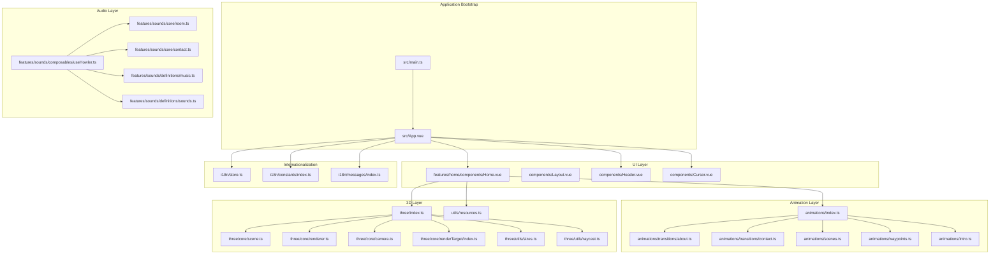
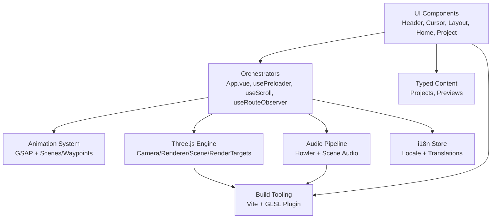
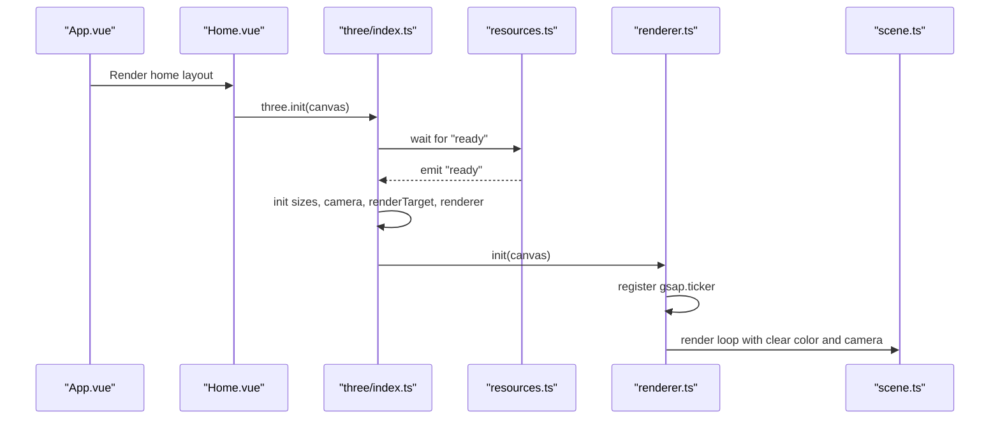
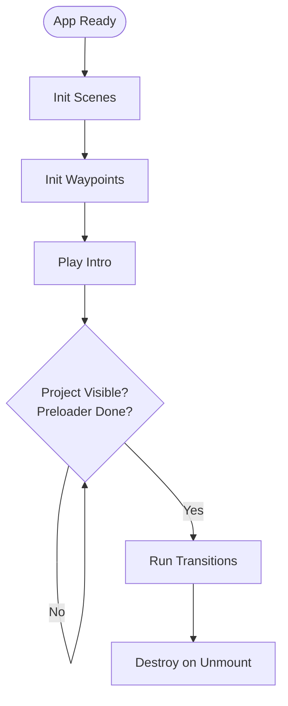
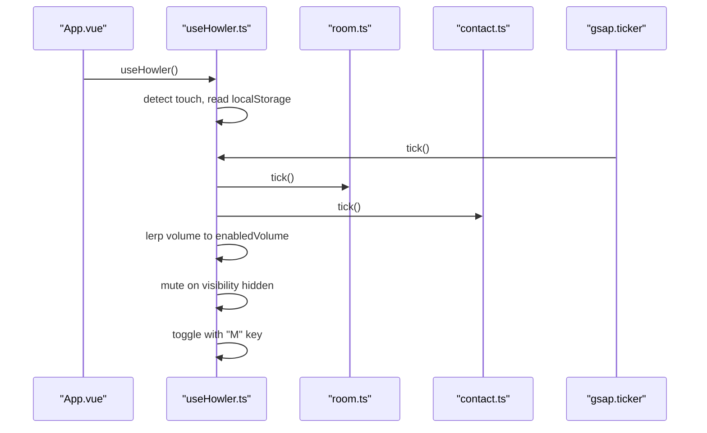
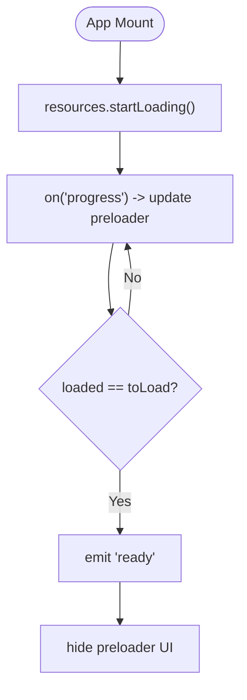
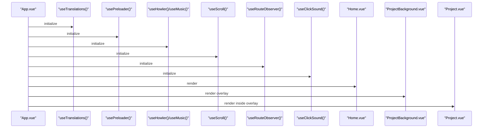
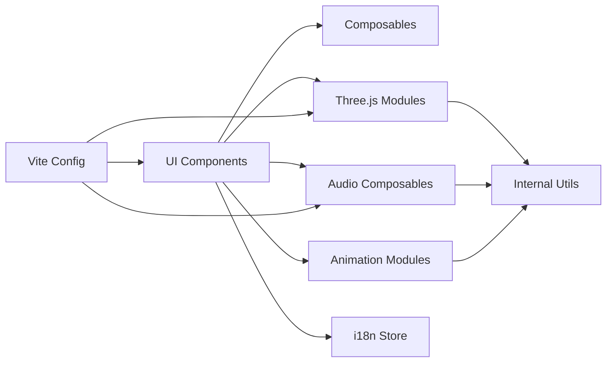

# Architecture Overview

<cite>
**Referenced Files in This Document**
- [README.md](file://README.md)
- [package.json](file://package.json)
- [vite.config.ts](file://vite.config.ts)
- [src/main.ts](file://src/main.ts)
- [src/App.vue](file://src/App.vue)
- [src/three/index.ts](file://src/three/index.ts)
- [src/three/core/renderer.ts](file://src/three/core/renderer.ts)
- [src/three/core/scene.ts](file://src/three/core/scene.ts)
- [src/animations/index.ts](file://src/animations/index.ts)
- [src/composables/usePreloader.ts](file://src/composables/usePreloader.ts)
- [src/utils/resources.ts](file://src/utils/resources.ts)
- [src/features/sounds/composables/useHowler.ts](file://src/features/sounds/composables/useHowler.ts)
- [src/i18n/store.ts](file://src/i18n/store.ts)
- [src/features/home/components/Home.vue](file://src/features/home/components/Home.vue)
</cite>

## Table of Contents
1. [Introduction](#introduction)
2. [Project Structure](#project-structure)
3. [Core Components](#core-components)
4. [Architecture Overview](#architecture-overview)
5. [Detailed Component Analysis](#detailed-component-analysis)
6. [Dependency Analysis](#dependency-analysis)
7. [Performance Considerations](#performance-considerations)
8. [Troubleshooting Guide](#troubleshooting-guide)
9. [Conclusion](#conclusion)

## Introduction
This document describes the high-level architecture of Portfolio-PM, a Vue 3 application integrating Three.js 3D graphics, GSAP-driven animations, and Howler.js audio processing. It explains the modular organization separating UI, 3D scene management, animation orchestration, internationalization, and content management. It also documents data flow patterns from content loading through composables to 3D rendering and animation systems, and how the root App.vue orchestrates major subsystems. Architectural decisions around Vite tooling, TypeScript, and design patterns are justified, along with system boundaries, component interactions, and cross-cutting concerns such as performance, responsiveness, and accessibility.

## Project Structure
The project is organized into feature-focused modules with clear separation of concerns:
- Frontend framework: Vue 3 with Composition API and TypeScript
- Build tooling: Vite with GLSL support and optimized asset handling
- 3D graphics: Three.js with custom core modules for camera, renderer, scene, and render targets
- Animation: GSAP with ScrollTrigger and custom animation orchestration
- Audio: Howler.js with composables for sound lifecycle and volume control
- Internationalization: Composables and stores for locale and translation management
- Content: Typed content modules for projects and previews
- Utilities: Resource loader, event emitter, math helpers, and size management

**Diagram sources**
- [src/main.ts:1-10](file://src/main.ts#L1-L10)
- [src/App.vue:1-87](file://src/App.vue#L1-L87)
- [src/features/home/components/Home.vue:1-293](file://src/features/home/components/Home.vue#L1-L293)
- [src/three/index.ts:1-35](file://src/three/index.ts#L1-L35)
- [src/three/core/renderer.ts:1-119](file://src/three/core/renderer.ts#L1-L119)
- [src/three/core/scene.ts:1-6](file://src/three/core/scene.ts#L1-L6)
- [src/animations/index.ts:1-30](file://src/animations/index.ts#L1-L30)
- [src/features/sounds/composables/useHowler.ts:1-110](file://src/features/sounds/composables/useHowler.ts#L1-L110)
- [src/i18n/store.ts:1-7](file://src/i18n/store.ts#L1-L7)
- [src/utils/resources.ts:1-78](file://src/utils/resources.ts#L1-L78)

**Section sources**
- [README.md:1-44](file://README.md#L1-L44)
- [package.json:1-38](file://package.json#L1-L38)
- [vite.config.ts:1-45](file://vite.config.ts#L1-L45)
- [src/main.ts:1-10](file://src/main.ts#L1-L10)
- [src/App.vue:1-87](file://src/App.vue#L1-L87)

## Core Components
- Application bootstrap and plugin registration:
  - Vue app creation, global styles, and GSAP plugin registration occur in the application entrypoint.
- Root orchestration:
  - App.vue initializes i18n, preloader, audio, scroll, routing, and cursor behavior, and renders the home and project overlays.
- 3D engine:
  - Central initialization coordinates resource readiness, sizing, camera, render target, renderer, objects, and raycasting.
- Animation system:
  - Animation orchestration initializes scenes, waypoints, and intro sequences once resources and conditions are met.
- Resource loader:
  - Unified loader for GLTF models, textures, and fonts with progress events and completion signaling.
- Audio pipeline:
  - Howler composable manages unlock, volume ramping, device-specific behavior, and per-scene audio updates.
- Internationalization:
  - Reactive locale and translation store for dynamic content switching.

**Section sources**
- [src/main.ts:1-10](file://src/main.ts#L1-L10)
- [src/App.vue:1-87](file://src/App.vue#L1-L87)
- [src/three/index.ts:1-35](file://src/three/index.ts#L1-L35)
- [src/animations/index.ts:1-30](file://src/animations/index.ts#L1-L30)
- [src/utils/resources.ts:1-78](file://src/utils/resources.ts#L1-L78)
- [src/features/sounds/composables/useHowler.ts:1-110](file://src/features/sounds/composables/useHowler.ts#L1-L110)
- [src/i18n/store.ts:1-7](file://src/i18n/store.ts#L1-L7)

## Architecture Overview
The system follows a layered architecture:
- Presentation layer: Vue components (Home, Project, UI controls)
- Orchestration layer: App.vue and composables coordinating lifecycle and state
- Animation layer: GSAP and custom scenes/waypoints
- 3D layer: Three.js core modules and object registries
- Audio layer: Howler-based composables and scene-specific audio
- Content and i18n: Typed content modules and reactive stores
- Build and tooling: Vite with GLSL compilation and optimized bundling

**Diagram sources**
- [src/App.vue:1-87](file://src/App.vue#L1-L87)
- [src/main.ts:1-10](file://src/main.ts#L1-L10)
- [src/three/index.ts:1-35](file://src/three/index.ts#L1-L35)
- [src/animations/index.ts:1-30](file://src/animations/index.ts#L1-L30)
- [src/features/sounds/composables/useHowler.ts:1-110](file://src/features/sounds/composables/useHowler.ts#L1-L110)
- [src/i18n/store.ts:1-7](file://src/i18n/store.ts#L1-L7)
- [vite.config.ts:1-45](file://vite.config.ts#L1-L45)

## Detailed Component Analysis

### 3D Rendering Pipeline
The 3D pipeline initializes on resource readiness, sets up camera and renderer, compiles scenes, and renders frames driven by GSAP ticker. It toggles visibility based on camera state and scene weights, and supports off-screen render targets for advanced effects.

**Diagram sources**
- [src/App.vue:1-87](file://src/App.vue#L1-L87)
- [src/features/home/components/Home.vue:1-293](file://src/features/home/components/Home.vue#L1-L293)
- [src/three/index.ts:1-35](file://src/three/index.ts#L1-L35)
- [src/utils/resources.ts:1-78](file://src/utils/resources.ts#L1-L78)
- [src/three/core/renderer.ts:1-119](file://src/three/core/renderer.ts#L1-L119)
- [src/three/core/scene.ts:1-6](file://src/three/core/scene.ts#L1-L6)

**Section sources**
- [src/three/index.ts:1-35](file://src/three/index.ts#L1-L35)
- [src/three/core/renderer.ts:1-119](file://src/three/core/renderer.ts#L1-L119)
- [src/three/core/scene.ts:1-6](file://src/three/core/scene.ts#L1-L6)
- [src/utils/resources.ts:1-78](file://src/utils/resources.ts#L1-L78)

### Animation Orchestration
The animation system initializes scenes and waypoints, plays intro sequences, and exposes transition handlers for specific views. It coordinates with GSAP and integrates with route/project visibility.

**Diagram sources**
- [src/animations/index.ts:1-30](file://src/animations/index.ts#L1-L30)
- [src/App.vue:1-87](file://src/App.vue#L1-L87)
- [src/features/home/components/Home.vue:1-293](file://src/features/home/components/Home.vue#L1-L293)

**Section sources**
- [src/animations/index.ts:1-30](file://src/animations/index.ts#L1-L30)
- [src/App.vue:1-87](file://src/App.vue#L1-L87)

### Audio Lifecycle with Howler
The audio composable handles device detection, unlocking, volume ramping, and per-tab muting. It integrates with scene-specific audio ticks and persists user preferences.

**Diagram sources**
- [src/App.vue:1-87](file://src/App.vue#L1-L87)
- [src/features/sounds/composables/useHowler.ts:1-110](file://src/features/sounds/composables/useHowler.ts#L1-L110)

**Section sources**
- [src/features/sounds/composables/useHowler.ts:1-110](file://src/features/sounds/composables/useHowler.ts#L1-L110)

### Resource Loading and Preloader
The resource loader aggregates GLTF, textures, and fonts, emitting progress and readiness events. The preloader composable listens to progress and animates a visual indicator, hiding itself upon completion.

**Diagram sources**
- [src/utils/resources.ts:1-78](file://src/utils/resources.ts#L1-L78)
- [src/composables/usePreloader.ts:1-43](file://src/composables/usePreloader.ts#L1-L43)

**Section sources**
- [src/utils/resources.ts:1-78](file://src/utils/resources.ts#L1-L78)
- [src/composables/usePreloader.ts:1-43](file://src/composables/usePreloader.ts#L1-L43)

### Root App Orchestration
App.vue wires together i18n, preloader, audio, scroll, routing, and cursor behavior. It conditionally renders the home page and project overlay, and applies layout classes based on project visibility and transitions.

**Diagram sources**
- [src/App.vue:1-87](file://src/App.vue#L1-L87)

**Section sources**
- [src/App.vue:1-87](file://src/App.vue#L1-L87)

## Dependency Analysis
The system exhibits low coupling and high cohesion across layers:
- UI depends on composables and 3D/audio modules via explicit imports
- 3D layer depends on Three.js and internal utilities; initialization is centralized
- Animation layer depends on GSAP and internal scene/waypoint modules
- Audio layer depends on Howler and internal definitions/core
- i18n store is reactive and decoupled from rendering logic
- Build tooling centralizes GLSL compilation and asset handling

**Diagram sources**
- [src/App.vue:1-87](file://src/App.vue#L1-L87)
- [src/three/index.ts:1-35](file://src/three/index.ts#L1-L35)
- [src/animations/index.ts:1-30](file://src/animations/index.ts#L1-L30)
- [src/features/sounds/composables/useHowler.ts:1-110](file://src/features/sounds/composables/useHowler.ts#L1-L110)
- [src/i18n/store.ts:1-7](file://src/i18n/store.ts#L1-L7)
- [vite.config.ts:1-45](file://vite.config.ts#L1-L45)

**Section sources**
- [package.json:1-38](file://package.json#L1-L38)
- [vite.config.ts:1-45](file://vite.config.ts#L1-L45)

## Performance Considerations
- Rendering:
  - Visibility toggling prevents unnecessary rendering when camera is uninitialized
  - Frustum culling is temporarily disabled during scene compilation to ensure proper shader compilation
  - Pixel ratio and size updates are handled via a dedicated sizes module
- Asset delivery:
  - Vite’s Rollup configuration optimizes chunk sizes and asset naming
  - GLSL files are included and compiled efficiently
- Animation:
  - GSAP ticker drives rendering and audio updates for smoothness
  - Transitions and scenes are initialized only when conditions are met
- Audio:
  - Volume ramps reduce abrupt changes; device-specific behavior avoids unnecessary work on touch devices
- Build:
  - Sourcemaps disabled for production builds; chunk size warnings tuned appropriately

[No sources needed since this section provides general guidance]

## Troubleshooting Guide
- 3D canvas not appearing:
  - Verify resource readiness before initializing Three.js; ensure the canvas element exists and is attached
  - Confirm renderer visibility logic and camera position are valid
- Animations not playing:
  - Check preloader completion and project visibility flags before initializing animations
  - Ensure GSAP ticker is registered and scenes/waypoints are initialized
- Audio not audible:
  - On touch devices, audio is intentionally disabled; unlock occurs on supported contexts
  - Check local storage preference and keyboard shortcut behavior
- Build errors:
  - Ensure GLSL files are included and Vite resolves shader extensions
  - Verify TypeScript checks pass before production builds

**Section sources**
- [src/three/core/renderer.ts:1-119](file://src/three/core/renderer.ts#L1-L119)
- [src/three/index.ts:1-35](file://src/three/index.ts#L1-L35)
- [src/animations/index.ts:1-30](file://src/animations/index.ts#L1-L30)
- [src/features/sounds/composables/useHowler.ts:1-110](file://src/features/sounds/composables/useHowler.ts#L1-L110)
- [vite.config.ts:1-45](file://vite.config.ts#L1-L45)

## Conclusion
Portfolio-PM’s architecture cleanly separates concerns across UI, 3D, animation, audio, and i18n while maintaining strong orchestration at the root App.vue level. The use of Vite streamlines asset handling and GLSL compilation, TypeScript ensures robustness, and GSAP provides precise motion control. The modular design enables maintainability, scalability, and a cohesive user experience across desktop and mobile environments.