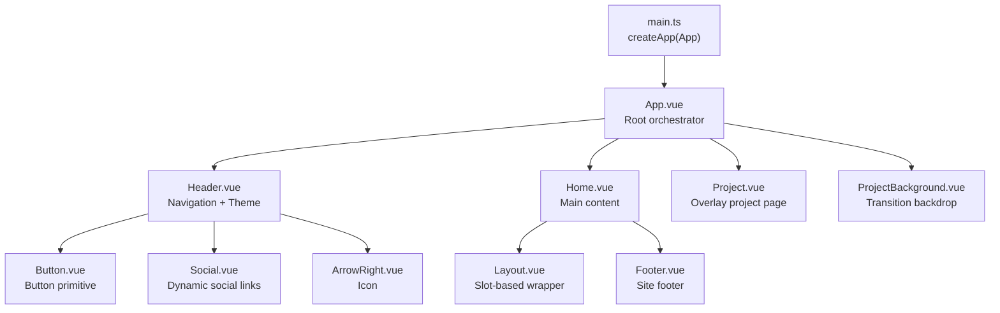
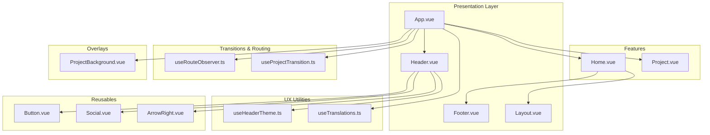
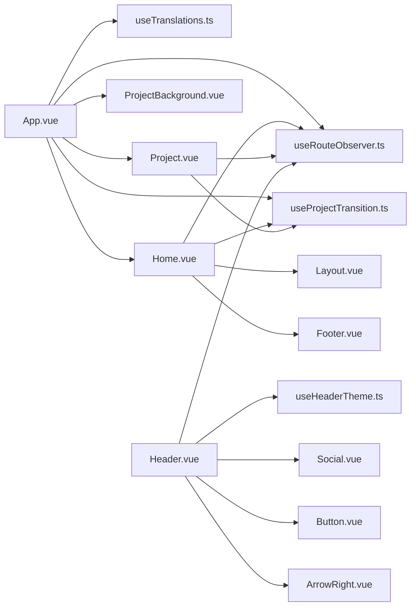

# Component Hierarchy

<cite>
**Referenced Files in This Document**
- [App.vue](file://src/App.vue)
- [main.ts](file://src/main.ts)
- [Layout.vue](file://src/components/Layout.vue)
- [Header.vue](file://src/components/Header.vue)
- [Footer.vue](file://src/components/Footer.vue)
- [Home.vue](file://src/features/home/components/Home.vue)
- [Project.vue](file://src/features/projects/components/Project.vue)
- [ProjectBackground.vue](file://src/features/projects/components/ProjectBackground.vue)
- [useRouteObserver.ts](file://src/composables/useRouteObserver.ts)
- [useProjectTransition.ts](file://src/composables/useProjectTransition.ts)
- [useHeaderTheme.ts](file://src/composables/useHeaderTheme.ts)
- [useTranslations.ts](file://src/i18n/composables/useTranslations.ts)
- [Button.vue](file://src/components/Button.vue)
- [Social.vue](file://src/components/Social.vue)
- [ArrowRight.vue](file://src/components/icons/ArrowRight.vue)
</cite>

## Table of Contents
1. [Introduction](#introduction)
2. [Project Structure](#project-structure)
3. [Core Components](#core-components)
4. [Architecture Overview](#architecture-overview)
5. [Detailed Component Analysis](#detailed-component-analysis)
6. [Dependency Analysis](#dependency-analysis)
7. [Performance Considerations](#performance-considerations)
8. [Troubleshooting Guide](#troubleshooting-guide)
9. [Conclusion](#conclusion)

## Introduction
This document explains the component hierarchy and organization of Portfolio-PM, focusing on how the root application orchestrates layout, navigation, content, and feature-specific components. It covers composition patterns, reactive coordination via shared composables, event emission, slots, dynamic component loading, naming conventions, lifecycle management, and performance optimizations.

## Project Structure
The application bootstraps via the Vue root app and mounts the global layout and feature pages. Reusable UI components live under components/, while feature-specific pages live under features/. Shared composables coordinate routing, transitions, theme, and internationalization.

**Diagram sources**
- [main.ts:1-10](file://src/main.ts#L1-L10)
- [App.vue:1-87](file://src/App.vue#L1-L87)
- [Header.vue:1-239](file://src/components/Header.vue#L1-L239)
- [Home.vue:1-293](file://src/features/home/components/Home.vue#L1-L293)
- [Project.vue:1-109](file://src/features/projects/components/Project.vue#L1-L109)
- [ProjectBackground.vue:1-71](file://src/features/projects/components/ProjectBackground.vue#L1-L71)
- [Layout.vue:1-16](file://src/components/Layout.vue#L1-L16)
- [Footer.vue:1-209](file://src/components/Footer.vue#L1-L209)
- [Button.vue:1-46](file://src/components/Button.vue#L1-L46)
- [Social.vue:1-58](file://src/components/Social.vue#L1-L58)
- [ArrowRight.vue:1-13](file://src/components/icons/ArrowRight.vue#L1-L13)

**Section sources**
- [main.ts:1-10](file://src/main.ts#L1-L10)
- [App.vue:1-87](file://src/App.vue#L1-L87)

## Core Components
- Root orchestration: App.vue wires global composables, renders Header, Home, ProjectBackground, and Project overlays, and applies transition classes based on route and transition state.
- Layout: Layout.vue is a minimal slot container for feature pages.
- Navigation: Header.vue manages back navigation, logo scroll-to-top, theme switching, and sound toggle, integrating with routing and scroll.
- Content: Home.vue composes hero, about, projects, contact, and footer inside a Layout, coordinating 3D canvas, animations, and sticky sections.
- Overlay: Project.vue dynamically loads project content per locale and project ID, rendering ProjectContent and Footer.
- Background: ProjectBackground.vue provides animated backdrop and blend layers synchronized with transitions.

Communication highlights:
- Reactive coordination via useRouteObserver and useProjectTransition.
- Event emission via custom route-change event and Lenis scroll events.
- Dynamic component loading via dynamic imports keyed by locale and project ID.
- Slot usage to compose feature pages within Layout.

**Section sources**
- [App.vue:1-87](file://src/App.vue#L1-L87)
- [Layout.vue:1-16](file://src/components/Layout.vue#L1-L16)
- [Header.vue:1-239](file://src/components/Header.vue#L1-L239)
- [Home.vue:1-293](file://src/features/home/components/Home.vue#L1-L293)
- [Project.vue:1-109](file://src/features/projects/components/Project.vue#L1-L109)
- [ProjectBackground.vue:1-71](file://src/features/projects/components/ProjectBackground.vue#L1-L71)

## Architecture Overview
The system separates concerns across layers:
- Presentation: App.vue, Header.vue, Footer.vue, Layout.vue
- Feature pages: Home.vue, Project.vue
- Transitions and routing: useRouteObserver.ts, useProjectTransition.ts
- Theming and scroll: useHeaderTheme.ts
- Internationalization: useTranslations.ts
- Reusable primitives: Button.vue, Social.vue, icons/*
- Overlay and 3D: ProjectBackground.vue, Home.vue canvas lifecycle

**Diagram sources**
- [App.vue:1-87](file://src/App.vue#L1-L87)
- [Header.vue:1-239](file://src/components/Header.vue#L1-L239)
- [Footer.vue:1-209](file://src/components/Footer.vue#L1-L209)
- [Layout.vue:1-16](file://src/components/Layout.vue#L1-L16)
- [Home.vue:1-293](file://src/features/home/components/Home.vue#L1-L293)
- [Project.vue:1-109](file://src/features/projects/components/Project.vue#L1-L109)
- [ProjectBackground.vue:1-71](file://src/features/projects/components/ProjectBackground.vue#L1-L71)
- [useRouteObserver.ts:1-93](file://src/composables/useRouteObserver.ts#L1-L93)
- [useProjectTransition.ts:1-37](file://src/composables/useProjectTransition.ts#L1-L37)
- [useHeaderTheme.ts:1-51](file://src/composables/useHeaderTheme.ts#L1-L51)
- [useTranslations.ts:1-37](file://src/i18n/composables/useTranslations.ts#L1-L37)
- [Button.vue:1-46](file://src/components/Button.vue#L1-L46)
- [Social.vue:1-58](file://src/components/Social.vue#L1-L58)
- [ArrowRight.vue:1-13](file://src/components/icons/ArrowRight.vue#L1-L13)

## Detailed Component Analysis

### App.vue: Root Orchestration
- Imports and initializes global composables for translations, preloader, audio, scroll, routing, and click sounds.
- Renders Header and two content areas:
  - Main page: a wrapper around Home.
  - Overlay: ProjectBackground and a fixed-position Project container controlled by visibility and transition flags.
- Applies conditional classes to manage visibility and pointer events during transitions and project overlays.
- Uses a fixed-position overlay with z-index and overflow controls to prevent scrolling during transitions.

Key patterns:
- Composition initialization order ensures global state is ready before rendering.
- Transition flags derived from useProjectTransition drive DOM classes for animations.
- Route observation integrates with history patching to emit a custom route-change event.

**Section sources**
- [App.vue:1-87](file://src/App.vue#L1-L87)
- [useProjectTransition.ts:1-37](file://src/composables/useProjectTransition.ts#L1-L37)
- [useRouteObserver.ts:1-93](file://src/composables/useRouteObserver.ts#L1-L93)

### Header.vue: Navigation and Theme
- Computes header class names based on theme state, scroll position relative to the hero, and current project context.
- Provides back navigation that either routes to home or uses browser history depending on first-route state.
- Integrates with Lenis scroll to jump to top when logo is clicked.
- Exposes a slot for custom actions and toggles sound via a feature-gated control.

Communication patterns:
- Emits custom route-change events via useRouteObserver to keep global state in sync.
- Uses useHeaderTheme to compute dark/light theme and scrolled states.

**Section sources**
- [Header.vue:1-239](file://src/components/Header.vue#L1-L239)
- [useHeaderTheme.ts:1-51](file://src/composables/useHeaderTheme.ts#L1-L51)
- [useRouteObserver.ts:1-93](file://src/composables/useRouteObserver.ts#L1-L93)

### Home.vue: Feature Page Composition
- Wraps content in Layout and composes Hero, About, Projects, Contact, and Footer.
- Manages a sticky section that toggles visibility based on intersection and project loading state.
- Initializes and tears down 3D canvas and animations when conditions are met.
- Coordinates renderer activity with project visibility to pause rendering off-screen.
- Uses ResizeObserver to track footer offset for proper spacing and scroll anchoring.

Composition patterns:
- Lifecycle hooks attach/detach observers and clean up resources.
- Computed visibility flags derive from reactive route and transition state.

**Section sources**
- [Home.vue:1-293](file://src/features/home/components/Home.vue#L1-L293)
- [Layout.vue:1-16](file://src/components/Layout.vue#L1-L16)

### Project.vue: Dynamic Content Loading
- Watches recentProjectId and locale to dynamically import project content modules.
- Renders ProjectContent when content is available and the project is visible.
- Scrolls to top on project entry and applies transition classes for smooth entrance.

Communication patterns:
- Dynamic import keyed by locale and project ID enables per-language content.
- Uses useRouteObserver and useProjectTransition to gate rendering and animations.

**Section sources**
- [Project.vue:1-109](file://src/features/projects/components/Project.vue#L1-L109)
- [useRouteObserver.ts:1-93](file://src/composables/useRouteObserver.ts#L1-L93)
- [useProjectTransition.ts:1-37](file://src/composables/useProjectTransition.ts#L1-L37)

### ProjectBackground.vue: Overlay Backdrop
- Renders two backdrop layers: a base background and a blend layer.
- Classes reflect recent project ID, visibility, and transitioning states to animate entrance/exit.

**Section sources**
- [ProjectBackground.vue:1-71](file://src/features/projects/components/ProjectBackground.vue#L1-L71)

### Reusable UI Components
- Button.vue: A thin wrapper around ButtonWrapper with size variants and slot support.
- Social.vue: Renders a list of social links with dynamic icon components mapped by name.
- ArrowRight.vue: A presentational SVG icon used within buttons and links.

Integration:
- Header.vue composes Button.vue and Social.vue to build navigation and CTAs.
- ArrowRight.vue is used for directional indicators.

**Section sources**
- [Button.vue:1-46](file://src/components/Button.vue#L1-L46)
- [Social.vue:1-58](file://src/components/Social.vue#L1-L58)
- [ArrowRight.vue:1-13](file://src/components/icons/ArrowRight.vue#L1-L13)

### Layout.vue: Slot-Based Container
- Minimal wrapper that exposes a default slot for feature pages.

Usage:
- Home.vue wraps its sections inside Layout to standardize structure and spacing.

**Section sources**
- [Layout.vue:1-16](file://src/components/Layout.vue#L1-L16)
- [Home.vue:1-293](file://src/features/home/components/Home.vue#L1-L293)

### Footer.vue: Site Footer
- Provides back-to-top action, legal links, language switch, and optional social links.
- Integrates with Lenis scroll and accessibility attributes.

**Section sources**
- [Footer.vue:1-209](file://src/components/Footer.vue#L1-L209)

### Composables: Coordination and State
- useRouteObserver.ts: Centralized route state with computed helpers for project detection and recent project caching, plus a patched history listener emitting route-change.
- useProjectTransition.ts: Global transition flag with a fixed duration timer to coordinate overlay animations.
- useHeaderTheme.ts: Scroll-driven theme computation with optional callback for downstream updates.
- useTranslations.ts: Loads and persists locale, initializing translations on mount and watching for changes.

**Section sources**
- [useRouteObserver.ts:1-93](file://src/composables/useRouteObserver.ts#L1-L93)
- [useProjectTransition.ts:1-37](file://src/composables/useProjectTransition.ts#L1-L37)
- [useHeaderTheme.ts:1-51](file://src/composables/useHeaderTheme.ts#L1-L51)
- [useTranslations.ts:1-37](file://src/i18n/composables/useTranslations.ts#L1-L37)

## Dependency Analysis
The following diagram maps key dependencies among components and composables:

**Diagram sources**
- [App.vue:1-87](file://src/App.vue#L1-L87)
- [Home.vue:1-293](file://src/features/home/components/Home.vue#L1-L293)
- [Project.vue:1-109](file://src/features/projects/components/Project.vue#L1-L109)
- [ProjectBackground.vue:1-71](file://src/features/projects/components/ProjectBackground.vue#L1-L71)
- [Header.vue:1-239](file://src/components/Header.vue#L1-L239)
- [Layout.vue:1-16](file://src/components/Layout.vue#L1-L16)
- [Footer.vue:1-209](file://src/components/Footer.vue#L1-L209)
- [useRouteObserver.ts:1-93](file://src/composables/useRouteObserver.ts#L1-L93)
- [useProjectTransition.ts:1-37](file://src/composables/useProjectTransition.ts#L1-L37)
- [useHeaderTheme.ts:1-51](file://src/composables/useHeaderTheme.ts#L1-L51)
- [useTranslations.ts:1-37](file://src/i18n/composables/useTranslations.ts#L1-L37)
- [Button.vue:1-46](file://src/components/Button.vue#L1-L46)
- [Social.vue:1-58](file://src/components/Social.vue#L1-L58)
- [ArrowRight.vue:1-13](file://src/components/icons/ArrowRight.vue#L1-L13)

## Performance Considerations
- Fixed-position overlays and overflow control during transitions minimize layout thrashing and prevent unintended scroll interactions.
- Conditional rendering and visibility classes ensure heavy features (like 3D canvases and animations) are initialized only when needed.
- Lifecycle hooks attach and detach observers and cancel timers to avoid memory leaks.
- Dynamic imports defer loading of project content until a project is selected, reducing initial payload.
- Scroll-driven theme updates are throttled via Lenis events and computed watchers to reduce reflows.

[No sources needed since this section provides general guidance]

## Troubleshooting Guide
Common issues and remedies:
- Transitions not triggering: Verify useProjectTransition is mounted and that route-change events are emitted by the patched history.
- Project content not loading: Confirm locale and recentProjectId are set and that dynamic import keys match available modules.
- Header theme not updating: Ensure useHeaderTheme is attached to the scroll manager and that the target element exists in the DOM.
- Cursor not changing on hover: Check that the 3D raycasting detects hovered objects and that the update loop is registered.

**Section sources**
- [useProjectTransition.ts:1-37](file://src/composables/useProjectTransition.ts#L1-L37)
- [useRouteObserver.ts:1-93](file://src/composables/useRouteObserver.ts#L1-L93)
- [useHeaderTheme.ts:1-51](file://src/composables/useHeaderTheme.ts#L1-L51)
- [Home.vue:1-293](file://src/features/home/components/Home.vue#L1-L293)

## Conclusion
Portfolio-PM’s component hierarchy cleanly separates presentation, routing, transitions, and UX utilities. App.vue orchestrates global state and renders the main and overlay content areas. Feature pages like Home.vue and Project.vue compose reusable UI primitives and rely on composables for responsive behavior. Dynamic component loading and careful lifecycle management deliver a performant, accessible experience.