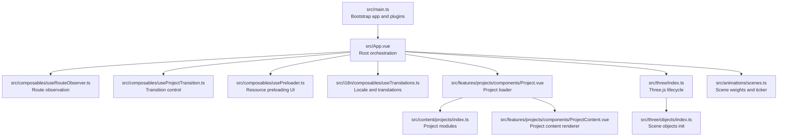
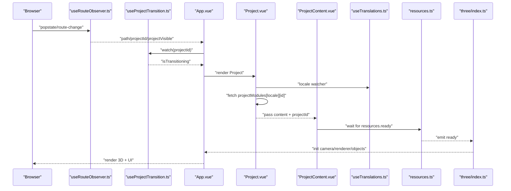
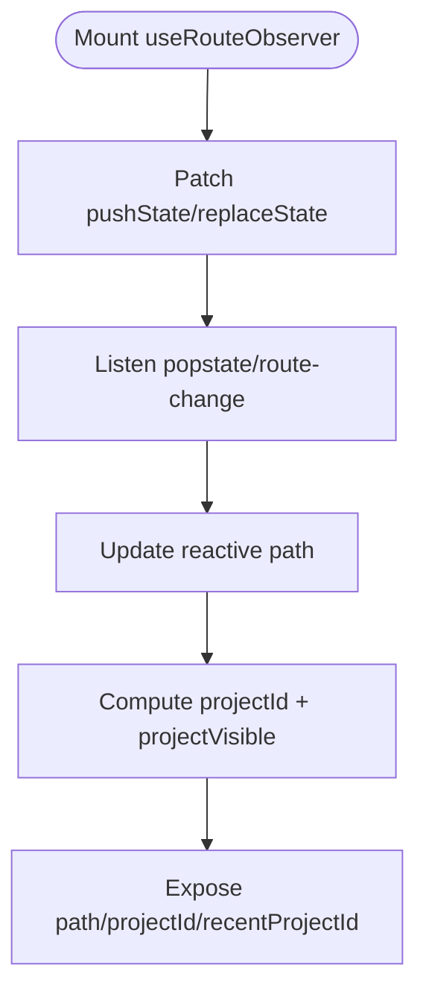
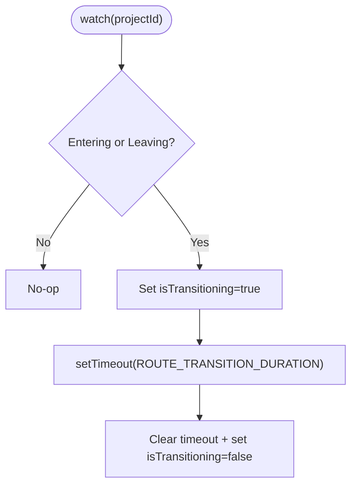
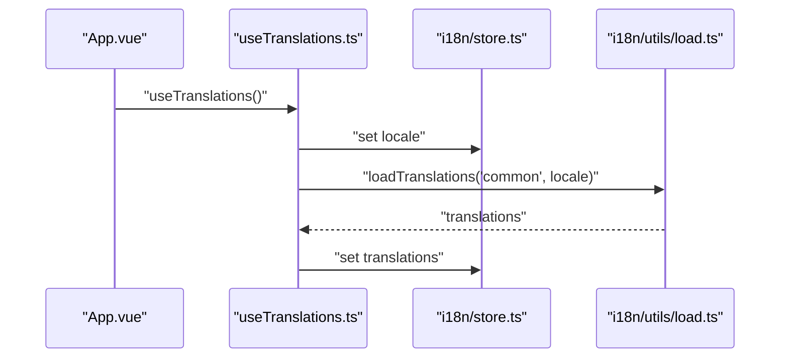
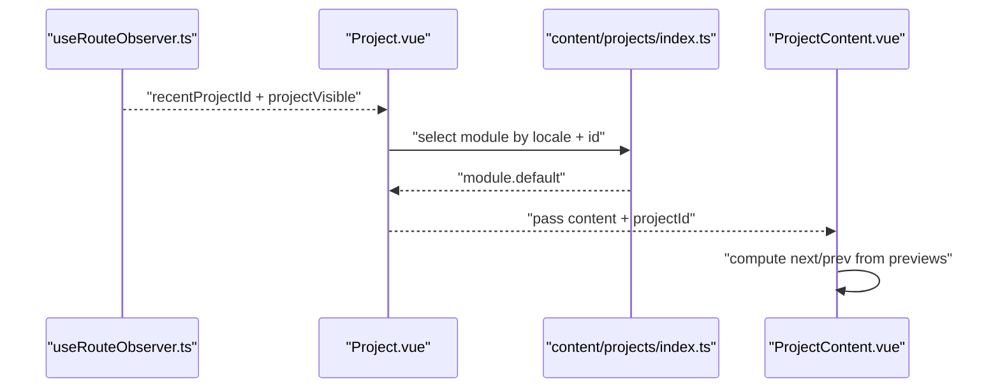
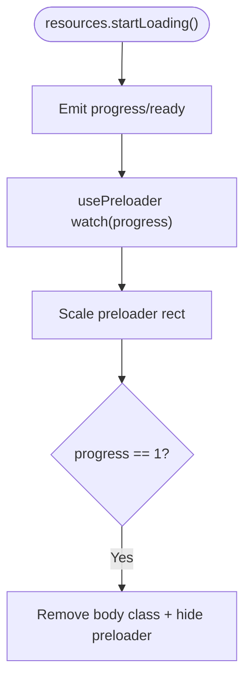
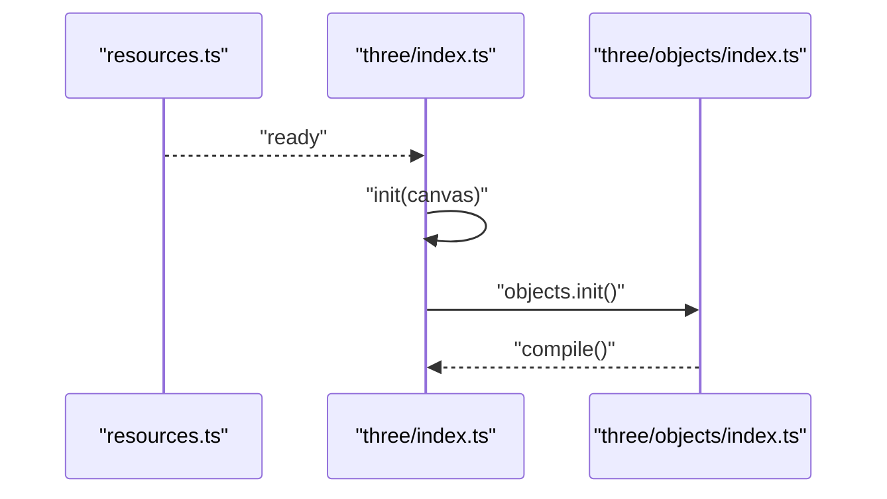
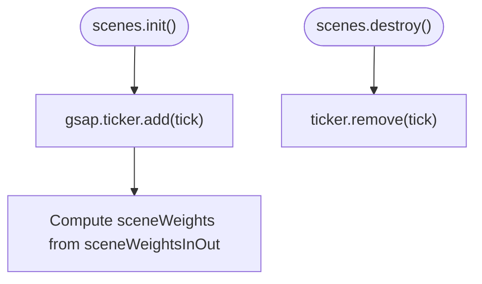
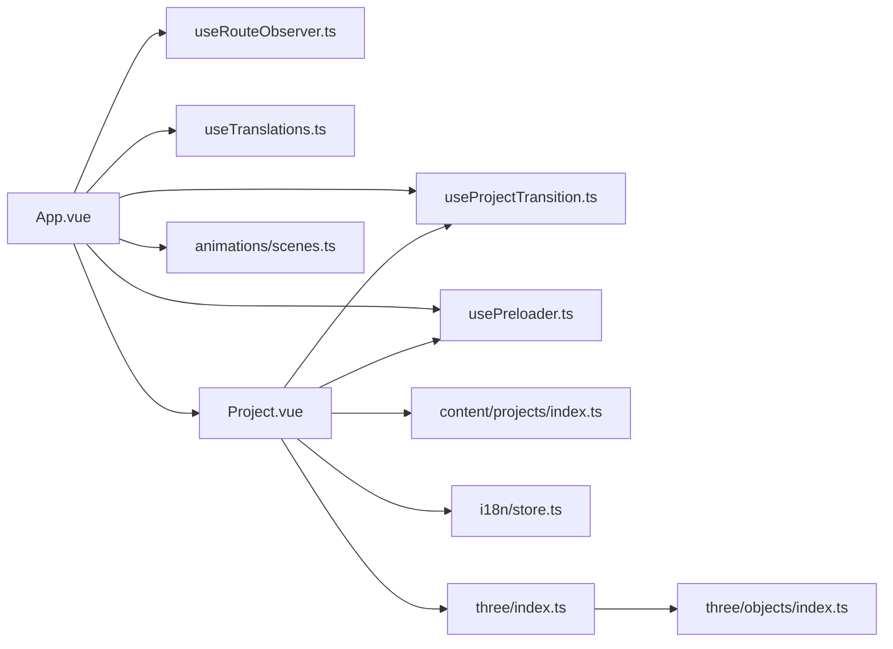

# Data Flow Patterns

<cite>
**Referenced Files in This Document**
- [src/main.ts](file://src/main.ts)
- [src/App.vue](file://src/App.vue)
- [src/composables/useRouteObserver.ts](file://src/composables/useRouteObserver.ts)
- [src/composables/useProjectTransition.ts](file://src/composables/useProjectTransition.ts)
- [src/composables/usePreloader.ts](file://src/composables/usePreloader.ts)
- [src/i18n/store.ts](file://src/i18n/store.ts)
- [src/i18n/composables/useTranslations.ts](file://src/i18n/composables/useTranslations.ts)
- [src/i18n/utils/load.ts](file://src/i18n/utils/load.ts)
- [src/content/projects/index.ts](file://src/content/projects/index.ts)
- [src/features/projects/components/Project.vue](file://src/features/projects/components/Project.vue)
- [src/features/projects/components/ProjectContent.vue](file://src/features/projects/components/ProjectContent.vue)
- [src/utils/resources.ts](file://src/utils/resources.ts)
- [src/three/index.ts](file://src/three/index.ts)
- [src/three/objects/index.ts](file://src/three/objects/index.ts)
- [src/animations/scenes.ts](file://src/animations/scenes.ts)
</cite>

## Table of Contents
1. [Introduction](#introduction)
2. [Project Structure](#project-structure)
3. [Core Components](#core-components)
4. [Architecture Overview](#architecture-overview)
5. [Detailed Component Analysis](#detailed-component-analysis)
6. [Dependency Analysis](#dependency-analysis)
7. [Performance Considerations](#performance-considerations)
8. [Troubleshooting Guide](#troubleshooting-guide)
9. [Conclusion](#conclusion)

## Introduction
This document explains how data flows through Portfolio-PM from content loading to 3D rendering and animation. It focuses on reactive state management via Vue 3 Composition API, route observation driving project transitions, and internationalization state propagation. It also documents data binding patterns between UI components and 3D scene objects, dynamic content loading based on URL parameters, and integration across content modules, 3D object properties, and animation timelines.

## Project Structure
Portfolio-PM organizes functionality by domain:
- Application bootstrap initializes plugins and mounts the root app.
- App orchestrates global composables for routing, transitions, preloading, audio, scroll, and cursor behavior.
- Content modules provide project data per locale and are dynamically imported based on the current route and locale.
- Three.js integration initializes camera, renderer, scene, objects, and raycasting after resource loading.
- Animations manage scene weights and GSAP-based ticking for visibility blending across sections.

**Diagram sources**
- [src/main.ts:1-10](file://src/main.ts#L1-L10)
- [src/App.vue:1-87](file://src/App.vue#L1-L87)
- [src/composables/useRouteObserver.ts:1-93](file://src/composables/useRouteObserver.ts#L1-L93)
- [src/composables/useProjectTransition.ts:1-37](file://src/composables/useProjectTransition.ts#L1-L37)
- [src/composables/usePreloader.ts:1-43](file://src/composables/usePreloader.ts#L1-L43)
- [src/i18n/composables/useTranslations.ts:1-37](file://src/i18n/composables/useTranslations.ts#L1-L37)
- [src/features/projects/components/Project.vue:1-109](file://src/features/projects/components/Project.vue#L1-L109)
- [src/content/projects/index.ts:1-18](file://src/content/projects/index.ts#L1-L18)
- [src/features/projects/components/ProjectContent.vue:1-142](file://src/features/projects/components/ProjectContent.vue#L1-L142)
- [src/three/index.ts:1-35](file://src/three/index.ts#L1-L35)
- [src/three/objects/index.ts:1-36](file://src/three/objects/index.ts#L1-L36)
- [src/animations/scenes.ts:1-59](file://src/animations/scenes.ts#L1-L59)

**Section sources**
- [src/main.ts:1-10](file://src/main.ts#L1-L10)
- [src/App.vue:1-87](file://src/App.vue#L1-L87)

## Core Components
- Route observation and project visibility:
  - Reactive path and computed helpers derive the current project ID and whether a project is visible, factoring in transition state.
  - History is patched to emit a custom event on navigation changes, ensuring safe reactivity ordering.
- Project transition control:
  - Transition state flips on project route changes and resets after a fixed duration, coordinating UI overlays and interactions.
- Internationalization:
  - Locale selection is persisted and watched to load translation namespaces on change.
  - Translation loading uses caching and in-flight deduplication to optimize repeated loads.
- Dynamic content loading:
  - Project modules are glob-imported per locale and fetched asynchronously by project ID derived from the route.
  - Project content renders a case study or a grid of components and computes next/previous project links from localized preview lists.
- Preloader and resource pipeline:
  - Resource manager emits progress and readiness events; preloader composable maps resource progress to UI and triggers post-load cleanup.
- Three.js initialization:
  - Canvas initialization waits for resources to be ready, then sets up camera, render target, renderer, scene objects, and raycasting.
- Animation system:
  - Scene weights are updated each frame based on in/out states, enabling smooth cross-fade effects across sections.

**Section sources**
- [src/composables/useRouteObserver.ts:1-93](file://src/composables/useRouteObserver.ts#L1-L93)
- [src/composables/useProjectTransition.ts:1-37](file://src/composables/useProjectTransition.ts#L1-L37)
- [src/i18n/store.ts:1-7](file://src/i18n/store.ts#L1-L7)
- [src/i18n/composables/useTranslations.ts:1-37](file://src/i18n/composables/useTranslations.ts#L1-L37)
- [src/i18n/utils/load.ts:1-77](file://src/i18n/utils/load.ts#L1-L77)
- [src/content/projects/index.ts:1-18](file://src/content/projects/index.ts#L1-L18)
- [src/features/projects/components/Project.vue:1-109](file://src/features/projects/components/Project.vue#L1-L109)
- [src/features/projects/components/ProjectContent.vue:1-142](file://src/features/projects/components/ProjectContent.vue#L1-L142)
- [src/composables/usePreloader.ts:1-43](file://src/composables/usePreloader.ts#L1-L43)
- [src/utils/resources.ts:1-78](file://src/utils/resources.ts#L1-L78)
- [src/three/index.ts:1-35](file://src/three/index.ts#L1-L35)
- [src/animations/scenes.ts:1-59](file://src/animations/scenes.ts#L1-L59)

## Architecture Overview
The system follows a reactive, event-driven pipeline:
- URL changes trigger route observation and project transitions.
- Locale drives translation loading and affects content module resolution.
- Resource readiness gates Three.js initialization and scene object creation.
- Animation system updates scene weights each frame for smooth transitions.

**Diagram sources**
- [src/composables/useRouteObserver.ts:67-92](file://src/composables/useRouteObserver.ts#L67-L92)
- [src/composables/useProjectTransition.ts:9-36](file://src/composables/useProjectTransition.ts#L9-L36)
- [src/App.vue:10-29](file://src/App.vue#L10-L29)
- [src/features/projects/components/Project.vue:17-37](file://src/features/projects/components/Project.vue#L17-L37)
- [src/features/projects/components/ProjectContent.vue:21-52](file://src/features/projects/components/ProjectContent.vue#L21-L52)
- [src/i18n/composables/useTranslations.ts:23-35](file://src/i18n/composables/useTranslations.ts#L23-L35)
- [src/utils/resources.ts:39-78](file://src/utils/resources.ts#L39-L78)
- [src/three/index.ts:11-35](file://src/three/index.ts#L11-L35)

## Detailed Component Analysis

### Route Observation and Project Visibility
- Observes browser history changes and dispatches a custom event to decouple timing from DOM events.
- Computes project ID from the path and determines visibility by excluding transition state.
- Maintains a recent project ID to stabilize content rendering across transitions.

**Diagram sources**
- [src/composables/useRouteObserver.ts:42-85](file://src/composables/useRouteObserver.ts#L42-L85)

**Section sources**
- [src/composables/useRouteObserver.ts:1-93](file://src/composables/useRouteObserver.ts#L1-L93)

### Project Transition Control
- Watches project ID changes to enter/exit project routes.
- Sets a transition flag and clears it after a fixed duration to coordinate UI overlays and interactions.

**Diagram sources**
- [src/composables/useProjectTransition.ts:9-36](file://src/composables/useProjectTransition.ts#L9-L36)

**Section sources**
- [src/composables/useProjectTransition.ts:1-37](file://src/composables/useProjectTransition.ts#L1-L37)

### Internationalization State and Translation Loading
- Initializes locale from localStorage or browser preference, with defaults.
- Persists locale changes to localStorage.
- Loads translation namespace for the selected locale and caches results; supports multiple namespace loading.

**Diagram sources**
- [src/i18n/composables/useTranslations.ts:9-36](file://src/i18n/composables/useTranslations.ts#L9-L36)
- [src/i18n/store.ts:1-7](file://src/i18n/store.ts#L1-L7)
- [src/i18n/utils/load.ts:25-58](file://src/i18n/utils/load.ts#L25-L58)

**Section sources**
- [src/i18n/composables/useTranslations.ts:1-37](file://src/i18n/composables/useTranslations.ts#L1-L37)
- [src/i18n/store.ts:1-7](file://src/i18n/store.ts#L1-L7)
- [src/i18n/utils/load.ts:1-77](file://src/i18n/utils/load.ts#L1-L77)

### Dynamic Content Loading Based on URL Parameters
- Project modules are glob-imported per locale at build time.
- Project component watches recent project ID and locale, then dynamically imports the matching module by ID.
- Project content component receives the resolved content and renders either a case study or a grid of components, computing next/previous project slugs from localized previews.

**Diagram sources**
- [src/composables/useRouteObserver.ts:27-34](file://src/composables/useRouteObserver.ts#L27-L34)
- [src/features/projects/components/Project.vue:17-37](file://src/features/projects/components/Project.vue#L17-L37)
- [src/content/projects/index.ts:14-18](file://src/content/projects/index.ts#L14-L18)
- [src/features/projects/components/ProjectContent.vue:21-52](file://src/features/projects/components/ProjectContent.vue#L21-L52)

**Section sources**
- [src/features/projects/components/Project.vue:1-109](file://src/features/projects/components/Project.vue#L1-L109)
- [src/features/projects/components/ProjectContent.vue:1-142](file://src/features/projects/components/ProjectContent.vue#L1-L142)
- [src/content/projects/index.ts:1-18](file://src/content/projects/index.ts#L1-L18)

### Preloader and Resource Pipeline
- Resource manager loads GLTF, textures, and fonts, emitting progress and readiness events.
- Preloader composable listens to progress, maps it to UI scale, and hides the preloader when complete.

**Diagram sources**
- [src/utils/resources.ts:39-78](file://src/utils/resources.ts#L39-L78)
- [src/composables/usePreloader.ts:17-42](file://src/composables/usePreloader.ts#L17-L42)

**Section sources**
- [src/utils/resources.ts:1-78](file://src/utils/resources.ts#L1-L78)
- [src/composables/usePreloader.ts:1-43](file://src/composables/usePreloader.ts#L1-L43)

### Three.js Initialization and Scene Objects
- Three.js lifecycle waits for resources to be ready, then initializes sizes, camera, render target, renderer, scene objects, and raycasting.
- Scene objects initializer registers all 3D objects and compiles the renderer.

**Diagram sources**
- [src/utils/resources.ts:63-67](file://src/utils/resources.ts#L63-L67)
- [src/three/index.ts:11-35](file://src/three/index.ts#L11-L35)
- [src/three/objects/index.ts:11-22](file://src/three/objects/index.ts#L11-L22)

**Section sources**
- [src/three/index.ts:1-35](file://src/three/index.ts#L1-L35)
- [src/three/objects/index.ts:1-36](file://src/three/objects/index.ts#L1-L36)

### Animation System and Scene Weights
- Scene weights are updated each frame based on in/out states, enabling visibility blending across sections.
- Ticker is added on initialization and removed on destruction.

**Diagram sources**
- [src/animations/scenes.ts:41-58](file://src/animations/scenes.ts#L41-L58)

**Section sources**
- [src/animations/scenes.ts:1-59](file://src/animations/scenes.ts#L1-L59)

## Dependency Analysis
- App depends on route observation, transitions, preloader, translations, scroll, and sound composables to orchestrate UI behavior.
- Project component depends on route observation and locale to resolve content modules.
- ProjectContent depends on previews and locale to compute navigation.
- Three.js initialization depends on resource readiness.
- Animations depend on GSAP ticker and scene weight maps.

**Diagram sources**
- [src/App.vue:10-29](file://src/App.vue#L10-L29)
- [src/composables/useRouteObserver.ts:1-93](file://src/composables/useRouteObserver.ts#L1-L93)
- [src/composables/useProjectTransition.ts:1-37](file://src/composables/useProjectTransition.ts#L1-L37)
- [src/composables/usePreloader.ts:1-43](file://src/composables/usePreloader.ts#L1-L43)
- [src/i18n/composables/useTranslations.ts:1-37](file://src/i18n/composables/useTranslations.ts#L1-L37)
- [src/features/projects/components/Project.vue:1-109](file://src/features/projects/components/Project.vue#L1-L109)
- [src/content/projects/index.ts:1-18](file://src/content/projects/index.ts#L1-L18)
- [src/i18n/store.ts:1-7](file://src/i18n/store.ts#L1-L7)
- [src/three/index.ts:1-35](file://src/three/index.ts#L1-L35)
- [src/three/objects/index.ts:1-36](file://src/three/objects/index.ts#L1-L36)
- [src/animations/scenes.ts:1-59](file://src/animations/scenes.ts#L1-L59)

**Section sources**
- [src/App.vue:1-87](file://src/App.vue#L1-L87)
- [src/features/projects/components/Project.vue:1-109](file://src/features/projects/components/Project.vue#L1-L109)
- [src/three/index.ts:1-35](file://src/three/index.ts#L1-L35)

## Performance Considerations
- Translation loading deduplication prevents redundant network requests for the same namespace/locale pair.
- Resource loading aggregates progress and only triggers UI updates when progress changes, minimizing layout thrash.
- Three.js initialization defers until resources are ready, avoiding partial rendering and ensuring stable asset availability.
- Project transitions prevent interaction during overlay transitions, reducing unnecessary re-renders and pointer events.

## Troubleshooting Guide
- Route changes not detected:
  - Verify custom route-change event emission after history patching and that listeners are attached on mount.
- Project content not loading:
  - Confirm locale is set and matches available modules; check that project ID resolves to an existing module key.
- Preloader stuck:
  - Inspect resource loader progress emissions and ensure the final progress equals 1 to trigger preloader hide.
- 3D scene not initializing:
  - Ensure resources ready event fires before three.init is called; confirm canvas element exists and sizes are initialized.
- Animations not updating:
  - Check that scenes.init is called and gsap ticker is present; verify sceneWeightsInOut values are updated elsewhere in the app.

**Section sources**
- [src/composables/useRouteObserver.ts:42-85](file://src/composables/useRouteObserver.ts#L42-L85)
- [src/features/projects/components/Project.vue:17-27](file://src/features/projects/components/Project.vue#L17-L27)
- [src/composables/usePreloader.ts:25-42](file://src/composables/usePreloader.ts#L25-L42)
- [src/three/index.ts:14-22](file://src/three/index.ts#L14-L22)
- [src/animations/scenes.ts:41-58](file://src/animations/scenes.ts#L41-L58)

## Conclusion
Portfolio-PM’s data flow integrates Vue 3 Composition API reactivity, event-driven navigation, and asynchronous content/resource loading. Route observation and transitions coordinate UI overlays, while locale-aware content modules and previews enable dynamic project rendering. Three.js initialization and animation systems rely on resource readiness and reactive state to deliver a cohesive, responsive experience. The described patterns—reactive watchers, event emitters, and modular content loading—provide a robust foundation for scalable enhancements across content, visuals, and interactivity.