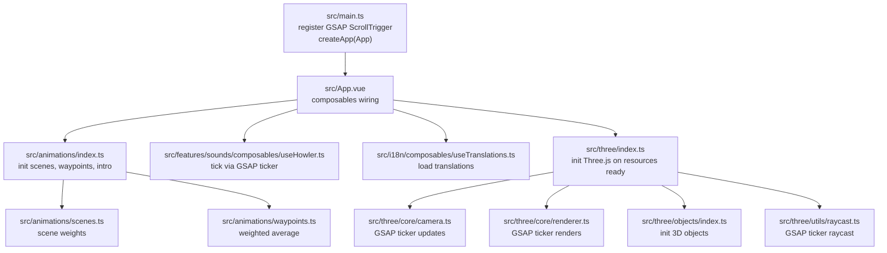
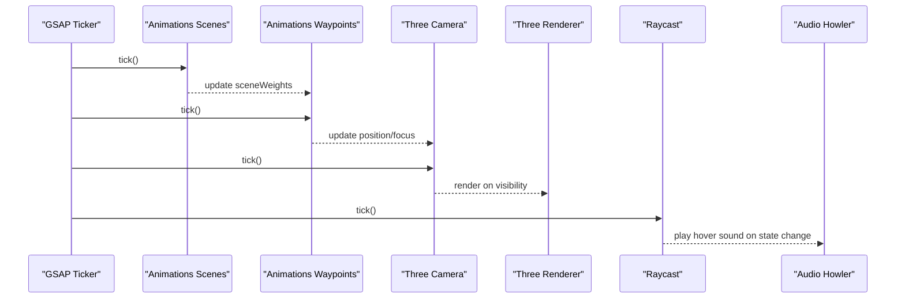
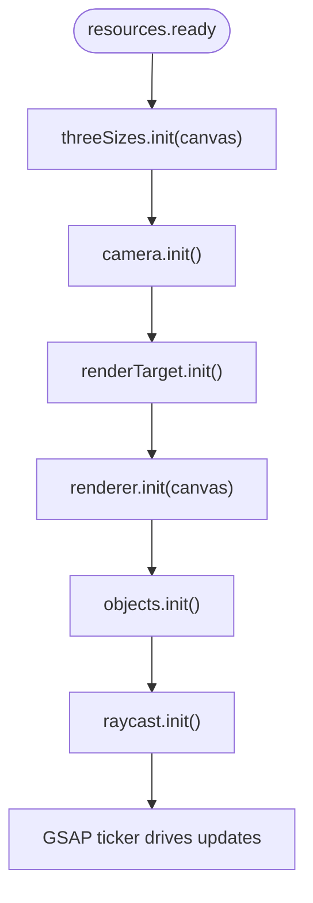
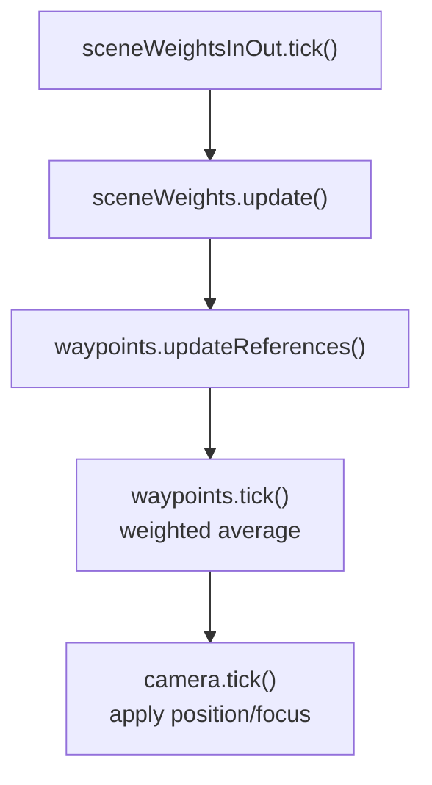
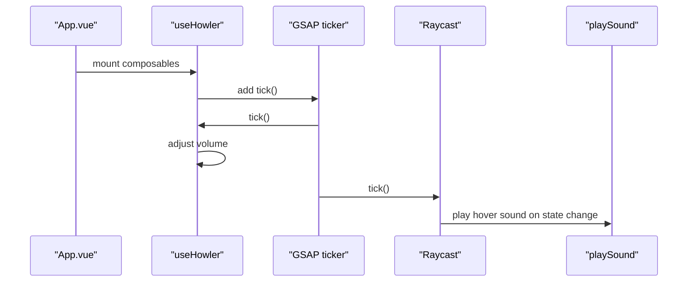
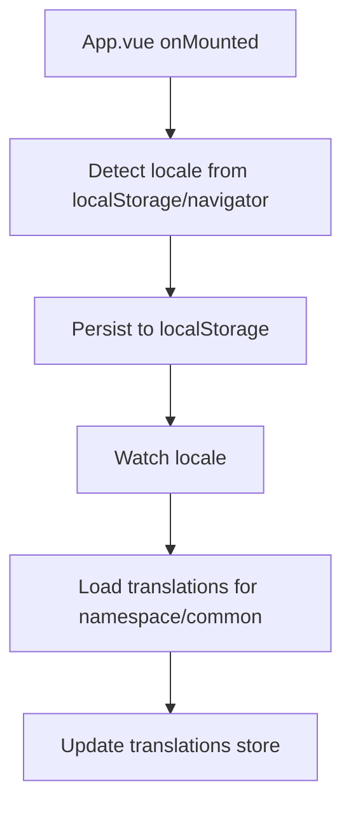
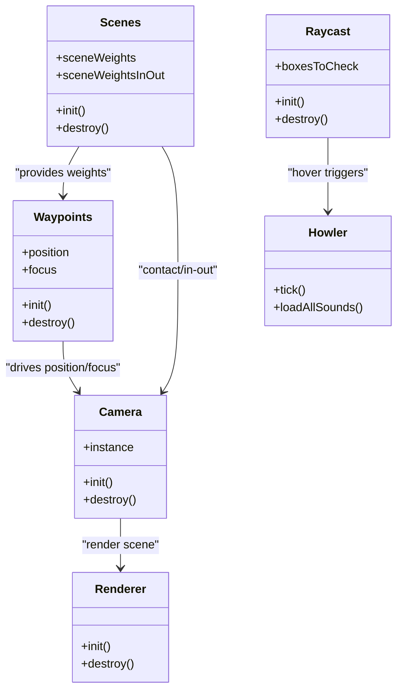
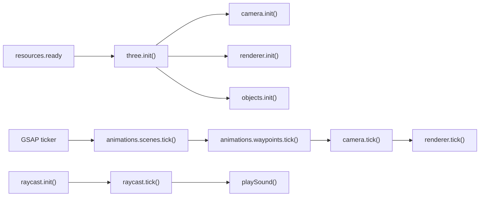

# Integration Patterns

<cite>
**Referenced Files in This Document**
- [src/main.ts](file://src/main.ts)
- [src/three/index.ts](file://src/three/index.ts)
- [src/three/core/camera.ts](file://src/three/core/camera.ts)
- [src/three/core/renderer.ts](file://src/three/core/renderer.ts)
- [src/three/objects/index.ts](file://src/three/objects/index.ts)
- [src/three/utils/raycast.ts](file://src/three/utils/raycast.ts)
- [src/animations/index.ts](file://src/animations/index.ts)
- [src/animations/scenes.ts](file://src/animations/scenes.ts)
- [src/animations/waypoints.ts](file://src/animations/waypoints.ts)
- [src/features/sounds/composables/useHowler.ts](file://src/features/sounds/composables/useHowler.ts)
- [src/features/sounds/core/contact.ts](file://src/features/sounds/core/contact.ts)
- [src/features/sounds/core/room.ts](file://src/features/sounds/core/room.ts)
- [src/features/sounds/utils/sounds.ts](file://src/features/sounds/utils/sounds.ts)
- [src/i18n/composables/useTranslations.ts](file://src/i18n/composables/useTranslations.ts)
- [src/i18n/store.ts](file://src/i18n/store.ts)
- [src/i18n/utils/load.ts](file://src/i18n/utils/load.ts)
- [src/App.vue](file://src/App.vue)
- [src/utils/EventEmitter.ts](file://src/utils/EventEmitter.ts)
</cite>

## Table of Contents
1. [Introduction](#introduction)
2. [Project Structure](#project-structure)
3. [Core Components](#core-components)
4. [Architecture Overview](#architecture-overview)
5. [Detailed Component Analysis](#detailed-component-analysis)
6. [Dependency Analysis](#dependency-analysis)
7. [Performance Considerations](#performance-considerations)
8. [Troubleshooting Guide](#troubleshooting-guide)
9. [Conclusion](#conclusion)

## Introduction
This document explains how Portfolio-PM integrates multiple subsystems: Three.js 3D graphics, animation orchestration, audio processing, and content management. It details how GSAP timelines coordinate with 3D transforms, how internationalization integrates with content loading and UI rendering, and how the audio system interacts with 3D spatial positioning and user interactions. Cross-system communication, shared state management, and event coordination are documented alongside plugin-style extension patterns and synchronization considerations.

## Project Structure
The application initializes Vue, registers GSAP plugins, and mounts the root component. The root component composes i18n, preloader, audio, scroll, routing, and cursor logic. Three.js initialization is deferred until resource loading completes, after which camera, renderer, objects, and raycasting are wired up. Animation orchestration computes scene weights and waypoint positions driven by GSAP’s ticker.

**Diagram sources**
- [src/main.ts:1-10](file://src/main.ts#L1-L10)
- [src/App.vue:1-87](file://src/App.vue#L1-L87)
- [src/three/index.ts:1-35](file://src/three/index.ts#L1-L35)
- [src/three/core/camera.ts:1-119](file://src/three/core/camera.ts#L1-L119)
- [src/three/core/renderer.ts:1-119](file://src/three/core/renderer.ts#L1-L119)
- [src/three/objects/index.ts:1-36](file://src/three/objects/index.ts#L1-L36)
- [src/three/utils/raycast.ts:1-106](file://src/three/utils/raycast.ts#L1-L106)
- [src/animations/index.ts:1-30](file://src/animations/index.ts#L1-L30)
- [src/animations/scenes.ts:1-59](file://src/animations/scenes.ts#L1-L59)
- [src/animations/waypoints.ts:1-72](file://src/animations/waypoints.ts#L1-L72)
- [src/features/sounds/composables/useHowler.ts:1-110](file://src/features/sounds/composables/useHowler.ts#L1-L110)
- [src/i18n/composables/useTranslations.ts:1-37](file://src/i18n/composables/useTranslations.ts#L1-L37)

**Section sources**
- [src/main.ts:1-10](file://src/main.ts#L1-L10)
- [src/App.vue:1-87](file://src/App.vue#L1-L87)

## Core Components
- GSAP integration: ScrollTrigger is registered globally; GSAP ticker drives camera, renderer, raycast, and audio volume transitions.
- Three.js lifecycle: Initialization waits for resource readiness; camera and renderer subscribe to GSAP ticker; objects compilation is triggered post-initialization.
- Animation orchestration: Scene weights and in/out progress are computed per frame; waypoints derive weighted camera positions/focus.
- Audio system: Howler-managed volume ramping, contact/room ticks, and click/hover sound triggers; integrates with raycast hover detection.
- Internationalization: Locale selection and persistence; translation loading on locale change; reactive translation store.

**Section sources**
- [src/main.ts:1-10](file://src/main.ts#L1-L10)
- [src/three/index.ts:11-35](file://src/three/index.ts#L11-L35)
- [src/three/core/camera.ts:29-93](file://src/three/core/camera.ts#L29-L93)
- [src/three/core/renderer.ts:19-61](file://src/three/core/renderer.ts#L19-L61)
- [src/three/objects/index.ts:11-22](file://src/three/objects/index.ts#L11-L22)
- [src/animations/scenes.ts:41-52](file://src/animations/scenes.ts#L41-L52)
- [src/animations/waypoints.ts:12-65](file://src/animations/waypoints.ts#L12-L65)
- [src/features/sounds/composables/useHowler.ts:20-109](file://src/features/sounds/composables/useHowler.ts#L20-L109)
- [src/i18n/composables/useTranslations.ts:9-36](file://src/i18n/composables/useTranslations.ts#L9-L36)

## Architecture Overview
The runtime architecture centers on GSAP’s global ticker driving multiple subsystems. Three.js camera and renderer react to scene weights and device sizes. Animation orchestration computes weighted camera positions and focus, which Three.js camera follows. Raycasting continuously checks for hovered 3D clickable regions and triggers audio feedback. Audio volume is smoothly interpolated based on user preferences and device constraints.

**Diagram sources**
- [src/animations/scenes.ts:41-52](file://src/animations/scenes.ts#L41-L52)
- [src/animations/waypoints.ts:12-65](file://src/animations/waypoints.ts#L12-L65)
- [src/three/core/camera.ts:75-93](file://src/three/core/camera.ts#L75-L93)
- [src/three/core/renderer.ts:44-61](file://src/three/core/renderer.ts#L44-L61)
- [src/three/utils/raycast.ts:68-82](file://src/three/utils/raycast.ts#L68-L82)
- [src/features/sounds/composables/useHowler.ts:42-58](file://src/features/sounds/composables/useHowler.ts#L42-L58)

## Detailed Component Analysis

### Three.js 3D Graphics Integration
- Initialization pipeline: Canvas-backed renderer is created; camera, render target, and scene are configured; objects initialize and compile; raycast is set up.
- Camera behavior: Mousemove updates normalized cursor; parallax group applies subtle positional offsets; contact scene transform blends into portrait/landscape layouts; lookAt follows waypoints except during contact.
- Renderer behavior: Visibility toggled based on camera position and activity flag; clear color switches by scene; renders scene with camera each frame.

**Diagram sources**
- [src/three/index.ts:11-23](file://src/three/index.ts#L11-L23)
- [src/three/core/camera.ts:29-39](file://src/three/core/camera.ts#L29-L39)
- [src/three/core/renderer.ts:19-31](file://src/three/core/renderer.ts#L19-L31)
- [src/three/objects/index.ts:11-22](file://src/three/objects/index.ts#L11-L22)
- [src/three/utils/raycast.ts:84-90](file://src/three/utils/raycast.ts#L84-L90)

**Section sources**
- [src/three/index.ts:11-35](file://src/three/index.ts#L11-L35)
- [src/three/core/camera.ts:29-119](file://src/three/core/camera.ts#L29-L119)
- [src/three/core/renderer.ts:19-119](file://src/three/core/renderer.ts#L19-L119)
- [src/three/objects/index.ts:11-36](file://src/three/objects/index.ts#L11-L36)
- [src/three/utils/raycast.ts:18-106](file://src/three/utils/raycast.ts#L18-L106)

### Animation Orchestration and GSAP Coordination
- Scene weights represent normalized visibility across scenes; in/out progress is combined to clamp weights per frame.
- Waypoints compute weighted averages of camera positions and focus vectors based on active scenes and their weights.
- Camera tick consumes waypoint-derived targets and contact-specific transforms; raycast tick performs continuous hover detection and sound feedback.

**Diagram sources**
- [src/animations/scenes.ts:41-52](file://src/animations/scenes.ts#L41-L52)
- [src/animations/waypoints.ts:42-65](file://src/animations/waypoints.ts#L42-L65)
- [src/three/core/camera.ts:75-93](file://src/three/core/camera.ts#L75-L93)

**Section sources**
- [src/animations/scenes.ts:1-59](file://src/animations/scenes.ts#L1-L59)
- [src/animations/waypoints.ts:1-72](file://src/animations/waypoints.ts#L1-L72)
- [src/three/core/camera.ts:75-93](file://src/three/core/camera.ts#L75-L93)

### Audio Processing and Spatial Positioning
- Audio lifecycle: Howler is unlocked on first user gesture; volume ramps via GSAP ticker; device constraints disable sounds on touch; visibility change mutes playback.
- Runtime ticks: Contact and room subsystems are ticked each frame; click and hover sounds are triggered from raycast hover changes.
- Volume interpolation: Smoothly lerps current Howler volume toward target based on enabled state.

**Diagram sources**
- [src/App.vue:8-29](file://src/App.vue#L8-L29)
- [src/features/sounds/composables/useHowler.ts:20-109](file://src/features/sounds/composables/useHowler.ts#L20-L109)
- [src/three/utils/raycast.ts:68-82](file://src/three/utils/raycast.ts#L68-L82)
- [src/features/sounds/utils/sounds.ts:1-200](file://src/features/sounds/utils/sounds.ts#L1-L200)

**Section sources**
- [src/features/sounds/composables/useHowler.ts:1-110](file://src/features/sounds/composables/useHowler.ts#L1-L110)
- [src/three/utils/raycast.ts:64-82](file://src/three/utils/raycast.ts#L64-L82)
- [src/features/sounds/core/contact.ts:1-200](file://src/features/sounds/core/contact.ts#L1-L200)
- [src/features/sounds/core/room.ts:1-200](file://src/features/sounds/core/room.ts#L1-L200)

### Content Management and Internationalization
- Locale resolution: On mount, falls back to browser language or defaults to a supported locale; persisted in localStorage.
- Translation loading: Watch on locale triggers asynchronous translation loading; reactive store updates UI.
- Integration points: Root component composes i18n; content is organized under language-specific folders and loaded dynamically.

**Diagram sources**
- [src/App.vue:22-29](file://src/App.vue#L22-L29)
- [src/i18n/composables/useTranslations.ts:9-36](file://src/i18n/composables/useTranslations.ts#L9-L36)
- [src/i18n/store.ts:1-7](file://src/i18n/store.ts#L1-L7)
- [src/i18n/utils/load.ts:1-200](file://src/i18n/utils/load.ts#L1-L200)

**Section sources**
- [src/i18n/composables/useTranslations.ts:1-37](file://src/i18n/composables/useTranslations.ts#L1-L37)
- [src/i18n/store.ts:1-7](file://src/i18n/store.ts#L1-L7)
- [src/App.vue:22-29](file://src/App.vue#L22-L29)

### Cross-System Communication and Shared State
- GSAP ticker as central scheduler: Drives camera, renderer, raycast, audio, and scene weight updates.
- Shared state:
  - sceneWeights and sceneWeightsInOut are consumed by camera and renderer.
  - raycast maintains a registry of clickable 3D boxes and emits hover changes.
  - i18n locale influences content loading and UI text.
- Event coordination:
  - Resource readiness gates Three.js initialization.
  - Visibility change and keyboard shortcuts influence audio behavior.
  - Touch-device detection disables certain audio features.

**Diagram sources**
- [src/animations/scenes.ts:1-59](file://src/animations/scenes.ts#L1-L59)
- [src/animations/waypoints.ts:1-72](file://src/animations/waypoints.ts#L1-L72)
- [src/three/core/camera.ts:1-119](file://src/three/core/camera.ts#L1-L119)
- [src/three/core/renderer.ts:1-119](file://src/three/core/renderer.ts#L1-L119)
- [src/three/utils/raycast.ts:1-106](file://src/three/utils/raycast.ts#L1-L106)
- [src/features/sounds/composables/useHowler.ts:1-110](file://src/features/sounds/composables/useHowler.ts#L1-L110)

**Section sources**
- [src/three/core/camera.ts:75-93](file://src/three/core/camera.ts#L75-L93)
- [src/three/core/renderer.ts:44-61](file://src/three/core/renderer.ts#L44-L61)
- [src/three/utils/raycast.ts:68-82](file://src/three/utils/raycast.ts#L68-L82)
- [src/features/sounds/composables/useHowler.ts:42-58](file://src/features/sounds/composables/useHowler.ts#L42-L58)

### Plugin Architecture and Decoupling
- Modular subsystems:
  - Three.js: core modules (camera, renderer, scene) and objects grouped by domain.
  - Animations: scenes and waypoints encapsulate orchestration logic.
  - Audio: composables manage lifecycle and integrate with external libraries.
  - i18n: composables and stores isolate locale and translation concerns.
- Decoupling mechanisms:
  - Event-driven initialization (resource ready) prevents tight coupling at startup.
  - GSAP ticker acts as a shared scheduler, reducing direct coupling between modules.
  - Reactive stores (i18n, audio) enable loose coupling with UI and content layers.

**Section sources**
- [src/three/index.ts:11-35](file://src/three/index.ts#L11-L35)
- [src/three/objects/index.ts:11-36](file://src/three/objects/index.ts#L11-L36)
- [src/animations/index.ts:14-29](file://src/animations/index.ts#L14-L29)
- [src/i18n/composables/useTranslations.ts:9-36](file://src/i18n/composables/useTranslations.ts#L9-L36)
- [src/utils/EventEmitter.ts:1-34](file://src/utils/EventEmitter.ts#L1-L34)

## Dependency Analysis
- Initialization dependencies:
  - Three.js depends on resource readiness; camera/renderer depend on sizes; objects depend on camera/renderer being ready.
  - Animations depend on GSAP ticker; waypoints depend on scene weights; camera depends on waypoints and contact transforms.
- Runtime dependencies:
  - Audio depends on Howler unlock and non-touch device; raycast depends on camera world matrix and pointer coordinates.
  - i18n depends on locale store and dynamic translation loading.

**Diagram sources**
- [src/three/index.ts:14-22](file://src/three/index.ts#L14-L22)
- [src/three/core/camera.ts:29-39](file://src/three/core/camera.ts#L29-L39)
- [src/three/core/renderer.ts:19-31](file://src/three/core/renderer.ts#L19-L31)
- [src/three/objects/index.ts:11-22](file://src/three/objects/index.ts#L11-L22)
- [src/animations/scenes.ts:41-52](file://src/animations/scenes.ts#L41-L52)
- [src/animations/waypoints.ts:12-65](file://src/animations/waypoints.ts#L12-L65)
- [src/three/utils/raycast.ts:84-90](file://src/three/utils/raycast.ts#L84-L90)

**Section sources**
- [src/three/index.ts:11-35](file://src/three/index.ts#L11-L35)
- [src/three/core/camera.ts:29-93](file://src/three/core/camera.ts#L29-L93)
- [src/three/core/renderer.ts:19-61](file://src/three/core/renderer.ts#L19-L61)
- [src/three/utils/raycast.ts:18-106](file://src/three/utils/raycast.ts#L18-L106)
- [src/animations/scenes.ts:41-52](file://src/animations/scenes.ts#L41-L52)
- [src/animations/waypoints.ts:12-65](file://src/animations/waypoints.ts#L12-L65)

## Performance Considerations
- Synchronization:
  - All major systems subscribe to GSAP ticker, ensuring synchronized updates across camera, renderer, raycast, and audio.
  - Scene weights are recomputed each frame; keep the number of active scenes minimal to reduce computation.
- Rendering:
  - Renderer visibility toggles prevent unnecessary draws when camera is uninitialized.
  - Clear color switching per scene avoids costly shader reconfiguration.
- Audio:
  - Volume lerping uses a small speed factor; tune for perceptual smoothness vs. CPU cost.
  - Device constraints disable audio ticks on touch to save cycles.
- Input:
  - Raycast continuous tick is disabled on touch devices; hover sounds only trigger on non-touch.
- Initialization:
  - Deferred Three.js initialization until resources are ready avoids blocking the main thread.

[No sources needed since this section provides general guidance]

## Troubleshooting Guide
- Three.js not rendering:
  - Verify resource readiness fires before initializing Three.js.
  - Confirm camera position is set and renderer is active; check visibility toggle logic.
- Camera not moving:
  - Ensure scene weights update; confirm waypoints tick runs and computes weighted averages.
  - Check mousemove event registration and cursor normalization.
- Audio not playing:
  - Unlock Howler via user gesture; verify non-touch device condition.
  - Confirm visibility change does not mute playback unexpectedly.
  - Ensure hover sound keys exist and playSound resolves to a valid sound.
- i18n not updating:
  - Confirm locale watcher triggers translation load.
  - Verify translation store updates and UI reacts to reactive changes.

**Section sources**
- [src/three/index.ts:14-22](file://src/three/index.ts#L14-L22)
- [src/three/core/renderer.ts:44-61](file://src/three/core/renderer.ts#L44-L61)
- [src/three/core/camera.ts:75-93](file://src/three/core/camera.ts#L75-L93)
- [src/three/utils/raycast.ts:68-82](file://src/three/utils/raycast.ts#L68-L82)
- [src/features/sounds/composables/useHowler.ts:42-58](file://src/features/sounds/composables/useHowler.ts#L42-L58)
- [src/i18n/composables/useTranslations.ts:23-35](file://src/i18n/composables/useTranslations.ts#L23-L35)

## Conclusion
Portfolio-PM integrates Three.js, animation orchestration, audio, and content management around a shared GSAP ticker. Scene weights and waypoints drive camera transforms; raycast connects user interactions to audio feedback; i18n loads content dynamically based on locale. The modular architecture and event-driven initialization enable decoupled subsystems while maintaining tight synchronization. Performance is optimized through conditional ticking, visibility gating, and deferred initialization.