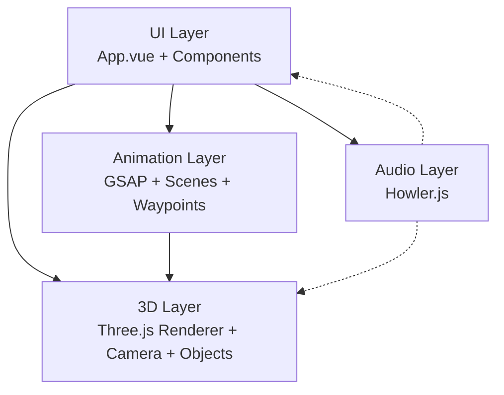
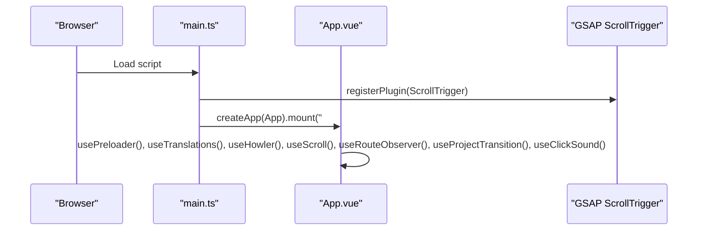
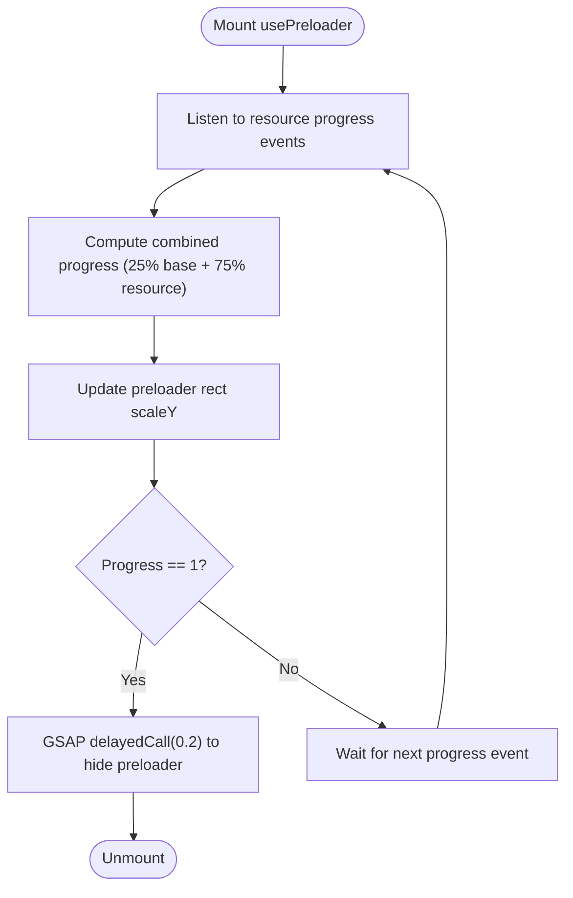
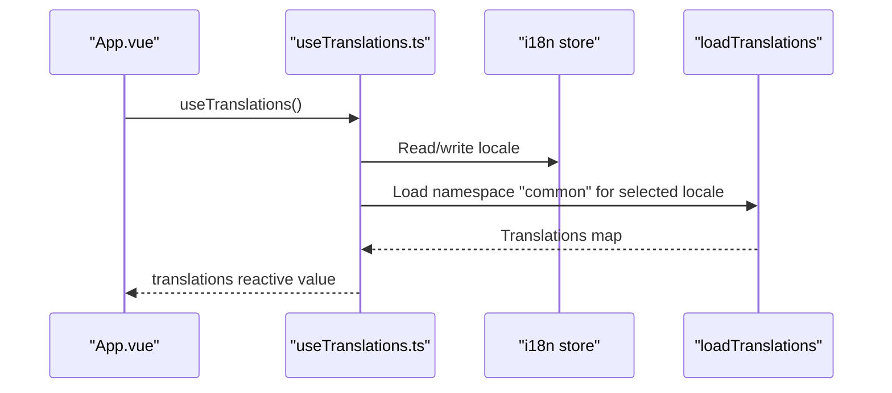
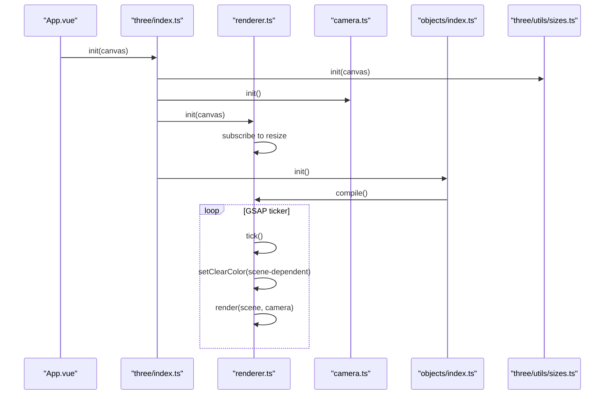
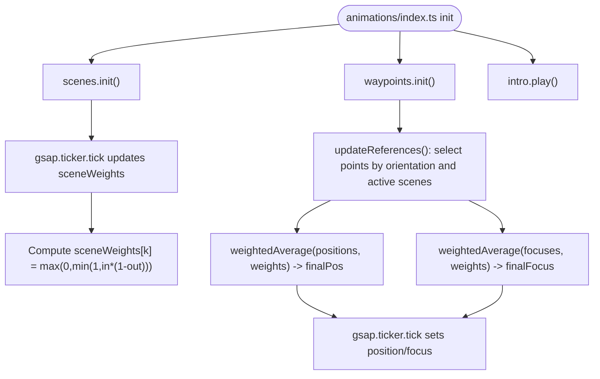
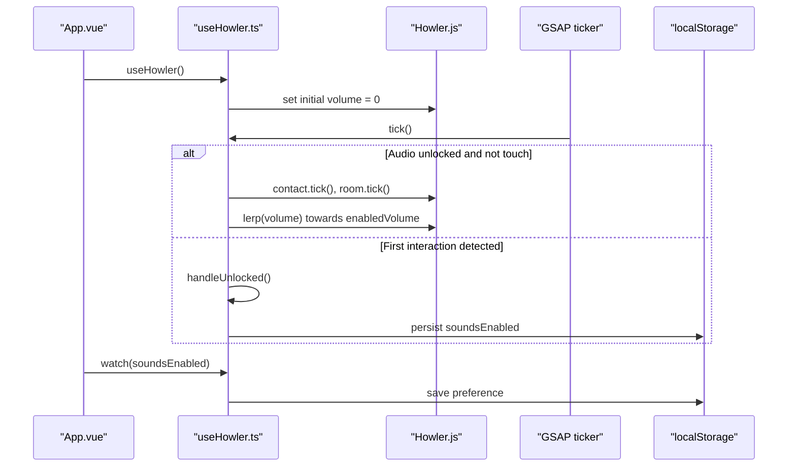
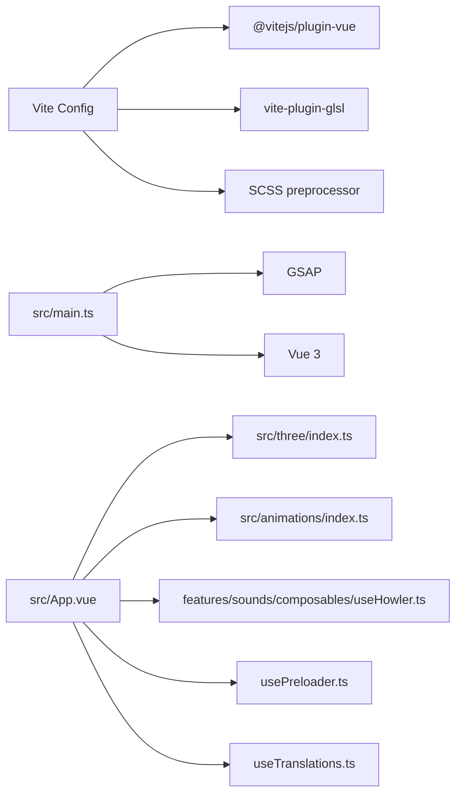

# System Design

<cite>
**Referenced Files in This Document**
- [package.json](file://package.json)
- [vite.config.ts](file://vite.config.ts)
- [src/main.ts](file://src/main.ts)
- [src/App.vue](file://src/App.vue)
- [README.md](file://README.md)
- [src/three/index.ts](file://src/three/index.ts)
- [src/three/core/renderer.ts](file://src/three/core/renderer.ts)
- [src/three/core/camera.ts](file://src/three/core/camera.ts)
- [src/three/objects/index.ts](file://src/three/objects/index.ts)
- [src/animations/index.ts](file://src/animations/index.ts)
- [src/animations/scenes.ts](file://src/animations/scenes.ts)
- [src/animations/waypoints.ts](file://src/animations/waypoints.ts)
- [src/features/sounds/composables/useHowler.ts](file://src/features/sounds/composables/useHowler.ts)
- [src/composables/usePreloader.ts](file://src/composables/usePreloader.ts)
- [src/i18n/composables/useTranslations.ts](file://src/i18n/composables/useTranslations.ts)
</cite>

## Table of Contents
1. [Introduction](#introduction)
2. [Project Structure](#project-structure)
3. [Core Components](#core-components)
4. [Architecture Overview](#architecture-overview)
5. [Detailed Component Analysis](#detailed-component-analysis)
6. [Dependency Analysis](#dependency-analysis)
7. [Performance Considerations](#performance-considerations)
8. [Troubleshooting Guide](#troubleshooting-guide)
9. [Conclusion](#conclusion)
10. [Appendices](#appendices)

## Introduction
This document describes the system architecture of Portfolio-PM, a modern personal portfolio integrating a Vue 3 frontend with a Three.js 3D graphics pipeline, GSAP-driven motion orchestration, and Howler.js audio processing. The application emphasizes a modular, composable design with clear separation of concerns across UI, 3D rendering, animations, and content management. It leverages Vite for fast development and optimized builds, and TypeScript for type safety.

## Project Structure
The project follows a feature-oriented, component-based organization:
- Frontend: Vue 3 single-file components, composables for cross-cutting concerns, and feature modules for pages and domains.
- 3D Pipeline: A self-contained Three.js subsystem under src/three/, encapsulating initialization, lifecycle, and rendering.
- Animations: A GSAP-centric animation orchestrator managing scene weights, waypoints, and transitions.
- Audio: A dedicated sounds feature module using Howler.js for spatialized and ambient audio.
- Internationalization: A composable-driven i18n layer for dynamic locale switching.
- Build Tooling: Vite with plugins for Vue SFCs, GLSL shaders, and SCSS preprocessing.

```mermaid
graph TB
subgraph "Frontend Runtime"
APP["App.vue"]
HEADER["Header.vue"]
CURSOR["Cursor.vue"]
HOME["features/home/components/Home.vue"]
PROJECT_BG["features/projects/components/ProjectBackground.vue"]
PROJECT["features/projects/components/Project.vue"]
end
subgraph "Composables"
PRELOADER["usePreloader.ts"]
TRANS["useTranslations.ts"]
HOWLER["useHowler.ts"]
ROUTE_OBS["useRouteObserver.ts"]
SCROLL["useScroll.ts"]
CLICK_SND["useClickSounds.ts"]
end
subgraph "3D Subsystem"
THREE_IDX["three/index.ts"]
RENDERER["three/core/renderer.ts"]
CAMERA["three/core/camera.ts"]
OBJECTS["three/objects/index.ts"]
end
subgraph "Animations"
ANIM_IDX["animations/index.ts"]
SCENES["animations/scenes.ts"]
WAYPOINTS["animations/waypoints.ts"]
end
subgraph "Audio"
HOWLER_COMPOSABLE["features/sounds/composables/useHowler.ts"]
end
APP --> HEADER
APP --> HOME
APP --> PROJECT_BG
APP --> PROJECT
APP --> CURSOR
APP --> PRELOADER
APP --> TRANS
APP --> HOWLER
APP --> ROUTE_OBS
APP --> SCROLL
APP --> CLICK_SND
APP --> THREE_IDX
THREE_IDX --> RENDERER
THREE_IDX --> CAMERA
THREE_IDX --> OBJECTS
APP --> ANIM_IDX
ANIM_IDX --> SCENES
ANIM_IDX --> WAYPOINTS
APP --> HOWLER_COMPOSABLE
```

**Diagram sources**
- [src/App.vue:1-87](file://src/App.vue#L1-L87)
- [src/three/index.ts:1-35](file://src/three/index.ts#L1-L35)
- [src/three/core/renderer.ts:1-119](file://src/three/core/renderer.ts#L1-L119)
- [src/three/core/camera.ts:1-119](file://src/three/core/camera.ts#L1-L119)
- [src/three/objects/index.ts:1-36](file://src/three/objects/index.ts#L1-L36)
- [src/animations/index.ts:1-30](file://src/animations/index.ts#L1-L30)
- [src/animations/scenes.ts:1-59](file://src/animations/scenes.ts#L1-L59)
- [src/animations/waypoints.ts:1-72](file://src/animations/waypoints.ts#L1-L72)
- [src/features/sounds/composables/useHowler.ts:1-110](file://src/features/sounds/composables/useHowler.ts#L1-L110)

**Section sources**
- [README.md:1-44](file://README.md#L1-L44)
- [src/App.vue:1-87](file://src/App.vue#L1-L87)

## Core Components
- Vue Application Bootstrap: Initializes GSAP ScrollTrigger plugin and mounts the root app.
- App Shell: Orchestrates global composables, routing overlays, and conditional rendering for project pages.
- Preloader Composable: Drives resource loading progress and animates the preloader UI.
- i18n Composable: Manages locale persistence and translation loading.
- Three.js Subsystem: Centralized initialization, lifecycle, and rendering loop with compile-time optimization.
- Animation Orchestrator: Scene weights, waypoint interpolation, and intro/in/out sequences.
- Audio Layer: Howler integration with device capability checks, volume ramping, and per-scene audio updates.

**Section sources**
- [src/main.ts:1-10](file://src/main.ts#L1-L10)
- [src/App.vue:1-87](file://src/App.vue#L1-L87)
- [src/composables/usePreloader.ts:1-43](file://src/composables/usePreloader.ts#L1-L43)
- [src/i18n/composables/useTranslations.ts:1-37](file://src/i18n/composables/useTranslations.ts#L1-L37)
- [src/three/index.ts:1-35](file://src/three/index.ts#L1-L35)
- [src/animations/index.ts:1-30](file://src/animations/index.ts#L1-L30)
- [src/features/sounds/composables/useHowler.ts:1-110](file://src/features/sounds/composables/useHowler.ts#L1-L110)

## Architecture Overview
The system integrates four primary subsystems:
- UI and Routing: Vue components and composables manage navigation, overlays, and global state.
- 3D Rendering: Three.js handles scene graph, camera movement, lighting, and rendering targets.
- Animation Orchestration: GSAP powers smooth transitions and scene-weight blending.
- Audio Processing: Howler manages spatialized and ambient audio with device-aware behavior.

**Diagram sources**
- [src/App.vue:1-87](file://src/App.vue#L1-L87)
- [src/three/index.ts:1-35](file://src/three/index.ts#L1-L35)
- [src/animations/index.ts:1-30](file://src/animations/index.ts#L1-L30)
- [src/features/sounds/composables/useHowler.ts:1-110](file://src/features/sounds/composables/useHowler.ts#L1-L110)

## Detailed Component Analysis

### Vue Application Bootstrap and Global Integrations
- Registers GSAP ScrollTrigger globally for scroll-driven animations.
- Mounts the root App component and initializes analytics.

**Diagram sources**
- [src/main.ts:1-10](file://src/main.ts#L1-L10)
- [src/App.vue:1-87](file://src/App.vue#L1-L87)

**Section sources**
- [src/main.ts:1-10](file://src/main.ts#L1-L10)
- [src/App.vue:1-87](file://src/App.vue#L1-L87)

### Preloader and Resource Loading
- Uses a resource loader to track progress and scales a preloader UI.
- Leverages GSAP delayed calls to animate out the preloader after completion.

**Diagram sources**
- [src/composables/usePreloader.ts:1-43](file://src/composables/usePreloader.ts#L1-L43)

**Section sources**
- [src/composables/usePreloader.ts:1-43](file://src/composables/usePreloader.ts#L1-L43)

### i18n Composable and Locale Management
- Persists and restores locale from localStorage.
- Loads translation namespaces on locale change.

**Diagram sources**
- [src/i18n/composables/useTranslations.ts:1-37](file://src/i18n/composables/useTranslations.ts#L1-L37)

**Section sources**
- [src/i18n/composables/useTranslations.ts:1-37](file://src/i18n/composables/useTranslations.ts#L1-L37)

### Three.js Subsystem Lifecycle and Rendering Loop
- Initialization sequence: resources ready → sizes init → camera init → render target init → renderer init → objects init → raycast init.
- Rendering loop: visibility toggles, render target rendering when needed, clear color selection based on scene weights, and scene render.

**Diagram sources**
- [src/three/index.ts:1-35](file://src/three/index.ts#L1-L35)
- [src/three/core/renderer.ts:1-119](file://src/three/core/renderer.ts#L1-L119)
- [src/three/core/camera.ts:1-119](file://src/three/core/camera.ts#L1-L119)
- [src/three/objects/index.ts:1-36](file://src/three/objects/index.ts#L1-L36)

**Section sources**
- [src/three/index.ts:1-35](file://src/three/index.ts#L1-L35)
- [src/three/core/renderer.ts:1-119](file://src/three/core/renderer.ts#L1-L119)
- [src/three/core/camera.ts:1-119](file://src/three/core/camera.ts#L1-L119)
- [src/three/objects/index.ts:1-36](file://src/three/objects/index.ts#L1-L36)

### Animation Orchestration: Scenes, Waypoints, and Intro
- Scene weights represent normalized visibility across scenes.
- Waypoints compute weighted averages of camera positions/focus based on active scene weights and viewport orientation.
- Intro sequence initializes scenes and waypoints, then plays the intro.

**Diagram sources**
- [src/animations/index.ts:1-30](file://src/animations/index.ts#L1-L30)
- [src/animations/scenes.ts:1-59](file://src/animations/scenes.ts#L1-L59)
- [src/animations/waypoints.ts:1-72](file://src/animations/waypoints.ts#L1-L72)

**Section sources**
- [src/animations/index.ts:1-30](file://src/animations/index.ts#L1-L30)
- [src/animations/scenes.ts:1-59](file://src/animations/scenes.ts#L1-L59)
- [src/animations/waypoints.ts:1-72](file://src/animations/waypoints.ts#L1-L72)

### Audio Layer with Howler.js
- Device-aware behavior: disables sounds on touch devices, unlocks audio on first interaction, persists user preference.
- Volume ramping via GSAP ticker; scene-specific audio updates; keyboard shortcut to toggle audio on non-touch devices.

**Diagram sources**
- [src/features/sounds/composables/useHowler.ts:1-110](file://src/features/sounds/composables/useHowler.ts#L1-L110)

**Section sources**
- [src/features/sounds/composables/useHowler.ts:1-110](file://src/features/sounds/composables/useHowler.ts#L1-L110)

## Dependency Analysis
- Build Tooling: Vite configured with Vue plugin, GLSL plugin, SCSS preprocessing, and asset inclusion for 3D/textures/audio.
- Runtime Dependencies: Vue 3, GSAP, Three.js, Howler, Lenis, vue-router.
- Internal Coupling: App.vue composes multiple features; Three.js and animations are decoupled but coordinate via scene weights and waypoints; audio is decoupled but integrated via composables.

**Diagram sources**
- [vite.config.ts:1-45](file://vite.config.ts#L1-L45)
- [src/main.ts:1-10](file://src/main.ts#L1-L10)
- [src/App.vue:1-87](file://src/App.vue#L1-L87)
- [src/three/index.ts:1-35](file://src/three/index.ts#L1-L35)
- [src/animations/index.ts:1-30](file://src/animations/index.ts#L1-L30)
- [src/features/sounds/composables/useHowler.ts:1-110](file://src/features/sounds/composables/useHowler.ts#L1-L110)
- [src/composables/usePreloader.ts:1-43](file://src/composables/usePreloader.ts#L1-L43)
- [src/i18n/composables/useTranslations.ts:1-37](file://src/i18n/composables/useTranslations.ts#L1-L37)

**Section sources**
- [package.json:1-38](file://package.json#L1-L38)
- [vite.config.ts:1-45](file://vite.config.ts#L1-L45)

## Performance Considerations
- Rendering Optimization:
  - Three.js compile phase forces frustum culling bypass for compilation to ensure shaders compile reliably.
  - Clear color selection based on scene weights reduces unnecessary re-renders.
- Animation Efficiency:
  - GSAP ticker drives all animation loops, minimizing redundant timers.
  - Weighted averages for waypoints reduce interpolation overhead.
- Asset Delivery:
  - Vite’s Rollup configuration optimizes chunk sizes and asset filenames.
  - GLSL and texture assets included via Vite config improve caching and bundling.
- Audio Responsiveness:
  - Volume lerping prevents audible pops; device checks avoid unnecessary work on touch devices.

[No sources needed since this section provides general guidance]

## Troubleshooting Guide
- Preloader does not hide:
  - Verify resource loader emits progress events and that progress reaches completion thresholds.
  - Confirm preloader rect element exists and transform updates occur.
- 3D scene not rendering:
  - Ensure resources are ready before initializing Three.js pipeline.
  - Check that renderer visibility toggling logic receives non-zero camera position and active state.
- Audio not playing:
  - On touch devices, audio is disabled by design; unlock occurs on first interaction.
  - Verify localStorage persistence of user preference and keyboard shortcut availability on non-touch devices.
- Animations feel sluggish:
  - Confirm GSAP ticker is registered and scene weights update consistently.
  - Validate weighted average computations and viewport orientation resolution.

**Section sources**
- [src/composables/usePreloader.ts:1-43](file://src/composables/usePreloader.ts#L1-L43)
- [src/three/core/renderer.ts:1-119](file://src/three/core/renderer.ts#L1-L119)
- [src/features/sounds/composables/useHowler.ts:1-110](file://src/features/sounds/composables/useHowler.ts#L1-L110)
- [src/animations/scenes.ts:1-59](file://src/animations/scenes.ts#L1-L59)
- [src/animations/waypoints.ts:1-72](file://src/animations/waypoints.ts#L1-L72)

## Conclusion
Portfolio-PM demonstrates a cohesive architecture that blends Vue 3’s component model with Three.js, GSAP, and Howler.js. The modular design enables clear separation of concerns, while composables unify cross-cutting concerns like internationalization, preloading, and audio. Vite and TypeScript provide a robust development and build foundation, ensuring maintainability and performance.

[No sources needed since this section summarizes without analyzing specific files]

## Appendices

### Build Tooling and Type Safety
- Vite configuration enables Vue SFCs, GLSL shader compilation, SCSS preprocessing, and optimized asset handling.
- TypeScript configuration supports strict type checking and Vue TS integration.

**Section sources**
- [vite.config.ts:1-45](file://vite.config.ts#L1-L45)
- [package.json:1-38](file://package.json#L1-L38)