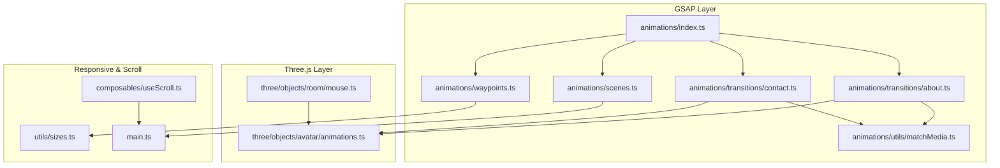
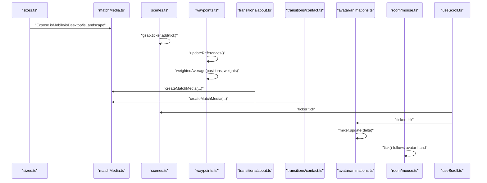
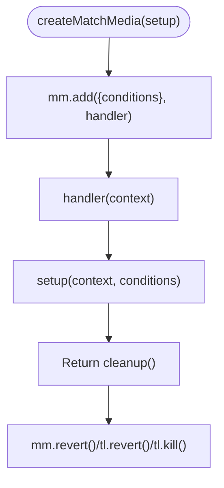
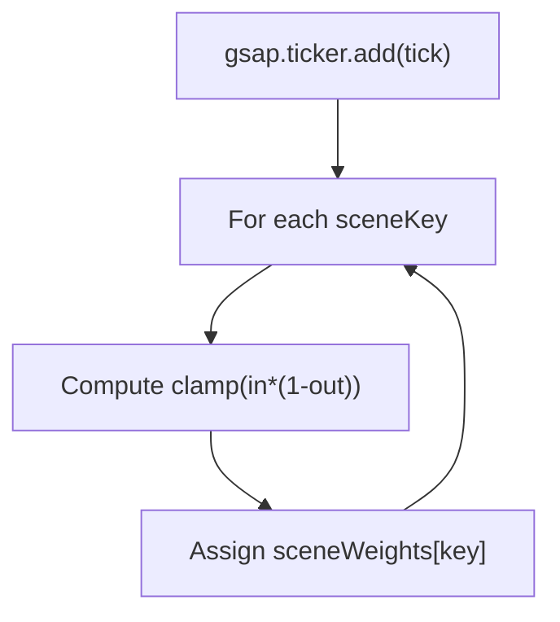
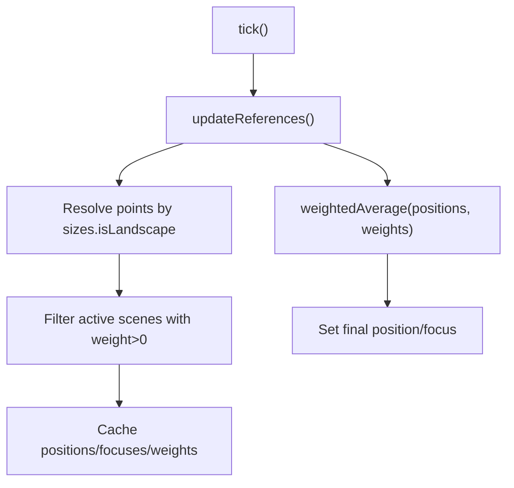
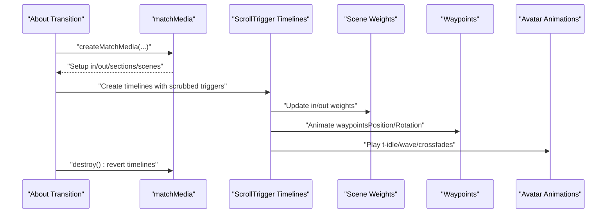
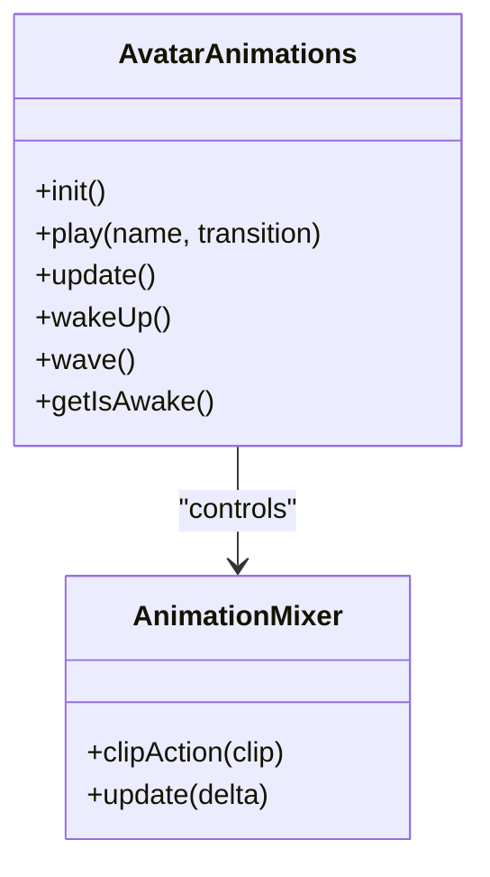
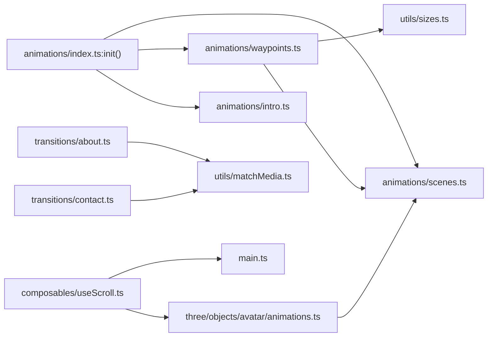

# Animation Optimization

<cite>
**Referenced Files in This Document**
- [matchMedia.ts](file://src/animations/utils/matchMedia.ts)
- [index.ts](file://src/animations/index.ts)
- [intro.ts](file://src/animations/intro.ts)
- [scenes.ts](file://src/animations/scenes.ts)
- [types.ts](file://src/animations/types.ts)
- [waypoints.ts](file://src/animations/waypoints.ts)
- [waypoints-data.ts](file://src/animations/waypoints-data.ts)
- [about.ts](file://src/animations/transitions/about.ts)
- [contact.ts](file://src/animations/transitions/contact.ts)
- [animations.ts](file://src/three/objects/avatar/animations.ts)
- [mouse.ts](file://src/three/objects/room/mouse.ts)
- [sizes.ts](file://src/utils/sizes.ts)
- [useScroll.ts](file://src/composables/useScroll.ts)
- [main.ts](file://src/main.ts)
</cite>

## Table of Contents
1. [Introduction](#introduction)
2. [Project Structure](#project-structure)
3. [Core Components](#core-components)
4. [Architecture Overview](#architecture-overview)
5. [Detailed Component Analysis](#detailed-component-analysis)
6. [Dependency Analysis](#dependency-analysis)
7. [Performance Considerations](#performance-considerations)
8. [Troubleshooting Guide](#troubleshooting-guide)
9. [Conclusion](#conclusion)
10. [Appendices](#appendices)

## Introduction
This document explains animation performance optimization techniques and best practices used in Portfolio-PM. It covers responsive adaptation via matchMedia utilities, animation lifecycle management, throttling and ticker usage, GPU-accelerated transforms, and cleanup strategies. It also provides guidance for profiling, identifying bottlenecks, and ensuring smooth frame rates across devices and browsers.

## Project Structure
The animation system is composed of:
- GSAP-driven timelines and ScrollTriggers for scroll-linked animations
- Responsive matchMedia wrappers for device and orientation-aware setups
- A lightweight ticker loop for per-frame updates
- Three.js avatar and room animations integrated with scene weights
- A composable that integrates Lenis smooth scrolling with GSAP’s ticker

**Diagram sources**
- [index.ts:1-30](file://src/animations/index.ts#L1-L30)
- [scenes.ts:1-59](file://src/animations/scenes.ts#L1-L59)
- [waypoints.ts:1-72](file://src/animations/waypoints.ts#L1-L72)
- [about.ts:1-295](file://src/animations/transitions/about.ts#L1-L295)
- [contact.ts:1-68](file://src/animations/transitions/contact.ts#L1-L68)
- [matchMedia.ts:1-27](file://src/animations/utils/matchMedia.ts#L1-L27)
- [animations.ts:1-222](file://src/three/objects/avatar/animations.ts#L1-L222)
- [mouse.ts:1-63](file://src/three/objects/room/mouse.ts#L1-L63)
- [sizes.ts:1-110](file://src/utils/sizes.ts#L1-L110)
- [useScroll.ts:1-61](file://src/composables/useScroll.ts#L1-L61)
- [main.ts:1-10](file://src/main.ts#L1-L10)

**Section sources**
- [index.ts:1-30](file://src/animations/index.ts#L1-L30)
- [main.ts:1-10](file://src/main.ts#L1-L10)

## Core Components
- MatchMedia wrapper: Centralizes responsive breakpoints and orientation checks for GSAP timelines.
- Scene weights and ticker: Compute normalized visibility weights per scene each frame.
- Waypoints: Weighted average of camera positions/focus across active scenes.
- Transition modules: Device- and orientation-aware timelines for About and Contact.
- Avatar animations: Three.js AnimationMixer with crossfades and per-frame updates.
- Scroll integration: Lenis + GSAP ticker for smooth, low-lag scrolling.

**Section sources**
- [matchMedia.ts:1-27](file://src/animations/utils/matchMedia.ts#L1-L27)
- [scenes.ts:1-59](file://src/animations/scenes.ts#L1-L59)
- [waypoints.ts:1-72](file://src/animations/waypoints.ts#L1-L72)
- [about.ts:1-295](file://src/animations/transitions/about.ts#L1-L295)
- [contact.ts:1-68](file://src/animations/transitions/contact.ts#L1-L68)
- [animations.ts:1-222](file://src/three/objects/avatar/animations.ts#L1-L222)
- [useScroll.ts:1-61](file://src/composables/useScroll.ts#L1-L61)

## Architecture Overview
The animation pipeline integrates responsive detection, scene weighting, and GSAP timelines with Three.js updates and smooth scrolling.

**Diagram sources**
- [sizes.ts:1-110](file://src/utils/sizes.ts#L1-L110)
- [matchMedia.ts:1-27](file://src/animations/utils/matchMedia.ts#L1-L27)
- [scenes.ts:1-59](file://src/animations/scenes.ts#L1-L59)
- [waypoints.ts:1-72](file://src/animations/waypoints.ts#L1-L72)
- [about.ts:1-295](file://src/animations/transitions/about.ts#L1-L295)
- [contact.ts:1-68](file://src/animations/transitions/contact.ts#L1-L68)
- [animations.ts:1-222](file://src/three/objects/avatar/animations.ts#L1-L222)
- [mouse.ts:1-63](file://src/three/objects/room/mouse.ts#L1-L63)
- [useScroll.ts:1-61](file://src/composables/useScroll.ts#L1-L61)

## Detailed Component Analysis

### Responsive Adaptation with MatchMedia Utilities
- Purpose: Provide device and orientation-aware conditions to GSAP timelines.
- Implementation highlights:
  - Uses a single GSAP matchMedia instance with custom conditions for mobile, desktop, and landscape.
  - Returns a cleanup function from the setup callback to revert timelines when conditions change.
- Best practices:
  - Keep timeline creation inside matchMedia callbacks to avoid redundant work.
  - Revert timelines on cleanup to prevent leaks and stale triggers.

**Diagram sources**
- [matchMedia.ts:4-26](file://src/animations/utils/matchMedia.ts#L4-L26)
- [about.ts:52-67](file://src/animations/transitions/about.ts#L52-L67)
- [contact.ts:41-49](file://src/animations/transitions/contact.ts#L41-L49)

**Section sources**
- [matchMedia.ts:1-27](file://src/animations/utils/matchMedia.ts#L1-L27)
- [about.ts:51-67](file://src/animations/transitions/about.ts#L51-L67)
- [contact.ts:41-49](file://src/animations/transitions/contact.ts#L41-L49)

### Scene Weights and Ticker-Based Updates
- Purpose: Normalize scene visibility across hero/about/projects/contact.
- Implementation highlights:
  - A fixed-weight dictionary defines scene importance.
  - A per-frame ticker computes a bounded weight per scene based on “in” and “out” states.
  - Exported for use by camera waypoints and transitions.
- Performance notes:
  - Single ticker loop updates all weights each frame.
  - Clamp weights to [0,1] to avoid exponential drift.

**Diagram sources**
- [scenes.ts:41-52](file://src/animations/scenes.ts#L41-L52)

**Section sources**
- [scenes.ts:1-59](file://src/animations/scenes.ts#L1-L59)
- [types.ts:1-4](file://src/animations/types.ts#L1-L4)

### Waypoints and Weighted Averages
- Purpose: Drive camera position and focus using a weighted average across active scenes.
- Implementation highlights:
  - Resolves points based on landscape/portrait and active scenes.
  - Maintains cached arrays for positions, focuses, and weights.
  - On each tick, recomputes final position and focus vectors.
- Performance notes:
  - Avoids allocations in the hot path by reusing arrays.
  - References update only when scene weights or viewport orientation change.

**Diagram sources**
- [waypoints.ts:43-65](file://src/animations/waypoints.ts#L43-L65)
- [waypoints-data.ts:3-57](file://src/animations/waypoints-data.ts#L3-L57)
- [sizes.ts:27](file://src/utils/sizes.ts#L27)

**Section sources**
- [waypoints.ts:1-72](file://src/animations/waypoints.ts#L1-L72)
- [waypoints-data.ts:1-57](file://src/animations/waypoints-data.ts#L1-L57)
- [sizes.ts:1-110](file://src/utils/sizes.ts#L1-L110)

### About Transition: Multi-Stage, Responsive Animations
- Purpose: Orchestrates entrance, progress bar, sections, and scene transitions with responsive adjustments.
- Implementation highlights:
  - Uses matchMedia for mobile/desktop and landscape checks.
  - Scroll-triggered timelines for entrance, exit, and internal section animations.
  - Conditional transforms and waypoint movements depending on orientation.
  - Cleanup via revert/kill of timelines and matchMedia instances.
- Performance notes:
  - Scrubbed scrollTriggers minimize layout thrash by animating transform/opacity.
  - Orientation-dependent delays and easing reduce simultaneous heavy work.

**Diagram sources**
- [about.ts:16-179](file://src/animations/transitions/about.ts#L16-L179)
- [matchMedia.ts:4-26](file://src/animations/utils/matchMedia.ts#L4-L26)
- [animations.ts:117-152](file://src/three/objects/avatar/animations.ts#L117-L152)

**Section sources**
- [about.ts:1-295](file://src/animations/transitions/about.ts#L1-L295)

### Contact Transition: Lightweight Entrance/Exit
- Purpose: Minimal scroll-triggered entrance/exit with a delayed wake-up triggered by orientation.
- Implementation highlights:
  - Sets scene weights on enter/exit.
  - Uses matchMedia to adjust trigger offsets for mobile vs. desktop.
  - Cleans up timelines and matchMedia on destroy.
- Performance notes:
  - Avoids heavy transforms; relies on scene weight updates for downstream effects.

**Section sources**
- [contact.ts:1-68](file://src/animations/transitions/contact.ts#L1-L68)

### Avatar Animations: Mixer, Crossfades, and Per-Frame Updates
- Purpose: Manage Three.js avatar animations with smooth transitions and per-frame mixer updates.
- Implementation highlights:
  - Preloads actions and sets loop modes; maintains active action and weights.
  - Exposes play(), wakeUp(), wave(), and update().
  - update() computes delta using GSAP ticker and advances mixers.
- Performance notes:
  - Crossfade durations are tuned to avoid abrupt changes.
  - Intro and contact modes switch weights to blend idle/t-idle/wave/sleeping.

**Diagram sources**
- [animations.ts:23-33](file://src/three/objects/avatar/animations.ts#L23-L33)
- [animations.ts:117-135](file://src/three/objects/avatar/animations.ts#L117-L135)
- [animations.ts:208-219](file://src/three/objects/avatar/animations.ts#L208-L219)

**Section sources**
- [animations.ts:1-222](file://src/three/objects/avatar/animations.ts#L1-L222)

### Room Mouse Follower: Conditional Movement with Bounds
- Purpose: Mouse follows avatar’s right hand within bounds while hero scene is near completion.
- Implementation highlights:
  - Uses GSAP ticker to poll bone world position and convert to local space.
  - Applies conditional movement only when hero scene weight exceeds threshold.
- Performance notes:
  - Early exits when conditions are not met reduce unnecessary work.

**Section sources**
- [mouse.ts:1-63](file://src/three/objects/room/mouse.ts#L1-L63)

### Scroll Integration: Lenis + GSAP Ticker
- Purpose: Provide smooth scrolling synchronized with GSAP’s ticker for consistent frame timing.
- Implementation highlights:
  - Creates a Lenis instance and hooks its raf into GSAP ticker.
  - Adjusts velocity based on scroll direction and magnitude.
  - Pauses Lenis during transitions and clears ScrollTrigger memory.
- Performance notes:
  - Disables lag smoothing to keep updates deterministic.
  - Stops and restarts Lenis to avoid residual scroll state during route transitions.

**Section sources**
- [useScroll.ts:1-61](file://src/composables/useScroll.ts#L1-L61)

## Dependency Analysis
- Centralized initialization wires scenes, waypoints, and intro playback.
- Transitions depend on matchMedia for responsiveness and on scene weights for synchronization.
- Waypoints depend on sizes for orientation and on scene weights for active points.
- Avatar animations depend on scene weights and GSAP ticker for mixer updates.
- Scroll integration ties Lenis and ScrollTrigger to the GSAP ticker.

**Diagram sources**
- [index.ts:14-29](file://src/animations/index.ts#L14-L29)
- [about.ts:3](file://src/animations/transitions/about.ts#L3)
- [contact.ts:4](file://src/animations/transitions/contact.ts#L4)
- [waypoints.ts:44-45](file://src/animations/waypoints.ts#L44-L45)
- [animations.ts:208-219](file://src/three/objects/avatar/animations.ts#L208-L219)
- [useScroll.ts:40-55](file://src/composables/useScroll.ts#L40-L55)
- [main.ts:7](file://src/main.ts#L7)

**Section sources**
- [index.ts:1-30](file://src/animations/index.ts#L1-L30)
- [about.ts:1-295](file://src/animations/transitions/about.ts#L1-L295)
- [contact.ts:1-68](file://src/animations/transitions/contact.ts#L1-L68)
- [waypoints.ts:1-72](file://src/animations/waypoints.ts#L1-L72)
- [animations.ts:1-222](file://src/three/objects/avatar/animations.ts#L1-L222)
- [useScroll.ts:1-61](file://src/composables/useScroll.ts#L1-L61)
- [main.ts:1-10](file://src/main.ts#L1-L10)

## Performance Considerations
- Throttling and Ticker Control
  - Use a single GSAP ticker for per-frame updates to avoid redundant RAF scheduling.
  - Remove ticker handlers on destroy to prevent leaks.
  - Example references:
    - [scenes.ts:42](file://src/animations/scenes.ts#L42)
    - [waypoints.ts:14](file://src/animations/waypoints.ts#L14)
    - [animations.ts:208-219](file://src/three/objects/avatar/animations.ts#L208-L219)
    - [mouse.ts:34](file://src/three/objects/room/mouse.ts#L34)
    - [useScroll.ts:41](file://src/composables/useScroll.ts#L41)
- Responsive Adaptation
  - Use matchMedia wrapper to tailor timelines per device/orientation and revert on change.
  - Example references:
    - [matchMedia.ts:4-26](file://src/animations/utils/matchMedia.ts#L4-L26)
    - [about.ts:70-138](file://src/animations/transitions/about.ts#L70-L138)
    - [contact.ts:41-49](file://src/animations/transitions/contact.ts#L41-L49)
- GPU Acceleration and Transform Scope
  - Animate transform/opacity on 3D-enabled elements to leverage compositing layers.
  - Avoid layout-affecting properties (offsetWidth/Height) in tight loops.
  - Example references:
    - [about.ts:120-136](file://src/animations/transitions/about.ts#L120-L136)
    - [waypoints.ts:60-64](file://src/animations/waypoints.ts#L60-L64)
- Memory Management and Cleanup
  - Revert timelines and kill ScrollTriggers; remove ticker handlers; dispose of ResizeObserver.
  - Example references:
    - [about.ts:286-292](file://src/animations/transitions/about.ts#L286-L292)
    - [contact.ts:52-65](file://src/animations/transitions/contact.ts#L52-L65)
    - [waypoints.ts:67](file://src/animations/waypoints.ts#L67)
    - [mouse.ts:58](file://src/three/objects/room/mouse.ts#L58)
    - [sizes.ts:100-106](file://src/utils/sizes.ts#L100-L106)
- Smoothness and Frame Budget
  - Keep ScrollTrigger scrub durations moderate; batch animations; avoid synchronous layout reads.
  - Example references:
    - [useScroll.ts:42](file://src/composables/useScroll.ts#L42)
    - [about.ts:51-67](file://src/animations/transitions/about.ts#L51-L67)
- Browser and Platform Notes
  - Register ScrollTrigger globally once at startup.
    - [main.ts:7](file://src/main.ts#L7)
  - Use ResizeObserver for efficient resize handling.
    - [sizes.ts:47-52](file://src/utils/sizes.ts#L47-L52)
  - Clamp devicePixelRatio to limit rendering cost.
    - [sizes.ts:90](file://src/utils/sizes.ts#L90)

[No sources needed since this section provides general guidance]

## Troubleshooting Guide
- Symptom: Animations stutter or drop frames
  - Check ticker usage and ensure only one ticker is active.
    - [useScroll.ts:41](file://src/composables/useScroll.ts#L41)
  - Verify ScrollTrigger scrubbing is not overly aggressive.
    - [about.ts:55](file://src/animations/transitions/about.ts#L55)
- Symptom: Animations behave differently on mobile vs. desktop
  - Confirm matchMedia conditions and cleanup on orientation changes.
    - [matchMedia.ts:18-22](file://src/animations/utils/matchMedia.ts#L18-L22)
    - [about.ts:70-138](file://src/animations/transitions/about.ts#L70-L138)
- Symptom: Avatar animations feel off-key or laggy
  - Ensure mixer.update is called each frame with correct delta.
    - [animations.ts:208-219](file://src/three/objects/avatar/animations.ts#L208-L219)
- Symptom: Room mouse does not follow hand
  - Confirm hero scene weight threshold and bone availability.
    - [mouse.ts:40-50](file://src/three/objects/room/mouse.ts#L40-L50)
- Symptom: Scroll feels choppy during transitions
  - Pause Lenis and clear ScrollTrigger memory during transitions.
    - [useScroll.ts:47-55](file://src/composables/useScroll.ts#L47-L55)

**Section sources**
- [useScroll.ts:41-55](file://src/composables/useScroll.ts#L41-L55)
- [matchMedia.ts:18-22](file://src/animations/utils/matchMedia.ts#L18-L22)
- [about.ts:55](file://src/animations/transitions/about.ts#L55)
- [animations.ts:208-219](file://src/three/objects/avatar/animations.ts#L208-L219)
- [mouse.ts:40-50](file://src/three/objects/room/mouse.ts#L40-L50)

## Conclusion
Portfolio-PM’s animation system combines responsive matchMedia, scene-weighted camera waypoints, and GSAP-driven scroll-linked animations with careful lifecycle management and ticker-based updates. By centralizing responsive logic, limiting layout work, and cleaning up resources on teardown, the system achieves smooth performance across devices and browsers.

[No sources needed since this section summarizes without analyzing specific files]

## Appendices
- Animation Lifecycle Checklist
  - Initialize: register ticker, create timelines, set up matchMedia.
  - Run: per-frame updates, conditional early exits, minimal allocations.
  - Destroy: revert timelines, kill ScrollTriggers, remove ticker, dispose observers.
- Profiling Tips
  - Use browser devtools to monitor JS CPU, compositing, and rasterization costs.
  - Temporarily disable non-essential timelines to isolate bottlenecks.
  - Measure frame time with the Performance panel and aim for consistent sub-16ms frames.

[No sources needed since this section provides general guidance]