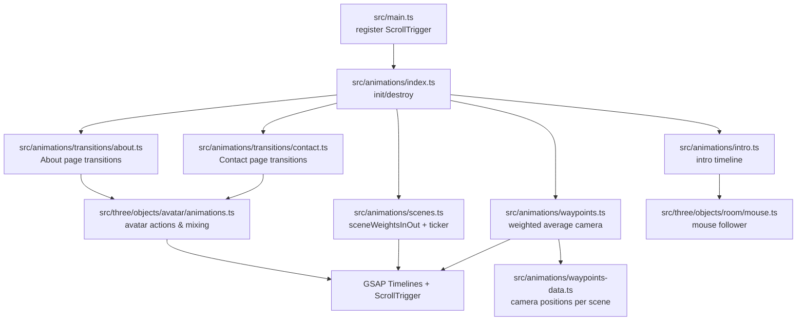
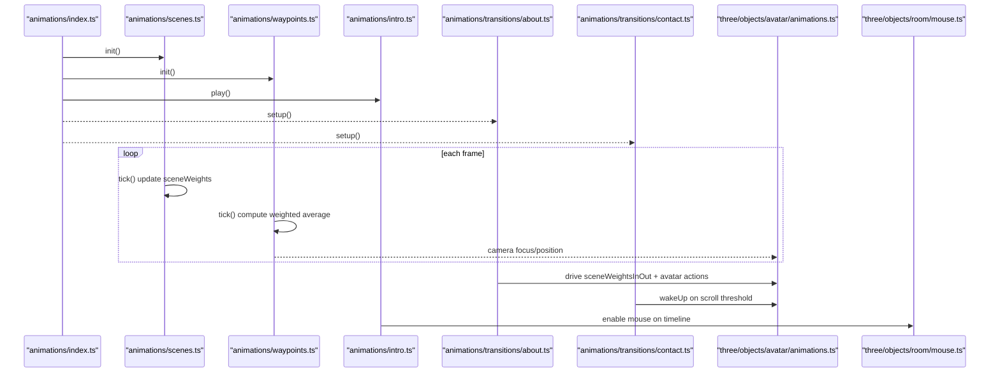
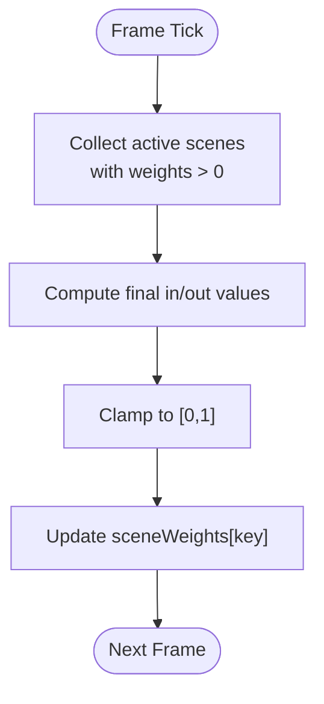
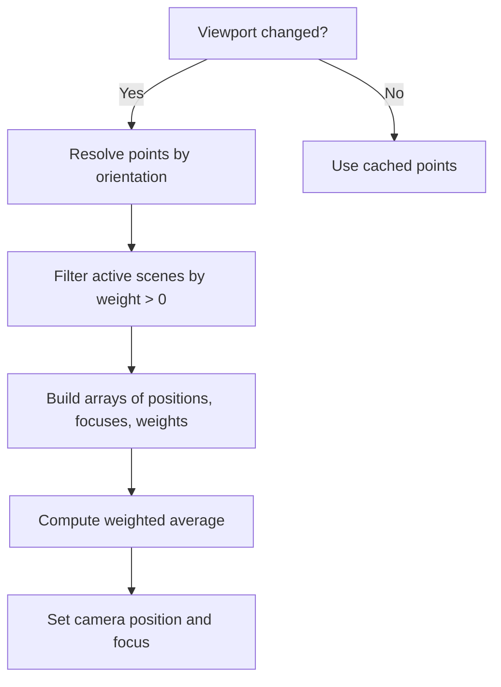
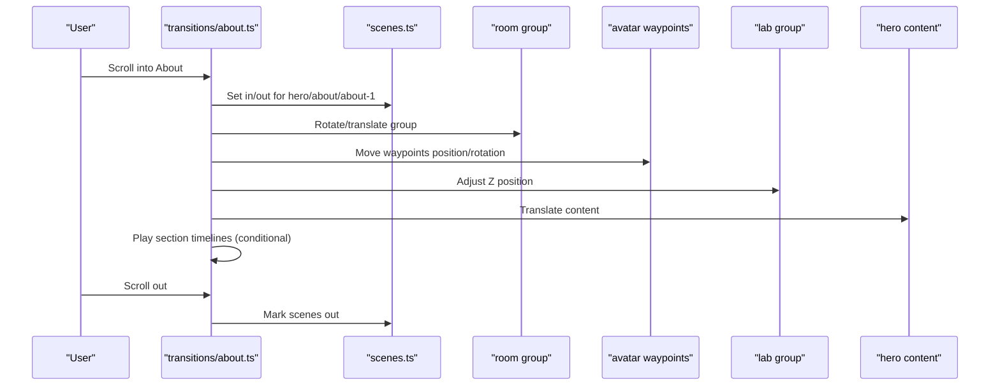
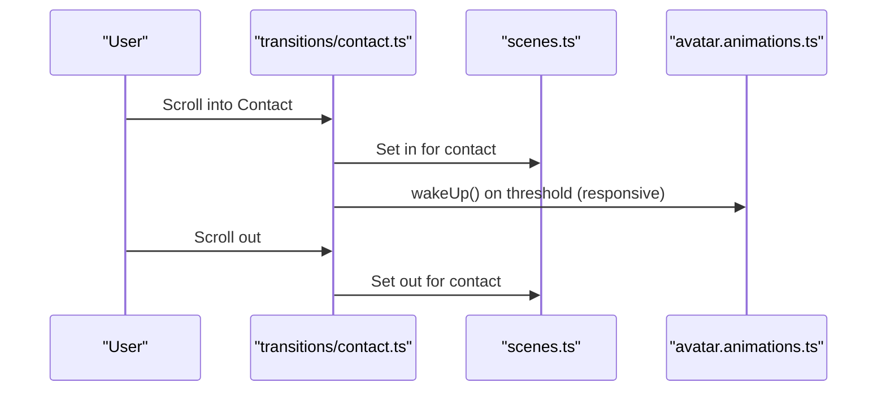
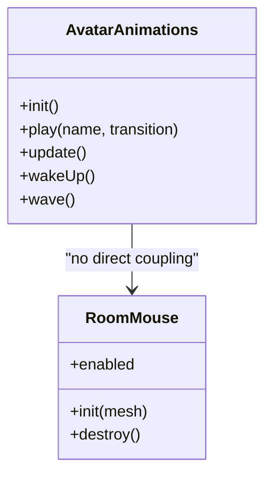
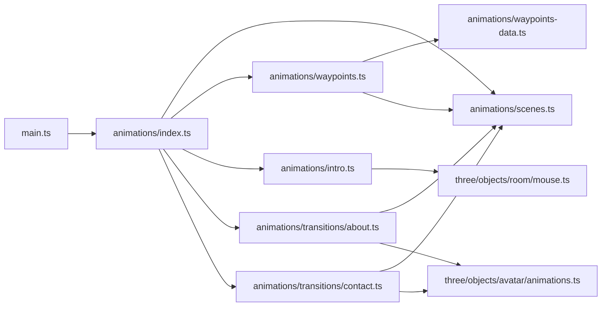

# Animation System

<cite>
**Referenced Files in This Document**
- [index.ts](file://src/animations/index.ts)
- [scenes.ts](file://src/animations/scenes.ts)
- [types.ts](file://src/animations/types.ts)
- [intro.ts](file://src/animations/intro.ts)
- [about.ts](file://src/animations/transitions/about.ts)
- [contact.ts](file://src/animations/transitions/contact.ts)
- [waypoints.ts](file://src/animations/waypoints.ts)
- [waypoints-data.ts](file://src/animations/waypoints-data.ts)
- [matchMedia.ts](file://src/animations/utils/matchMedia.ts)
- [main.ts](file://src/main.ts)
- [animations.ts](file://src/three/objects/avatar/animations.ts)
- [mouse.ts](file://src/three/objects/room/mouse.ts)
</cite>

## Table of Contents
1. [Introduction](#introduction)
2. [Project Structure](#project-structure)
3. [Core Components](#core-components)
4. [Architecture Overview](#architecture-overview)
5. [Detailed Component Analysis](#detailed-component-analysis)
6. [Dependency Analysis](#dependency-analysis)
7. [Performance Considerations](#performance-considerations)
8. [Troubleshooting Guide](#troubleshooting-guide)
9. [Conclusion](#conclusion)
10. [Appendices](#appendices)

## Introduction
This document describes the animation system built on GSAP that orchestrates smooth transitions and interactive experiences across Portfolio-PM. It explains how timelines are coordinated across scenes and components, how transitions are configured for the About and Contact pages, how scroll-triggered animations are implemented, how responsive adaptations are handled via matchMedia utilities, and how the animation system integrates with the 3D graphics pipeline. It also provides guidance for creating custom animations, configuring scroll triggers, optimizing performance, and extending the system with new transitions and effects.

## Project Structure
The animation system is organized around a central initialization module that wires up scene weighting, waypoints, and page-specific transitions. Page transitions are implemented under a dedicated folder and leverage GSAP’s ScrollTrigger and matchMedia utilities. The 3D integration lives in the three.js objects and is driven by scene weights and global timelines.

**Diagram sources**
- [main.ts:1-10](file://src/main.ts#L1-L10)
- [index.ts:1-30](file://src/animations/index.ts#L1-L30)
- [scenes.ts:1-59](file://src/animations/scenes.ts#L1-L59)
- [waypoints.ts:1-72](file://src/animations/waypoints.ts#L1-L72)
- [waypoints-data.ts:1-57](file://src/animations/waypoints-data.ts#L1-L57)
- [intro.ts:1-16](file://src/animations/intro.ts#L1-L16)
- [about.ts:1-295](file://src/animations/transitions/about.ts#L1-L295)
- [contact.ts:1-68](file://src/animations/transitions/contact.ts#L1-L68)
- [animations.ts:1-222](file://src/three/objects/avatar/animations.ts#L1-L222)
- [mouse.ts:1-63](file://src/three/objects/room/mouse.ts#L1-L63)

**Section sources**
- [index.ts:1-30](file://src/animations/index.ts#L1-L30)
- [main.ts:1-10](file://src/main.ts#L1-L10)

## Core Components
- Timeline orchestration and lifecycle:
  - Central initialization wires up scenes, waypoints, and intro playback.
  - Destruction cleans up listeners and timelines to prevent leaks.
- Scene weighting:
  - A lightweight system computes visibility weights per scene and exposes in/out thresholds for smooth transitions.
- Waypoints:
  - A weighted average of camera positions and focuses across active scenes drives the 3D camera smoothly.
- Transitions:
  - About and Contact pages define scroll-triggered timelines that coordinate with scene weights and 3D assets.
- Responsive adaptations:
  - MatchMedia wrapper adapts animations to mobile/desktop and landscape/portrait contexts.
- 3D integration:
  - Avatar animations and room mouse follower react to scene weights and global timelines.

**Section sources**
- [index.ts:12-29](file://src/animations/index.ts#L12-L29)
- [scenes.ts:18-52](file://src/animations/scenes.ts#L18-L52)
- [waypoints.ts:42-65](file://src/animations/waypoints.ts#L42-L65)
- [matchMedia.ts:4-27](file://src/animations/utils/matchMedia.ts#L4-L27)
- [animations.ts:208-219](file://src/three/objects/avatar/animations.ts#L208-L219)

## Architecture Overview
The animation system follows a layered architecture:
- Initialization layer registers plugins and starts the animation engine.
- Scene layer maintains normalized weights per scene and updates them each frame.
- Waypoint layer aggregates active scene positions/focuses into a single camera target.
- Transition layer defines per-page scroll-driven timelines.
- 3D layer reacts to scene weights and timelines to animate meshes and materials.

**Diagram sources**
- [index.ts:14-20](file://src/animations/index.ts#L14-L20)
- [scenes.ts:41-52](file://src/animations/scenes.ts#L41-L52)
- [waypoints.ts:57-65](file://src/animations/waypoints.ts#L57-L65)
- [intro.ts:6-13](file://src/animations/intro.ts#L6-L13)
- [about.ts:16-49](file://src/animations/transitions/about.ts#L16-L49)
- [contact.ts:10-50](file://src/animations/transitions/contact.ts#L10-L50)
- [animations.ts:208-219](file://src/three/objects/avatar/animations.ts#L208-L219)
- [mouse.ts:30-56](file://src/three/objects/room/mouse.ts#L30-L56)

## Detailed Component Analysis

### Timeline Management System (index.ts)
- Purpose:
  - Initializes and tears down the animation subsystem.
  - Exposes a single interface to start/stop all animations.
- Responsibilities:
  - Ensures idempotent initialization and destruction.
  - Invokes initialization routines for scenes, waypoints, and intro.
- Best practices:
  - Keep initialization centralized to avoid race conditions.
  - Always pair setup with teardown to prevent memory leaks.

**Section sources**
- [index.ts:14-29](file://src/animations/index.ts#L14-L29)

### Scene Weighting and Coordination (scenes.ts)
- Purpose:
  - Maintain normalized visibility weights per scene.
  - Provide smooth in/out transitions via a simple ticker-driven update.
- Data model:
  - sceneWeights: numeric weight per scene.
  - sceneWeightsInOut: in/out thresholds per scene used to compute weights.
- Behavior:
  - On each frame, weights are clamped to [0,1] based on in/out values.
- Integration:
  - Consumed by waypoints for camera targeting and by transitions for conditional animations.

**Diagram sources**
- [scenes.ts:45-52](file://src/animations/scenes.ts#L45-L52)

**Section sources**
- [scenes.ts:3-10](file://src/animations/scenes.ts#L3-L10)
- [scenes.ts:18-39](file://src/animations/scenes.ts#L18-L39)
- [scenes.ts:41-52](file://src/animations/scenes.ts#L41-L52)

### Waypoints and Camera Targeting (waypoints.ts, waypoints-data.ts)
- Purpose:
  - Drive the 3D camera by computing a weighted average of positions and focuses across active scenes.
- Data model:
  - points.landscape/portrait: fixed camera positions and focuses per scene.
- Algorithm:
  - At each tick, filter active scenes by positive weights, resolve points by orientation, compute weighted averages, and update internal vectors.
- Integration:
  - Consumed by the 3D camera and avatar animations to maintain coherent framing.

**Diagram sources**
- [waypoints.ts:43-65](file://src/animations/waypoints.ts#L43-L65)
- [waypoints-data.ts:3-57](file://src/animations/waypoints-data.ts#L3-L57)

**Section sources**
- [waypoints.ts:12-15](file://src/animations/waypoints.ts#L12-L15)
- [waypoints.ts:42-55](file://src/animations/waypoints.ts#L42-L55)
- [waypoints.ts:57-65](file://src/animations/waypoints.ts#L57-L65)
- [waypoints-data.ts:3-57](file://src/animations/waypoints-data.ts#L3-L57)

### About Page Transitions (about.ts)
- Setup phases:
  - In animation: scrolls in, adjusts scene weights, rotates room, moves avatar waypoints, and translates hero content.
  - Sections animation: fades and plays child timelines for Description, Services, and Details depending on orientation.
  - Scenes animation: coordinates scene switches between “about-1” and “about-2”.
  - Out animation: marks scenes as out when scrolling away.
  - Progress animation: scrubbed progress bar for portrait mode.
- Responsive behavior:
  - Uses matchMedia to adapt triggers, delays, and transforms for landscape vs portrait.
- Integration:
  - Drives sceneWeightsInOut for hero/about/about-1/about-2.
  - Animates room group position/rotation and avatar waypoints.
  - Controls hero content translation during in animation.

**Diagram sources**
- [about.ts:69-138](file://src/animations/transitions/about.ts#L69-L138)
- [about.ts:181-284](file://src/animations/transitions/about.ts#L181-L284)
- [about.ts:154-179](file://src/animations/transitions/about.ts#L154-L179)
- [about.ts:140-152](file://src/animations/transitions/about.ts#L140-L152)
- [about.ts:51-67](file://src/animations/transitions/about.ts#L51-L67)

**Section sources**
- [about.ts:16-49](file://src/animations/transitions/about.ts#L16-L49)
- [about.ts:51-67](file://src/animations/transitions/about.ts#L51-L67)
- [about.ts:69-138](file://src/animations/transitions/about.ts#L69-L138)
- [about.ts:140-152](file://src/animations/transitions/about.ts#L140-L152)
- [about.ts:154-179](file://src/animations/transitions/about.ts#L154-L179)
- [about.ts:181-284](file://src/animations/transitions/about.ts#L181-L284)

### Contact Form Transitions (contact.ts)
- Setup:
  - In/out scroll-triggered timelines adjust sceneWeightsInOut.contact.
  - Wake-up trigger (responsive) calls avatar wakeUp after entering viewport.
- Cleanup:
  - Timelines and matchMedia are reverted/killed on teardown.

**Diagram sources**
- [contact.ts:10-50](file://src/animations/transitions/contact.ts#L10-L50)
- [contact.ts:52-67](file://src/animations/transitions/contact.ts#L52-L67)

**Section sources**
- [contact.ts:10-50](file://src/animations/transitions/contact.ts#L10-L50)
- [contact.ts:52-67](file://src/animations/transitions/contact.ts#L52-L67)

### Intro Timeline (intro.ts)
- Purpose:
  - Optional intro sequence that enables a mouse follower after an initial delay.
- Integration:
  - Uses a feature flag to gate the intro and sets a reactive property to enable movement.

**Section sources**
- [intro.ts:6-13](file://src/animations/intro.ts#L6-L13)

### 3D Integration (avatar animations.ts, room mouse.ts)
- Avatar animations:
  - Manages multiple animation mixers and actions, crossfades between states, and updates weights based on scene weights.
  - Provides update loop synchronized to GSAP’s ticker.
- Room mouse:
  - Tracks avatar hand position and updates mouse mesh when conditions are met.

**Diagram sources**
- [animations.ts:23-33](file://src/three/objects/avatar/animations.ts#L23-L33)
- [animations.ts:208-219](file://src/three/objects/avatar/animations.ts#L208-L219)
- [mouse.ts:30-35](file://src/three/objects/room/mouse.ts#L30-L35)

**Section sources**
- [animations.ts:208-219](file://src/three/objects/avatar/animations.ts#L208-L219)
- [mouse.ts:37-56](file://src/three/objects/room/mouse.ts#L37-L56)

## Dependency Analysis
- Initialization depends on:
  - GSAP plugin registration in the main entry point.
  - Central index module to wire scenes, waypoints, and intro.
- Transitions depend on:
  - Scene weights for conditional logic.
  - MatchMedia utilities for responsive behavior.
  - 3D assets for positional/rotational animations.
- Waypoints depend on:
  - Scene weights and orientation to select appropriate camera points.

**Diagram sources**
- [main.ts:4-7](file://src/main.ts#L4-L7)
- [index.ts:14-20](file://src/animations/index.ts#L14-L20)
- [waypoints.ts:42-55](file://src/animations/waypoints.ts#L42-L55)
- [waypoints-data.ts:3-57](file://src/animations/waypoints-data.ts#L3-L57)
- [about.ts:16-49](file://src/animations/transitions/about.ts#L16-L49)
- [contact.ts:10-50](file://src/animations/transitions/contact.ts#L10-L50)
- [animations.ts:208-219](file://src/three/objects/avatar/animations.ts#L208-L219)
- [mouse.ts:30-56](file://src/three/objects/room/mouse.ts#L30-L56)

**Section sources**
- [main.ts:4-7](file://src/main.ts#L4-L7)
- [index.ts:14-20](file://src/animations/index.ts#L14-L20)
- [waypoints.ts:42-55](file://src/animations/waypoints.ts#L42-L55)

## Performance Considerations
- Prefer scrubbed ScrollTriggers for smoothness on lower-end devices.
- Use matchMedia to avoid unnecessary timeline creation on irrelevant breakpoints.
- Revert or kill timelines and remove ticker callbacks on teardown to prevent leaks.
- Minimize DOM reads/writes inside tight loops; batch updates when possible.
- Leverage GSAP’s internal ticker delta for deterministic 3D updates.
- Disable heavy effects behind feature flags when performance is constrained.

[No sources needed since this section provides general guidance]

## Troubleshooting Guide
- Stuttering or dropped frames:
  - Verify ScrollTrigger scrubbing is enabled only where necessary.
  - Reduce the number of animated properties per timeline.
  - Ensure ticker-based updates are not doing expensive work each frame.
- Memory issues:
  - Always call revert/kill on matchMedia/timelines and remove ticker callbacks in destroy functions.
  - Confirm teardown paths in transitions are invoked on route changes.
- Cross-browser compatibility:
  - Test ScrollTrigger on Safari and iOS browsers; ensure polyfills are included if needed.
  - Validate matchMedia queries against your breakpoint definitions.

**Section sources**
- [about.ts:286-292](file://src/animations/transitions/about.ts#L286-L292)
- [contact.ts:52-65](file://src/animations/transitions/contact.ts#L52-L65)
- [waypoints.ts:67-69](file://src/animations/waypoints.ts#L67-L69)

## Conclusion
The animation system combines GSAP timelines, scene weights, and matchMedia to deliver responsive, scroll-driven experiences that integrate tightly with the 3D world. By centralizing initialization, maintaining clean teardown, and leveraging weighted scene targeting, the system remains extensible and performant. Extending it requires adding new scenes, updating waypoints, and composing new transitions that read from scene weights and react to 3D assets.

[No sources needed since this section summarizes without analyzing specific files]

## Appendices

### Creating Custom Animations
- Steps:
  - Define a new transition module under transitions/.
  - Use matchMedia to adapt to device characteristics.
  - Create ScrollTrigger-based timelines that read from sceneWeightsInOut.
  - Integrate with 3D assets by animating their properties or driving avatar actions.
  - Export setup and destroy functions and register them in the central index.
- Example references:
  - [about.ts:16-49](file://src/animations/transitions/about.ts#L16-L49)
  - [contact.ts:10-50](file://src/animations/transitions/contact.ts#L10-L50)
  - [matchMedia.ts:4-27](file://src/animations/utils/matchMedia.ts#L4-L27)

**Section sources**
- [about.ts:16-49](file://src/animations/transitions/about.ts#L16-L49)
- [contact.ts:10-50](file://src/animations/transitions/contact.ts#L10-L50)
- [matchMedia.ts:4-27](file://src/animations/utils/matchMedia.ts#L4-L27)

### Configuring Scroll Triggers
- Tips:
  - Use trigger, start, end, and scrub to control activation and smoothness.
  - Chain tweens with offsets to create layered effects.
  - Use matchMedia to vary triggers per breakpoint.
- References:
  - [about.ts:55-60](file://src/animations/transitions/about.ts#L55-L60)
  - [contact.ts:12-18](file://src/animations/transitions/contact.ts#L12-L18)

**Section sources**
- [about.ts:55-60](file://src/animations/transitions/about.ts#L55-L60)
- [contact.ts:12-18](file://src/animations/transitions/contact.ts#L12-L18)

### Optimizing Animation Performance
- Recommendations:
  - Prefer transform and opacity over layout-affecting properties.
  - Use staggered delays sparingly; test on low-power devices.
  - Avoid animating many elements simultaneously; consider throttling.
  - Keep timeline durations reasonable; use scrub for responsiveness.
- References:
  - [animations.ts:208-219](file://src/three/objects/avatar/animations.ts#L208-L219)
  - [waypoints.ts:57-65](file://src/animations/waypoints.ts#L57-L65)

**Section sources**
- [animations.ts:208-219](file://src/three/objects/avatar/animations.ts#L208-L219)
- [waypoints.ts:57-65](file://src/animations/waypoints.ts#L57-L65)

### Scene-Based Animation Coordination
- Guidance:
  - Add new scenes to sceneWeights and sceneWeightsInOut.
  - Provide corresponding waypoints in waypoints-data.ts.
  - Update transitions to read/write the new scene’s in/out values.
- References:
  - [scenes.ts:3-10](file://src/animations/scenes.ts#L3-L10)
  - [scenes.ts:18-39](file://src/animations/scenes.ts#L18-L39)
  - [waypoints-data.ts:3-57](file://src/animations/waypoints-data.ts#L3-L57)

**Section sources**
- [scenes.ts:3-10](file://src/animations/scenes.ts#L3-L10)
- [scenes.ts:18-39](file://src/animations/scenes.ts#L18-L39)
- [waypoints-data.ts:3-57](file://src/animations/waypoints-data.ts#L3-L57)