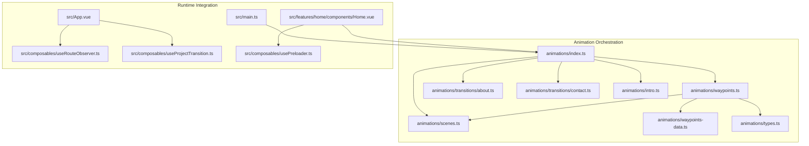
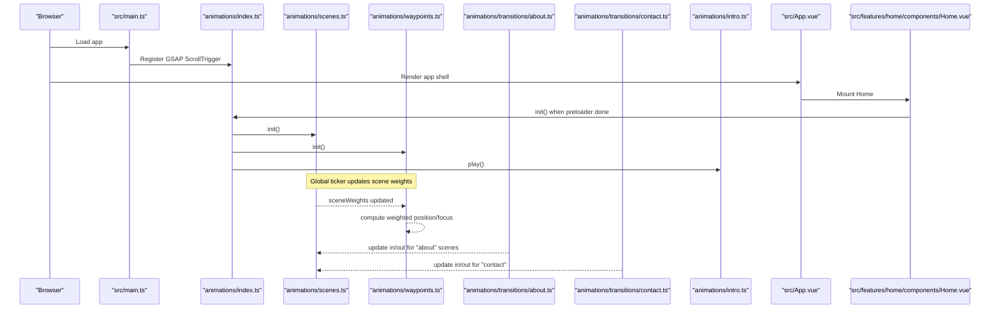
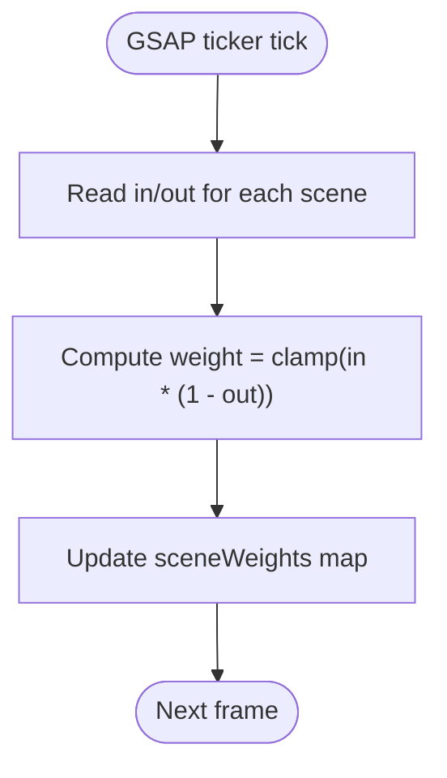
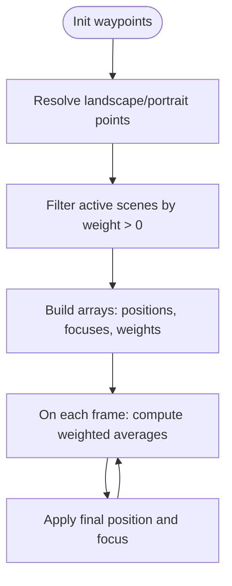
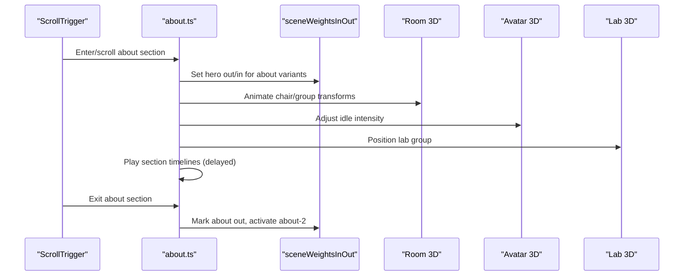
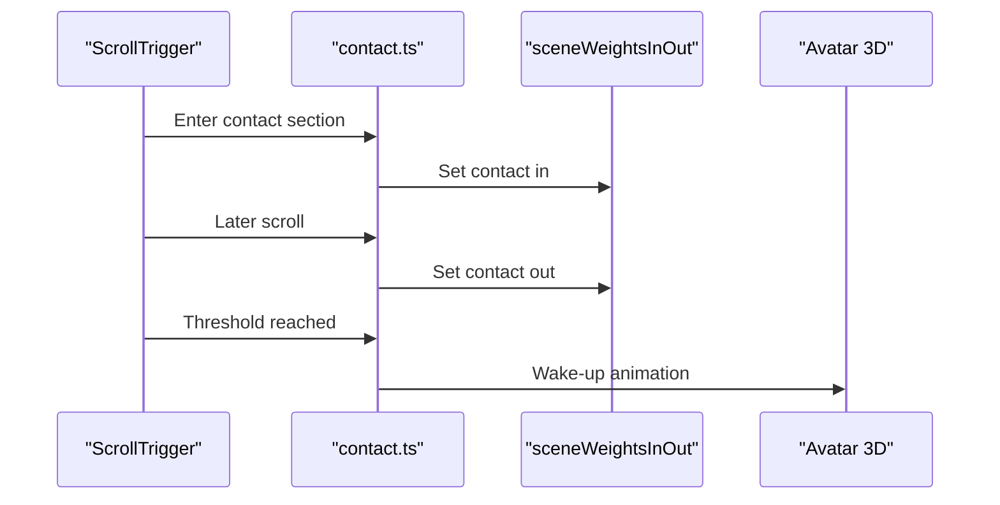
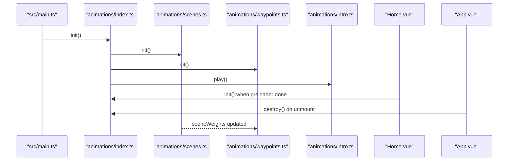
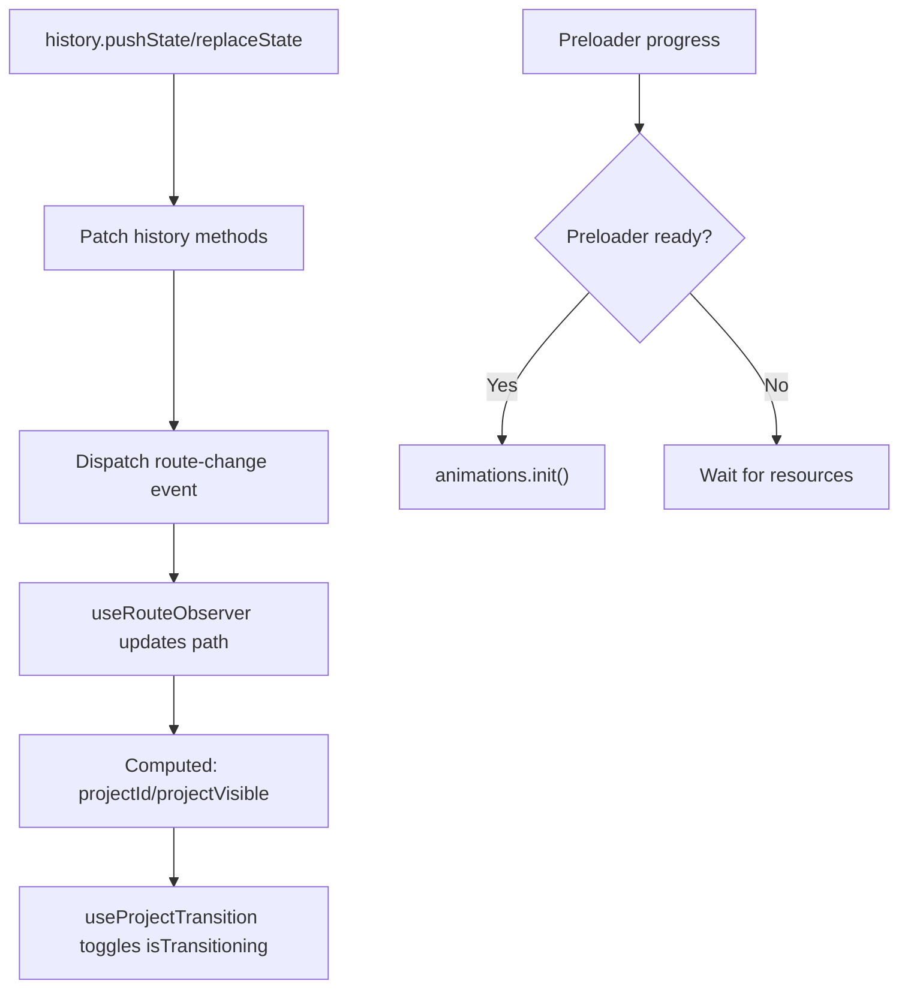
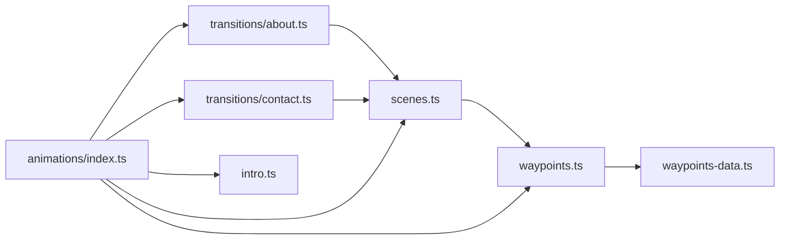

# Scene Transitions

<cite>
**Referenced Files in This Document**
- [src/animations/index.ts](file://src/animations/index.ts)
- [src/animations/scenes.ts](file://src/animations/scenes.ts)
- [src/animations/waypoints.ts](file://src/animations/waypoints.ts)
- [src/animations/waypoints-data.ts](file://src/animations/waypoints-data.ts)
- [src/animations/types.ts](file://src/animations/types.ts)
- [src/animations/transitions/about.ts](file://src/animations/transitions/about.ts)
- [src/animations/transitions/contact.ts](file://src/animations/transitions/contact.ts)
- [src/animations/intro.ts](file://src/animations/intro.ts)
- [src/main.ts](file://src/main.ts)
- [src/App.vue](file://src/App.vue)
- [src/features/home/components/Home.vue](file://src/features/home/components/Home.vue)
- [src/composables/useRouteObserver.ts](file://src/composables/useRouteObserver.ts)
- [src/composables/useProjectTransition.ts](file://src/composables/useProjectTransition.ts)
- [src/composables/usePreloader.ts](file://src/composables/usePreloader.ts)
</cite>

## Table of Contents
1. [Introduction](#introduction)
2. [Project Structure](#project-structure)
3. [Core Components](#core-components)
4. [Architecture Overview](#architecture-overview)
5. [Detailed Component Analysis](#detailed-component-analysis)
6. [Dependency Analysis](#dependency-analysis)
7. [Performance Considerations](#performance-considerations)
8. [Troubleshooting Guide](#troubleshooting-guide)
9. [Conclusion](#conclusion)
10. [Appendices](#appendices)

## Introduction
This document explains the scene transition system used to manage smooth navigation between views and states in Portfolio-PM. It covers how animations coordinate with route changes and component mounting, the lifecycle of scenes (initialization, activation, cleanup), and how scene transitions integrate with the broader animation system, including timeline coordination and state management. Practical guidance is included for creating custom scene transitions, configuring timing and easing, resolving transition conflicts, optimizing performance, and extending the system with new transition types.

## Project Structure
The scene transition system spans several modules:
- Animation orchestration and lifecycle: animations/index.ts initializes and tears down subsystems.
- Scene state engine: animations/scenes.ts maintains scene weights and in/out states.
- Waypoint camera system: animations/waypoints.ts computes a weighted camera position/focus based on active scenes.
- Transition definitions: animations/transitions/about.ts and animations/transitions/contact.ts define per-scene animations.
- Global initialization: src/main.ts registers GSAP plugins; src/App.vue controls overlay/project rendering and transitions.
- Routing and transition hooks: src/composables/useRouteObserver.ts and src/composables/useProjectTransition.ts coordinate route changes and route transitions.

**Diagram sources**
- [src/animations/index.ts:14-29](file://src/animations/index.ts#L14-L29)
- [src/animations/scenes.ts:41-58](file://src/animations/scenes.ts#L41-L58)
- [src/animations/waypoints.ts:12-71](file://src/animations/waypoints.ts#L12-L71)
- [src/animations/waypoints-data.ts:3-57](file://src/animations/waypoints-data.ts#L3-L57)
- [src/animations/types.ts:1-4](file://src/animations/types.ts#L1-L4)
- [src/animations/transitions/about.ts:16-49](file://src/animations/transitions/about.ts#L16-L49)
- [src/animations/transitions/contact.ts:10-50](file://src/animations/transitions/contact.ts#L10-L50)
- [src/animations/intro.ts:6-15](file://src/animations/intro.ts#L6-L15)
- [src/main.ts:4-7](file://src/main.ts#L4-L7)
- [src/App.vue:33-57](file://src/App.vue#L33-L57)
- [src/features/home/components/Home.vue:83-124](file://src/features/home/components/Home.vue#L83-L124)
- [src/composables/useRouteObserver.ts:67-92](file://src/composables/useRouteObserver.ts#L67-L92)
- [src/composables/useProjectTransition.ts:9-36](file://src/composables/useProjectTransition.ts#L9-L36)
- [src/composables/usePreloader.ts:7-42](file://src/composables/usePreloader.ts#L7-L42)

**Section sources**
- [src/animations/index.ts:14-29](file://src/animations/index.ts#L14-L29)
- [src/animations/scenes.ts:41-58](file://src/animations/scenes.ts#L41-L58)
- [src/animations/waypoints.ts:12-71](file://src/animations/waypoints.ts#L12-L71)
- [src/animations/waypoints-data.ts:3-57](file://src/animations/waypoints-data.ts#L3-L57)
- [src/animations/types.ts:1-4](file://src/animations/types.ts#L1-L4)
- [src/animations/transitions/about.ts:16-49](file://src/animations/transitions/about.ts#L16-L49)
- [src/animations/transitions/contact.ts:10-50](file://src/animations/transitions/contact.ts#L10-L50)
- [src/animations/intro.ts:6-15](file://src/animations/intro.ts#L6-L15)
- [src/main.ts:4-7](file://src/main.ts#L4-L7)
- [src/App.vue:33-57](file://src/App.vue#L33-L57)
- [src/features/home/components/Home.vue:83-124](file://src/features/home/components/Home.vue#L83-L124)
- [src/composables/useRouteObserver.ts:67-92](file://src/composables/useRouteObserver.ts#L67-L92)
- [src/composables/useProjectTransition.ts:9-36](file://src/composables/useProjectTransition.ts#L9-L36)
- [src/composables/usePreloader.ts:7-42](file://src/composables/usePreloader.ts#L7-L42)

## Core Components
- Scene state engine
  - Maintains scene weights and per-scene in/out thresholds.
  - Drives a global ticker to compute current scene weight as a product of in and (1 - out).
- Waypoint camera system
  - Computes a weighted average of camera positions and focuses across active scenes.
  - Switches between landscape/portrait presets dynamically.
- Transition modules
  - about.ts: orchestrates in/out timelines, progress tracking, section-specific animations, and scene switching among about variants.
  - contact.ts: sets up contact-specific in/out triggers and optional avatar wake-up on scroll.
- Animation orchestration
  - Initializes scene and waypoint systems, runs intro, and cleans up on teardown.
- Runtime integration
  - GSAP plugin registration, route change detection, project route transitions, and preloader gating.

**Section sources**
- [src/animations/scenes.ts:3-39](file://src/animations/scenes.ts#L3-L39)
- [src/animations/scenes.ts:41-58](file://src/animations/scenes.ts#L41-L58)
- [src/animations/waypoints.ts:12-71](file://src/animations/waypoints.ts#L12-L71)
- [src/animations/waypoints-data.ts:3-57](file://src/animations/waypoints-data.ts#L3-L57)
- [src/animations/transitions/about.ts:16-49](file://src/animations/transitions/about.ts#L16-L49)
- [src/animations/transitions/contact.ts:10-50](file://src/animations/transitions/contact.ts#L10-L50)
- [src/animations/index.ts:14-29](file://src/animations/index.ts#L14-L29)
- [src/main.ts:4-7](file://src/main.ts#L4-L7)
- [src/App.vue:33-57](file://src/App.vue#L33-L57)
- [src/composables/useRouteObserver.ts:67-92](file://src/composables/useRouteObserver.ts#L67-L92)
- [src/composables/useProjectTransition.ts:9-36](file://src/composables/useProjectTransition.ts#L9-L36)
- [src/composables/usePreloader.ts:7-42](file://src/composables/usePreloader.ts#L7-L42)

## Architecture Overview
The system blends reactive scene weights with ScrollTrigger-driven timelines to animate both UI and 3D environments. Animations initialize after preloader completion and project route readiness, coordinating with route changes and component lifecycle.

**Diagram sources**
- [src/main.ts:4-7](file://src/main.ts#L4-L7)
- [src/animations/index.ts:14-29](file://src/animations/index.ts#L14-L29)
- [src/animations/scenes.ts:41-58](file://src/animations/scenes.ts#L41-L58)
- [src/animations/waypoints.ts:57-65](file://src/animations/waypoints.ts#L57-L65)
- [src/animations/transitions/about.ts:16-49](file://src/animations/transitions/about.ts#L16-L49)
- [src/animations/transitions/contact.ts:10-50](file://src/animations/transitions/contact.ts#L10-L50)
- [src/animations/intro.ts:6-15](file://src/animations/intro.ts#L6-L15)
- [src/App.vue:33-57](file://src/App.vue#L33-L57)
- [src/features/home/components/Home.vue:111-124](file://src/features/home/components/Home.vue#L111-L124)

## Detailed Component Analysis

### Scene State Engine
- Purpose: Maintain normalized scene weights and per-scene in/out thresholds.
- Behavior:
  - Initialization adds a GSAP ticker callback to recalculate weights each frame.
  - Weight is clamped to [0, 1] using the formula: weight = in × (1 − out).
  - Destruction removes the ticker to prevent leaks.
- Integration:
  - Consumed by the waypoint system to compute camera pose.
  - Updated by transition modules via ScrollTrigger timelines.

**Diagram sources**
- [src/animations/scenes.ts:45-51](file://src/animations/scenes.ts#L45-L51)

**Section sources**
- [src/animations/scenes.ts:3-39](file://src/animations/scenes.ts#L3-L39)
- [src/animations/scenes.ts:41-58](file://src/animations/scenes.ts#L41-L58)

### Waypoint Camera System
- Purpose: Drive a dynamic camera by blending active scene positions and focuses.
- Behavior:
  - Resolves preset points per landscape/portrait.
  - Builds lists of positions, focuses, and weights from active scenes.
  - Computes weighted averages for position and focus each frame.
- Integration:
  - Consumed by 3D rendering pipeline to drive camera movement.

**Diagram sources**
- [src/animations/waypoints.ts:43-65](file://src/animations/waypoints.ts#L43-L65)
- [src/animations/waypoints-data.ts:3-57](file://src/animations/waypoints-data.ts#L3-L57)
- [src/animations/types.ts:1-4](file://src/animations/types.ts#L1-L4)

**Section sources**
- [src/animations/waypoints.ts:12-71](file://src/animations/waypoints.ts#L12-L71)
- [src/animations/waypoints-data.ts:3-57](file://src/animations/waypoints-data.ts#L3-L57)
- [src/animations/types.ts:1-4](file://src/animations/types.ts#L1-L4)

### About Page Transition
- Setup:
  - In timeline: animates hero out, avatar idle intensity, room group transforms, and switches scene weights for hero→about variants.
  - Progress timeline: scrubbed progress for a numeric counter or similar indicator.
  - Sections timeline: plays section-specific timelines (description/services/details) with delays and device-aware behavior.
  - Out timeline: marks about as “scrolled past” and activates next variant.
  - Scenes timeline: coordinates scene weight transitions across about variants.
- Cleanup:
  - Reverts all MatchMedia-managed timelines and ScrollTriggers.

**Diagram sources**
- [src/animations/transitions/about.ts:69-138](file://src/animations/transitions/about.ts#L69-L138)
- [src/animations/transitions/about.ts:51-67](file://src/animations/transitions/about.ts#L51-L67)
- [src/animations/transitions/about.ts:181-284](file://src/animations/transitions/about.ts#L181-L284)
- [src/animations/transitions/about.ts:140-152](file://src/animations/transitions/about.ts#L140-L152)
- [src/animations/transitions/about.ts:154-179](file://src/animations/transitions/about.ts#L154-L179)
- [src/animations/scenes.ts:18-39](file://src/animations/scenes.ts#L18-L39)

**Section sources**
- [src/animations/transitions/about.ts:16-49](file://src/animations/transitions/about.ts#L16-L49)
- [src/animations/transitions/about.ts:51-67](file://src/animations/transitions/about.ts#L51-L67)
- [src/animations/transitions/about.ts:69-138](file://src/animations/transitions/about.ts#L69-L138)
- [src/animations/transitions/about.ts:140-152](file://src/animations/transitions/about.ts#L140-L152)
- [src/animations/transitions/about.ts:154-179](file://src/animations/transitions/about.ts#L154-L179)
- [src/animations/transitions/about.ts:181-284](file://src/animations/transitions/about.ts#L181-L284)
- [src/animations/transitions/about.ts:286-294](file://src/animations/transitions/about.ts#L286-L294)

### Contact Form Transition
- Setup:
  - In timeline: marks contact as in-view by updating scene weights.
  - Out timeline: marks contact as scrolled past.
  - Optional wake-up timeline: triggers avatar wake-up at a specific scroll threshold depending on device.
- Cleanup:
  - Kills timelines and MatchMedia scopes.

**Diagram sources**
- [src/animations/transitions/contact.ts:10-50](file://src/animations/transitions/contact.ts#L10-L50)
- [src/animations/scenes.ts:18-39](file://src/animations/scenes.ts#L18-L39)

**Section sources**
- [src/animations/transitions/contact.ts:10-50](file://src/animations/transitions/contact.ts#L10-L50)
- [src/animations/transitions/contact.ts:52-67](file://src/animations/transitions/contact.ts#L52-L67)

### Animation Orchestration and Lifecycle
- Initialization:
  - Registers GSAP ScrollTrigger.
  - Initializes scene and waypoint systems.
  - Plays intro if enabled.
- Destruction:
  - Removes scene/waypoint tickers and reverts transitions.
- Integration with routing:
  - Home component gates animations until preloader completes and projects are loaded.
  - App component controls overlay visibility and transition classes during project routes.

**Diagram sources**
- [src/main.ts:4-7](file://src/main.ts#L4-L7)
- [src/animations/index.ts:14-29](file://src/animations/index.ts#L14-L29)
- [src/animations/scenes.ts:41-58](file://src/animations/scenes.ts#L41-L58)
- [src/animations/waypoints.ts:12-15](file://src/animations/waypoints.ts#L12-L15)
- [src/animations/intro.ts:6-15](file://src/animations/intro.ts#L6-L15)
- [src/features/home/components/Home.vue:111-124](file://src/features/home/components/Home.vue#L111-L124)
- [src/App.vue:33-57](file://src/App.vue#L33-L57)

**Section sources**
- [src/animations/index.ts:14-29](file://src/animations/index.ts#L14-L29)
- [src/main.ts:4-7](file://src/main.ts#L4-L7)
- [src/features/home/components/Home.vue:83-124](file://src/features/home/components/Home.vue#L83-L124)
- [src/App.vue:33-57](file://src/App.vue#L33-L57)

### Route Changes and Transition Hooks
- Route observation:
  - Intercepts pushState/replaceState to emit a custom event ensuring safe reactivity ordering.
  - Provides computed flags for project route detection and visibility.
- Project route transitions:
  - Uses a timeout-based flag to coordinate UI transitions around route changes.
- Preloader gating:
  - Prevents animations from initializing until resource loading is sufficiently advanced.

**Diagram sources**
- [src/composables/useRouteObserver.ts:42-85](file://src/composables/useRouteObserver.ts#L42-L85)
- [src/composables/useProjectTransition.ts:9-36](file://src/composables/useProjectTransition.ts#L9-L36)
- [src/composables/usePreloader.ts:17-42](file://src/composables/usePreloader.ts#L17-L42)
- [src/features/home/components/Home.vue:111-124](file://src/features/home/components/Home.vue#L111-L124)

**Section sources**
- [src/composables/useRouteObserver.ts:67-92](file://src/composables/useRouteObserver.ts#L67-L92)
- [src/composables/useProjectTransition.ts:9-36](file://src/composables/useProjectTransition.ts#L9-L36)
- [src/composables/usePreloader.ts:7-42](file://src/composables/usePreloader.ts#L7-L42)
- [src/features/home/components/Home.vue:111-124](file://src/features/home/components/Home.vue#L111-L124)

## Dependency Analysis
- Coupling
  - transitions/about.ts and transitions/contact.ts depend on sceneWeightsInOut and 3D objects.
  - waypoints.ts depends on sceneWeights and points presets.
  - animations/index.ts orchestrates initialization/cleanup of all subsystems.
- Cohesion
  - Scene weights and waypoint computation are cohesive units that remain agnostic of UI specifics.
  - Transition modules encapsulate per-section ScrollTrigger timelines and device-specific logic.
- External dependencies
  - GSAP and ScrollTrigger are registered globally and used pervasively.
- Circular dependencies
  - None observed; orchestration module acts as a central initializer without reverse dependencies.

**Diagram sources**
- [src/animations/scenes.ts:3-39](file://src/animations/scenes.ts#L3-L39)
- [src/animations/waypoints.ts:12-71](file://src/animations/waypoints.ts#L12-L71)
- [src/animations/waypoints-data.ts:3-57](file://src/animations/waypoints-data.ts#L3-L57)
- [src/animations/transitions/about.ts:16-49](file://src/animations/transitions/about.ts#L16-L49)
- [src/animations/transitions/contact.ts:10-50](file://src/animations/transitions/contact.ts#L10-L50)
- [src/animations/index.ts:14-29](file://src/animations/index.ts#L14-L29)
- [src/animations/intro.ts:6-15](file://src/animations/intro.ts#L6-L15)

**Section sources**
- [src/animations/scenes.ts:3-39](file://src/animations/scenes.ts#L3-L39)
- [src/animations/waypoints.ts:12-71](file://src/animations/waypoints.ts#L12-L71)
- [src/animations/waypoints-data.ts:3-57](file://src/animations/waypoints-data.ts#L3-L57)
- [src/animations/transitions/about.ts:16-49](file://src/animations/transitions/about.ts#L16-L49)
- [src/animations/transitions/contact.ts:10-50](file://src/animations/transitions/contact.ts#L10-L50)
- [src/animations/index.ts:14-29](file://src/animations/index.ts#L14-L29)
- [src/animations/intro.ts:6-15](file://src/animations/intro.ts#L6-L15)

## Performance Considerations
- Frame-time budget
  - Scene weight updates occur on GSAP’s ticker; keep ScrollTrigger scrubbing durations reasonable to avoid heavy per-frame work.
- Device-aware timelines
  - Use matchMedia wrappers to tailor durations/eases per breakpoint and reduce unnecessary work on mobile.
- Preloading strategy
  - Gate animations until preloader reaches a threshold to avoid jank during initial load.
- Memory management
  - Always revert or kill timelines and remove ticker callbacks in transition module destroy routines.
- Rendering
  - Keep ScrollTrigger scrubbing off critical paths; prefer snapping for non-interactive transitions.
- Waypoint computation
  - Weighted averaging is O(n) per frame; limit active scenes and avoid recalculating unnecessarily.

[No sources needed since this section provides general guidance]

## Troubleshooting Guide
- Transitions not triggering
  - Verify GSAP ScrollTrigger is registered and that triggers are placed on correct DOM elements.
  - Confirm animations.init() is called after preloader completion.
- Conflicting animations
  - Ensure distinct ScrollTrigger triggers per section; avoid overlapping scrub timelines on the same element.
  - Use revert/kill in destroy routines to prevent lingering tweens.
- Stuck states
  - Check sceneWeightsInOut updates and that out flags are flipped when sections exit viewport.
- Route transition conflicts
  - Use the project transition flag to coordinate UI animations with route changes; avoid simultaneous DOM and timeline modifications.

**Section sources**
- [src/main.ts:4-7](file://src/main.ts#L4-L7)
- [src/features/home/components/Home.vue:111-124](file://src/features/home/components/Home.vue#L111-L124)
- [src/animations/transitions/about.ts:286-294](file://src/animations/transitions/about.ts#L286-L294)
- [src/animations/transitions/contact.ts:52-67](file://src/animations/transitions/contact.ts#L52-L67)
- [src/animations/scenes.ts:41-58](file://src/animations/scenes.ts#L41-L58)

## Conclusion
The scene transition system integrates reactive scene weights, device-aware timelines, and a dynamic waypoint camera to deliver smooth, coordinated navigation. By structuring transitions per scene, centralizing lifecycle management, and gating initialization behind preloading, the system remains maintainable and performant. Extending the system involves adding new scene keys, presets, and transition modules while adhering to the established patterns for initialization, cleanup, and conflict avoidance.

[No sources needed since this section summarizes without analyzing specific files]

## Appendices

### Creating Custom Scene Transitions
- Steps
  - Define scene keys and presets in waypoints-data.ts.
  - Add a transition module under animations/transitions/ with setup/destroy.
  - Use ScrollTrigger timelines to update sceneWeightsInOut and animate 3D/UI targets.
  - Integrate the new transition in animations/index.ts and initialize it alongside existing ones.
- Timing and easing
  - Prefer scrubbed timelines for continuous interactions; otherwise, use snap-based triggers.
  - Choose easing aligned with motion design (e.g., power* for natural deceleration).
- Conflict resolution
  - Ensure unique triggers per section; revert timelines in destroy.
  - Avoid concurrent scrub timelines on the same element.

**Section sources**
- [src/animations/waypoints-data.ts:3-57](file://src/animations/waypoints-data.ts#L3-L57)
- [src/animations/transitions/about.ts:16-49](file://src/animations/transitions/about.ts#L16-L49)
- [src/animations/transitions/contact.ts:10-50](file://src/animations/transitions/contact.ts#L10-L50)
- [src/animations/index.ts:14-29](file://src/animations/index.ts#L14-L29)