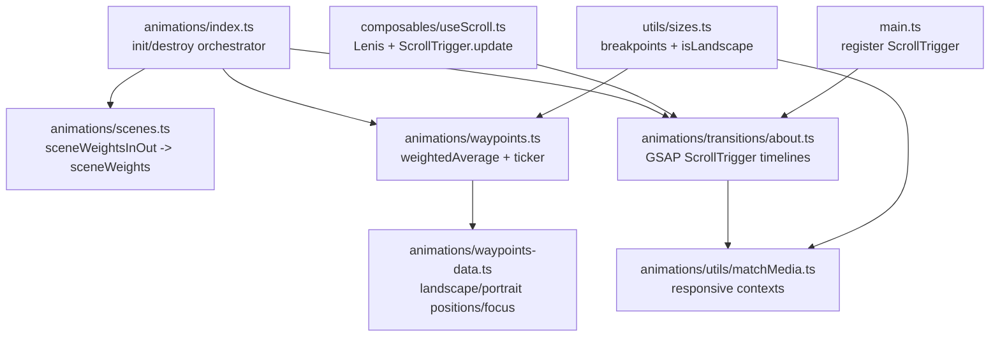
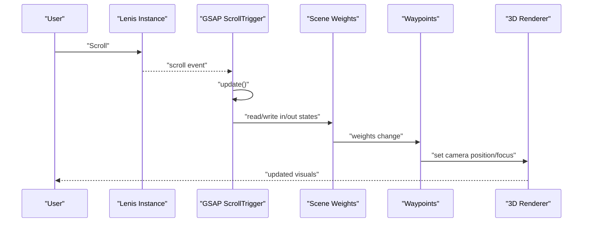
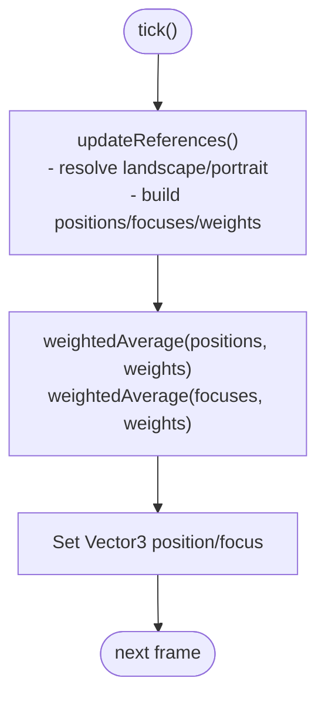
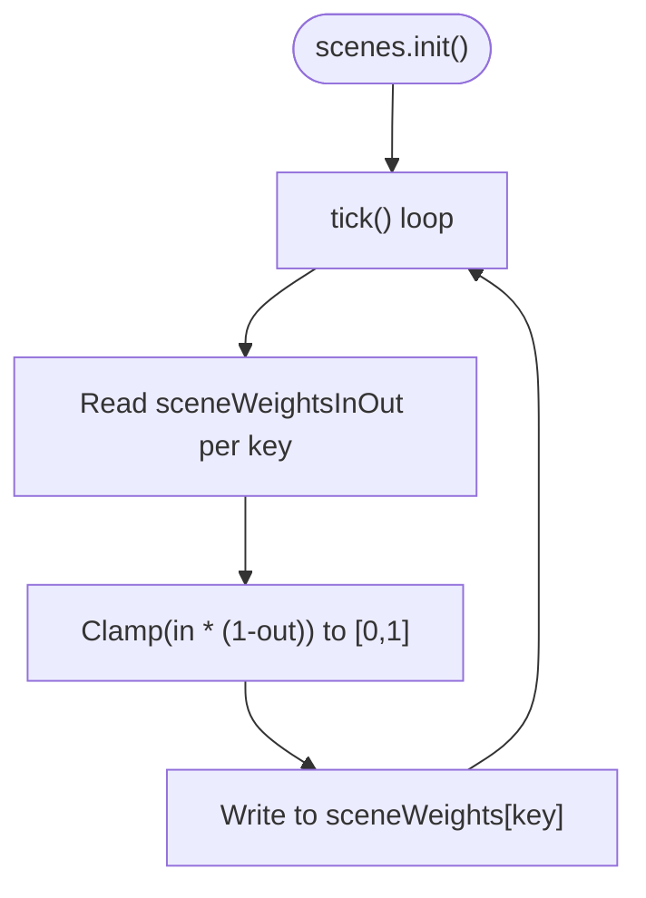
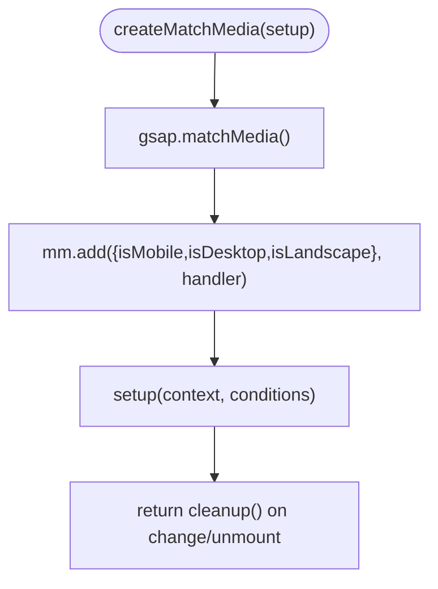
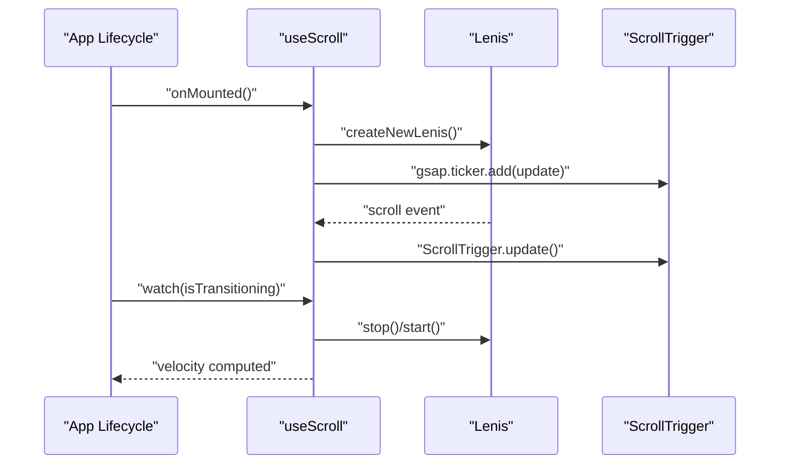
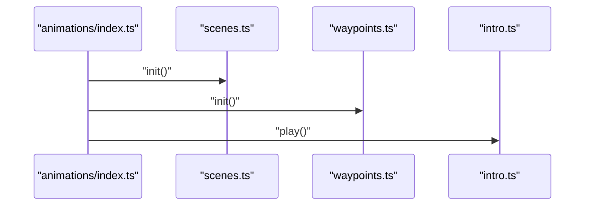
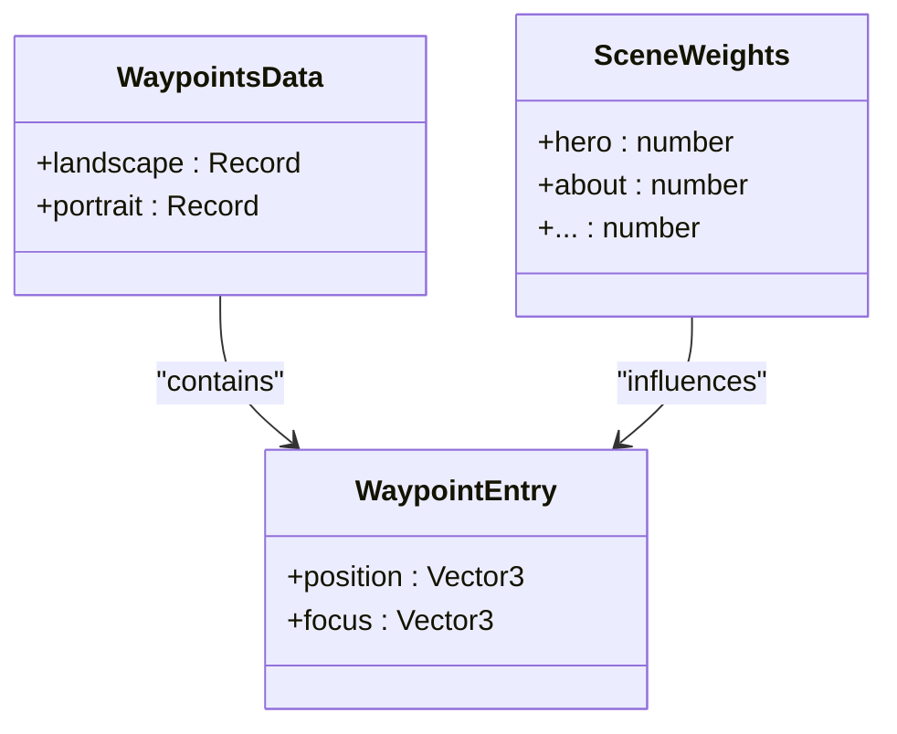
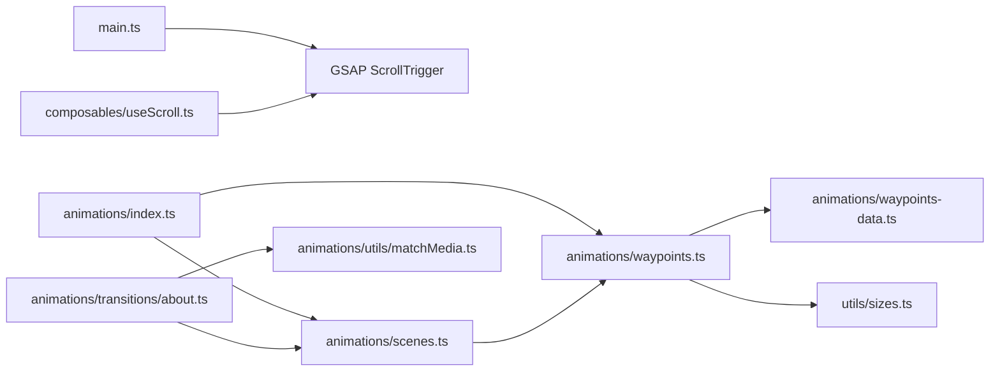

# Scroll-Triggered Animations

<cite>
**Referenced Files in This Document**
- [waypoints.ts](file://src/animations/waypoints.ts)
- [waypoints-data.ts](file://src/animations/waypoints-data.ts)
- [matchMedia.ts](file://src/animations/utils/matchMedia.ts)
- [useScroll.ts](file://src/composables/useScroll.ts)
- [scenes.ts](file://src/animations/scenes.ts)
- [sizes.ts](file://src/utils/sizes.ts)
- [index.ts](file://src/animations/index.ts)
- [about.ts](file://src/animations/transitions/about.ts)
- [intro.ts](file://src/animations/intro.ts)
- [main.ts](file://src/main.ts)
</cite>

## Table of Contents
1. [Introduction](#introduction)
2. [Project Structure](#project-structure)
3. [Core Components](#core-components)
4. [Architecture Overview](#architecture-overview)
5. [Detailed Component Analysis](#detailed-component-analysis)
6. [Dependency Analysis](#dependency-analysis)
7. [Performance Considerations](#performance-considerations)
8. [Troubleshooting Guide](#troubleshooting-guide)
9. [Conclusion](#conclusion)
10. [Appendices](#appendices)

## Introduction
This document explains the scroll-triggered animation system that powers interactive experiences driven by user scroll position. It covers the waypoint system that blends camera positions and focuses across scenes, the responsive adaptation using matchMedia utilities, and the integration of GSAP ScrollTrigger timelines. You will learn how scroll positions trigger animations and transitions, how to configure waypoint timing, and how to adapt behavior across devices. Guidance is also provided for performance optimization and extending the system with custom effects.

## Project Structure
The scroll-triggered animation system spans several modules:
- Animation orchestration and initialization
- Waypoints and scene weighting
- Responsive matchMedia utilities
- Scroll engine integration via Lenis and GSAP ScrollTrigger
- Device sizing and orientation utilities

**Diagram sources**
- [index.ts:14-29](file://src/animations/index.ts#L14-L29)
- [scenes.ts:41-58](file://src/animations/scenes.ts#L41-L58)
- [waypoints.ts:12-69](file://src/animations/waypoints.ts#L12-L69)
- [waypoints-data.ts:3-56](file://src/animations/waypoints-data.ts#L3-L56)
- [about.ts:16-49](file://src/animations/transitions/about.ts#L16-L49)
- [matchMedia.ts:4-26](file://src/animations/utils/matchMedia.ts#L4-L26)
- [useScroll.ts:15-60](file://src/composables/useScroll.ts#L15-L60)
- [sizes.ts:16-109](file://src/utils/sizes.ts#L16-L109)
- [main.ts:4-7](file://src/main.ts#L4-L7)

**Section sources**
- [index.ts:14-29](file://src/animations/index.ts#L14-L29)
- [waypoints.ts:12-69](file://src/animations/waypoints.ts#L12-L69)
- [scenes.ts:41-58](file://src/animations/scenes.ts#L41-L58)
- [matchMedia.ts:4-26](file://src/animations/utils/matchMedia.ts#L4-L26)
- [useScroll.ts:15-60](file://src/composables/useScroll.ts#L15-L60)
- [sizes.ts:16-109](file://src/utils/sizes.ts#L16-L109)
- [main.ts:4-7](file://src/main.ts#L4-L7)

## Core Components
- Waypoints: Computes a weighted average of camera positions and focuses per scene, switching between landscape and portrait configurations based on device orientation.
- Scenes: Maintains scene weights and in/out states that drive waypoint blending.
- MatchMedia: Provides responsive contexts for mobile/desktop and landscape modes to adapt ScrollTrigger timelines.
- Scroll Engine: Integrates Lenis smooth scrolling with GSAP ScrollTrigger updates and velocity sampling.
- Initialization: Starts scene and waypoint systems, then plays intro.

Key responsibilities:
- Waypoints compute final camera position and focus each frame using weighted averages.
- Scenes update scene weights based on in/out progress.
- MatchMedia adapts ScrollTrigger triggers and animations to device characteristics.
- Scroll engine ensures smoothness and correct ScrollTrigger refresh during transitions.

**Section sources**
- [waypoints.ts:12-69](file://src/animations/waypoints.ts#L12-L69)
- [scenes.ts:41-58](file://src/animations/scenes.ts#L41-L58)
- [matchMedia.ts:4-26](file://src/animations/utils/matchMedia.ts#L4-L26)
- [useScroll.ts:15-60](file://src/composables/useScroll.ts#L15-L60)
- [index.ts:14-29](file://src/animations/index.ts#L14-L29)

## Architecture Overview
The system integrates three layers:
- Input Layer: Lenis smooth scroll updates ScrollTrigger and exposes velocity.
- Computation Layer: Scene weights and waypoints blend camera transforms each frame.
- Presentation Layer: GSAP ScrollTrigger timelines animate DOM, GSAP targets, and 3D objects.

**Diagram sources**
- [useScroll.ts:11-13](file://src/composables/useScroll.ts#L11-L13)
- [scenes.ts:45-51](file://src/animations/scenes.ts#L45-L51)
- [waypoints.ts:57-64](file://src/animations/waypoints.ts#L57-L64)

## Detailed Component Analysis

### Waypoints System
The waypoints module computes a continuous camera transform by blending scene-specific positions and focuses using scene weights. It selects between landscape and portrait waypoint sets based on orientation and recomputes references when the scene or viewport changes.

**Diagram sources**
- [waypoints.ts:43-64](file://src/animations/waypoints.ts#L43-L64)
- [waypoints.ts:17-34](file://src/animations/waypoints.ts#L17-L34)

Key data structure:
- Waypoint entries define a position and focus vector per scene, per orientation.
- Scene weights determine influence of each scene’s waypoint.

Responsive adaptation:
- Orientation switch occurs via sizes.isLandscape.
- Waypoints select the appropriate set (landscape or portrait) and filter by active scenes with positive weights.

**Section sources**
- [waypoints.ts:12-69](file://src/animations/waypoints.ts#L12-L69)
- [waypoints-data.ts:3-56](file://src/animations/waypoints-data.ts#L3-L56)
- [scenes.ts:3-10](file://src/animations/scenes.ts#L3-L10)
- [sizes.ts:27](file://src/utils/sizes.ts#L27)

### Scene Weighting and In/Out States
Scene weights are derived from sceneWeightsInOut, which tracks normalized in/out progress per scene. The system clamps weights to [0, 1] and updates them each frame.

**Diagram sources**
- [scenes.ts:41-52](file://src/animations/scenes.ts#L41-L52)

**Section sources**
- [scenes.ts:3-10](file://src/animations/scenes.ts#L3-L10)
- [scenes.ts:41-58](file://src/animations/scenes.ts#L41-L58)

### Responsive Adaptation with MatchMedia
The matchMedia utility wraps GSAP’s matchMedia to create responsive contexts keyed by device characteristics. It enables different ScrollTrigger configurations for mobile/desktop and landscape modes.

**Diagram sources**
- [matchMedia.ts:4-26](file://src/animations/utils/matchMedia.ts#L4-L26)

Usage pattern:
- Transitions use createMatchMedia to branch ScrollTrigger timelines by device characteristics.
- Conditions are derived from breakpoints and orientation checks.

**Section sources**
- [matchMedia.ts:4-26](file://src/animations/utils/matchMedia.ts#L4-L26)
- [about.ts:52-67](file://src/animations/transitions/about.ts#L52-L67)
- [about.ts:70-138](file://src/animations/transitions/about.ts#L70-L138)
- [about.ts:200-284](file://src/animations/transitions/about.ts#L200-L284)

### Scroll Engine Integration (Lenis + ScrollTrigger)
The scroll composable initializes Lenis, wires scroll events to update ScrollTrigger, and manages velocity sampling. It also pauses/resumes scrolling during transitions.

**Diagram sources**
- [useScroll.ts:40-55](file://src/composables/useScroll.ts#L40-L55)
- [useScroll.ts:11-13](file://src/composables/useScroll.ts#L11-L13)

**Section sources**
- [useScroll.ts:15-60](file://src/composables/useScroll.ts#L15-L60)

### Initialization and Intro
The animation orchestrator initializes scene and waypoint systems, then plays an intro sequence if enabled.

**Diagram sources**
- [index.ts:14-19](file://src/animations/index.ts#L14-L19)
- [intro.ts:6-13](file://src/animations/intro.ts#L6-L13)

**Section sources**
- [index.ts:14-29](file://src/animations/index.ts#L14-L29)
- [intro.ts:1-16](file://src/animations/intro.ts#L1-L16)

### Example: Setting Up a Scroll-Triggered Animation
Follow this pattern to create a new scroll-triggered effect:
- Choose a container element as the trigger.
- Define start/end offsets and scrubbing behavior.
- Use createMatchMedia to adapt triggers for mobile/desktop and landscape.
- Drive scene weights or 3D/GSAP targets based on scroll progress.

Reference paths:
- Trigger definition and scrubbing: [about.ts:55-60](file://src/animations/transitions/about.ts#L55-L60)
- Orientation-aware start/end: [about.ts:57-58](file://src/animations/transitions/about.ts#L57-L58)
- Device-specific branching: [about.ts:70-138](file://src/animations/transitions/about.ts#L70-L138)
- Sections timeline with delays: [about.ts:200-284](file://src/animations/transitions/about.ts#L200-L284)

**Section sources**
- [about.ts:51-67](file://src/animations/transitions/about.ts#L51-L67)
- [about.ts:70-138](file://src/animations/transitions/about.ts#L70-L138)
- [about.ts:200-284](file://src/animations/transitions/about.ts#L200-L284)

### Waypoint Data Structure and Configuration
Waypoint data defines position and focus vectors per scene and orientation. Scene weights determine how strongly each scene influences the final camera transform.

**Diagram sources**
- [waypoints-data.ts:3-56](file://src/animations/waypoints-data.ts#L3-L56)
- [scenes.ts:3-10](file://src/animations/scenes.ts#L3-L10)

**Section sources**
- [waypoints-data.ts:3-56](file://src/animations/waypoints-data.ts#L3-L56)
- [scenes.ts:3-10](file://src/animations/scenes.ts#L3-L10)

### Animation Mapping and Cross-Device Compatibility
- Use createMatchMedia to branch ScrollTrigger timelines by device characteristics.
- Adjust trigger offsets and scrub durations for different layouts.
- Drive scene weights to blend between scenes smoothly across devices.

Reference paths:
- Responsive branching: [matchMedia.ts:4-26](file://src/animations/utils/matchMedia.ts#L4-L26)
- Orientation-dependent triggers: [about.ts:57-58](file://src/animations/transitions/about.ts#L57-L58)
- Device-specific transforms: [about.ts:92-136](file://src/animations/transitions/about.ts#L92-L136)

**Section sources**
- [matchMedia.ts:4-26](file://src/animations/utils/matchMedia.ts#L4-L26)
- [about.ts:51-67](file://src/animations/transitions/about.ts#L51-L67)
- [about.ts:92-136](file://src/animations/transitions/about.ts#L92-L136)

## Dependency Analysis
The system exhibits layered dependencies:
- Initialization depends on ScrollTrigger registration and composable lifecycle hooks.
- Waypoints depend on scene weights and device orientation.
- Transitions depend on matchMedia and scene weights to coordinate animations.

**Diagram sources**
- [main.ts:4-7](file://src/main.ts#L4-L7)
- [index.ts:14-29](file://src/animations/index.ts#L14-L29)
- [scenes.ts:41-58](file://src/animations/scenes.ts#L41-L58)
- [waypoints.ts:12-69](file://src/animations/waypoints.ts#L12-L69)
- [waypoints-data.ts:3-56](file://src/animations/waypoints-data.ts#L3-L56)
- [sizes.ts:16-109](file://src/utils/sizes.ts#L16-L109)
- [about.ts:16-49](file://src/animations/transitions/about.ts#L16-L49)
- [matchMedia.ts:4-26](file://src/animations/utils/matchMedia.ts#L4-L26)
- [useScroll.ts:15-60](file://src/composables/useScroll.ts#L15-L60)

**Section sources**
- [main.ts:4-7](file://src/main.ts#L4-L7)
- [index.ts:14-29](file://src/animations/index.ts#L14-L29)
- [waypoints.ts:12-69](file://src/animations/waypoints.ts#L12-L69)
- [scenes.ts:41-58](file://src/animations/scenes.ts#L41-L58)
- [about.ts:16-49](file://src/animations/transitions/about.ts#L16-L49)
- [matchMedia.ts:4-26](file://src/animations/utils/matchMedia.ts#L4-L26)
- [useScroll.ts:15-60](file://src/composables/useScroll.ts#L15-L60)
- [sizes.ts:16-109](file://src/utils/sizes.ts#L16-L109)

## Performance Considerations
- Use ScrollTrigger with scrubbing to avoid heavy per-frame calculations during scroll.
- Keep ScrollTrigger timelines declarative and scoped to relevant containers.
- Leverage gsap.ticker for minimal update overhead; Scene and Waypoint updates occur each frame but are lightweight.
- Pause Lenis and clear ScrollTrigger memory during transitions to prevent redundant recalculations.
- Use matchMedia to avoid unnecessary timeline creation on irrelevant breakpoints.
- Avoid animating layout-heavy properties; prefer transform and opacity for smoother performance.

[No sources needed since this section provides general guidance]

## Troubleshooting Guide
Common issues and remedies:
- ScrollTrigger not updating: Ensure ScrollTrigger.update is called on scroll events and re-initiated after transitions.
  - Reference: [useScroll.ts:11-13](file://src/composables/useScroll.ts#L11-L13)
- Waypoints not switching orientations: Verify sizes.isLandscape and that scene weights are nonzero for active scenes.
  - Reference: [waypoints.ts:44-54](file://src/animations/waypoints.ts#L44-L54), [sizes.ts:27](file://src/utils/sizes.ts#L27)
- Timelines not adapting to devices: Confirm createMatchMedia is invoked with proper conditions and returns cleanup handlers.
  - Reference: [matchMedia.ts:4-26](file://src/animations/utils/matchMedia.ts#L4-L26)
- Velocity not sampled: Ensure lenis raf loop runs and velocity is read while scrolling.
  - Reference: [useScroll.ts:16-25](file://src/composables/useScroll.ts#L16-L25)
- Transitions not resuming: Check watch on isTransitioning to start Lenis and update ScrollTrigger.
  - Reference: [useScroll.ts:47-55](file://src/composables/useScroll.ts#L47-L55)

**Section sources**
- [useScroll.ts:11-13](file://src/composables/useScroll.ts#L11-L13)
- [waypoints.ts:44-54](file://src/animations/waypoints.ts#L44-L54)
- [sizes.ts:27](file://src/utils/sizes.ts#L27)
- [matchMedia.ts:4-26](file://src/animations/utils/matchMedia.ts#L4-L26)
- [useScroll.ts:16-25](file://src/composables/useScroll.ts#L16-L25)
- [useScroll.ts:47-55](file://src/composables/useScroll.ts#L47-L55)

## Conclusion
The scroll-triggered animation system combines smooth scrolling, scene-weighted waypoints, and responsive matchMedia to deliver immersive, cross-device experiences. By structuring ScrollTrigger timelines around device characteristics and blending camera transforms through scene weights, the system achieves coherent, performant animations. Extending the system involves adding new waypoint entries, adjusting scene weights, and creating device-adapted timelines using the provided utilities.

[No sources needed since this section summarizes without analyzing specific files]

## Appendices
- Initialization checklist:
  - Register ScrollTrigger plugin.
    - Reference: [main.ts:4-7](file://src/main.ts#L4-L7)
  - Initialize animations orchestrator.
    - Reference: [index.ts:14-19](file://src/animations/index.ts#L14-L19)
  - Ensure Lenis is created and ScrollTrigger is updated on scroll.
    - Reference: [useScroll.ts:27-38](file://src/composables/useScroll.ts#L27-L38), [useScroll.ts:11-13](file://src/composables/useScroll.ts#L11-L13)

[No sources needed since this section provides general guidance]