# Timeline Management

<cite>
**Referenced Files in This Document**
- [index.ts](file://src/animations/index.ts)
- [intro.ts](file://src/animations/intro.ts)
- [scenes.ts](file://src/animations/scenes.ts)
- [waypoints.ts](file://src/animations/waypoints.ts)
- [waypoints-data.ts](file://src/animations/waypoints-data.ts)
- [types.ts](file://src/animations/types.ts)
- [about.ts](file://src/animations/transitions/about.ts)
- [contact.ts](file://src/animations/transitions/contact.ts)
- [matchMedia.ts](file://src/animations/utils/matchMedia.ts)
- [main.ts](file://src/main.ts)
- [BoxDescription.vue](file://src/features/home/components/BoxDescription.vue)
- [BoxServices.vue](file://src/features/home/components/BoxServices.vue)
- [BoxDetails.vue](file://src/features/home/components/BoxDetails.vue)
- [sleeping-sprite.ts](file://src/three/objects/contact/sleeping-sprite.ts)
</cite>

## Table of Contents
1. [Introduction](#introduction)
2. [Project Structure](#project-structure)
3. [Core Components](#core-components)
4. [Architecture Overview](#architecture-overview)
5. [Detailed Component Analysis](#detailed-component-analysis)
6. [Dependency Analysis](#dependency-analysis)
7. [Performance Considerations](#performance-considerations)
8. [Troubleshooting Guide](#troubleshooting-guide)
9. [Conclusion](#conclusion)
10. [Appendices](#appendices)

## Introduction
This document explains the GSAP-based timeline management system coordinating complex animation sequences across Portfolio-PM. It focuses on how timelines are orchestrated centrally, synchronized with reactive scene weights, and integrated with Vue 3 component lifecycles. It also covers creation, sequencing, nesting, and destruction patterns, along with performance and debugging guidance.

## Project Structure
The animation subsystem is organized around a central orchestrator that initializes scene state, waypoints, and intro animations, and exposes lifecycle hooks for initialization and teardown. Transition modules define scroll-triggered timelines per page, while utility modules encapsulate responsive timeline contexts and data-driven camera waypoint definitions.

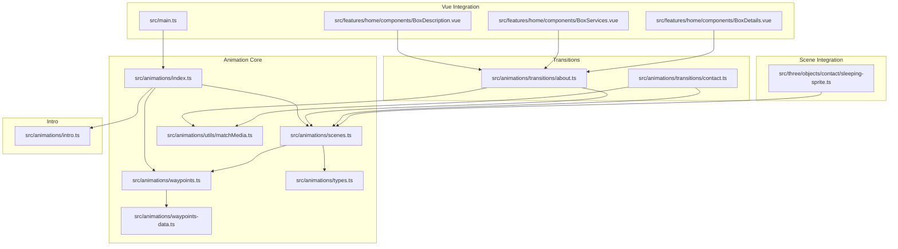

**Diagram sources**
- [index.ts:1-30](file://src/animations/index.ts#L1-L30)
- [scenes.ts:1-59](file://src/animations/scenes.ts#L1-L59)
- [waypoints.ts:1-72](file://src/animations/waypoints.ts#L1-L72)
- [waypoints-data.ts:1-57](file://src/animations/waypoints-data.ts#L1-L57)
- [types.ts:1-4](file://src/animations/types.ts#L1-L4)
- [matchMedia.ts:1-27](file://src/animations/utils/matchMedia.ts#L1-L27)
- [about.ts:1-295](file://src/animations/transitions/about.ts#L1-L295)
- [contact.ts:1-68](file://src/animations/transitions/contact.ts#L1-L68)
- [intro.ts:1-16](file://src/animations/intro.ts#L1-L16)
- [main.ts:1-10](file://src/main.ts#L1-L10)
- [BoxDescription.vue:43-95](file://src/features/home/components/BoxDescription.vue#L43-L95)
- [BoxServices.vue:42-128](file://src/features/home/components/BoxServices.vue#L42-L128)
- [BoxDetails.vue:44-99](file://src/features/home/components/BoxDetails.vue#L44-L99)
- [sleeping-sprite.ts:1-108](file://src/three/objects/contact/sleeping-sprite.ts#L1-L108)

**Section sources**
- [index.ts:1-30](file://src/animations/index.ts#L1-L30)
- [main.ts:1-10](file://src/main.ts#L1-L10)

## Core Components
- Central orchestrator: Initializes scene weights, waypoints, and intro; exposes init/destroy lifecycle.
- Scene weights: Reactive in/out state per scene, computed via ticker updates.
- Waypoints: Weighted average of active scene positions/focuses; drives camera motion.
- Transitions: Scroll-triggered timelines for “about” and “contact,” with responsive MatchMedia wrappers.
- Intro: Single-use timeline for initial state setup.
- Vue integration: Components create paused timelines and coordinate playback via events and delays.

Key responsibilities:
- Orchestrate initialization order and teardown to prevent leaks.
- Synchronize scene visibility with camera waypoints.
- Provide responsive, device-aware timelines via MatchMedia.
- Coordinate nested timelines from child components.

**Section sources**
- [index.ts:1-30](file://src/animations/index.ts#L1-L30)
- [scenes.ts:1-59](file://src/animations/scenes.ts#L1-L59)
- [waypoints.ts:1-72](file://src/animations/waypoints.ts#L1-L72)
- [waypoints-data.ts:1-57](file://src/animations/waypoints-data.ts#L1-L57)
- [types.ts:1-4](file://src/animations/types.ts#L1-L4)
- [about.ts:1-295](file://src/animations/transitions/about.ts#L1-L295)
- [contact.ts:1-68](file://src/animations/transitions/contact.ts#L1-L68)
- [matchMedia.ts:1-27](file://src/animations/utils/matchMedia.ts#L1-L27)
- [intro.ts:1-16](file://src/animations/intro.ts#L1-L16)

## Architecture Overview
The system uses a layered approach:
- Initialization: app bootstraps GSAP plugins, then the animation orchestrator sets up scene weights, waypoints, and intro.
- Runtime: gsap.ticker drives scene weight updates; waypoints compute camera targets; transitions react to scene weights and viewport conditions.
- Vue integration: components emit timeline instances; parent composes nested timelines with delays and stagggers.

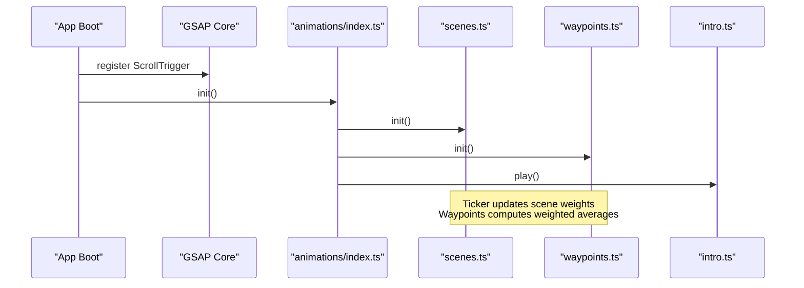

**Diagram sources**
- [main.ts:1-10](file://src/main.ts#L1-L10)
- [index.ts:14-20](file://src/animations/index.ts#L14-L20)
- [scenes.ts:41-52](file://src/animations/scenes.ts#L41-L52)
- [waypoints.ts:12-15](file://src/animations/waypoints.ts#L12-L15)
- [intro.ts:6-13](file://src/animations/intro.ts#L6-L13)

## Detailed Component Analysis

### Central Orchestrator (index.ts)
- Exports transitions registry and lifecycle functions.
- Guards against duplicate initialization.
- Initializes scenes, waypoints, and intro on first use.
- Destroys scenes and waypoints on teardown.

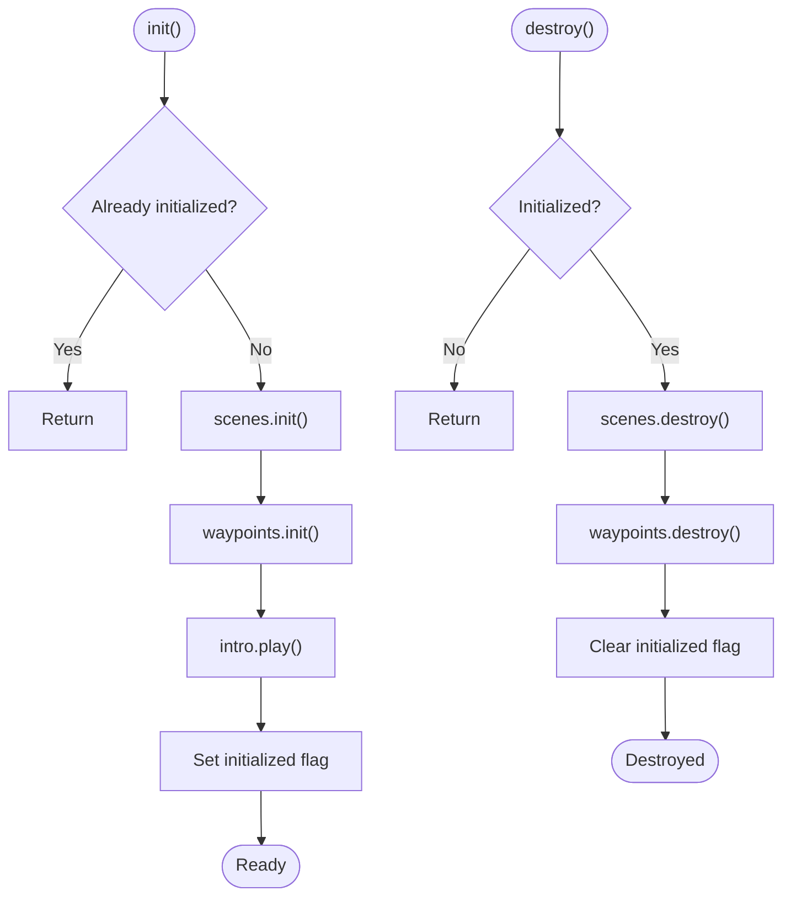

**Diagram sources**
- [index.ts:12-29](file://src/animations/index.ts#L12-L29)

**Section sources**
- [index.ts:1-30](file://src/animations/index.ts#L1-L30)

### Scene Weights (scenes.ts)
- Maintains scene in/out weights and derived visibility.
- Uses gsap.ticker to clamp and update weights each frame.
- Provides init/destroy to manage ticker lifecycle.

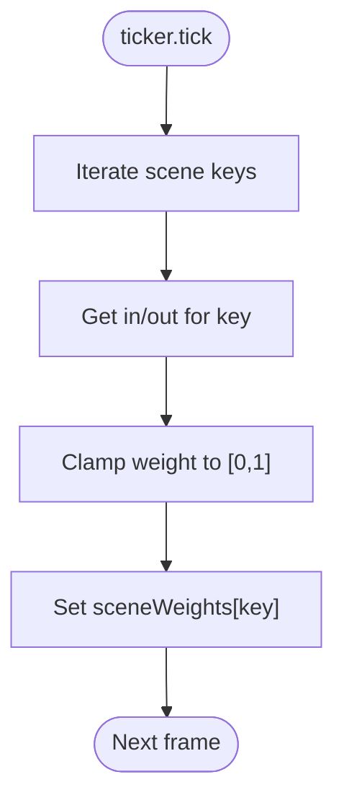

**Diagram sources**
- [scenes.ts:45-52](file://src/animations/scenes.ts#L45-L52)

**Section sources**
- [scenes.ts:1-59](file://src/animations/scenes.ts#L1-L59)
- [types.ts:1-4](file://src/animations/types.ts#L1-L4)

### Waypoints (waypoints.ts)
- Computes weighted average of active scene positions and focuses.
- Resolves active scenes based on current viewport orientation.
- Exposes position and focus refs for camera controls.

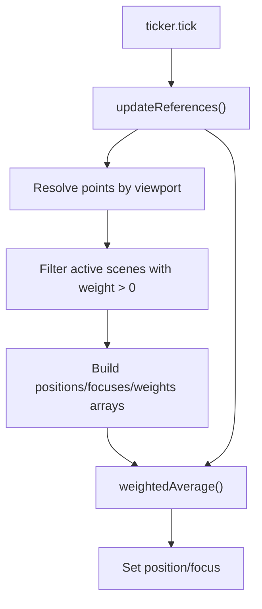

**Diagram sources**
- [waypoints.ts:43-65](file://src/animations/waypoints.ts#L43-L65)
- [waypoints-data.ts:3-56](file://src/animations/waypoints-data.ts#L3-L56)

**Section sources**
- [waypoints.ts:1-72](file://src/animations/waypoints.ts#L1-L72)
- [waypoints-data.ts:1-57](file://src/animations/waypoints-data.ts#L1-L57)

### Intro Timeline (intro.ts)
- Conditional intro animation gated by feature flag.
- Creates a short timeline to set a reactive camera enable flag after a small delay.

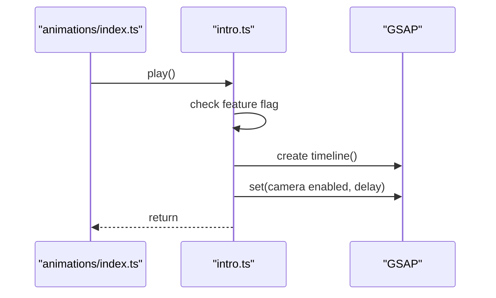

**Diagram sources**
- [index.ts](file://src/animations/index.ts#L18)
- [intro.ts:6-13](file://src/animations/intro.ts#L6-L13)

**Section sources**
- [intro.ts:1-16](file://src/animations/intro.ts#L1-L16)

### About Transition (transitions/about.ts)
- Defines multiple timelines:
  - In/out transitions driven by scroll triggers.
  - Sections-specific timelines (description/services/details) coordinated via MatchMedia.
  - Scene progression timeline controlling visibility across “about” scenes.
- Uses MatchMedia wrapper to adapt animations to device breakpoints.
- Manages cleanup via revert/kill of timelines and media queries.

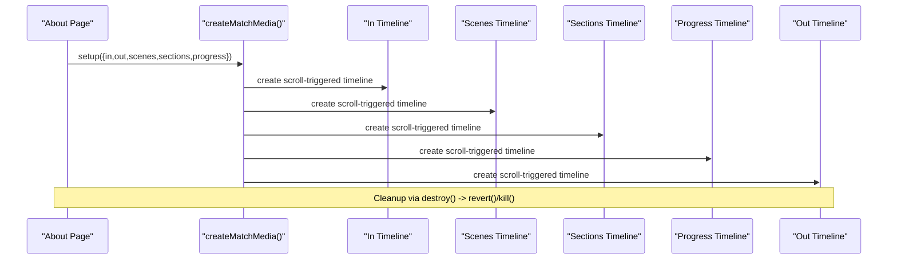

**Diagram sources**
- [about.ts:16-49](file://src/animations/transitions/about.ts#L16-L49)
- [about.ts:69-138](file://src/animations/transitions/about.ts#L69-L138)
- [about.ts:140-152](file://src/animations/transitions/about.ts#L140-L152)
- [about.ts:154-179](file://src/animations/transitions/about.ts#L154-L179)
- [about.ts:181-284](file://src/animations/transitions/about.ts#L181-L284)
- [about.ts:286-292](file://src/animations/transitions/about.ts#L286-L292)
- [matchMedia.ts:4-26](file://src/animations/utils/matchMedia.ts#L4-L26)

**Section sources**
- [about.ts:1-295](file://src/animations/transitions/about.ts#L1-L295)
- [matchMedia.ts:1-27](file://src/animations/utils/matchMedia.ts#L1-L27)

### Contact Transition (transitions/contact.ts)
- Scroll-triggered in/out timelines for the contact scene.
- Responsive wake-up trigger using MatchMedia.
- Explicit kill/cleanup of timelines and media queries.

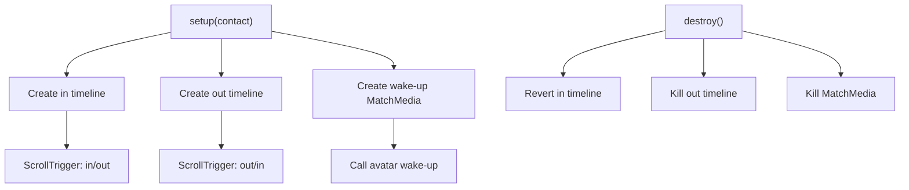

**Diagram sources**
- [contact.ts:10-50](file://src/animations/transitions/contact.ts#L10-L50)
- [contact.ts:52-65](file://src/animations/transitions/contact.ts#L52-L65)

**Section sources**
- [contact.ts:1-68](file://src/animations/transitions/contact.ts#L1-L68)

### Vue 3 Integration Patterns
- Components create paused timelines and emit them for orchestration.
- Parent composes nested timelines with delays and optional staggerring.
- Cleanup uses onInvalidate/onBeforeUnmount to revert MatchMedia and kill timelines.
- Nested timelines are restarted in sequence to synchronize complex sequences.

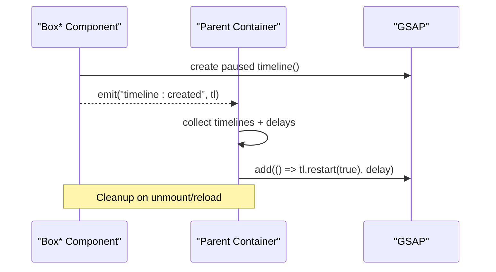

**Diagram sources**
- [BoxDescription.vue:43-95](file://src/features/home/components/BoxDescription.vue#L43-L95)
- [BoxServices.vue:42-128](file://src/features/home/components/BoxServices.vue#L42-L128)
- [BoxDetails.vue:44-99](file://src/features/home/components/BoxDetails.vue#L44-L99)

**Section sources**
- [BoxDescription.vue:43-95](file://src/features/home/components/BoxDescription.vue#L43-L95)
- [BoxServices.vue:42-128](file://src/features/home/components/BoxServices.vue#L42-L128)
- [BoxDetails.vue:44-99](file://src/features/home/components/BoxDetails.vue#L44-L99)

### Scene Integration Example: Sleeping Sprite
- Uses scene weights to drive visibility and opacity interpolation.
- Subscribes to gsap.ticker to update uniforms and visibility.

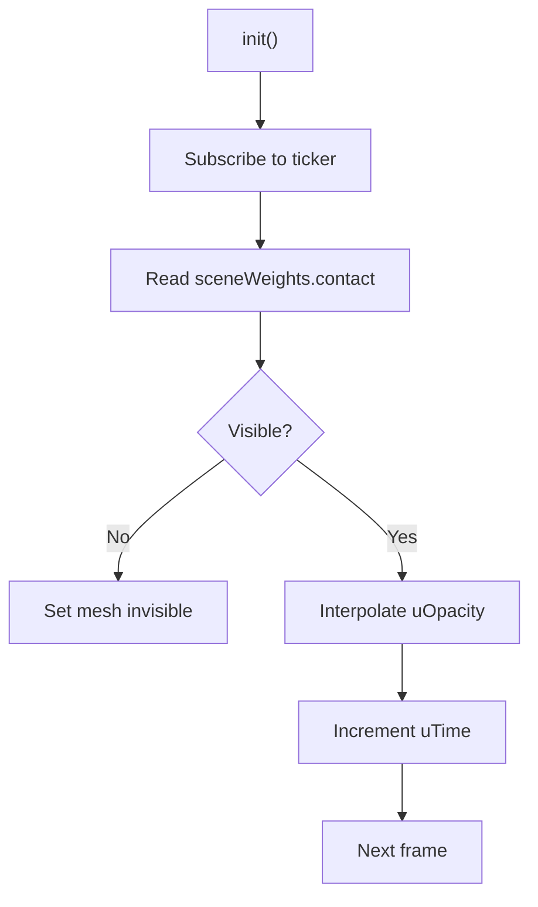

**Diagram sources**
- [sleeping-sprite.ts:25-102](file://src/three/objects/contact/sleeping-sprite.ts#L25-L102)

**Section sources**
- [sleeping-sprite.ts:1-108](file://src/three/objects/contact/sleeping-sprite.ts#L1-L108)

## Dependency Analysis
- Central dependencies:
  - GSAP core and ScrollTrigger are registered globally during app bootstrap.
  - Animations module depends on scenes and waypoints modules.
  - Transitions depend on scenes and MatchMedia utilities.
  - Waypoints depend on scene weights and viewport data.
- Vue components depend on transition modules and emit timeline instances for composition.

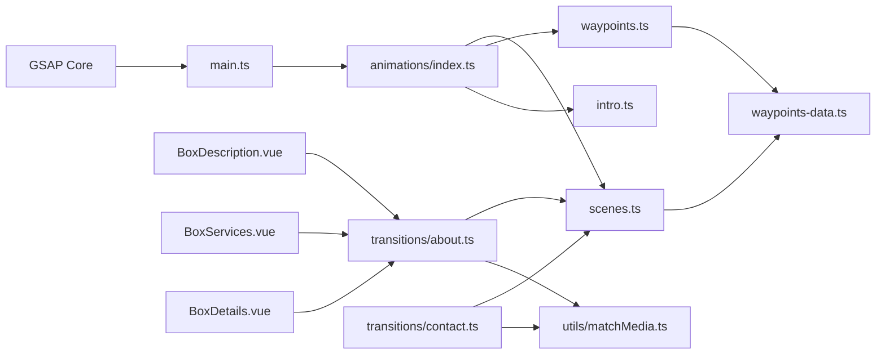

**Diagram sources**
- [main.ts:1-10](file://src/main.ts#L1-L10)
- [index.ts:1-30](file://src/animations/index.ts#L1-L30)
- [scenes.ts:1-59](file://src/animations/scenes.ts#L1-L59)
- [waypoints.ts:1-72](file://src/animations/waypoints.ts#L1-L72)
- [waypoints-data.ts:1-57](file://src/animations/waypoints-data.ts#L1-L57)
- [about.ts:1-295](file://src/animations/transitions/about.ts#L1-L295)
- [contact.ts:1-68](file://src/animations/transitions/contact.ts#L1-L68)
- [matchMedia.ts:1-27](file://src/animations/utils/matchMedia.ts#L1-L27)
- [BoxDescription.vue:43-95](file://src/features/home/components/BoxDescription.vue#L43-L95)
- [BoxServices.vue:42-128](file://src/features/home/components/BoxServices.vue#L42-L128)
- [BoxDetails.vue:44-99](file://src/features/home/components/BoxDetails.vue#L44-L99)

**Section sources**
- [main.ts:1-10](file://src/main.ts#L1-L10)
- [index.ts:1-30](file://src/animations/index.ts#L1-L30)
- [about.ts:1-295](file://src/animations/transitions/about.ts#L1-L295)
- [contact.ts:1-68](file://src/animations/transitions/contact.ts#L1-L68)
- [matchMedia.ts:1-27](file://src/animations/utils/matchMedia.ts#L1-L27)
- [waypoints.ts:1-72](file://src/animations/waypoints.ts#L1-L72)

## Performance Considerations
- Prefer paused timelines in Vue components and restart them explicitly to avoid unnecessary work until needed.
- Use MatchMedia to avoid animating on unsupported devices or orientations.
- Keep scroll-triggered timelines scoped to minimal DOM and reactive targets; avoid frequent reflows.
- Use gsap.ticker judiciously; unsubscribe in destroy/init guards to prevent accumulation.
- Avoid overlapping long-running timelines; prefer chaining and delayed starts to reduce contention.
- Clean up timelines and media queries in onInvalidate/onBeforeUnmount hooks to prevent memory leaks.

[No sources needed since this section provides general guidance]

## Troubleshooting Guide
Common issues and remedies:
- Timelines not playing:
  - Verify orchestrator init was called and not guarded by initialization checks.
  - Ensure scene weights are being updated by gsap.ticker.
- Scroll-triggered animations not firing:
  - Confirm ScrollTrigger registration in main.ts.
  - Check viewport conditions and MatchMedia setup.
- Memory leaks or residual animations:
  - Ensure destroy() is called and timelines are reverted/killed.
  - Verify onInvalidate/onBeforeUnmount cleanup paths.
- Conflicting animations:
  - Use explicit delays and chaining; avoid simultaneous tweens on the same targets.
  - Validate that nested timelines are restarted in the intended order.

**Section sources**
- [index.ts:14-27](file://src/animations/index.ts#L14-L27)
- [about.ts:286-292](file://src/animations/transitions/about.ts#L286-L292)
- [contact.ts:52-65](file://src/animations/transitions/contact.ts#L52-L65)
- [BoxDescription.vue:77-89](file://src/features/home/components/BoxDescription.vue#L77-L89)
- [BoxServices.vue:90-102](file://src/features/home/components/BoxServices.vue#L90-L102)
- [BoxDetails.vue:81-93](file://src/features/home/components/BoxDetails.vue#L81-L93)

## Conclusion
The GSAP timeline management system in Portfolio-PM centers on a clean separation of concerns: a lightweight orchestrator, reactive scene weights, and data-driven waypoints. Transitions leverage responsive MatchMedia and scroll-triggered timelines to deliver immersive, device-aware experiences. Vue components contribute by composing nested timelines with precise timing, ensuring synchronization across complex sequences. Proper initialization, destruction, and cleanup practices are essential to maintain performance and reliability.

[No sources needed since this section summarizes without analyzing specific files]

## Appendices

### Timeline Creation and Destruction Patterns
- Creation:
  - Use paused timelines in Vue components; emit for orchestration.
  - Use MatchMedia wrappers for responsive scroll-triggered timelines.
  - Chain timelines with add() and set explicit delays.
- Destruction:
  - Revert or kill timelines and MatchMedia instances.
  - Unsubscribe from gsap.ticker in init/destroy guards.
  - Clear reactive references and unsubscribe in component lifecycle hooks.

**Section sources**
- [BoxDescription.vue:43-95](file://src/features/home/components/BoxDescription.vue#L43-L95)
- [BoxServices.vue:42-128](file://src/features/home/components/BoxServices.vue#L42-L128)
- [BoxDetails.vue:44-99](file://src/features/home/components/BoxDetails.vue#L44-L99)
- [about.ts:286-292](file://src/animations/transitions/about.ts#L286-L292)
- [contact.ts:52-65](file://src/animations/transitions/contact.ts#L52-L65)
- [waypoints.ts:67-69](file://src/animations/waypoints.ts#L67-L69)
- [scenes.ts:54-56](file://src/animations/scenes.ts#L54-L56)