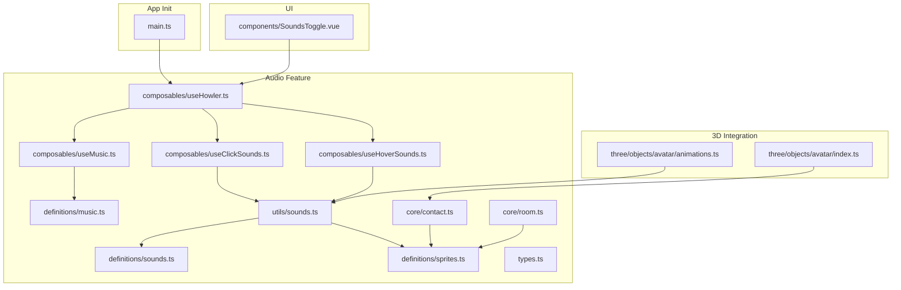
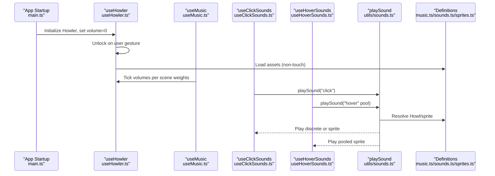
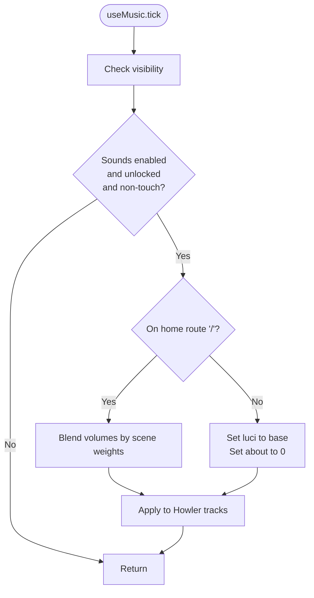
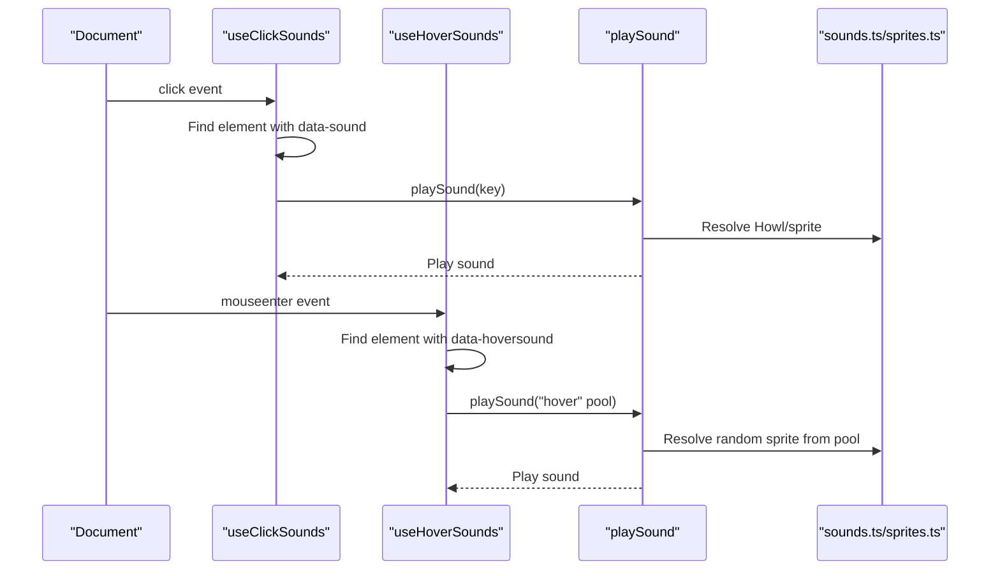
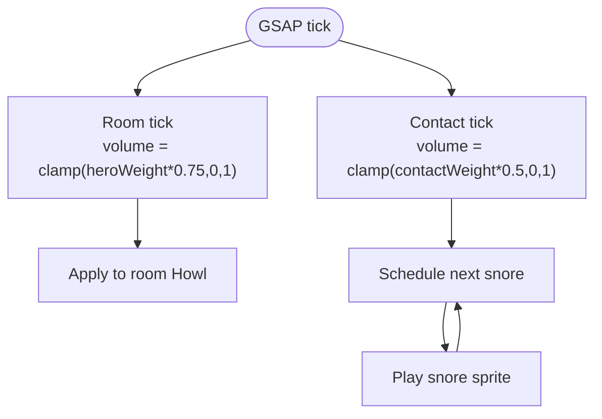
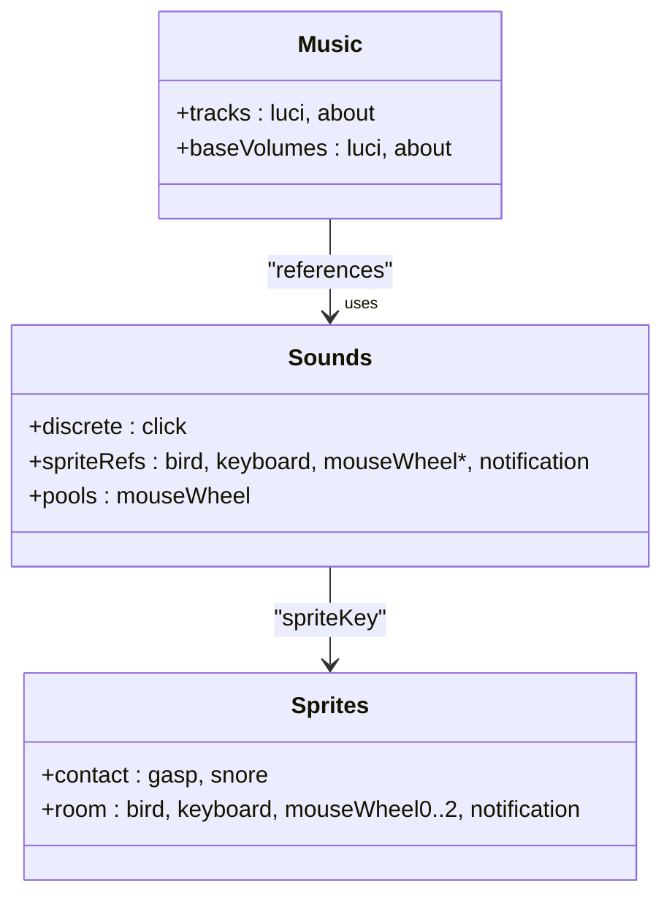
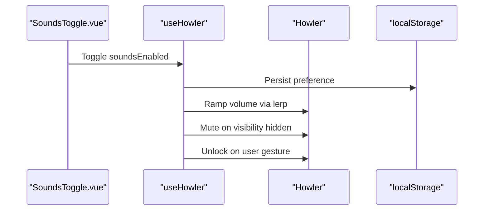
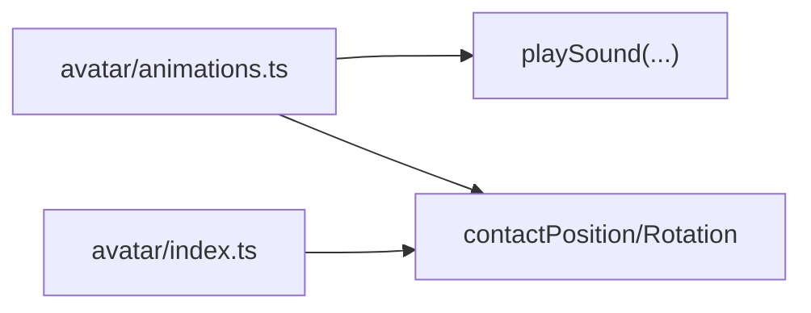
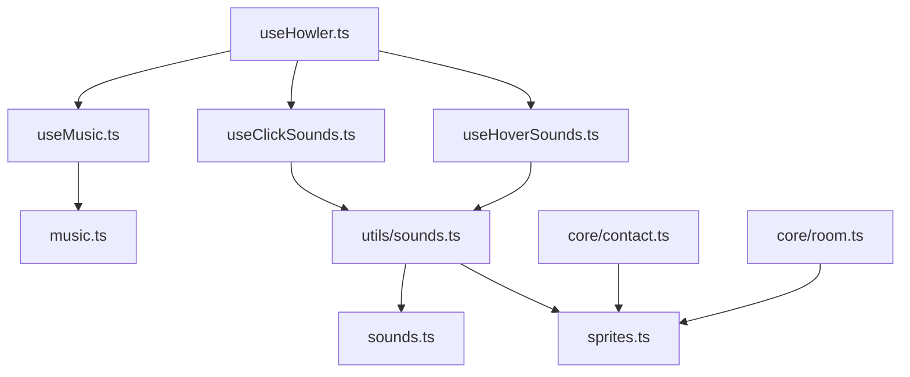

# Audio System

<cite>
**Referenced Files in This Document**
- [useHowler.ts](file://src/features/sounds/composables/useHowler.ts)
- [useMusic.ts](file://src/features/sounds/composables/useMusic.ts)
- [useClickSounds.ts](file://src/features/sounds/composables/useClickSounds.ts)
- [useHoverSounds.ts](file://src/features/sounds/composables/useHoverSounds.ts)
- [music.ts](file://src/features/sounds/definitions/music.ts)
- [sounds.ts](file://src/features/sounds/definitions/sounds.ts)
- [sprites.ts](file://src/features/sounds/definitions/sprites.ts)
- [sounds.ts](file://src/features/sounds/utils/sounds.ts)
- [types.ts](file://src/features/sounds/types.ts)
- [contact.ts](file://src/features/sounds/core/contact.ts)
- [room.ts](file://src/features/sounds/core/room.ts)
- [SoundsToggle.vue](file://src/components/SoundsToggle.vue)
- [main.ts](file://src/main.ts)
- [animations.ts](file://src/three/objects/avatar/animations.ts)
- [index.ts](file://src/three/objects/avatar/index.ts)
</cite>

## Table of Contents
1. [Introduction](#introduction)
2. [Project Structure](#project-structure)
3. [Core Components](#core-components)
4. [Architecture Overview](#architecture-overview)
5. [Detailed Component Analysis](#detailed-component-analysis)
6. [Dependency Analysis](#dependency-analysis)
7. [Performance Considerations](#performance-considerations)
8. [Troubleshooting Guide](#troubleshooting-guide)
9. [Conclusion](#conclusion)
10. [Appendices](#appendices)

## Introduction
This document describes the audio system built with Howler.js that powers immersive spatial audio experiences in Portfolio-PM. It covers:
- Music management: track loading, dynamic mixing, and scene-driven volume blending
- Sound effects: click feedback, hover effects, and environmental audio via sprite-based pooling
- Spatial audio: scene-relative volume control for room and contact environments
- Audio definitions: music tracks, sound effects, and sprite configurations
- Practical guidance: adding new assets, configuring feedback, browser autoplay policies, and performance considerations

## Project Structure
The audio system is organized under a dedicated feature module with composable hooks, definitions, core ticking logic, and utilities. The main application initializes GSAP for frame-perfect timing.

**Diagram sources**
- [music.ts:1-17](file://src/features/sounds/definitions/music.ts#L1-L17)
- [sounds.ts:1-31](file://src/features/sounds/definitions/sounds.ts#L1-L31)
- [sprites.ts:1-33](file://src/features/sounds/definitions/sprites.ts#L1-L33)
- [sounds.ts:1-45](file://src/features/sounds/utils/sounds.ts#L1-L45)
- [types.ts:1-16](file://src/features/sounds/types.ts#L1-L16)
- [contact.ts:1-42](file://src/features/sounds/core/contact.ts#L1-L42)
- [room.ts:1-10](file://src/features/sounds/core/room.ts#L1-L10)
- [useHowler.ts:1-110](file://src/features/sounds/composables/useHowler.ts#L1-L110)
- [useMusic.ts:1-63](file://src/features/sounds/composables/useMusic.ts#L1-L63)
- [useClickSounds.ts:1-43](file://src/features/sounds/composables/useClickSounds.ts#L1-L43)
- [useHoverSounds.ts:1-49](file://src/features/sounds/composables/useHoverSounds.ts#L1-L49)
- [SoundsToggle.vue:1-43](file://src/components/SoundsToggle.vue#L1-L43)
- [main.ts:1-10](file://src/main.ts#L1-L10)
- [animations.ts:1-40](file://src/three/objects/avatar/animations.ts#L1-L40)
- [index.ts:1-29](file://src/three/objects/avatar/index.ts#L1-L29)

**Section sources**
- [useHowler.ts:1-110](file://src/features/sounds/composables/useHowler.ts#L1-L110)
- [useMusic.ts:1-63](file://src/features/sounds/composables/useMusic.ts#L1-L63)
- [useClickSounds.ts:1-43](file://src/features/sounds/composables/useClickSounds.ts#L1-L43)
- [useHoverSounds.ts:1-49](file://src/features/sounds/composables/useHoverSounds.ts#L1-L49)
- [music.ts:1-17](file://src/features/sounds/definitions/music.ts#L1-L17)
- [sounds.ts:1-31](file://src/features/sounds/definitions/sounds.ts#L1-L31)
- [sprites.ts:1-33](file://src/features/sounds/definitions/sprites.ts#L1-L33)
- [sounds.ts:1-45](file://src/features/sounds/utils/sounds.ts#L1-L45)
- [types.ts:1-16](file://src/features/sounds/types.ts#L1-L16)
- [contact.ts:1-42](file://src/features/sounds/core/contact.ts#L1-L42)
- [room.ts:1-10](file://src/features/sounds/core/room.ts#L1-L10)
- [SoundsToggle.vue:1-43](file://src/components/SoundsToggle.vue#L1-L43)
- [main.ts:1-10](file://src/main.ts#L1-L10)
- [animations.ts:1-40](file://src/three/objects/avatar/animations.ts#L1-L40)
- [index.ts:1-29](file://src/three/objects/avatar/index.ts#L1-L29)

## Core Components
- useHowler: Initializes Howler, manages global volume ramping, unlocks on user gesture, toggles mute on visibility change, and persists user preference. It also loads all sound assets on non-touch devices.
- useMusic: Drives scene-aware music mixing, dynamically adjusting volumes for ambient tracks based on scene weights and route context.
- useClickSounds/useHoverSounds: Event-driven sound triggers for interactive elements using data attributes.
- definitions/*: Centralized audio asset definitions for music, discrete sounds, and sprite-based audio.
- core/*: Scene-specific audio drivers that adjust sprite volumes based on scene visibility and weights.
- utils/sounds: Unified playback API that resolves sprite vs. discrete Howl instances and supports randomized pools.

**Section sources**
- [useHowler.ts:1-110](file://src/features/sounds/composables/useHowler.ts#L1-L110)
- [useMusic.ts:1-63](file://src/features/sounds/composables/useMusic.ts#L1-L63)
- [useClickSounds.ts:1-43](file://src/features/sounds/composables/useClickSounds.ts#L1-L43)
- [useHoverSounds.ts:1-49](file://src/features/sounds/composables/useHoverSounds.ts#L1-L49)
- [music.ts:1-17](file://src/features/sounds/definitions/music.ts#L1-L17)
- [sounds.ts:1-31](file://src/features/sounds/definitions/sounds.ts#L1-L31)
- [sprites.ts:1-33](file://src/features/sounds/definitions/sprites.ts#L1-L33)
- [sounds.ts:1-45](file://src/features/sounds/utils/sounds.ts#L1-L45)
- [contact.ts:1-42](file://src/features/sounds/core/contact.ts#L1-L42)
- [room.ts:1-10](file://src/features/sounds/core/room.ts#L1-L10)

## Architecture Overview
The audio pipeline integrates Vue composables, Howler.js, and GSAP timing for smooth, responsive audio behavior. The system distinguishes between:
- Discrete sounds (e.g., click)
- Sprite-based sounds (room/environment and contact)
- Music tracks (ambient pads and luci theme)

**Diagram sources**
- [main.ts:1-10](file://src/main.ts#L1-L10)
- [useHowler.ts:1-110](file://src/features/sounds/composables/useHowler.ts#L1-L110)
- [useMusic.ts:1-63](file://src/features/sounds/composables/useMusic.ts#L1-L63)
- [useClickSounds.ts:1-43](file://src/features/sounds/composables/useClickSounds.ts#L1-L43)
- [useHoverSounds.ts:1-49](file://src/features/sounds/composables/useHoverSounds.ts#L1-L49)
- [sounds.ts:1-45](file://src/features/sounds/utils/sounds.ts#L1-L45)
- [music.ts:1-17](file://src/features/sounds/definitions/music.ts#L1-L17)
- [sounds.ts:1-31](file://src/features/sounds/definitions/sounds.ts#L1-L31)
- [sprites.ts:1-33](file://src/features/sounds/definitions/sprites.ts#L1-L33)

## Detailed Component Analysis

### Music Management System
- Track loading: Tracks are instantiated as Howl objects with lazy preload and loop enabled. They are loaded and played on demand.
- Dynamic mixing: Volumes are computed per scene and route. On the home route, two ambient tracks blend according to scene weights; elsewhere, volumes fall back to base levels.
- Playback control: Composable watches for conditions (feature enabled, unlocked, sounds enabled, non-touch) and starts both tracks automatically.

**Diagram sources**
- [useMusic.ts:17-27](file://src/features/sounds/composables/useMusic.ts#L17-L27)
- [music.ts:13-16](file://src/features/sounds/definitions/music.ts#L13-L16)

**Section sources**
- [useMusic.ts:1-63](file://src/features/sounds/composables/useMusic.ts#L1-L63)
- [music.ts:1-17](file://src/features/sounds/definitions/music.ts#L1-L17)

### Sound Effects System
- Click sounds: A global click handler finds elements with a data attribute and plays a discrete sound.
- Hover effects: A global mouseenter handler plays a randomized hover sound from a predefined pool.
- Asset definition: Discrete sounds and sprite groups are declared centrally; sprite keys map to shared Howl instances.

**Diagram sources**
- [useClickSounds.ts:6-25](file://src/features/sounds/composables/useClickSounds.ts#L6-L25)
- [useHoverSounds.ts:8-29](file://src/features/sounds/composables/useHoverSounds.ts#L8-L29)
- [sounds.ts:22-44](file://src/features/sounds/utils/sounds.ts#L22-L44)
- [sounds.ts:11-30](file://src/features/sounds/definitions/sounds.ts#L11-L30)
- [sprites.ts:7-32](file://src/features/sounds/definitions/sprites.ts#L7-L32)

**Section sources**
- [useClickSounds.ts:1-43](file://src/features/sounds/composables/useClickSounds.ts#L1-L43)
- [useHoverSounds.ts:1-49](file://src/features/sounds/composables/useHoverSounds.ts#L1-L49)
- [sounds.ts:1-31](file://src/features/sounds/definitions/sounds.ts#L1-L31)
- [sprites.ts:1-33](file://src/features/sounds/definitions/sprites.ts#L1-L33)
- [sounds.ts:1-45](file://src/features/sounds/utils/sounds.ts#L1-L45)

### Spatial Audio Implementation
- Room audio: Scene-relative volume scaling based on hero scene weight and project visibility.
- Contact audio: Scene-relative volume scaling based on contact scene weight and project visibility, with periodic snoring playback orchestrated by a delayed timer.

**Diagram sources**
- [room.ts:6-9](file://src/features/sounds/core/room.ts#L6-L9)
- [contact.ts:13-25](file://src/features/sounds/core/contact.ts#L13-L25)
- [contact.ts:27-30](file://src/features/sounds/core/contact.ts#L27-L30)

**Section sources**
- [room.ts:1-10](file://src/features/sounds/core/room.ts#L1-L10)
- [contact.ts:1-42](file://src/features/sounds/core/contact.ts#L1-L42)

### Audio Definitions
- Music tracks: Two ambient Howl instances with loop and configurable base volumes.
- Discrete sounds: Click and others defined as unique Howl instances.
- Sprites: Room and contact Howl instances with named sprite segments; pools enable randomized playback.

**Diagram sources**
- [music.ts:8-16](file://src/features/sounds/definitions/music.ts#L8-L16)
- [sounds.ts:11-30](file://src/features/sounds/definitions/sounds.ts#L11-L30)
- [sprites.ts:7-32](file://src/features/sounds/definitions/sprites.ts#L7-L32)

**Section sources**
- [music.ts:1-17](file://src/features/sounds/definitions/music.ts#L1-L17)
- [sounds.ts:1-31](file://src/features/sounds/definitions/sounds.ts#L1-L31)
- [sprites.ts:1-33](file://src/features/sounds/definitions/sprites.ts#L1-L33)
- [types.ts:1-16](file://src/features/sounds/types.ts#L1-L16)

### Global Audio Control and UI Toggle
- Global volume ramping: Smoothly ramps Howler volume toward enabled state using a lerp-based approach.
- Visibility and keyboard controls: Mutes audio when the page is hidden and toggles sounds via keyboard shortcut on non-touch devices.
- UI toggle: A round button component toggles soundsEnabled and triggers click/hover feedback.

**Diagram sources**
- [SoundsToggle.vue:14-16](file://src/components/SoundsToggle.vue#L14-L16)
- [useHowler.ts:20-74](file://src/features/sounds/composables/useHowler.ts#L20-L74)
- [useHowler.ts:60-68](file://src/features/sounds/composables/useHowler.ts#L60-L68)

**Section sources**
- [SoundsToggle.vue:1-43](file://src/components/SoundsToggle.vue#L1-L43)
- [useHowler.ts:1-110](file://src/features/sounds/composables/useHowler.ts#L1-L110)

### 3D Integration and Avatar Audio
- Avatar animations orchestrate scene-specific audio behaviors and integrate with contact audio.
- Avatar scene configuration defines positional and rotational anchors used by audio cues.

**Diagram sources**
- [animations.ts:1-40](file://src/three/objects/avatar/animations.ts#L1-L40)
- [index.ts:28-29](file://src/three/objects/avatar/index.ts#L28-L29)

**Section sources**
- [animations.ts:1-40](file://src/three/objects/avatar/animations.ts#L1-L40)
- [index.ts:1-29](file://src/three/objects/avatar/index.ts#L1-L29)

## Dependency Analysis
- Composables depend on definitions for asset metadata and on utils for playback resolution.
- Core modules depend on sprite definitions and scene weights to compute volumes.
- UI toggle depends on global state from useHowler.

**Diagram sources**
- [useHowler.ts:1-110](file://src/features/sounds/composables/useHowler.ts#L1-L110)
- [useMusic.ts:1-63](file://src/features/sounds/composables/useMusic.ts#L1-L63)
- [useClickSounds.ts:1-43](file://src/features/sounds/composables/useClickSounds.ts#L1-L43)
- [useHoverSounds.ts:1-49](file://src/features/sounds/composables/useHoverSounds.ts#L1-L49)
- [music.ts:1-17](file://src/features/sounds/definitions/music.ts#L1-L17)
- [sounds.ts:1-31](file://src/features/sounds/definitions/sounds.ts#L1-L31)
- [sprites.ts:1-33](file://src/features/sounds/definitions/sprites.ts#L1-L33)
- [sounds.ts:1-45](file://src/features/sounds/utils/sounds.ts#L1-L45)
- [contact.ts:1-42](file://src/features/sounds/core/contact.ts#L1-L42)
- [room.ts:1-10](file://src/features/sounds/core/room.ts#L1-L10)

**Section sources**
- [useHowler.ts:1-110](file://src/features/sounds/composables/useHowler.ts#L1-L110)
- [useMusic.ts:1-63](file://src/features/sounds/composables/useMusic.ts#L1-L63)
- [useClickSounds.ts:1-43](file://src/features/sounds/composables/useClickSounds.ts#L1-L43)
- [useHoverSounds.ts:1-49](file://src/features/sounds/composables/useHoverSounds.ts#L1-L49)
- [music.ts:1-17](file://src/features/sounds/definitions/music.ts#L1-L17)
- [sounds.ts:1-31](file://src/features/sounds/definitions/sounds.ts#L1-L31)
- [sprites.ts:1-33](file://src/features/sounds/definitions/sprites.ts#L1-L33)
- [sounds.ts:1-45](file://src/features/sounds/utils/sounds.ts#L1-L45)
- [contact.ts:1-42](file://src/features/sounds/core/contact.ts#L1-L42)
- [room.ts:1-10](file://src/features/sounds/core/room.ts#L1-L10)

## Performance Considerations
- Lazy loading: Tracks and sounds are configured with lazy preload to defer asset loading until needed.
- Frame timing: GSAP ticker ensures smooth volume transitions and responsive event handling.
- Device awareness: Automatic disabling of sounds on touch devices avoids unnecessary overhead and respects platform constraints.
- Pooling: Randomized sprite selection reduces repetition and optimizes memory by sharing a single Howl instance.

[No sources needed since this section provides general guidance]

## Troubleshooting Guide
- Autoplay policy issues:
  - Ensure a user gesture occurs before unlocking audio; the system waits for a running audio context state and sets a flag accordingly.
  - On touch devices, sounds are disabled by default; enablement requires explicit user action.
- Volume inconsistencies:
  - Verify that global volume is being ramped and not immediately set; use the provided composable to toggle soundsEnabled and persist preferences.
  - Confirm that visibility changes mute audio appropriately.
- Synchronization problems:
  - Confirm that scene weights and route path are correctly influencing music volumes.
  - For sprite-based audio, ensure the correct sprite name is used and that the Howl instance is loaded.
- Mobile device restrictions:
  - Touch devices disable sounds by default; provide a visible toggle for users who want to enable sounds after a gesture.
  - Avoid preloading large assets on mobile; rely on lazy loading and on-demand playback.

**Section sources**
- [useHowler.ts:24-40](file://src/features/sounds/composables/useHowler.ts#L24-L40)
- [useHowler.ts:60-68](file://src/features/sounds/composables/useHowler.ts#L60-L68)
- [useMusic.ts:17-27](file://src/features/sounds/composables/useMusic.ts#L17-L27)
- [sounds.ts:36-41](file://src/features/sounds/utils/sounds.ts#L36-L41)
- [SoundsToggle.vue:20-31](file://src/components/SoundsToggle.vue#L20-L31)

## Conclusion
The audio system leverages Howler.js and Vue composables to deliver a responsive, scene-aware audio experience. Music tracks blend dynamically with scene weights, while discrete and sprite-based sounds provide contextual feedback. The design emphasizes performance, platform compatibility, and maintainability through centralized definitions and composable orchestration.

[No sources needed since this section summarizes without analyzing specific files]

## Appendices

### Adding New Audio Assets
- Add the asset to the appropriate definition file:
  - For discrete sounds, add a new key to the sounds dictionary with a Howl instance.
  - For sprite-based sounds, add a new sprite segment to the relevant Howl in sprites and reference it in sounds.
- If the sound belongs to a pool (e.g., mouse wheel variants), update the pools definition.
- Use the unified playSound utility to trigger playback; it will resolve the correct Howl or sprite.

**Section sources**
- [sounds.ts:11-30](file://src/features/sounds/definitions/sounds.ts#L11-L30)
- [sprites.ts:7-32](file://src/features/sounds/definitions/sprites.ts#L7-L32)
- [sounds.ts:22-44](file://src/features/sounds/utils/sounds.ts#L22-L44)

### Configuring Scene-Based Spatial Volume
- Adjust the volume computation in the relevant core tick function (room or contact) to reflect desired scene weights and visibility thresholds.
- Ensure the sprite Howl instance is loaded and that sprite names match the definitions.

**Section sources**
- [room.ts:6-9](file://src/features/sounds/core/room.ts#L6-L9)
- [contact.ts:27-30](file://src/features/sounds/core/contact.ts#L27-L30)
- [sprites.ts:18-32](file://src/features/sounds/definitions/sprites.ts#L18-L32)

### Implementing Audio Feedback for Interactions
- Mark interactive elements with data attributes and attach handlers from the composables.
- Trigger playSound with the appropriate key or pool to produce feedback.

**Section sources**
- [useClickSounds.ts:6-25](file://src/features/sounds/composables/useClickSounds.ts#L6-L25)
- [useHoverSounds.ts:8-29](file://src/features/sounds/composables/useHoverSounds.ts#L8-L29)
- [SoundsToggle.vue:27-28](file://src/components/SoundsToggle.vue#L27-L28)