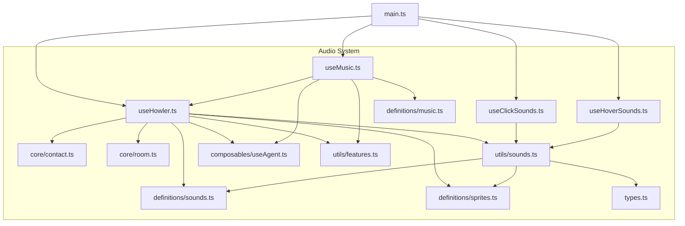
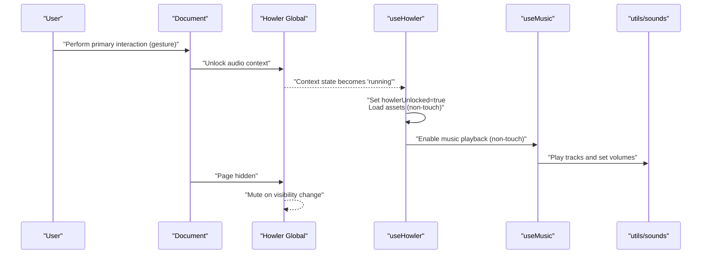
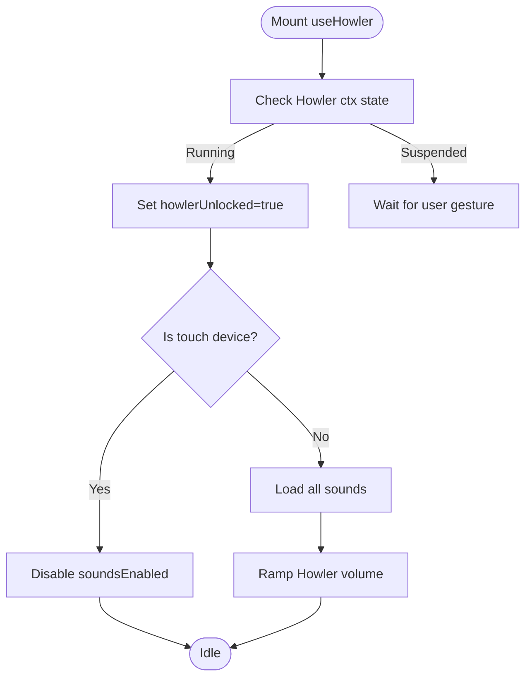
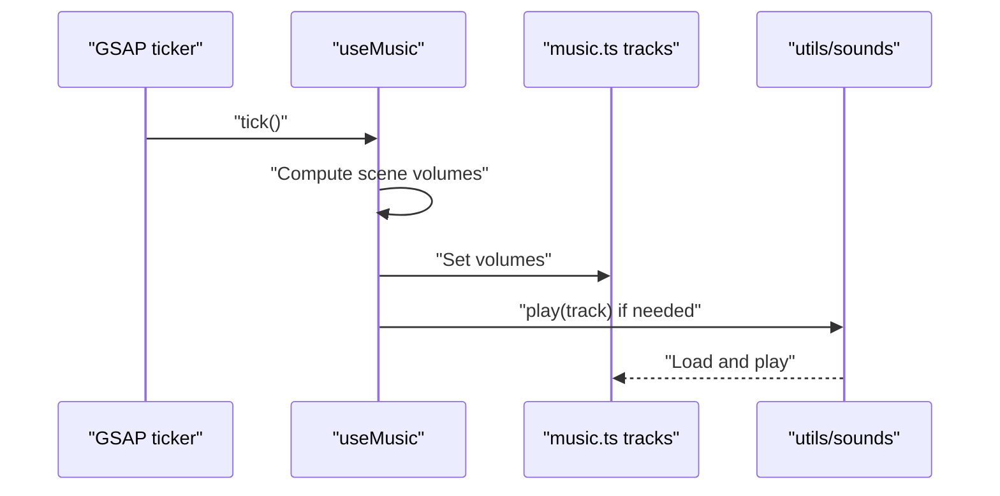
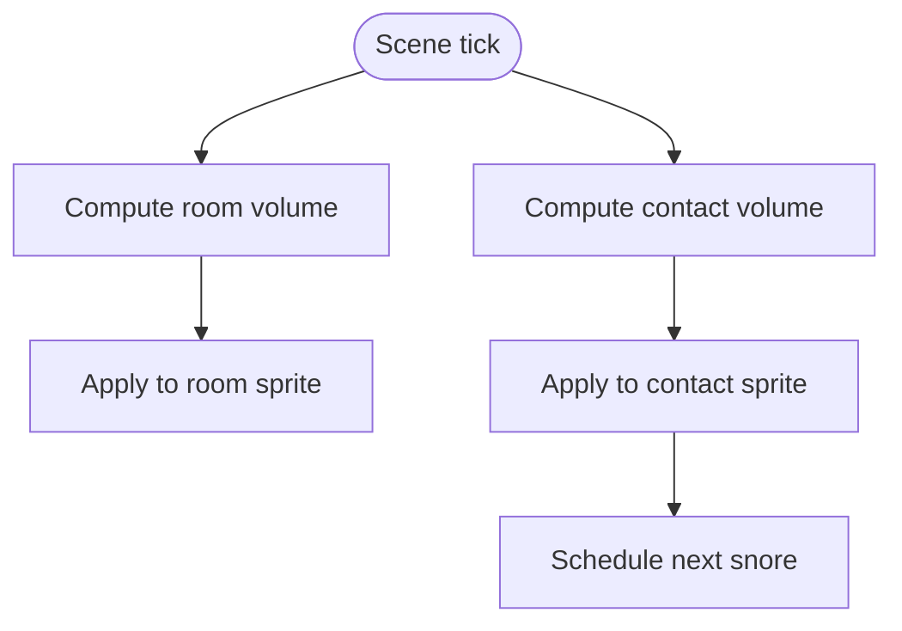
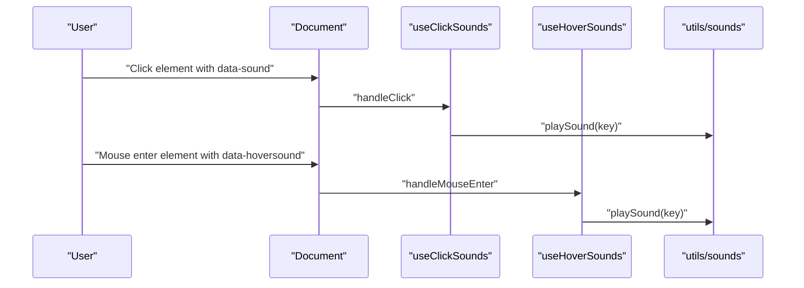
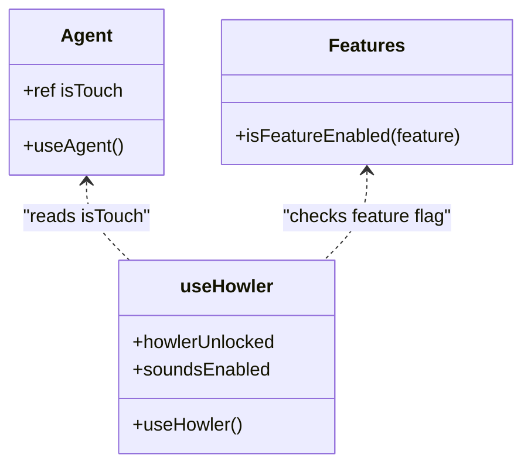
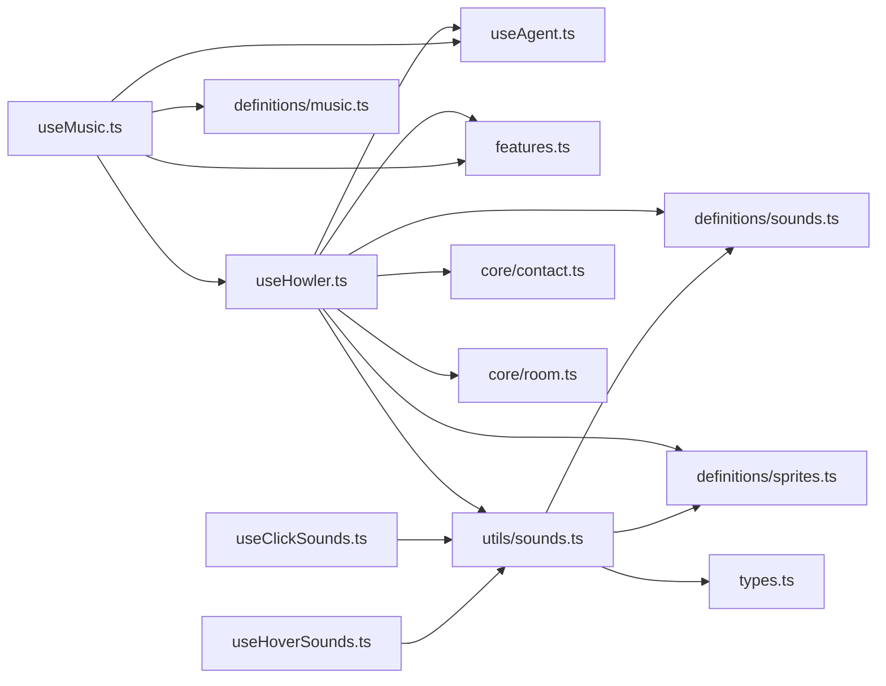

# Browser Compatibility & Autoplay Policies

<cite>
**Referenced Files in This Document**
- [useHowler.ts](file://src/features/sounds/composables/useHowler.ts)
- [useMusic.ts](file://src/features/sounds/composables/useMusic.ts)
- [useClickSounds.ts](file://src/features/sounds/composables/useClickSounds.ts)
- [useHoverSounds.ts](file://src/features/sounds/composables/useHoverSounds.ts)
- [contact.ts](file://src/features/sounds/core/contact.ts)
- [room.ts](file://src/features/sounds/core/room.ts)
- [music.ts](file://src/features/sounds/definitions/music.ts)
- [sounds.ts](file://src/features/sounds/definitions/sounds.ts)
- [sprites.ts](file://src/features/sounds/definitions/sprites.ts)
- [sounds.ts](file://src/features/sounds/utils/sounds.ts)
- [useAgent.ts](file://src/composables/useAgent.ts)
- [features.ts](file://src/utils/features.ts)
- [types.ts](file://src/features/sounds/types.ts)
- [main.ts](file://src/main.ts)
</cite>

## Table of Contents
1. [Introduction](#introduction)
2. [Project Structure](#project-structure)
3. [Core Components](#core-components)
4. [Architecture Overview](#architecture-overview)
5. [Detailed Component Analysis](#detailed-component-analysis)
6. [Dependency Analysis](#dependency-analysis)
7. [Performance Considerations](#performance-considerations)
8. [Troubleshooting Guide](#troubleshooting-guide)
9. [Conclusion](#conclusion)
10. [Appendices](#appendices)

## Introduction
This document explains how the audio system integrates browser compatibility and autoplay policy compliance using Howler.js. It covers:
- Browser detection and feature availability checks
- Autoplay policy handling across Chrome, Safari, Firefox, and mobile environments
- User interaction requirements to unlock audio playback
- Fallback strategies when autoplay is blocked
- Audio format compatibility across browsers
- Mobile device restrictions, background audio limitations, and battery optimization considerations
- Practical troubleshooting steps for common autoplay and browser-specific audio issues

## Project Structure
The audio system is organized into composable modules, definitions for tracks and sounds, core scene-driven audio logic, and utilities for playback orchestration. The main application initializes the framework and plugins but does not directly configure Howler’s global state.

**Diagram sources**
- [main.ts:1-10](file://src/main.ts#L1-L10)
- [useHowler.ts:1-110](file://src/features/sounds/composables/useHowler.ts#L1-L110)
- [useMusic.ts:1-63](file://src/features/sounds/composables/useMusic.ts#L1-L63)
- [useClickSounds.ts:1-43](file://src/features/sounds/composables/useClickSounds.ts#L1-L43)
- [useHoverSounds.ts:1-49](file://src/features/sounds/composables/useHoverSounds.ts#L1-L49)
- [contact.ts:1-42](file://src/features/sounds/core/contact.ts#L1-L42)
- [room.ts:1-10](file://src/features/sounds/core/room.ts#L1-L10)
- [music.ts:1-17](file://src/features/sounds/definitions/music.ts#L1-L17)
- [sounds.ts:1-31](file://src/features/sounds/definitions/sounds.ts#L1-L31)
- [sprites.ts:1-33](file://src/features/sounds/definitions/sprites.ts#L1-L33)
- [sounds.ts:1-45](file://src/features/sounds/utils/sounds.ts#L1-L45)
- [useAgent.ts:1-17](file://src/composables/useAgent.ts#L1-L17)
- [features.ts:1-10](file://src/utils/features.ts#L1-L10)
- [types.ts:1-16](file://src/features/sounds/types.ts#L1-L16)

**Section sources**
- [main.ts:1-10](file://src/main.ts#L1-L10)
- [useHowler.ts:1-110](file://src/features/sounds/composables/useHowler.ts#L1-L110)
- [useMusic.ts:1-63](file://src/features/sounds/composables/useMusic.ts#L1-L63)
- [useClickSounds.ts:1-43](file://src/features/sounds/composables/useClickSounds.ts#L1-L43)
- [useHoverSounds.ts:1-49](file://src/features/sounds/composables/useHoverSounds.ts#L1-L49)
- [contact.ts:1-42](file://src/features/sounds/core/contact.ts#L1-L42)
- [room.ts:1-10](file://src/features/sounds/core/room.ts#L1-L10)
- [music.ts:1-17](file://src/features/sounds/definitions/music.ts#L1-L17)
- [sounds.ts:1-31](file://src/features/sounds/definitions/sounds.ts#L1-L31)
- [sprites.ts:1-33](file://src/features/sounds/definitions/sprites.ts#L1-L33)
- [sounds.ts:1-45](file://src/features/sounds/utils/sounds.ts#L1-L45)
- [useAgent.ts:1-17](file://src/composables/useAgent.ts#L1-L17)
- [features.ts:1-10](file://src/utils/features.ts#L1-L10)
- [types.ts:1-16](file://src/features/sounds/types.ts#L1-L16)

## Core Components
- useHowler: Initializes Howler, detects user interaction to unlock audio, manages volume ramping, handles visibility mute, and disables sounds on touch devices.
- useMusic: Controls scene-aware music playback and volume mixing using Howler tracks.
- useClickSounds / useHoverSounds: Event-driven sound triggers via DOM attributes.
- Core audio logic: Scene-dependent volume adjustments for ambient and contact sounds.
- Definitions: Tracks, sounds, and sprites with Howler instances and sprite definitions.
- Utilities: Playback orchestration and sprite resolution.
- Agent and feature utilities: Device capability detection and feature gating.

Key behaviors:
- Autoplay unlocking via user gesture observed by Howler context state.
- Touch-device exclusion for interactive sound enabling.
- Preloading and lazy loading of Howler assets.
- Visibility-based muting to reduce background CPU usage.

**Section sources**
- [useHowler.ts:1-110](file://src/features/sounds/composables/useHowler.ts#L1-L110)
- [useMusic.ts:1-63](file://src/features/sounds/composables/useMusic.ts#L1-L63)
- [useClickSounds.ts:1-43](file://src/features/sounds/composables/useClickSounds.ts#L1-L43)
- [useHoverSounds.ts:1-49](file://src/features/sounds/composables/useHoverSounds.ts#L1-L49)
- [contact.ts:1-42](file://src/features/sounds/core/contact.ts#L1-L42)
- [room.ts:1-10](file://src/features/sounds/core/room.ts#L1-L10)
- [music.ts:1-17](file://src/features/sounds/definitions/music.ts#L1-L17)
- [sounds.ts:1-31](file://src/features/sounds/definitions/sounds.ts#L1-L31)
- [sprites.ts:1-33](file://src/features/sounds/definitions/sprites.ts#L1-L33)
- [sounds.ts:1-45](file://src/features/sounds/utils/sounds.ts#L1-L45)
- [useAgent.ts:1-17](file://src/composables/useAgent.ts#L1-L17)
- [features.ts:1-10](file://src/utils/features.ts#L1-L10)

## Architecture Overview
The audio pipeline relies on user gestures to unlock Howler, then orchestrates music and ambient sounds per scene. Touch devices bypass interactive enabling to avoid autoplay blocks. Background audio is muted on visibility change to conserve resources.

**Diagram sources**
- [useHowler.ts:24-62](file://src/features/sounds/composables/useHowler.ts#L24-L62)
- [useMusic.ts:29-49](file://src/features/sounds/composables/useMusic.ts#L29-L49)
- [sounds.ts:22-44](file://src/features/sounds/utils/sounds.ts#L22-L44)

**Section sources**
- [useHowler.ts:24-62](file://src/features/sounds/composables/useHowler.ts#L24-L62)
- [useMusic.ts:29-49](file://src/features/sounds/composables/useMusic.ts#L29-L49)
- [sounds.ts:22-44](file://src/features/sounds/utils/sounds.ts#L22-L44)

## Detailed Component Analysis

### Autoplay Unlock and Gesture Requirements
- The system waits for the Howler audio context to transition from suspended to running, which occurs after a user gesture.
- On unlock, non-touch devices load assets and enable volume ramping; touch devices remain disabled to comply with autoplay policies.
- A keyboard shortcut toggles sound state on non-touch devices.

**Diagram sources**
- [useHowler.ts:24-58](file://src/features/sounds/composables/useHowler.ts#L24-L58)
- [useAgent.ts:1-17](file://src/composables/useAgent.ts#L1-L17)

**Section sources**
- [useHowler.ts:24-58](file://src/features/sounds/composables/useHowler.ts#L24-L58)
- [useAgent.ts:1-17](file://src/composables/useAgent.ts#L1-L17)

### Music Playback and Scene-Based Mixing
- Scene-aware mixing adjusts volumes for overlapping tracks based on route and animation weights.
- Non-touch devices and unlocked state are required to play music.
- Tracks are loaded and played lazily to minimize initial overhead.

**Diagram sources**
- [useMusic.ts:17-49](file://src/features/sounds/composables/useMusic.ts#L17-L49)
- [music.ts:8-11](file://src/features/sounds/definitions/music.ts#L8-L11)
- [sounds.ts:22-44](file://src/features/sounds/utils/sounds.ts#L22-L44)

**Section sources**
- [useMusic.ts:17-49](file://src/features/sounds/composables/useMusic.ts#L17-L49)
- [music.ts:8-11](file://src/features/sounds/definitions/music.ts#L8-L11)
- [sounds.ts:22-44](file://src/features/sounds/utils/sounds.ts#L22-L44)

### Ambient and Contact Audio Orchestration
- Room and contact scenes adjust sprite volumes based on project visibility and scene weights.
- Snoring sound is scheduled periodically with a delayed call to simulate natural pacing.

**Diagram sources**
- [room.ts:6-9](file://src/features/sounds/core/room.ts#L6-L9)
- [contact.ts:27-30](file://src/features/sounds/core/contact.ts#L27-L30)
- [contact.ts:13-22](file://src/features/sounds/core/contact.ts#L13-L22)

**Section sources**
- [room.ts:6-9](file://src/features/sounds/core/room.ts#L6-L9)
- [contact.ts:27-30](file://src/features/sounds/core/contact.ts#L27-L30)
- [contact.ts:13-22](file://src/features/sounds/core/contact.ts#L13-L22)

### Event-Driven Sound Triggers
- Click and hover sounds are triggered via DOM attributes on interactive elements.
- Hover events are ignored during transitions and on touch devices.

**Diagram sources**
- [useClickSounds.ts:22-25](file://src/features/sounds/composables/useClickSounds.ts#L22-L25)
- [useHoverSounds.ts:26-29](file://src/features/sounds/composables/useHoverSounds.ts#L26-L29)
- [sounds.ts:22-44](file://src/features/sounds/utils/sounds.ts#L22-L44)

**Section sources**
- [useClickSounds.ts:22-25](file://src/features/sounds/composables/useClickSounds.ts#L22-L25)
- [useHoverSounds.ts:26-29](file://src/features/sounds/composables/useHoverSounds.ts#L26-L29)
- [sounds.ts:22-44](file://src/features/sounds/utils/sounds.ts#L22-L44)

### Browser Detection and Feature Availability
- Device detection uses touch capability checks to tailor behavior.
- Feature flags gate audio functionality globally.

**Diagram sources**
- [useAgent.ts:1-17](file://src/composables/useAgent.ts#L1-L17)
- [features.ts:1-10](file://src/utils/features.ts#L1-L10)
- [useHowler.ts:1-110](file://src/features/sounds/composables/useHowler.ts#L1-L110)

**Section sources**
- [useAgent.ts:1-17](file://src/composables/useAgent.ts#L1-L17)
- [features.ts:1-10](file://src/utils/features.ts#L1-L10)
- [useHowler.ts:1-110](file://src/features/sounds/composables/useHowler.ts#L1-L110)

## Dependency Analysis
- useHowler depends on Howler global state, device agent, feature flags, and scene core modules for volume updates.
- useMusic depends on scene weights, base volumes, and Howler tracks.
- Event-driven hooks depend on utils/sounds for playback orchestration.
- Definitions encapsulate asset loading and sprite configurations.

**Diagram sources**
- [useHowler.ts:1-110](file://src/features/sounds/composables/useHowler.ts#L1-L110)
- [useMusic.ts:1-63](file://src/features/sounds/composables/useMusic.ts#L1-L63)
- [useClickSounds.ts:1-43](file://src/features/sounds/composables/useClickSounds.ts#L1-L43)
- [useHoverSounds.ts:1-49](file://src/features/sounds/composables/useHoverSounds.ts#L1-L49)
- [contact.ts:1-42](file://src/features/sounds/core/contact.ts#L1-L42)
- [room.ts:1-10](file://src/features/sounds/core/room.ts#L1-L10)
- [music.ts:1-17](file://src/features/sounds/definitions/music.ts#L1-L17)
- [sounds.ts:1-31](file://src/features/sounds/definitions/sounds.ts#L1-L31)
- [sprites.ts:1-33](file://src/features/sounds/definitions/sprites.ts#L1-L33)
- [sounds.ts:1-45](file://src/features/sounds/utils/sounds.ts#L1-L45)
- [useAgent.ts:1-17](file://src/composables/useAgent.ts#L1-L17)
- [features.ts:1-10](file://src/utils/features.ts#L1-L10)
- [types.ts:1-16](file://src/features/sounds/types.ts#L1-L16)

**Section sources**
- [useHowler.ts:1-110](file://src/features/sounds/composables/useHowler.ts#L1-L110)
- [useMusic.ts:1-63](file://src/features/sounds/composables/useMusic.ts#L1-L63)
- [useClickSounds.ts:1-43](file://src/features/sounds/composables/useClickSounds.ts#L1-L43)
- [useHoverSounds.ts:1-49](file://src/features/sounds/composables/useHoverSounds.ts#L1-L49)
- [contact.ts:1-42](file://src/features/sounds/core/contact.ts#L1-L42)
- [room.ts:1-10](file://src/features/sounds/core/room.ts#L1-L10)
- [music.ts:1-17](file://src/features/sounds/definitions/music.ts#L1-L17)
- [sounds.ts:1-31](file://src/features/sounds/definitions/sounds.ts#L1-L31)
- [sprites.ts:1-33](file://src/features/sounds/definitions/sprites.ts#L1-L33)
- [sounds.ts:1-45](file://src/features/sounds/utils/sounds.ts#L1-L45)
- [useAgent.ts:1-17](file://src/composables/useAgent.ts#L1-L17)
- [features.ts:1-10](file://src/utils/features.ts#L1-L10)
- [types.ts:1-16](file://src/features/sounds/types.ts#L1-L16)

## Performance Considerations
- Lazy loading: Tracks and sounds are loaded on demand to reduce startup cost.
- Visibility-based muting: Automatically mutes audio when the page is not visible to save CPU/battery.
- Volume ramping: Smooth transitions prevent abrupt loudness changes and reduce perceived noise spikes.
- Touch exclusion: Disabling sounds on touch devices avoids unnecessary resource usage and autoplay issues.
- Scene-based mixing: Dynamic volume adjustments based on route and animation weights keep audio coherent and efficient.

[No sources needed since this section provides general guidance]

## Troubleshooting Guide
Common issues and resolutions:
- Autoplay blocked on first load
  - Cause: Audio context suspended until user gesture.
  - Resolution: Trigger a primary interaction (click, key press). The system unlocks on the first gesture and loads assets for non-touch devices.
  - Verification: Check that the Howler context state transitions to running and howlerUnlocked becomes true.
  - Section sources
    - [useHowler.ts:24-58](file://src/features/sounds/composables/useHowler.ts#L24-L58)

- No sound on mobile devices
  - Cause: Touch devices disable interactive sound enabling by design.
  - Resolution: Provide a manual toggle or rely on ambient/sprite sounds that are designed to work without explicit user interaction.
  - Section sources
    - [useHowler.ts:27-31](file://src/features/sounds/composables/useHowler.ts#L27-L31)
    - [useAgent.ts:1-17](file://src/composables/useAgent.ts#L1-L17)

- Music not playing on non-home routes
  - Cause: Scene logic sets base volumes differently off the home route.
  - Resolution: Verify route path and scene weights; ensure tracks are loaded and playing.
  - Section sources
    - [useMusic.ts:17-27](file://src/features/sounds/composables/useMusic.ts#L17-L27)

- Background audio continues consuming power
  - Cause: Page visibility unmuted audio.
  - Resolution: Allow visibility-based muting to activate; re-check visibility listener behavior.
  - Section sources
    - [useHowler.ts:60-62](file://src/features/sounds/composables/useHowler.ts#L60-L62)

- Click/hover sounds not triggering
  - Cause: Missing data attributes or event listeners not attached on touch devices.
  - Resolution: Ensure elements have proper data attributes and that the hooks are mounted; note hover is disabled on touch.
  - Section sources
    - [useClickSounds.ts:6-25](file://src/features/sounds/composables/useClickSounds.ts#L6-L25)
    - [useHoverSounds.ts:8-29](file://src/features/sounds/composables/useHoverSounds.ts#L8-L29)
    - [useHoverSounds.ts:40-42](file://src/features/sounds/composables/useHoverSounds.ts#L40-L42)

- Sprites not playing specific cues
  - Cause: Incorrect sprite name or missing sprite definition.
  - Resolution: Confirm sprite keys and names in definitions; ensure the sprite exists and is loaded.
  - Section sources
    - [sprites.ts:7-32](file://src/features/sounds/definitions/sprites.ts#L7-L32)
    - [sounds.ts:36-41](file://src/features/sounds/utils/sounds.ts#L36-L41)

## Conclusion
The audio system leverages user gestures to unlock Howler, dynamically adapts to device capabilities, and minimizes resource usage through visibility-based muting and lazy loading. Scene-aware mixing and sprite orchestration deliver immersive audio while respecting browser autoplay policies across desktop and mobile environments.

[No sources needed since this section summarizes without analyzing specific files]

## Appendices

### Browser Compatibility Matrix (MP3, OGG, WAV, AAC)
- Asset definitions include OGG and MP3 variants for tracks and sprites, enabling broad browser support:
  - OGG: Used for music and room sprites.
  - MP3: Used for room sprites and click sound.
- Recommendations:
  - Prefer OGG for modern browsers and Safari for best codec support.
  - Keep MP3 as a fallback for legacy environments.
  - Validate asset loading per browser and provide appropriate fallbacks if needed.

**Section sources**
- [music.ts:3-4](file://src/features/sounds/definitions/music.ts#L3-L4)
- [sprites.ts:2-3](file://src/features/sounds/definitions/sprites.ts#L2-L3)
- [sounds.ts:5-13](file://src/features/sounds/definitions/sounds.ts#L5-L13)

### Autoplay Policy Compliance by Browser Family
- Chrome
  - Requires a user gesture to unlock audio context.
  - Background tabs may throttle audio; visibility-based muting helps.
- Safari
  - Enforces strict autoplay; requires user interaction.
  - OGG generally preferred for best native support.
- Firefox
  - Similar policies to Chrome; user gesture required.
- Mobile (iOS Safari, Android Chrome)
  - Autoplay is blocked; user gesture mandatory.
  - Touch exclusion pattern is applied to avoid autoplay attempts.

**Section sources**
- [useHowler.ts:24-58](file://src/features/sounds/composables/useHowler.ts#L24-L58)
- [useAgent.ts:1-17](file://src/composables/useAgent.ts#L1-L17)
- [music.ts:3-4](file://src/features/sounds/definitions/music.ts#L3-L4)
- [sprites.ts:2-3](file://src/features/sounds/definitions/sprites.ts#L2-L3)