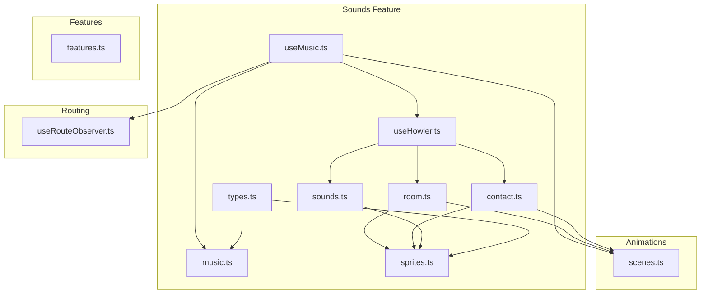
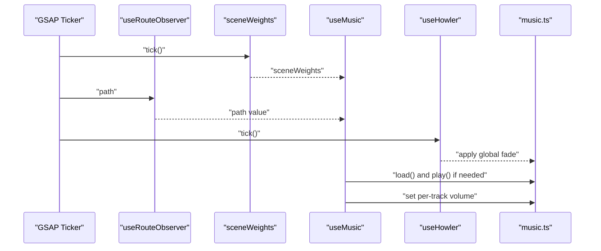
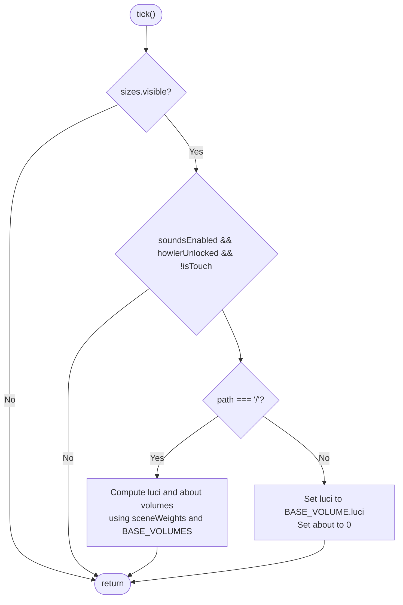
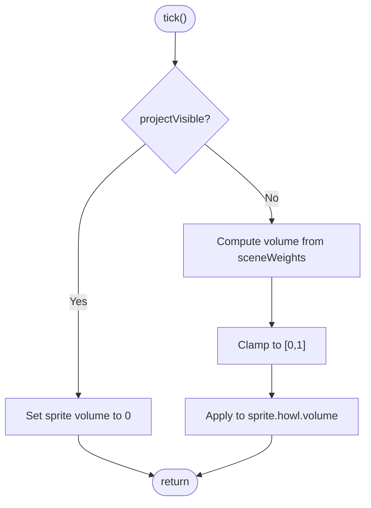
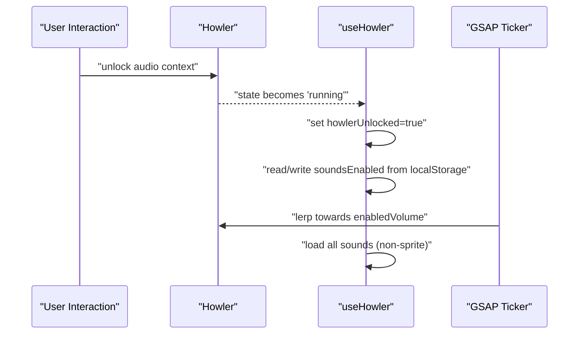
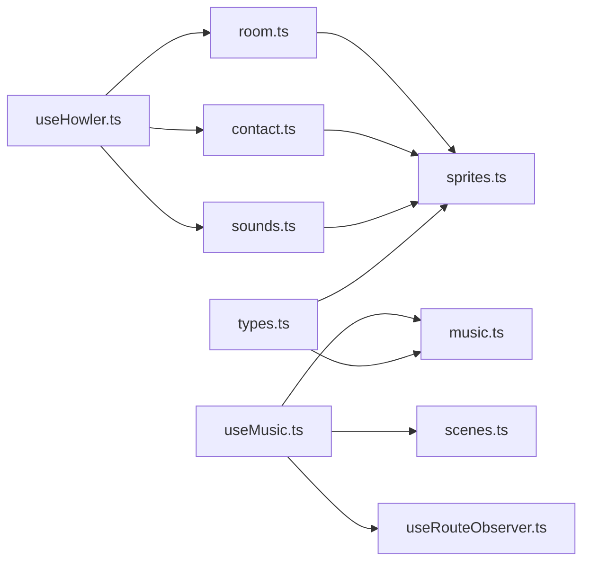

# Music Management

<cite>
**Referenced Files in This Document**
- [useMusic.ts](file://src/features/sounds/composables/useMusic.ts)
- [music.ts](file://src/features/sounds/definitions/music.ts)
- [room.ts](file://src/features/sounds/core/room.ts)
- [contact.ts](file://src/features/sounds/core/contact.ts)
- [useHowler.ts](file://src/features/sounds/composables/useHowler.ts)
- [scenes.ts](file://src/animations/scenes.ts)
- [useRouteObserver.ts](file://src/composables/useRouteObserver.ts)
- [features.ts](file://src/utils/features.ts)
- [sprites.ts](file://src/features/sounds/definitions/sprites.ts)
- [sounds.ts](file://src/features/sounds/utils/sounds.ts)
- [types.ts](file://src/features/sounds/types.ts)
</cite>

## Table of Contents
1. [Introduction](#introduction)
2. [Project Structure](#project-structure)
3. [Core Components](#core-components)
4. [Architecture Overview](#architecture-overview)
5. [Detailed Component Analysis](#detailed-component-analysis)
6. [Dependency Analysis](#dependency-analysis)
7. [Performance Considerations](#performance-considerations)
8. [Troubleshooting Guide](#troubleshooting-guide)
9. [Conclusion](#conclusion)
10. [Appendices](#appendices)

## Introduction
This document explains the music management system responsible for dynamic audio mixing and spatial positioning within the portfolio experience. It covers:
- Music track loading and automatic track selection based on scene transitions and user preferences
- Spatial audio positioning that relates music to the avatar and room environment
- Volume control with smooth fade-in/fade-out and dynamic mixing across audio layers
- Examples for adding new music tracks, configuring spatial parameters, and implementing scene transitions
- Music definitions including metadata, supported file formats, and loading priorities
- Browser autoplay policy compliance, user interaction requirements, and fallback mechanisms for audio playback failures

## Project Structure
The music system is organized under the sounds feature with composable orchestration, definitions for tracks and sprites, core tickers for spatial volumes, and shared utilities for routing and feature flags.

**Diagram sources**
- [useMusic.ts:1-63](file://src/features/sounds/composables/useMusic.ts#L1-L63)
- [music.ts:1-17](file://src/features/sounds/definitions/music.ts#L1-L17)
- [room.ts:1-10](file://src/features/sounds/core/room.ts#L1-L10)
- [contact.ts:1-42](file://src/features/sounds/core/contact.ts#L1-L42)
- [useHowler.ts:1-110](file://src/features/sounds/composables/useHowler.ts#L1-L110)
- [scenes.ts:1-59](file://src/animations/scenes.ts#L1-L59)
- [useRouteObserver.ts:1-93](file://src/composables/useRouteObserver.ts#L1-L93)
- [features.ts:1-10](file://src/utils/features.ts#L1-L10)
- [sprites.ts:1-33](file://src/features/sounds/definitions/sprites.ts#L1-L33)
- [sounds.ts:1-45](file://src/features/sounds/utils/sounds.ts#L1-L45)
- [types.ts:1-16](file://src/features/sounds/types.ts#L1-L16)

**Section sources**
- [useMusic.ts:1-63](file://src/features/sounds/composables/useMusic.ts#L1-L63)
- [music.ts:1-17](file://src/features/sounds/definitions/music.ts#L1-L17)
- [room.ts:1-10](file://src/features/sounds/core/room.ts#L1-L10)
- [contact.ts:1-42](file://src/features/sounds/core/contact.ts#L1-L42)
- [useHowler.ts:1-110](file://src/features/sounds/composables/useHowler.ts#L1-L110)
- [scenes.ts:1-59](file://src/animations/scenes.ts#L1-L59)
- [useRouteObserver.ts:1-93](file://src/composables/useRouteObserver.ts#L1-L93)
- [features.ts:1-10](file://src/utils/features.ts#L1-L10)
- [sprites.ts:1-33](file://src/features/sounds/definitions/sprites.ts#L1-L33)
- [sounds.ts:1-45](file://src/features/sounds/utils/sounds.ts#L1-L45)
- [types.ts:1-16](file://src/features/sounds/types.ts#L1-L16)

## Core Components
- Music orchestration composable: orchestrates track loading, playing, and volume mixing based on scene weights and route context.
- Music definitions: declare Howler instances for each track, base volumes, and loading behavior.
- Spatial core tickers: compute per-scene volumes for room ambient and contact snoring sprites.
- Howler manager: handles global Howler initialization, unlock via user interaction, fade-in/fade-out, and device-specific behavior.
- Scene weight engine: computes normalized visibility weights per scene to drive dynamic mixing.
- Route observer: exposes current path and project visibility to gate music behavior.
- Feature flags: centralize enabling/disabling of sounds.

Key responsibilities:
- Automatic track selection: plays both tracks on the home route; otherwise reduces the “about” track volume to zero.
- Dynamic mixing: scales track volumes using scene weights and base volumes.
- Spatial positioning: adjusts room ambient and contact snoring volumes based on scene weights and project visibility.
- Autoplay policy: defers audio until user interaction unlocks Howler, with device-specific restrictions.

**Section sources**
- [useMusic.ts:14-63](file://src/features/sounds/composables/useMusic.ts#L14-L63)
- [music.ts:8-17](file://src/features/sounds/definitions/music.ts#L8-L17)
- [room.ts:6-9](file://src/features/sounds/core/room.ts#L6-L9)
- [contact.ts:27-30](file://src/features/sounds/core/contact.ts#L27-L30)
- [useHowler.ts:20-58](file://src/features/sounds/composables/useHowler.ts#L20-L58)
- [scenes.ts:3-52](file://src/animations/scenes.ts#L3-L52)
- [useRouteObserver.ts:8-25](file://src/composables/useRouteObserver.ts#L8-L25)
- [features.ts:7-9](file://src/utils/features.ts#L7-L9)

## Architecture Overview
The music system integrates reactive scene weights, route awareness, and Howler’s global state to deliver seamless, spatially-aware audio mixing.

**Diagram sources**
- [useMusic.ts:29-41](file://src/features/sounds/composables/useMusic.ts#L29-L41)
- [music.ts:8-11](file://src/features/sounds/definitions/music.ts#L8-L11)
- [useHowler.ts:42-58](file://src/features/sounds/composables/useHowler.ts#L42-L58)
- [scenes.ts:45-52](file://src/animations/scenes.ts#L45-L52)
- [useRouteObserver.ts:8-25](file://src/composables/useRouteObserver.ts#L8-L25)

## Detailed Component Analysis

### Music Orchestration Composable
Responsibilities:
- Gate playback by feature flag, device type, and global Howler unlock state.
- On home route, mix two tracks using scene weights and base volumes.
- Elsewhere, favor the “luci” track and reduce “about” to zero.
- Manage lifecycle: register/unregister ticker and stop tracks on unmount.

Processing logic highlights:
- Route-awareness: uses current path to decide mixing strategy.
- Scene-weight-driven mixing: applies clamping to keep volumes in [0,1].
- Preloading and lazy loading: tracks are configured to preload=false and loaded on demand.

**Diagram sources**
- [useMusic.ts:17-27](file://src/features/sounds/composables/useMusic.ts#L17-L27)
- [music.ts:13-16](file://src/features/sounds/definitions/music.ts#L13-L16)
- [useRouteObserver.ts:8-25](file://src/composables/useRouteObserver.ts#L8-L25)

**Section sources**
- [useMusic.ts:14-63](file://src/features/sounds/composables/useMusic.ts#L14-L63)
- [music.ts:8-17](file://src/features/sounds/definitions/music.ts#L8-L17)

### Music Definitions
Defines Howler instances for each track, base volumes, and loading behavior:
- Tracks: “luci” and “about”
- File formats: OGG for “luci”, OGG for “about”
- Loading: preload disabled; loaded on demand via composable
- Looping: enabled for continuous background

Implementation notes:
- Exposes a readonly record of tracks and base volumes for consumers.
- Track keys are strongly typed via the MusicTrack union.

**Section sources**
- [music.ts:1-17](file://src/features/sounds/definitions/music.ts#L1-L17)
- [types.ts:5-8](file://src/features/sounds/types.ts#L5-L8)

### Spatial Audio Positioning
Room ambient and contact snoring are positioned via per-scene volumes:
- Room ambient: volume ramps up when the project is hidden and hero scene weight increases.
- Contact snoring: volume ramps up when the contact scene weight increases and the project is hidden.

Both rely on:
- Scene weights from the animation system
- Project visibility to suppress during active project routes

**Diagram sources**
- [room.ts:6-9](file://src/features/sounds/core/room.ts#L6-L9)
- [contact.ts:27-30](file://src/features/sounds/core/contact.ts#L27-L30)
- [scenes.ts:3-52](file://src/animations/scenes.ts#L3-L52)
- [useRouteObserver.ts:23-25](file://src/composables/useRouteObserver.ts#L23-L25)

**Section sources**
- [room.ts:1-10](file://src/features/sounds/core/room.ts#L1-L10)
- [contact.ts:1-42](file://src/features/sounds/core/contact.ts#L1-L42)

### Howler Manager and Autoplay Policy
Responsibilities:
- Unlock Howler on first user interaction (e.g., pointer move or audio context change).
- Device-specific behavior: disables sounds on touch devices.
- Global fade-in/fade-out using linear interpolation toward target volume.
- Load all non-sprite sounds on mount for responsive playback.
- Toggle mute on page visibility change.

Autoplay policy compliance:
- Defer audio until the audio context is unlocked.
- Disable sounds on mobile/touch devices to respect platform policies.
- Persist user preference in local storage.

**Diagram sources**
- [useHowler.ts:24-58](file://src/features/sounds/composables/useHowler.ts#L24-L58)
- [useHowler.ts:76-83](file://src/features/sounds/composables/useHowler.ts#L76-L83)

**Section sources**
- [useHowler.ts:1-110](file://src/features/sounds/composables/useHowler.ts#L1-L110)

### Scene Weight Engine
Responsibilities:
- Maintain scene weights for visibility blending.
- Normalize weights to [0,1] based on in/out progress.
- Drive dynamic mixing for music and spatial audio.

Integration:
- Consumed by music orchestration and spatial tickers to compute per-track and per-sprite volumes.

**Section sources**
- [scenes.ts:3-52](file://src/animations/scenes.ts#L3-L52)

### Route Observer
Responsibilities:
- Track current path reactively.
- Detect project routes and visibility to gate music behavior.
- Emit route-change events after history mutations.

Integration:
- Used by music orchestration to select mixing strategy based on route.

**Section sources**
- [useRouteObserver.ts:1-93](file://src/composables/useRouteObserver.ts#L1-L93)

### Sound Utilities and Sprites
Responsibilities:
- Resolve Howler instances for both direct sounds and sprite-based playback.
- Play random selections from sound pools.
- Provide unified play interface for sprite and non-sprite sounds.

Sprites definition:
- Room ambient sprites: bird, keyboard, mouse wheel variants, notification
- Contact sprites: gasp, snore

**Section sources**
- [sounds.ts:1-45](file://src/features/sounds/utils/sounds.ts#L1-L45)
- [sprites.ts:1-33](file://src/features/sounds/definitions/sprites.ts#L1-L33)
- [types.ts:10-16](file://src/features/sounds/types.ts#L10-L16)

## Dependency Analysis
High-level dependencies:
- useMusic depends on music definitions, scene weights, route observer, and Howler manager.
- Spatial tickers depend on scene weights and sprites definitions.
- useHowler depends on core tickers and sound utilities to manage global state and loading.
- Feature flags gate all sound-related behavior.

**Diagram sources**
- [useMusic.ts:1-12](file://src/features/sounds/composables/useMusic.ts#L1-L12)
- [music.ts:1-17](file://src/features/sounds/definitions/music.ts#L1-L17)
- [room.ts:1-10](file://src/features/sounds/core/room.ts#L1-L10)
- [contact.ts:1-42](file://src/features/sounds/core/contact.ts#L1-L42)
- [useHowler.ts:1-110](file://src/features/sounds/composables/useHowler.ts#L1-L110)
- [scenes.ts:1-59](file://src/animations/scenes.ts#L1-L59)
- [useRouteObserver.ts:1-93](file://src/composables/useRouteObserver.ts#L1-L93)
- [sounds.ts:1-45](file://src/features/sounds/utils/sounds.ts#L1-L45)
- [sprites.ts:1-33](file://src/features/sounds/definitions/sprites.ts#L1-L33)
- [types.ts:1-16](file://src/features/sounds/types.ts#L1-L16)

**Section sources**
- [useMusic.ts:1-12](file://src/features/sounds/composables/useMusic.ts#L1-L12)
- [music.ts:1-17](file://src/features/sounds/definitions/music.ts#L1-L17)
- [room.ts:1-10](file://src/features/sounds/core/room.ts#L1-L10)
- [contact.ts:1-42](file://src/features/sounds/core/contact.ts#L1-L42)
- [useHowler.ts:1-110](file://src/features/sounds/composables/useHowler.ts#L1-L110)
- [scenes.ts:1-59](file://src/animations/scenes.ts#L1-L59)
- [useRouteObserver.ts:1-93](file://src/composables/useRouteObserver.ts#L1-L93)
- [sounds.ts:1-45](file://src/features/sounds/utils/sounds.ts#L1-L45)
- [sprites.ts:1-33](file://src/features/sounds/definitions/sprites.ts#L1-L33)
- [types.ts:1-16](file://src/features/sounds/types.ts#L1-L16)

## Performance Considerations
- Lazy loading: Tracks are configured to preload=false and loaded on demand to minimize initial payload.
- Minimal updates: Music tick runs only when the viewport is visible and sounds are enabled.
- Efficient lerping: Global fade uses a small step coefficient to balance responsiveness and CPU usage.
- Device-aware: Touch devices disable sounds to avoid autoplay policy pitfalls and reduce overhead.
- Sprite reuse: Room and contact sprites are single Howl instances with named segments, reducing memory footprint.

[No sources needed since this section provides general guidance]

## Troubleshooting Guide
Common issues and resolutions:
- No audio after page load
  - Cause: Autoplay blocked; audio context not unlocked.
  - Resolution: Interact with the page to unlock Howler; verify soundsEnabled state and local storage persistence.
  - Section sources
    - [useHowler.ts:24-40](file://src/features/sounds/composables/useHowler.ts#L24-L40)
    - [useHowler.ts:70-74](file://src/features/sounds/composables/useHowler.ts#L70-L74)

- Music does not play on mobile devices
  - Cause: Device restriction disables sounds on touch.
  - Resolution: Confirm isTouch behavior and avoid relying on music for critical UX.
  - Section sources
    - [useHowler.ts:27-31](file://src/features/sounds/composables/useHowler.ts#L27-L31)

- Tracks do not load immediately
  - Cause: preload disabled; load invoked on demand.
  - Resolution: Call load() before play() or rely on orchestration; ensure feature flag is enabled.
  - Section sources
    - [music.ts:9-11](file://src/features/sounds/definitions/music.ts#L9-L11)
    - [useMusic.ts:35-41](file://src/features/sounds/composables/useMusic.ts#L35-L41)

- Volume feels inconsistent
  - Cause: Scene weights and base volumes combined with clamping.
  - Resolution: Adjust BASE_VOLUMES and review sceneWeights behavior.
  - Section sources
    - [useMusic.ts:17-27](file://src/features/sounds/composables/useMusic.ts#L17-L27)
    - [music.ts:13-16](file://src/features/sounds/definitions/music.ts#L13-L16)
    - [scenes.ts:3-52](file://src/animations/scenes.ts#L3-L52)

- Room or contact sounds not audible
  - Cause: Suppressed when project route is active; volume computed from scene weights.
  - Resolution: Verify projectVisible and sceneWeights for the relevant scene.
  - Section sources
    - [room.ts:6-9](file://src/features/sounds/core/room.ts#L6-L9)
    - [contact.ts:27-30](file://src/features/sounds/core/contact.ts#L27-L30)
    - [useRouteObserver.ts:23-25](file://src/composables/useRouteObserver.ts#L23-L25)

## Conclusion
The music management system combines reactive scene weights, route-aware orchestration, and a robust Howler manager to provide dynamic, spatially contextual audio. It respects browser autoplay policies, adapts to device capabilities, and offers flexible volume control and track loading. Extending the system involves adding new tracks or sprites, adjusting base volumes, and integrating new scene weights.

[No sources needed since this section summarizes without analyzing specific files]

## Appendices

### Adding a New Music Track
Steps:
- Define a new Howler instance in the music definitions with appropriate source and loop settings.
- Export the track key so it is recognized by the orchestration composable.
- Optionally adjust base volume and integrate with scene weights if needed.
- Ensure the composable attempts to load and play the track when appropriate.

References:
- [music.ts:8-11](file://src/features/sounds/definitions/music.ts#L8-L11)
- [music.ts:13-16](file://src/features/sounds/definitions/music.ts#L13-L16)
- [useMusic.ts:35-41](file://src/features/sounds/composables/useMusic.ts#L35-L41)

### Configuring Spatial Positioning Parameters
Steps:
- Determine which scene weights should influence the sprite volume.
- Set up a core ticker that reads scene weights and clamps to [0,1].
- Apply the computed volume to the sprite’s Howler instance.
- Ensure project visibility suppresses spatial audio when a project route is active.

References:
- [room.ts:6-9](file://src/features/sounds/core/room.ts#L6-L9)
- [contact.ts:27-30](file://src/features/sounds/core/contact.ts#L27-L30)
- [scenes.ts:3-52](file://src/animations/scenes.ts#L3-L52)
- [useRouteObserver.ts:23-25](file://src/composables/useRouteObserver.ts#L23-L25)

### Implementing Music Transitions Between Scenes
Guidance:
- Use scene weights to interpolate between tracks (already implemented for home route).
- For non-home routes, set secondary track volume to zero to emphasize the primary track.
- Keep base volumes tuned to prevent clipping and maintain perceived loudness balance.

References:
- [useMusic.ts:17-27](file://src/features/sounds/composables/useMusic.ts#L17-L27)
- [music.ts:13-16](file://src/features/sounds/definitions/music.ts#L13-L16)

### Music Definitions Reference
- Track keys: “luci”, “about”
- File formats: OGG for both tracks
- Looping: enabled
- Preloading: disabled; loaded on demand
- Base volumes: configurable per track

References:
- [music.ts:8-16](file://src/features/sounds/definitions/music.ts#L8-L16)

### Autoplay Policies and Fallbacks
- Unlock: Wait for audio context to become “running” before enabling sounds.
- Device behavior: Disable sounds on touch devices.
- Visibility: Mute on page hide; resume on show.
- Persistence: Store user preference in local storage.

References:
- [useHowler.ts:24-40](file://src/features/sounds/composables/useHowler.ts#L24-L40)
- [useHowler.ts:60-62](file://src/features/sounds/composables/useHowler.ts#L60-L62)
- [useHowler.ts:70-74](file://src/features/sounds/composables/useHowler.ts#L70-L74)
- [useHowler.ts:85-99](file://src/features/sounds/composables/useHowler.ts#L85-L99)