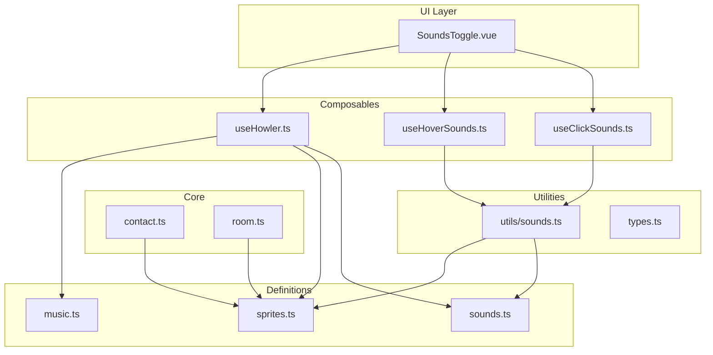
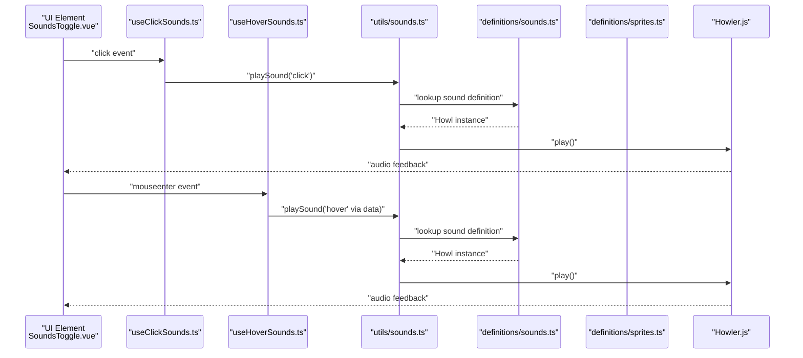
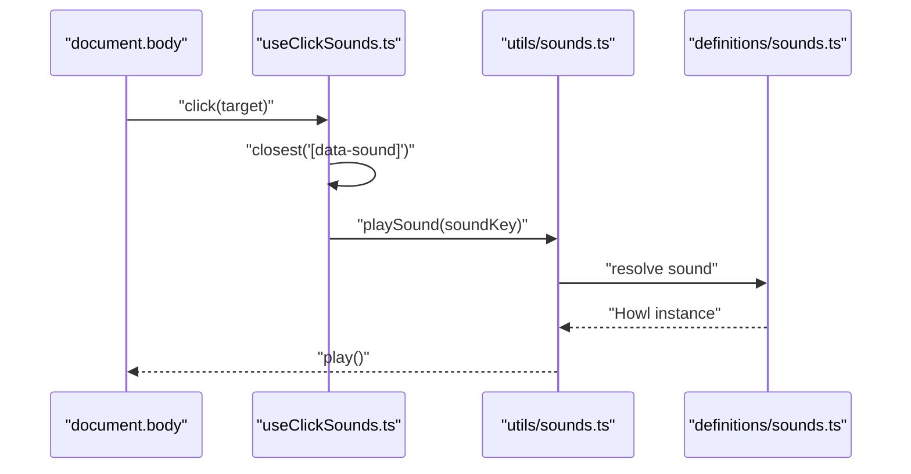
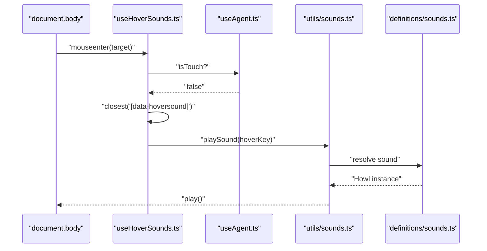
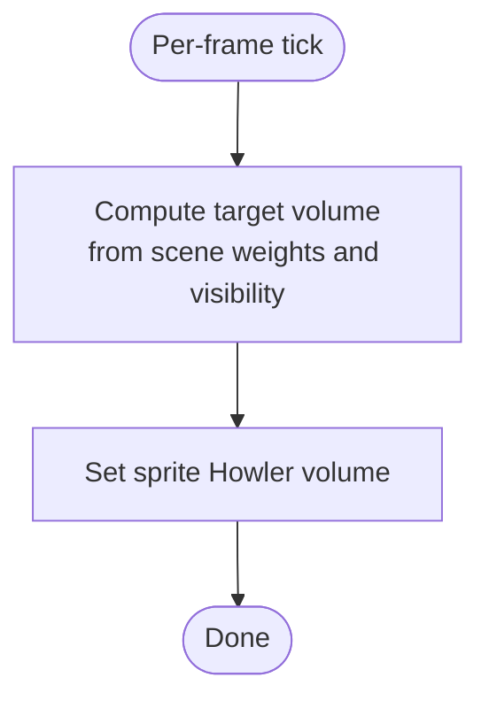
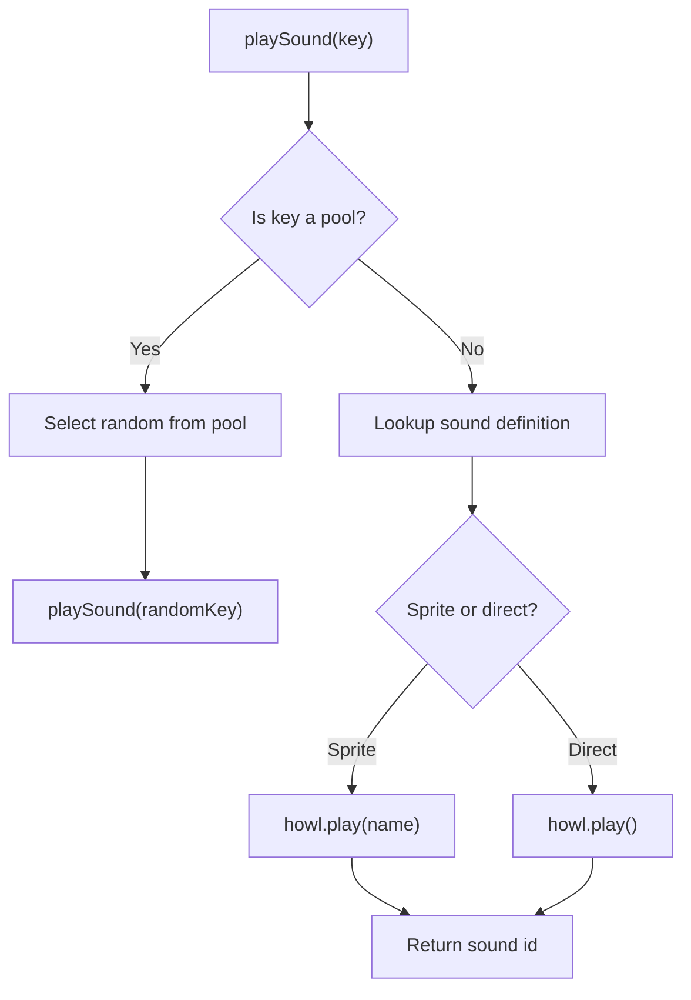
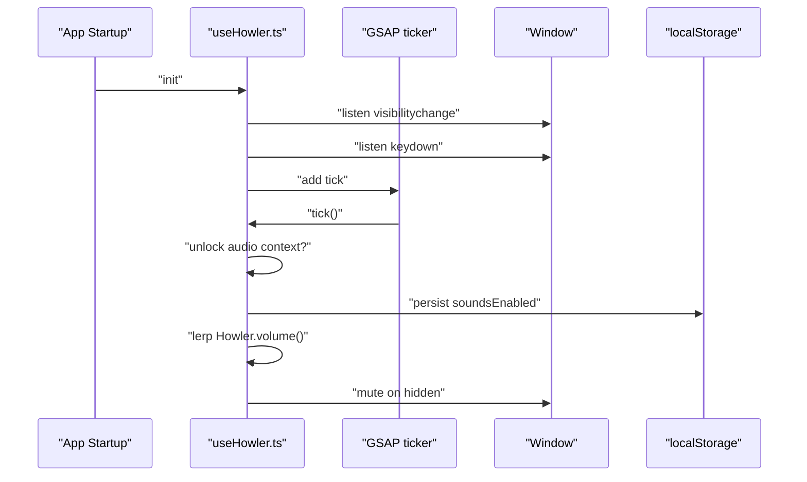
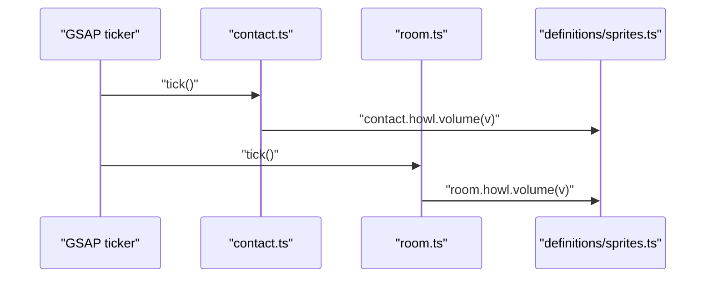
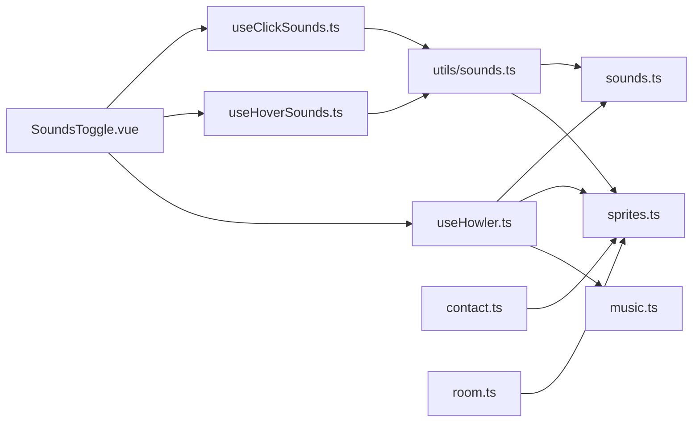

# Sound Effects

<cite>
**Referenced Files in This Document**
- [useClickSounds.ts](file://src/features/sounds/composables/useClickSounds.ts)
- [useHoverSounds.ts](file://src/features/sounds/composables/useHoverSounds.ts)
- [useHowler.ts](file://src/features/sounds/composables/useHowler.ts)
- [contact.ts](file://src/features/sounds/core/contact.ts)
- [room.ts](file://src/features/sounds/core/room.ts)
- [sounds.ts](file://src/features/sounds/definitions/sounds.ts)
- [sprites.ts](file://src/features/sounds/definitions/sprites.ts)
- [music.ts](file://src/features/sounds/definitions/music.ts)
- [sounds.ts](file://src/features/sounds/utils/sounds.ts)
- [types.ts](file://src/features/sounds/types.ts)
- [SoundsToggle.vue](file://src/components/SoundsToggle.vue)
- [useAgent.ts](file://src/composables/useAgent.ts)
- [useProjectTransition.ts](file://src/composables/useProjectTransition.ts)
- [useRouteObserver.ts](file://src/composables/useRouteObserver.ts)
- [scenes.ts](file://src/animations/scenes.ts)
- [math.ts](file://src/utils/math.ts)
- [features.ts](file://src/utils/features.ts)
- [index.html](file://index.html)
</cite>

## Table of Contents
1. [Introduction](#introduction)
2. [Project Structure](#project-structure)
3. [Core Components](#core-components)
4. [Architecture Overview](#architecture-overview)
5. [Detailed Component Analysis](#detailed-component-analysis)
6. [Dependency Analysis](#dependency-analysis)
7. [Performance Considerations](#performance-considerations)
8. [Troubleshooting Guide](#troubleshooting-guide)
9. [Conclusion](#conclusion)
10. [Appendices](#appendices)

## Introduction
This document explains the sound effects system that provides contextual audio feedback for user interactions. It covers:
- Click sound implementation for buttons, project selection, and navigation elements
- Hover sound system for interactive elements and cursor movements
- Sprite-based sound system enabling precise timing and memory-efficient playback
- How to add new sound effects, configure sprite definitions, and implement audio feedback for different UI states
- Sound effect definitions including file formats, volume levels, and trigger conditions
- Performance optimizations for frequent triggers, memory management for large audio files, and browser compatibility considerations

## Project Structure
The sound system is organized under a dedicated feature module with composable hooks, definitions, core ticking logic, utilities, and types. UI integration is provided via a toggle component.

**Diagram sources**
- [useClickSounds.ts:1-43](file://src/features/sounds/composables/useClickSounds.ts#L1-L43)
- [useHoverSounds.ts:1-49](file://src/features/sounds/composables/useHoverSounds.ts#L1-L49)
- [useHowler.ts:1-110](file://src/features/sounds/composables/useHowler.ts#L1-L110)
- [sounds.ts:1-31](file://src/features/sounds/definitions/sounds.ts#L1-L31)
- [sprites.ts:1-33](file://src/features/sounds/definitions/sprites.ts#L1-L33)
- [music.ts:1-17](file://src/features/sounds/definitions/music.ts#L1-L17)
- [contact.ts:1-42](file://src/features/sounds/core/contact.ts#L1-L42)
- [room.ts:1-10](file://src/features/sounds/core/room.ts#L1-L10)
- [sounds.ts:1-45](file://src/features/sounds/utils/sounds.ts#L1-L45)
- [types.ts:1-16](file://src/features/sounds/types.ts#L1-L16)
- [SoundsToggle.vue:1-43](file://src/components/SoundsToggle.vue#L1-L43)

**Section sources**
- [useClickSounds.ts:1-43](file://src/features/sounds/composables/useClickSounds.ts#L1-L43)
- [useHoverSounds.ts:1-49](file://src/features/sounds/composables/useHoverSounds.ts#L1-L49)
- [useHowler.ts:1-110](file://src/features/sounds/composables/useHowler.ts#L1-L110)
- [sounds.ts:1-31](file://src/features/sounds/definitions/sounds.ts#L1-L31)
- [sprites.ts:1-33](file://src/features/sounds/definitions/sprites.ts#L1-L33)
- [music.ts:1-17](file://src/features/sounds/definitions/music.ts#L1-L17)
- [contact.ts:1-42](file://src/features/sounds/core/contact.ts#L1-L42)
- [room.ts:1-10](file://src/features/sounds/core/room.ts#L1-L10)
- [sounds.ts:1-45](file://src/features/sounds/utils/sounds.ts#L1-L45)
- [types.ts:1-16](file://src/features/sounds/types.ts#L1-L16)
- [SoundsToggle.vue:1-43](file://src/components/SoundsToggle.vue#L1-L43)

## Core Components
- Event-driven sound triggers:
  - Click sounds: bound to elements with a data attribute and played on pointer clicks
  - Hover sounds: triggered on mouse enter for non-touch devices and suppressed during transitions
- Centralized sound playback:
  - Utility resolves sound definitions and plays either direct Howler instances or sprite segments
  - Supports sound pools for randomized variants
- Audio engine lifecycle:
  - Deferred initialization until audio context is unlocked
  - Device-aware toggling (touch devices disable sounds)
  - Smooth volume transitions and visibility-based muting
- Scene-aware ambient mixing:
  - Contact scene: periodic snoring with adjustable volume based on scene weights
  - Room scene: ambient tracks mixed based on scene weights and project visibility

**Section sources**
- [useClickSounds.ts:1-43](file://src/features/sounds/composables/useClickSounds.ts#L1-L43)
- [useHoverSounds.ts:1-49](file://src/features/sounds/composables/useHoverSounds.ts#L1-L49)
- [useHowler.ts:1-110](file://src/features/sounds/composables/useHowler.ts#L1-L110)
- [sounds.ts:1-45](file://src/features/sounds/utils/sounds.ts#L1-L45)
- [contact.ts:1-42](file://src/features/sounds/core/contact.ts#L1-L42)
- [room.ts:1-10](file://src/features/sounds/core/room.ts#L1-L10)

## Architecture Overview
The system integrates UI events, device detection, and audio playback through composable hooks and a central utility. Ambient scenes update per-frame volumes for sprite-based tracks.

**Diagram sources**
- [SoundsToggle.vue:1-43](file://src/components/SoundsToggle.vue#L1-L43)
- [useClickSounds.ts:1-43](file://src/features/sounds/composables/useClickSounds.ts#L1-L43)
- [useHoverSounds.ts:1-49](file://src/features/sounds/composables/useHoverSounds.ts#L1-L49)
- [sounds.ts:1-45](file://src/features/sounds/utils/sounds.ts#L1-L45)
- [sounds.ts:1-31](file://src/features/sounds/definitions/sounds.ts#L1-L31)
- [sprites.ts:1-33](file://src/features/sounds/definitions/sprites.ts#L1-L33)

## Detailed Component Analysis

### Click Sound System
- Trigger mechanism:
  - Elements declare a sound via a data attribute
  - A delegated listener captures clicks and finds the closest element with the attribute
  - Plays the mapped sound through the central utility
- Typical usage:
  - Buttons and navigation items set the data attribute to route a click to a specific sound key
- Implementation highlights:
  - Delegated event handling avoids attaching listeners to many nodes
  - Uses dataset to decouple markup from logic

**Diagram sources**
- [useClickSounds.ts:1-43](file://src/features/sounds/composables/useClickSounds.ts#L1-L43)
- [sounds.ts:1-45](file://src/features/sounds/utils/sounds.ts#L1-L45)
- [sounds.ts:1-31](file://src/features/sounds/definitions/sounds.ts#L1-L31)

**Section sources**
- [useClickSounds.ts:1-43](file://src/features/sounds/composables/useClickSounds.ts#L1-L43)
- [SoundsToggle.vue:1-43](file://src/components/SoundsToggle.vue#L1-L43)

### Hover Sound System
- Trigger mechanism:
  - Elements declare a hover sound via a data attribute
  - Mouse enter events are captured at document level
  - Skips events during transitions and on touch devices
- Device awareness:
  - Uses agent detection to avoid hover sounds on mobile/touch devices
- Implementation highlights:
  - Suppressed during transitions to prevent overlapping audio during page changes

**Diagram sources**
- [useHoverSounds.ts:1-49](file://src/features/sounds/composables/useHoverSounds.ts#L1-L49)
- [useAgent.ts](file://src/composables/useAgent.ts)
- [sounds.ts:1-45](file://src/features/sounds/utils/sounds.ts#L1-L45)
- [sounds.ts:1-31](file://src/features/sounds/definitions/sounds.ts#L1-L31)

**Section sources**
- [useHoverSounds.ts:1-49](file://src/features/sounds/composables/useHoverSounds.ts#L1-L49)
- [useProjectTransition.ts](file://src/composables/useProjectTransition.ts)

### Sprite-Based Sound System
- Purpose:
  - Precise timing and memory efficiency for ambient loops and short samples
- Definitions:
  - Tracks define sprite segments with start times and durations
  - Sounds map keys to sprite tracks and segment names
- Playback:
  - Utility resolves sprite Howl and plays a named segment
- Ambient mixing:
  - Per-tick updates adjust sprite volumes based on scene weights and visibility

**Diagram sources**
- [contact.ts:27-30](file://src/features/sounds/core/contact.ts#L27-L30)
- [room.ts:6-9](file://src/features/sounds/core/room.ts#L6-L9)

**Section sources**
- [sprites.ts:1-33](file://src/features/sounds/definitions/sprites.ts#L1-L33)
- [sounds.ts:1-31](file://src/features/sounds/definitions/sounds.ts#L1-L31)
- [contact.ts:1-42](file://src/features/sounds/core/contact.ts#L1-L42)
- [room.ts:1-10](file://src/features/sounds/core/room.ts#L1-L10)

### Central Sound Utility
- Responsibilities:
  - Resolve sound definitions (direct Howl vs sprite)
  - Play single shots and sprite segments
  - Support sound pools for randomized variants
- Behavior:
  - Respects feature flag disabling sounds
  - Returns early if sound key is unknown

**Diagram sources**
- [sounds.ts:1-45](file://src/features/sounds/utils/sounds.ts#L1-L45)
- [sounds.ts:1-31](file://src/features/sounds/definitions/sounds.ts#L1-L31)
- [types.ts:1-16](file://src/features/sounds/types.ts#L1-L16)

**Section sources**
- [sounds.ts:1-45](file://src/features/sounds/utils/sounds.ts#L1-L45)
- [types.ts:1-16](file://src/features/sounds/types.ts#L1-L16)

### Howler Engine Lifecycle and Controls
- Initialization:
  - Deferred until audio context is running
  - Touch devices disable sounds by default
- Persistence:
  - Stores user preference in local storage
- Runtime:
  - Smooth volume transitions via interpolation
  - Visibility-based muting to save battery
  - Toggle via keyboard shortcut on non-touch devices
- Loading:
  - Preloads all sounds on supported devices

**Diagram sources**
- [useHowler.ts:1-110](file://src/features/sounds/composables/useHowler.ts#L1-L110)
- [features.ts](file://src/utils/features.ts)

**Section sources**
- [useHowler.ts:1-110](file://src/features/sounds/composables/useHowler.ts#L1-L110)

### Ambient Scene Integration
- Contact scene:
  - Periodic snoring with randomized intervals
  - Volume scaled by scene weight and visibility
- Room scene:
  - Ambient tracks mixed based on hero scene weight and project visibility

**Diagram sources**
- [contact.ts:27-30](file://src/features/sounds/core/contact.ts#L27-L30)
- [room.ts:6-9](file://src/features/sounds/core/room.ts#L6-L9)
- [sprites.ts:1-33](file://src/features/sounds/definitions/sprites.ts#L1-L33)

**Section sources**
- [contact.ts:1-42](file://src/features/sounds/core/contact.ts#L1-L42)
- [room.ts:1-10](file://src/features/sounds/core/room.ts#L1-L10)

## Dependency Analysis
The sound system exhibits low coupling and clear separation of concerns:
- Composables depend on the central utility and definitions
- Core modules depend on definitions and shared utilities
- UI components integrate via data attributes and composable hooks

**Diagram sources**
- [SoundsToggle.vue:1-43](file://src/components/SoundsToggle.vue#L1-L43)
- [useClickSounds.ts:1-43](file://src/features/sounds/composables/useClickSounds.ts#L1-L43)
- [useHoverSounds.ts:1-49](file://src/features/sounds/composables/useHoverSounds.ts#L1-L49)
- [useHowler.ts:1-110](file://src/features/sounds/composables/useHowler.ts#L1-L110)
- [sounds.ts:1-45](file://src/features/sounds/utils/sounds.ts#L1-L45)
- [sounds.ts:1-31](file://src/features/sounds/definitions/sounds.ts#L1-L31)
- [sprites.ts:1-33](file://src/features/sounds/definitions/sprites.ts#L1-L33)
- [music.ts:1-17](file://src/features/sounds/definitions/music.ts#L1-L17)
- [contact.ts:1-42](file://src/features/sounds/core/contact.ts#L1-L42)
- [room.ts:1-10](file://src/features/sounds/core/room.ts#L1-L10)

**Section sources**
- [useClickSounds.ts:1-43](file://src/features/sounds/composables/useClickSounds.ts#L1-L43)
- [useHoverSounds.ts:1-49](file://src/features/sounds/composables/useHoverSounds.ts#L1-L49)
- [useHowler.ts:1-110](file://src/features/sounds/composables/useHowler.ts#L1-L110)
- [sounds.ts:1-45](file://src/features/sounds/utils/sounds.ts#L1-L45)
- [sounds.ts:1-31](file://src/features/sounds/definitions/sounds.ts#L1-L31)
- [sprites.ts:1-33](file://src/features/sounds/definitions/sprites.ts#L1-L33)
- [music.ts:1-17](file://src/features/sounds/definitions/music.ts#L1-L17)
- [contact.ts:1-42](file://src/features/sounds/core/contact.ts#L1-L42)
- [room.ts:1-10](file://src/features/sounds/core/room.ts#L1-L10)

## Performance Considerations
- Frequent triggers:
  - Use sprite-based segments for short, repeatable sounds to reduce overhead
  - Avoid playing long audio clips repeatedly; prefer shorter samples or looping segments
- Memory management:
  - Keep audio assets compressed and in multiple formats for broad codec support
  - Preload only when necessary; defer loading until after unlock to minimize initial cost
- Volume ramping:
  - Smooth transitions reduce audible pops and improve perceived quality
- Device constraints:
  - Disable sounds on touch devices to avoid accidental noise and conserve resources
- Browser compatibility:
  - Provide multiple formats (e.g., OGG and MP3) and detect support at runtime
  - Test autoplay policies and user gesture requirements across browsers

[No sources needed since this section provides general guidance]

## Troubleshooting Guide
- Sounds do not play:
  - Verify the feature flag allows sounds and the audio context is unlocked
  - Confirm the element has the correct data attribute and the sound key exists
- Hover sounds not triggering:
  - Ensure the device is not detected as touch; hover is disabled on touch devices
  - Check that transitions are not active; hover is suppressed during transitions
- Volume appears too loud or quiet:
  - Adjust per-track volumes and rely on scene-weighted mixing for ambient tracks
  - Use the global toggle to enable/disable sounds and test with muted speakers
- Sprites not playing segments:
  - Confirm the sprite name matches the definition and the segment duration is correct
  - Ensure the sprite Howl is loaded and not preloaded aggressively

**Section sources**
- [useHowler.ts:1-110](file://src/features/sounds/composables/useHowler.ts#L1-L110)
- [useHoverSounds.ts:1-49](file://src/features/sounds/composables/useHoverSounds.ts#L1-L49)
- [sounds.ts:1-45](file://src/features/sounds/utils/sounds.ts#L1-L45)
- [sprites.ts:1-33](file://src/features/sounds/definitions/sprites.ts#L1-L33)

## Conclusion
The sound effects system delivers responsive, contextual audio feedback while maintaining performance and compatibility. It leverages sprite-based playback for precision and efficiency, integrates seamlessly with UI events, and adapts dynamically to scene states and device capabilities.

[No sources needed since this section summarizes without analyzing specific files]

## Appendices

### Adding New Sound Effects
- Define the sound:
  - Add a new key to the sound definitions with either a direct Howl instance or a sprite mapping
  - For sprite-based sounds, include the sprite key and segment name
- Integrate into UI:
  - Assign the appropriate data attribute to trigger elements
  - Optionally add hover or click data attributes to map to the new sound key
- Configure sprite definitions (if applicable):
  - Extend the sprite definitions with new segment start times and durations
- Verify playback:
  - Use the central utility to resolve and play the sound key
  - Confirm that the sound plays as expected and does not conflict with existing audio

**Section sources**
- [sounds.ts:1-31](file://src/features/sounds/definitions/sounds.ts#L1-L31)
- [sprites.ts:1-33](file://src/features/sounds/definitions/sprites.ts#L1-L33)
- [sounds.ts:1-45](file://src/features/sounds/utils/sounds.ts#L1-L45)
- [SoundsToggle.vue:1-43](file://src/components/SoundsToggle.vue#L1-L43)

### Configuring Sprite Definitions
- Add sprite Howl instances with accurate segment metadata
- Map sound keys to sprite tracks and segment names
- Ensure segments are non-overlapping and cover intended playback windows
- Keep segment durations precise to avoid gaps or overlaps

**Section sources**
- [sprites.ts:1-33](file://src/features/sounds/definitions/sprites.ts#L1-L33)
- [sounds.ts:1-31](file://src/features/sounds/definitions/sounds.ts#L1-L31)

### Implementing Audio Feedback for UI States
- Click feedback:
  - Attach the click sound data attribute to actionable elements
  - Use the click composable to bind global event handling
- Hover feedback:
  - Attach the hover sound data attribute to interactive elements
  - Use the hover composable to bind global event handling with device checks
- Ambient feedback:
  - Rely on per-frame scene ticks to adjust sprite volumes
  - Use scene weights and visibility to blend ambient tracks

**Section sources**
- [useClickSounds.ts:1-43](file://src/features/sounds/composables/useClickSounds.ts#L1-L43)
- [useHoverSounds.ts:1-49](file://src/features/sounds/composables/useHoverSounds.ts#L1-L49)
- [contact.ts:1-42](file://src/features/sounds/core/contact.ts#L1-L42)
- [room.ts:1-10](file://src/features/sounds/core/room.ts#L1-L10)

### Sound Effect Definitions and Trigger Conditions
- File formats:
  - Provide multiple formats for broad codec support
  - Use compressed formats suitable for web playback
- Volume levels:
  - Set per-track volumes in definitions
  - Rely on scene-weighted mixing for ambient tracks
- Trigger conditions:
  - Click: pointer click on elements with the data attribute
  - Hover: mouse enter on non-touch devices and when transitions are inactive
  - Sprites: per-frame volume adjustments based on scene weights and visibility

**Section sources**
- [music.ts:1-17](file://src/features/sounds/definitions/music.ts#L1-L17)
- [contact.ts:27-30](file://src/features/sounds/core/contact.ts#L27-L30)
- [room.ts:6-9](file://src/features/sounds/core/room.ts#L6-L9)
- [useHoverSounds.ts:18-24](file://src/features/sounds/composables/useHoverSounds.ts#L18-L24)

### Browser Compatibility and Autoplay Policies
- Provide fallback formats to support diverse browsers
- Respect autoplay policies and user gestures
- Test on multiple devices and browsers to ensure consistent behavior

[No sources needed since this section provides general guidance]