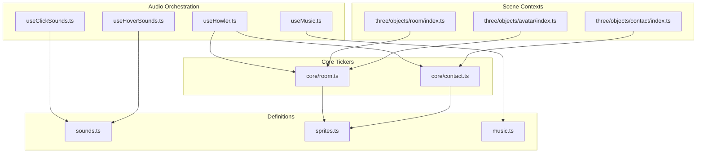
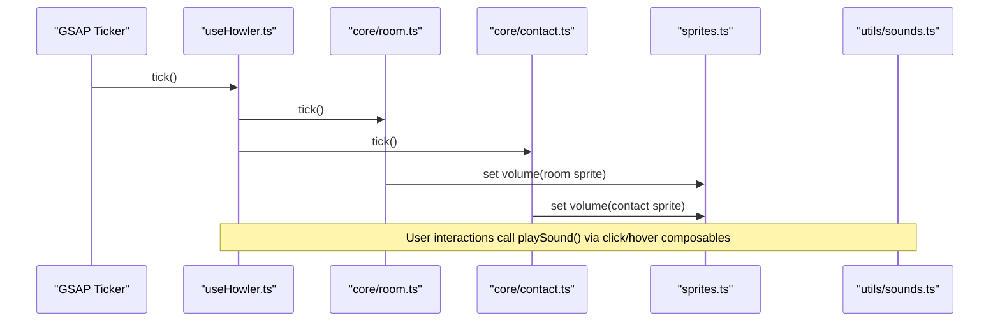
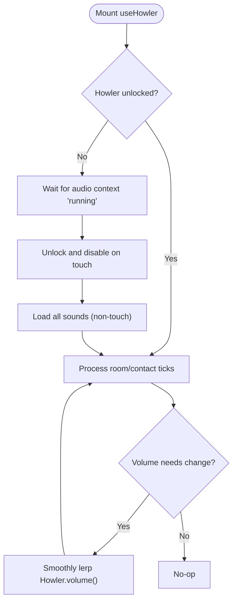
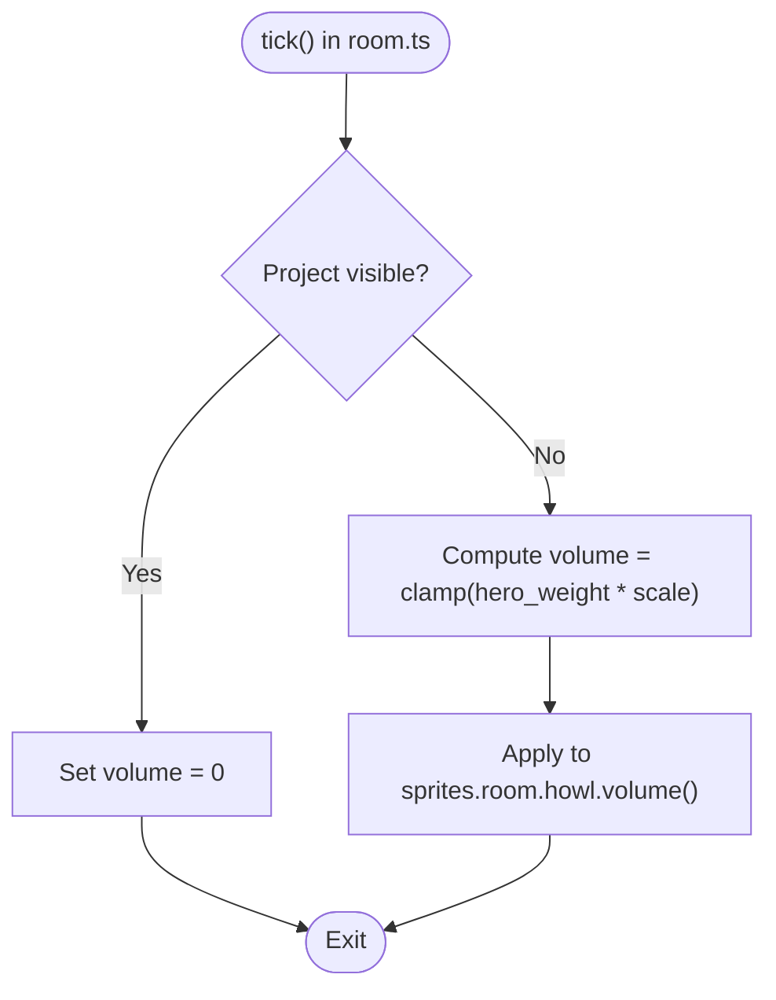
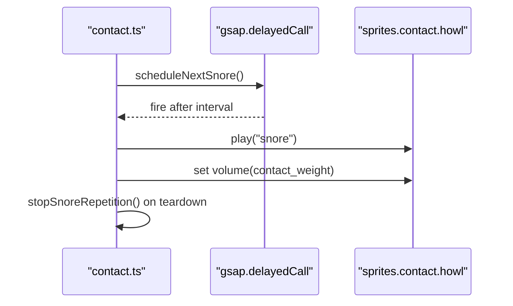
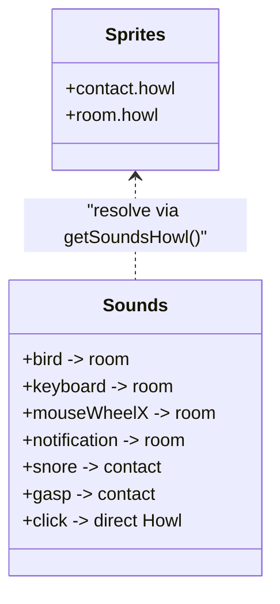
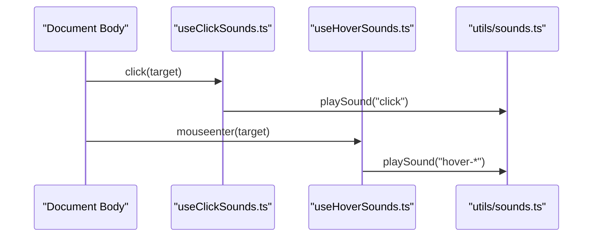
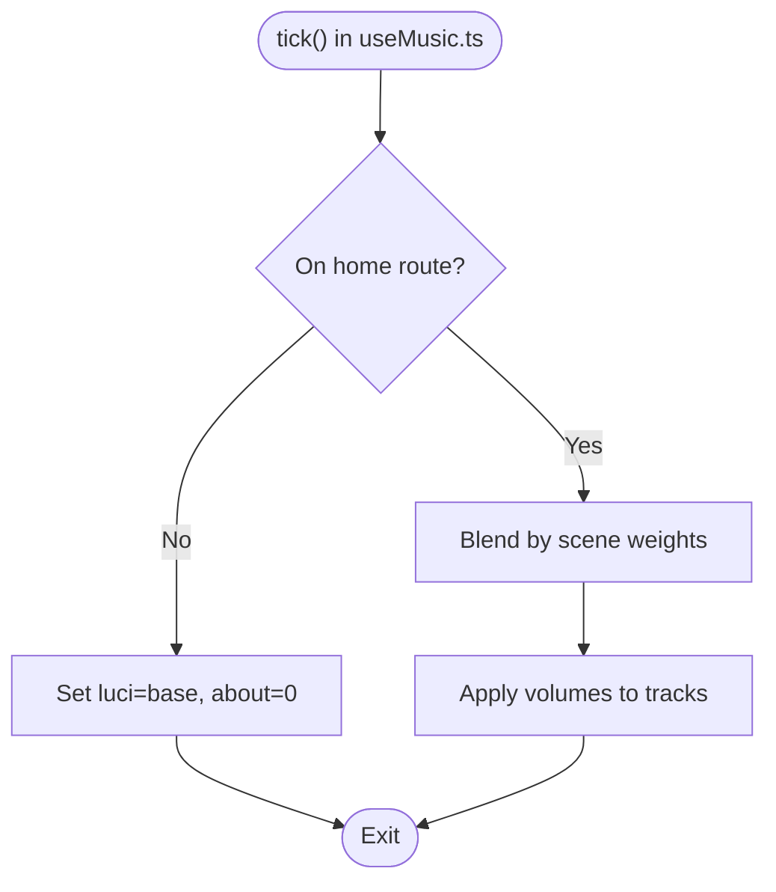
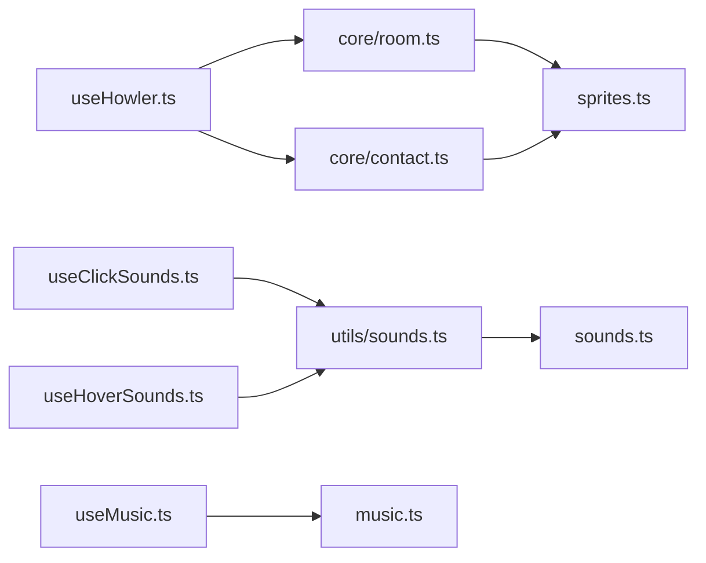

# Spatial Audio Positioning

<cite>
**Referenced Files in This Document**
- [useHowler.ts](file://src/features/sounds/composables/useHowler.ts)
- [room.ts](file://src/features/sounds/core/room.ts)
- [contact.ts](file://src/features/sounds/core/contact.ts)
- [sounds.ts](file://src/features/sounds/definitions/sounds.ts)
- [sprites.ts](file://src/features/sounds/definitions/sprites.ts)
- [music.ts](file://src/features/sounds/definitions/music.ts)
- [sounds.ts (utility)](file://src/features/sounds/utils/sounds.ts)
- [useClickSounds.ts](file://src/features/sounds/composables/useClickSounds.ts)
- [useHoverSounds.ts](file://src/features/sounds/composables/useHoverSounds.ts)
- [useMusic.ts](file://src/features/sounds/composables/useMusic.ts)
- [README.md (sounds)](file://sounds/README.md)
- [index.ts (avatar)](file://src/three/objects/avatar/index.ts)
- [index.ts (contact)](file://src/three/objects/contact/index.ts)
- [index.ts (room)](file://src/three/objects/room/index.ts)
</cite>

## Table of Contents
1. [Introduction](#introduction)
2. [Project Structure](#project-structure)
3. [Core Components](#core-components)
4. [Architecture Overview](#architecture-overview)
5. [Detailed Component Analysis](#detailed-component-analysis)
6. [Dependency Analysis](#dependency-analysis)
7. [Performance Considerations](#performance-considerations)
8. [Troubleshooting Guide](#troubleshooting-guide)
9. [Conclusion](#conclusion)
10. [Appendices](#appendices)

## Introduction
This document explains the spatial audio positioning system that powers immersive 3D audio experiences in the project. It covers:
- Howler.js integration for audio playback and sprite-based composition
- Room-based audio positioning that places sounds relative to the virtual environment and avatar character
- Contact scene audio system that provides localized sound effects for interactive elements
- Configuration of spatial audio parameters, positional audio for 3D objects, and performance optimization
- The audio listener system that tracks avatar movement and adjusts sound positioning
- Browser support for Web Audio API, fallback mechanisms for unsupported browsers, and real-time audio processing considerations

## Project Structure
The spatial audio system is organized around composables, definitions, and core tickers that orchestrate sound playback and volume envelopes per scene. Three.js scene objects define spatial contexts (room and contact), while Howler manages audio loading, sprite timing, and playback.

**Diagram sources**
- [useHowler.ts:1-110](file://src/features/sounds/composables/useHowler.ts#L1-L110)
- [useMusic.ts:1-63](file://src/features/sounds/composables/useMusic.ts#L1-L63)
- [useClickSounds.ts:1-43](file://src/features/sounds/composables/useClickSounds.ts#L1-L43)
- [useHoverSounds.ts:1-49](file://src/features/sounds/composables/useHoverSounds.ts#L1-L49)
- [room.ts:1-10](file://src/features/sounds/core/room.ts#L1-L10)
- [contact.ts:1-42](file://src/features/sounds/core/contact.ts#L1-L42)
- [sounds.ts:1-31](file://src/features/sounds/definitions/sounds.ts#L1-L31)
- [sprites.ts:1-33](file://src/features/sounds/definitions/sprites.ts#L1-L33)
- [music.ts:1-17](file://src/features/sounds/definitions/music.ts#L1-L17)
- [index.ts (avatar):1-179](file://src/three/objects/avatar/index.ts#L1-L179)
- [index.ts (room):1-111](file://src/three/objects/room/index.ts#L1-L111)
- [index.ts (contact):1-53](file://src/three/objects/contact/index.ts#L1-L53)

**Section sources**
- [useHowler.ts:1-110](file://src/features/sounds/composables/useHowler.ts#L1-L110)
- [room.ts:1-10](file://src/features/sounds/core/room.ts#L1-L10)
- [contact.ts:1-42](file://src/features/sounds/core/contact.ts#L1-L42)
- [sounds.ts:1-31](file://src/features/sounds/definitions/sounds.ts#L1-L31)
- [sprites.ts:1-33](file://src/features/sounds/definitions/sprites.ts#L1-L33)
- [music.ts:1-17](file://src/features/sounds/definitions/music.ts#L1-L17)
- [index.ts (avatar):1-179](file://src/three/objects/avatar/index.ts#L1-L179)
- [index.ts (room):1-111](file://src/three/objects/room/index.ts#L1-L111)
- [index.ts (contact):1-53](file://src/three/objects/contact/index.ts#L1-L53)

## Core Components
- useHowler: Initializes Howler, handles unlocking, device-specific behavior, global volume ramping, visibility mute, and periodic ticks for room/contact audio.
- useMusic: Manages music tracks, routes, and scene-weighted volume blending for ambient tracks.
- Room and Contact Core: Scene-dependent tickers that adjust sprite volumes based on scene weights and visibility.
- Sprite Definitions: Encapsulate sprite audio assets and precise timing for room and contact scenes.
- Sound Utilities: Resolve sound keys to Howler instances and play either direct Howls or sprite segments.
- Interaction Composables: Hook up click and hover events to trigger localized sound effects.

**Section sources**
- [useHowler.ts:1-110](file://src/features/sounds/composables/useHowler.ts#L1-L110)
- [useMusic.ts:1-63](file://src/features/sounds/composables/useMusic.ts#L1-L63)
- [room.ts:1-10](file://src/features/sounds/core/room.ts#L1-L10)
- [contact.ts:1-42](file://src/features/sounds/core/contact.ts#L1-L42)
- [sounds.ts:1-31](file://src/features/sounds/definitions/sounds.ts#L1-L31)
- [sprites.ts:1-33](file://src/features/sounds/definitions/sprites.ts#L1-L33)
- [sounds.ts (utility):1-45](file://src/features/sounds/utils/sounds.ts#L1-L45)
- [useClickSounds.ts:1-43](file://src/features/sounds/composables/useClickSounds.ts#L1-L43)
- [useHoverSounds.ts:1-49](file://src/features/sounds/composables/useHoverSounds.ts#L1-L49)

## Architecture Overview
The system integrates Howler.js with Three.js scene weights and visibility to dynamically control audio. Room and contact scenes each own a sprite Howl. A central ticker updates volumes per scene, while interaction composables trigger localized sounds. Music tracks are blended according to route and scene progress.

**Diagram sources**
- [useHowler.ts:42-58](file://src/features/sounds/composables/useHowler.ts#L42-L58)
- [room.ts:6-9](file://src/features/sounds/core/room.ts#L6-L9)
- [contact.ts:27-30](file://src/features/sounds/core/contact.ts#L27-L30)
- [sprites.ts:7-32](file://src/features/sounds/definitions/sprites.ts#L7-L32)
- [sounds.ts (utility):22-44](file://src/features/sounds/utils/sounds.ts#L22-L44)

## Detailed Component Analysis

### Howler Integration and Listener System
- Unlocking and Device Behavior: The system waits for the Web Audio context to be running, then unlocks audio and disables sounds on touch devices. A toggle persists in local storage and controls global volume ramping.
- Global Volume Control: A smooth lerp-based volume transition ensures quiet startup and seamless toggling.
- Visibility Handling: Automatically mutes when the page is hidden to save resources.
- Periodic Ticking: Non-touch devices drive room and contact tickers every frame to update sprite volumes.

**Diagram sources**
- [useHowler.ts:20-109](file://src/features/sounds/composables/useHowler.ts#L20-L109)

**Section sources**
- [useHowler.ts:18-109](file://src/features/sounds/composables/useHowler.ts#L18-L109)

### Room-Based Audio Positioning
- Scene Context: Room audio is active when the hero scene weight is significant and the project is not visible (e.g., project pages).
- Volume Envelope: The room sprite volume scales with a clamped function of the hero scene weight, scaled to avoid abrupt changes.
- Avatar Influence: The avatar’s transform and scene weights influence whether the room is visible and audible. When the avatar enters the contact scene, room audio fades out.

**Diagram sources**
- [room.ts:6-9](file://src/features/sounds/core/room.ts#L6-L9)

**Section sources**
- [room.ts:1-10](file://src/features/sounds/core/room.ts#L1-L10)
- [index.ts (avatar):132-159](file://src/three/objects/avatar/index.ts#L132-L159)

### Contact Scene Audio System
- Localized Effects: The contact scene plays a recurring snore effect at a fixed interval using a delayed tween. A stop function cancels the loop and stops playback when needed.
- Volume Envelope: The contact sprite volume scales with a clamped function of the contact scene weight, ensuring quiet fade-in/out during transitions.
- Scene Visibility: The contact scene is hidden when the project is visible, preventing overlap with other audio.

**Diagram sources**
- [contact.ts:13-41](file://src/features/sounds/core/contact.ts#L13-L41)
- [sprites.ts:8-17](file://src/features/sounds/definitions/sprites.ts#L8-L17)

**Section sources**
- [contact.ts:1-42](file://src/features/sounds/core/contact.ts#L1-L42)
- [index.ts (contact):43-45](file://src/three/objects/contact/index.ts#L43-L45)

### Sound Sprites and Configuration
- Sprite Generation: Sprite JSON and combined audio files are generated from individual MP3s. Timings are converted from seconds to milliseconds and durations computed for Howler.
- Sprite Definitions: Two sprite sets are defined: room and contact. Each includes precise start/end timings and non-looping entries.
- Public Sound Keys: Public keys map to sprite identifiers and Howl instances. Some keys resolve to sprite Howls, others to direct Howls.

**Diagram sources**
- [sprites.ts:7-32](file://src/features/sounds/definitions/sprites.ts#L7-L32)
- [sounds.ts:11-25](file://src/features/sounds/definitions/sounds.ts#L11-L25)

**Section sources**
- [README.md (sounds):1-55](file://sounds/README.md#L1-L55)
- [sprites.ts:1-33](file://src/features/sounds/definitions/sprites.ts#L1-L33)
- [sounds.ts:1-31](file://src/features/sounds/definitions/sounds.ts#L1-L31)

### Interaction-Based Audio (Click/Hover)
- Click Sounds: Elements with a data attribute trigger a click sound on click. The composable attaches a delegated event listener to the document body.
- Hover Sounds: Elements with a data attribute trigger a hover sound on mouse enter, but only when not transitioning and not on touch devices.

**Diagram sources**
- [useClickSounds.ts:22-25](file://src/features/sounds/composables/useClickSounds.ts#L22-L25)
- [useHoverSounds.ts:26-29](file://src/features/sounds/composables/useHoverSounds.ts#L26-L29)
- [sounds.ts (utility):22-44](file://src/features/sounds/utils/sounds.ts#L22-L44)

**Section sources**
- [useClickSounds.ts:1-43](file://src/features/sounds/composables/useClickSounds.ts#L1-L43)
- [useHoverSounds.ts:1-49](file://src/features/sounds/composables/useHoverSounds.ts#L1-L49)
- [sounds.ts (utility):1-45](file://src/features/sounds/utils/sounds.ts#L1-L45)

### Music System and Scene Blending
- Tracks: Two ambient tracks are defined with base volumes. They are blended according to route and scene weights.
- Route Logic: On non-home routes, one track uses base volume while the other is silenced.
- Scene Blending: On the home route, volumes are computed from scene weights to crossfade between tracks smoothly.

**Diagram sources**
- [useMusic.ts:17-27](file://src/features/sounds/composables/useMusic.ts#L17-L27)
- [music.ts:8-16](file://src/features/sounds/definitions/music.ts#L8-L16)

**Section sources**
- [useMusic.ts:1-63](file://src/features/sounds/composables/useMusic.ts#L1-L63)
- [music.ts:1-17](file://src/features/sounds/definitions/music.ts#L1-L17)

## Dependency Analysis
- Centralization: useHowler orchestrates room and contact ticks and applies global volume changes.
- Resolution: playSound resolves keys to either sprite Howls or direct Howls via getSoundsHowl.
- Scene Coupling: room.ts and contact.ts depend on scene weights and visibility to compute volumes.
- Asset Coupling: sprites.ts defines the authoritative sprite timing and Howl instances.

**Diagram sources**
- [useHowler.ts:42-58](file://src/features/sounds/composables/useHowler.ts#L42-L58)
- [room.ts:6-9](file://src/features/sounds/core/room.ts#L6-L9)
- [contact.ts:27-30](file://src/features/sounds/core/contact.ts#L27-L30)
- [sounds.ts (utility):7-13](file://src/features/sounds/utils/sounds.ts#L7-L13)
- [sounds.ts:11-25](file://src/features/sounds/definitions/sounds.ts#L11-L25)
- [useClickSounds.ts:14-20](file://src/features/sounds/composables/useClickSounds.ts#L14-L20)
- [useHoverSounds.ts:18-24](file://src/features/sounds/composables/useHoverSounds.ts#L18-L24)
- [useMusic.ts:35-49](file://src/features/sounds/composables/useMusic.ts#L35-L49)
- [music.ts:8-16](file://src/features/sounds/definitions/music.ts#L8-L16)

**Section sources**
- [useHowler.ts:1-110](file://src/features/sounds/composables/useHowler.ts#L1-L110)
- [room.ts:1-10](file://src/features/sounds/core/room.ts#L1-L10)
- [contact.ts:1-42](file://src/features/sounds/core/contact.ts#L1-L42)
- [sounds.ts (utility):1-45](file://src/features/sounds/utils/sounds.ts#L1-L45)
- [sounds.ts:1-31](file://src/features/sounds/definitions/sounds.ts#L1-L31)
- [useClickSounds.ts:1-43](file://src/features/sounds/composables/useClickSounds.ts#L1-L43)
- [useHoverSounds.ts:1-49](file://src/features/sounds/composables/useHoverSounds.ts#L1-L49)
- [useMusic.ts:1-63](file://src/features/sounds/composables/useMusic.ts#L1-L63)
- [music.ts:1-17](file://src/features/sounds/definitions/music.ts#L1-L17)

## Performance Considerations
- Preloading and Lazy Loading: Howls are configured to defer preloading; assets are loaded on demand via loaders and play calls to reduce initial memory footprint.
- Volume Ramping: Smooth volume transitions prevent audible clicks and reduce abrupt changes during scene transitions.
- Conditional Execution: Ticks and listeners are disabled on touch devices and when the tab is hidden to conserve CPU/GPU and battery.
- Sprite Efficiency: Using sprite Howls reduces the number of active Howl instances and improves memory locality for short clips.
- Scene-Based Visibility: Audio is muted when scenes are not relevant, minimizing unnecessary processing.

[No sources needed since this section provides general guidance]

## Troubleshooting Guide
- Audio does not unlock: Ensure the audio context reaches the “running” state before enabling sounds. Check for user gesture requirements in the browser.
- No sound on mobile: Touch devices automatically disable audio; this is by design. Use a desktop device or simulate pointer events if testing programmatically.
- Click/hover sounds not playing: Verify the presence of data attributes on elements and confirm that the composables are mounted and not suppressed by transitions or touch detection.
- Sprites not audible: Confirm that sprite timings are correctly converted from seconds to milliseconds and durations computed as per the sprite generation guide.
- Music not blending: Ensure the route is home and scene weights are updating; otherwise, the system defaults to base volume for the luci track and zero for the about track.

**Section sources**
- [useHowler.ts:24-40](file://src/features/sounds/composables/useHowler.ts#L24-L40)
- [useClickSounds.ts:14-20](file://src/features/sounds/composables/useClickSounds.ts#L14-L20)
- [useHoverSounds.ts:18-24](file://src/features/sounds/composables/useHoverSounds.ts#L18-L24)
- [README.md (sounds):30-55](file://sounds/README.md#L30-L55)
- [useMusic.ts:17-27](file://src/features/sounds/composables/useMusic.ts#L17-L27)

## Conclusion
The spatial audio system leverages Howler.js sprite composition and Three.js scene weights to deliver contextual, immersive audio. Room and contact scenes independently control sprite volumes, while interaction composables provide localized feedback. The design emphasizes performance, device-awareness, and maintainable sprite configuration.

[No sources needed since this section summarizes without analyzing specific files]

## Appendices

### Browser Support and Fallbacks
- Web Audio API: The system relies on Howler.js, which uses the Web Audio API under the hood. Ensure the environment supports the Web Audio context and that autoplay policies allow audio initialization after user gestures.
- Fallback Mechanisms: If the audio context fails to unlock or is blocked, the system remains idle until conditions permit. On unsupported environments, consider polyfills or feature-detection to degrade gracefully.

[No sources needed since this section provides general guidance]

### Practical Examples and Recipes
- Configure a New Sprite:
  - Place source MP3s in the appropriate sprite folder and generate the sprite with the documented command.
  - Copy the generated audio file into the assets directory and update the sprite definition with accurate timings.
  - Add a public sound key that maps to the sprite identifier.
- Add a Click/Hover Sound:
  - Attach a data attribute to the element and call the respective composable to enable event-driven playback.
- Optimize Performance:
  - Keep sprite gaps minimal to avoid bleed.
  - Use lazy loading for Howls and avoid preloading large tracks.
  - Mute off-screen or irrelevant audio using scene weights and visibility checks.

**Section sources**
- [README.md (sounds):6-29](file://sounds/README.md#L6-L29)
- [sprites.ts:18-32](file://src/features/sounds/definitions/sprites.ts#L18-L32)
- [sounds.ts:11-25](file://src/features/sounds/definitions/sounds.ts#L11-L25)
- [useClickSounds.ts:6-20](file://src/features/sounds/composables/useClickSounds.ts#L6-L20)
- [useHoverSounds.ts:8-24](file://src/features/sounds/composables/useHoverSounds.ts#L8-L24)