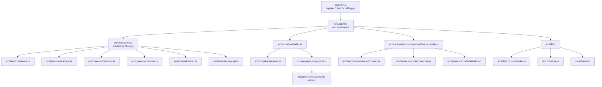
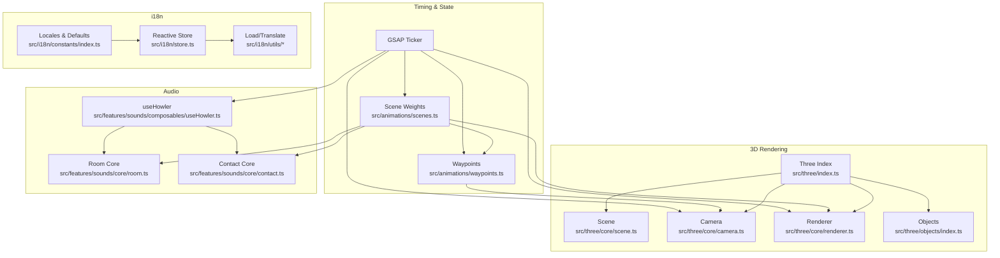
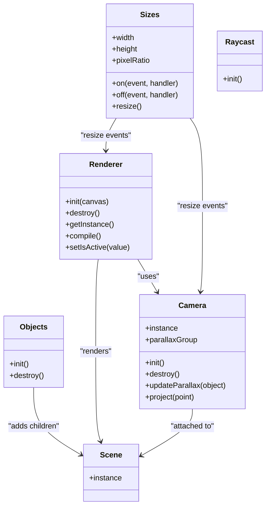
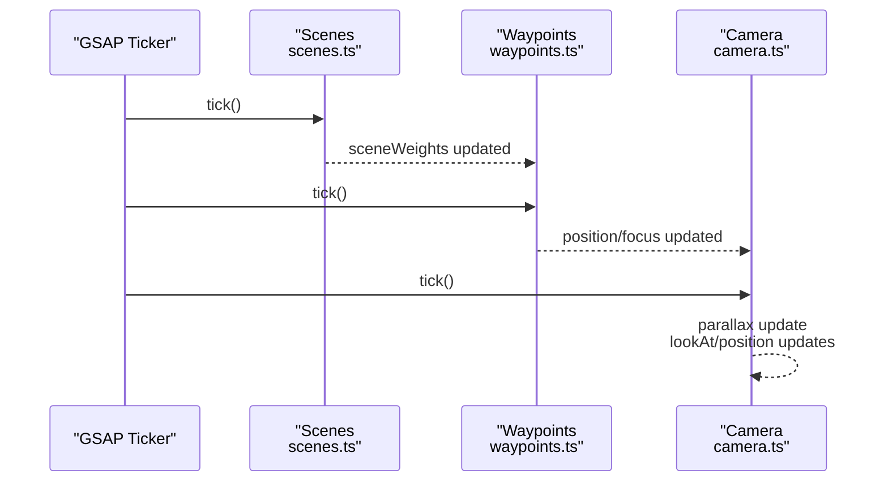
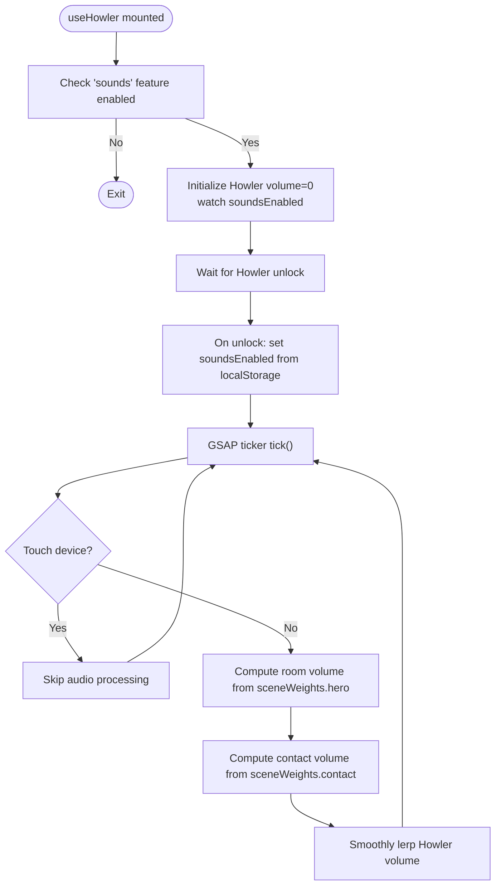
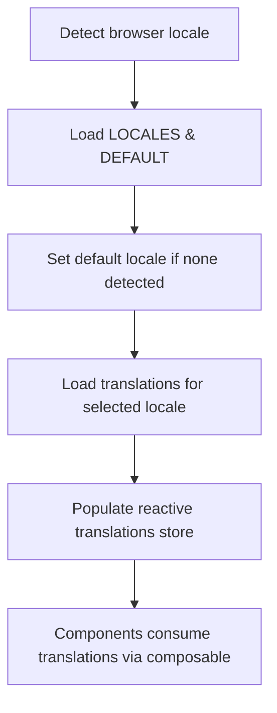
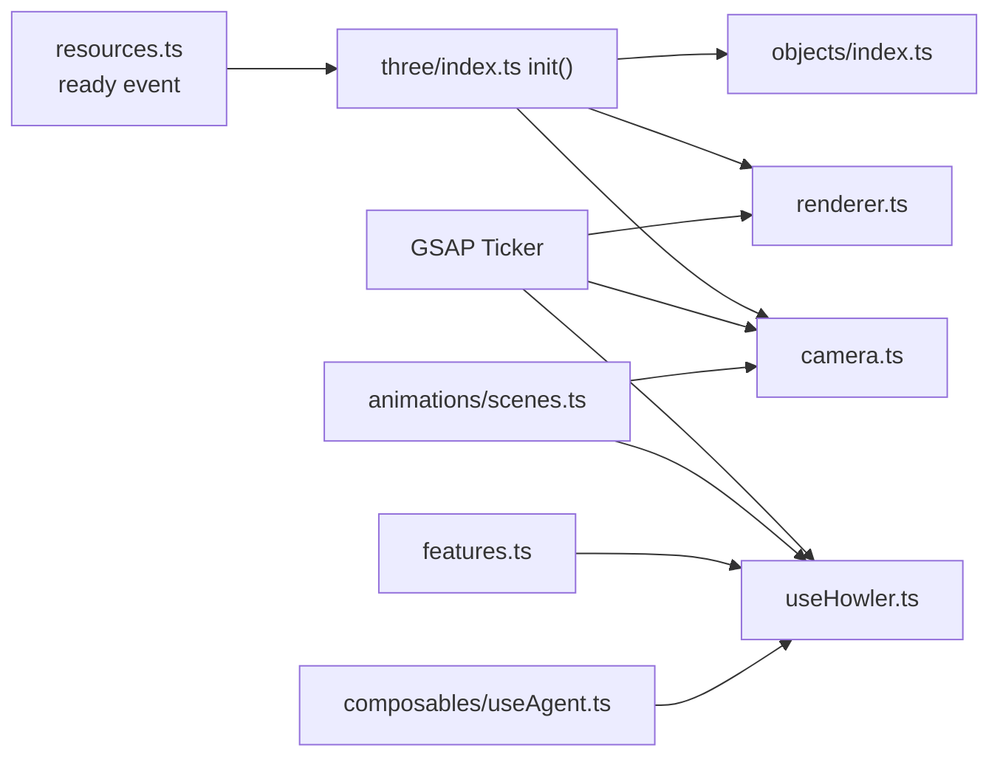

# Core Systems

<cite>
**Referenced Files in This Document**
- [src/main.ts](file://src/main.ts)
- [src/three/index.ts](file://src/three/index.ts)
- [src/three/core/scene.ts](file://src/three/core/scene.ts)
- [src/three/core/camera.ts](file://src/three/core/camera.ts)
- [src/three/core/renderer.ts](file://src/three/core/renderer.ts)
- [src/three/objects/index.ts](file://src/three/objects/index.ts)
- [src/three/utils/sizes.ts](file://src/three/utils/sizes.ts)
- [src/three/utils/raycast.ts](file://src/three/utils/raycast.ts)
- [src/three/common/materials.ts](file://src/three/common/materials.ts)
- [src/three/shaders/avatar-face/fragment.glsl](file://src/three/shaders/avatar-face/fragment.glsl)
- [src/three/shaders/avatar-face/vertex.glsl](file://src/three/shaders/avatar-face/vertex.glsl)
- [src/three/shaders/grid-floor/fragment.glsl](file://src/three/shaders/grid-floor/fragment.glsl)
- [src/three/shaders/grid-floor/vertex.glsl](file://src/three/shaders/grid-floor/vertex.glsl)
- [src/three/shaders/lab-base/fragment.glsl](file://src/three/shaders/lab-base/fragment.glsl)
- [src/three/shaders/lab-base/vertex.glsl](file://src/three/shaders/lab-base/vertex.glsl)
- [src/animations/index.ts](file://src/animations/index.ts)
- [src/animations/scenes.ts](file://src/animations/scenes.ts)
- [src/animations/waypoints.ts](file://src/animations/waypoints.ts)
- [src/animations/waypoints-data.ts](file://src/animations/waypoints-data.ts)
- [src/animations/intro.ts](file://src/animations/intro.ts)
- [src/animations/transitions/about.ts](file://src/animations/transitions/about.ts)
- [src/animations/transitions/contact.ts](file://src/animations/transitions/contact.ts)
- [src/features/sounds/composables/useHowler.ts](file://src/features/sounds/composables/useHowler.ts)
- [src/features/sounds/core/contact.ts](file://src/features/sounds/core/contact.ts)
- [src/features/sounds/core/room.ts](file://src/features/sounds/core/room.ts)
- [src/features/sounds/definitions/music.ts](file://src/features/sounds/definitions/music.ts)
- [src/features/sounds/definitions/sounds.ts](file://src/features/sounds/definitions/sounds.ts)
- [src/features/sounds/definitions/sprites.ts](file://src/features/sounds/definitions/sprites.ts)
- [src/features/sounds/utils/sounds.ts](file://src/features/sounds/utils/sounds.ts)
- [src/i18n/constants/index.ts](file://src/i18n/constants/index.ts)
- [src/i18n/store.ts](file://src/i18n/store.ts)
- [src/i18n/utils/locale.ts](file://src/i18n/utils/locale.ts)
- [src/i18n/utils/load.ts](file://src/i18n/utils/load.ts)
- [src/i18n/utils/template.ts](file://src/i18n/utils/template.ts)
- [src/i18n/utils/translate.ts](file://src/i18n/utils/translate.ts)
- [src/i18n/composables/useTranslations.ts](file://src/i18n/composables/useTranslations.ts)
- [src/App.vue](file://src/App.vue)
- [src/utils/resources.ts](file://src/utils/resources.ts)
- [src/utils/observer.ts](file://src/utils/observer.ts)
- [src/utils/math.ts](file://src/utils/math.ts)
- [src/composables/useAgent.ts](file://src/composables/useAgent.ts)
- [src/composables/useRouteObserver.ts](file://src/composables/useRouteObserver.ts)
</cite>

## Table of Contents
1. [Introduction](#introduction)
2. [Project Structure](#project-structure)
3. [Core Components](#core-components)
4. [Architecture Overview](#architecture-overview)
5. [Detailed Component Analysis](#detailed-component-analysis)
6. [Dependency Analysis](#dependency-analysis)
7. [Performance Considerations](#performance-considerations)
8. [Troubleshooting Guide](#troubleshooting-guide)
9. [Conclusion](#conclusion)
10. [Appendices](#appendices)

## Introduction
This document explains the technical foundation of Portfolio-PM’s immersive experience, focusing on four core systems:
- Three.js 3D Graphics: scene management, object hierarchy, lighting setup, materials, and shader implementation
- Animation System: GSAP-driven scroll-triggered animations, timeline management, and responsive adaptation
- Audio System: spatial positioning, music mixing, and sound effect management via Howler.js
- Internationalization (i18n): bilingual content management, locale detection, translation loading, and content organization

It also documents integration patterns among these systems and provides performance and troubleshooting guidance.

## Project Structure
The application initializes Vue, registers GSAP ScrollTrigger globally, and mounts the root app. Three.js initialization is orchestrated by a central module that wires up scene, camera, renderer, objects, render targets, sizes, and raycasting. Animations manage scene weights and waypoints, driving camera and object behavior. The audio system integrates Howler with GSAP timing and scene weights. The i18n system manages locales, translations, and reactive stores.

**Diagram sources**
- [src/main.ts:1-10](file://src/main.ts#L1-L10)
- [src/three/index.ts:1-35](file://src/three/index.ts#L1-L35)
- [src/three/core/scene.ts:1-6](file://src/three/core/scene.ts#L1-L6)
- [src/three/core/camera.ts:1-119](file://src/three/core/camera.ts#L1-L119)
- [src/three/core/renderer.ts:1-119](file://src/three/core/renderer.ts#L1-L119)
- [src/three/objects/index.ts:1-36](file://src/three/objects/index.ts#L1-L36)
- [src/three/utils/sizes.ts](file://src/three/utils/sizes.ts)
- [src/three/utils/raycast.ts](file://src/three/utils/raycast.ts)
- [src/animations/index.ts:1-30](file://src/animations/index.ts#L1-L30)
- [src/animations/scenes.ts:1-59](file://src/animations/scenes.ts#L1-L59)
- [src/animations/waypoints.ts:1-72](file://src/animations/waypoints.ts#L1-L72)
- [src/animations/waypoints-data.ts](file://src/animations/waypoints-data.ts)
- [src/features/sounds/composables/useHowler.ts:1-110](file://src/features/sounds/composables/useHowler.ts#L1-L110)
- [src/features/sounds/core/contact.ts:1-42](file://src/features/sounds/core/contact.ts#L1-L42)
- [src/features/sounds/core/room.ts:1-10](file://src/features/sounds/core/room.ts#L1-L10)
- [src/i18n/constants/index.ts:1-19](file://src/i18n/constants/index.ts#L1-L19)
- [src/i18n/store.ts:1-7](file://src/i18n/store.ts#L1-L7)
- [src/i18n/utils/locale.ts](file://src/i18n/utils/locale.ts)
- [src/i18n/utils/load.ts](file://src/i18n/utils/load.ts)
- [src/i18n/utils/template.ts](file://src/i18n/utils/template.ts)
- [src/i18n/utils/translate.ts](file://src/i18n/utils/translate.ts)
- [src/i18n/composables/useTranslations.ts](file://src/i18n/composables/useTranslations.ts)

**Section sources**
- [src/main.ts:1-10](file://src/main.ts#L1-L10)
- [src/three/index.ts:1-35](file://src/three/index.ts#L1-L35)
- [src/three/core/scene.ts:1-6](file://src/three/core/scene.ts#L1-L6)
- [src/three/core/camera.ts:1-119](file://src/three/core/camera.ts#L1-L119)
- [src/three/core/renderer.ts:1-119](file://src/three/core/renderer.ts#L1-L119)
- [src/three/objects/index.ts:1-36](file://src/three/objects/index.ts#L1-L36)
- [src/three/utils/sizes.ts](file://src/three/utils/sizes.ts)
- [src/three/utils/raycast.ts](file://src/three/utils/raycast.ts)
- [src/animations/index.ts:1-30](file://src/animations/index.ts#L1-L30)
- [src/animations/scenes.ts:1-59](file://src/animations/scenes.ts#L1-L59)
- [src/animations/waypoints.ts:1-72](file://src/animations/waypoints.ts#L1-L72)
- [src/animations/waypoints-data.ts](file://src/animations/waypoints-data.ts)
- [src/features/sounds/composables/useHowler.ts:1-110](file://src/features/sounds/composables/useHowler.ts#L1-L110)
- [src/features/sounds/core/contact.ts:1-42](file://src/features/sounds/core/contact.ts#L1-L42)
- [src/features/sounds/core/room.ts:1-10](file://src/features/sounds/core/room.ts#L1-L10)
- [src/i18n/constants/index.ts:1-19](file://src/i18n/constants/index.ts#L1-L19)
- [src/i18n/store.ts:1-7](file://src/i18n/store.ts#L1-L7)
- [src/i18n/utils/locale.ts](file://src/i18n/utils/locale.ts)
- [src/i18n/utils/load.ts](file://src/i18n/utils/load.ts)
- [src/i18n/utils/template.ts](file://src/i18n/utils/template.ts)
- [src/i18n/utils/translate.ts](file://src/i18n/utils/translate.ts)
- [src/i18n/composables/useTranslations.ts](file://src/i18n/composables/useTranslations.ts)

## Core Components
- Three.js 3D Graphics
  - Scene: single global Scene instance
  - Camera: perspective camera with parallax group, mouse movement, waypoint-driven look-at, and contact-specific transforms
  - Renderer: WebGL renderer with visibility control, pixel ratio sizing, clear color switching, and compile-time frustum culling adjustments
  - Objects: avatar, contact area, dark plane, grid floor, lab, room, and sleeping sprite modules
  - Materials and Shaders: modular GLSL vertex/fragment pairs per object type
  - Sizes and Raycasting: viewport-aware sizing and raycasting utilities
- Animation System
  - Scene weights and in/out progress tracking
  - Waypoints: weighted average of active scene positions/focuses
  - Transitions: about and contact transitions; intro sequence
- Audio System
  - Howler integration with device unlock, mute on visibility change, keyboard toggle, and GSAP-driven volume ramping
  - Room and contact audio cores adjust volumes based on scene weights and visibility
  - Sound definitions and sprite management
- Internationalization
  - Locales definition, default locale, reactive locale and translations store
  - Locale detection, translation loading, templating, and translation utilities
  - Composable for consuming translations

**Section sources**
- [src/three/core/scene.ts:1-6](file://src/three/core/scene.ts#L1-L6)
- [src/three/core/camera.ts:1-119](file://src/three/core/camera.ts#L1-L119)
- [src/three/core/renderer.ts:1-119](file://src/three/core/renderer.ts#L1-L119)
- [src/three/objects/index.ts:1-36](file://src/three/objects/index.ts#L1-L36)
- [src/three/common/materials.ts](file://src/three/common/materials.ts)
- [src/three/shaders/avatar-face/vertex.glsl](file://src/three/shaders/avatar-face/vertex.glsl)
- [src/three/shaders/avatar-face/fragment.glsl](file://src/three/shaders/avatar-face/fragment.glsl)
- [src/three/shaders/grid-floor/vertex.glsl](file://src/three/shaders/grid-floor/vertex.glsl)
- [src/three/shaders/grid-floor/fragment.glsl](file://src/three/shaders/grid-floor/fragment.glsl)
- [src/three/shaders/lab-base/vertex.glsl](file://src/three/shaders/lab-base/vertex.glsl)
- [src/three/shaders/lab-base/fragment.glsl](file://src/three/shaders/lab-base/fragment.glsl)
- [src/three/utils/sizes.ts](file://src/three/utils/sizes.ts)
- [src/three/utils/raycast.ts](file://src/three/utils/raycast.ts)
- [src/animations/index.ts:1-30](file://src/animations/index.ts#L1-L30)
- [src/animations/scenes.ts:1-59](file://src/animations/scenes.ts#L1-L59)
- [src/animations/waypoints.ts:1-72](file://src/animations/waypoints.ts#L1-L72)
- [src/animations/transitions/about.ts](file://src/animations/transitions/about.ts)
- [src/animations/transitions/contact.ts](file://src/animations/transitions/contact.ts)
- [src/animations/intro.ts](file://src/animations/intro.ts)
- [src/features/sounds/composables/useHowler.ts:1-110](file://src/features/sounds/composables/useHowler.ts#L1-L110)
- [src/features/sounds/core/contact.ts:1-42](file://src/features/sounds/core/contact.ts#L1-L42)
- [src/features/sounds/core/room.ts:1-10](file://src/features/sounds/core/room.ts#L1-L10)
- [src/features/sounds/definitions/music.ts](file://src/features/sounds/definitions/music.ts)
- [src/features/sounds/definitions/sounds.ts](file://src/features/sounds/definitions/sounds.ts)
- [src/features/sounds/definitions/sprites.ts](file://src/features/sounds/definitions/sprites.ts)
- [src/features/sounds/utils/sounds.ts](file://src/features/sounds/utils/sounds.ts)
- [src/i18n/constants/index.ts:1-19](file://src/i18n/constants/index.ts#L1-L19)
- [src/i18n/store.ts:1-7](file://src/i18n/store.ts#L1-L7)
- [src/i18n/utils/locale.ts](file://src/i18n/utils/locale.ts)
- [src/i18n/utils/load.ts](file://src/i18n/utils/load.ts)
- [src/i18n/utils/template.ts](file://src/i18n/utils/template.ts)
- [src/i18n/utils/translate.ts](file://src/i18n/utils/translate.ts)
- [src/i18n/composables/useTranslations.ts](file://src/i18n/composables/useTranslations.ts)

## Architecture Overview
The core systems integrate around a shared timing loop (GSAP ticker), scene weights, and resource readiness. Three.js renders the 3D world; animations drive camera and object states; audio reacts to scene weights and visibility; i18n supplies localized content.

**Diagram sources**
- [src/animations/scenes.ts:1-59](file://src/animations/scenes.ts#L1-L59)
- [src/animations/waypoints.ts:1-72](file://src/animations/waypoints.ts#L1-L72)
- [src/three/index.ts:1-35](file://src/three/index.ts#L1-L35)
- [src/three/core/scene.ts:1-6](file://src/three/core/scene.ts#L1-L6)
- [src/three/core/camera.ts:1-119](file://src/three/core/camera.ts#L1-L119)
- [src/three/core/renderer.ts:1-119](file://src/three/core/renderer.ts#L1-L119)
- [src/three/objects/index.ts:1-36](file://src/three/objects/index.ts#L1-L36)
- [src/features/sounds/composables/useHowler.ts:1-110](file://src/features/sounds/composables/useHowler.ts#L1-L110)
- [src/features/sounds/core/contact.ts:1-42](file://src/features/sounds/core/contact.ts#L1-L42)
- [src/features/sounds/core/room.ts:1-10](file://src/features/sounds/core/room.ts#L1-L10)
- [src/i18n/constants/index.ts:1-19](file://src/i18n/constants/index.ts#L1-L19)
- [src/i18n/store.ts:1-7](file://src/i18n/store.ts#L1-L7)
- [src/i18n/utils/locale.ts](file://src/i18n/utils/locale.ts)
- [src/i18n/utils/load.ts](file://src/i18n/utils/load.ts)
- [src/i18n/utils/template.ts](file://src/i18n/utils/template.ts)
- [src/i18n/utils/translate.ts](file://src/i18n/utils/translate.ts)

## Detailed Component Analysis

### Three.js 3D Graphics System
- Scene Management
  - Single global Scene instance is created and reused across rendering cycles.
- Object Hierarchy
  - Objects module initializes avatar, contact area, dark plane, grid floor, lab, room, and sleeping sprite, then compiles materials for optimal rendering.
- Lighting Setup
  - No explicit lights are defined in the provided files; lighting likely relies on environment or material self-emission.
- Materials and Shader Implementation
  - Materials are centralized; shaders are split into modular vertex/fragment pairs per object (e.g., avatar-face, grid-floor, lab-base).
- Render Target and Compilation
  - Renderer compiles scenes with adjusted frustum culling to ensure visibility during compilation and render target usage.

**Diagram sources**
- [src/three/core/scene.ts:1-6](file://src/three/core/scene.ts#L1-L6)
- [src/three/core/camera.ts:1-119](file://src/three/core/camera.ts#L1-L119)
- [src/three/core/renderer.ts:1-119](file://src/three/core/renderer.ts#L1-L119)
- [src/three/objects/index.ts:1-36](file://src/three/objects/index.ts#L1-L36)
- [src/three/utils/sizes.ts](file://src/three/utils/sizes.ts)
- [src/three/utils/raycast.ts](file://src/three/utils/raycast.ts)

**Section sources**
- [src/three/core/scene.ts:1-6](file://src/three/core/scene.ts#L1-L6)
- [src/three/core/camera.ts:1-119](file://src/three/core/camera.ts#L1-L119)
- [src/three/core/renderer.ts:1-119](file://src/three/core/renderer.ts#L1-L119)
- [src/three/objects/index.ts:1-36](file://src/three/objects/index.ts#L1-L36)
- [src/three/common/materials.ts](file://src/three/common/materials.ts)
- [src/three/shaders/avatar-face/vertex.glsl](file://src/three/shaders/avatar-face/vertex.glsl)
- [src/three/shaders/avatar-face/fragment.glsl](file://src/three/shaders/avatar-face/fragment.glsl)
- [src/three/shaders/grid-floor/vertex.glsl](file://src/three/shaders/grid-floor/vertex.glsl)
- [src/three/shaders/grid-floor/fragment.glsl](file://src/three/shaders/grid-floor/fragment.glsl)
- [src/three/shaders/lab-base/vertex.glsl](file://src/three/shaders/lab-base/vertex.glsl)
- [src/three/shaders/lab-base/fragment.glsl](file://src/three/shaders/lab-base/fragment.glsl)
- [src/three/utils/sizes.ts](file://src/three/utils/sizes.ts)
- [src/three/utils/raycast.ts](file://src/three/utils/raycast.ts)

### Animation System (GSAP)
- Timeline and Scroll-Trigger Integration
  - GSAP ScrollTrigger is registered globally; animations orchestrate scenes and waypoints using a shared ticker.
- Scene Weights and Waypoints
  - Scene weights represent normalized visibility per scene; waypoints compute weighted averages of positions/focus vectors based on active scenes and their weights.
- Responsive Adaptation
  - Waypoints switch between portrait and landscape configurations; camera adapts look-at and contact-specific transforms accordingly.

**Diagram sources**
- [src/animations/scenes.ts:1-59](file://src/animations/scenes.ts#L1-L59)
- [src/animations/waypoints.ts:1-72](file://src/animations/waypoints.ts#L1-L72)
- [src/three/core/camera.ts:1-119](file://src/three/core/camera.ts#L1-L119)

**Section sources**
- [src/animations/index.ts:1-30](file://src/animations/index.ts#L1-L30)
- [src/animations/scenes.ts:1-59](file://src/animations/scenes.ts#L1-L59)
- [src/animations/waypoints.ts:1-72](file://src/animations/waypoints.ts#L1-L72)
- [src/animations/waypoints-data.ts](file://src/animations/waypoints-data.ts)
- [src/animations/transitions/about.ts](file://src/animations/transitions/about.ts)
- [src/animations/transitions/contact.ts](file://src/animations/transitions/contact.ts)
- [src/animations/intro.ts](file://src/animations/intro.ts)

### Audio System (Howler.js)
- Device Unlock and Muting
  - Howler unlocks on first user interaction; visibility change mutes audio when the page is hidden.
- Volume Control and Ramping
  - GSAP ticker smoothly ramps Howler volume toward target based on user preference and device constraints.
- Spatial Positioning and Mixing
  - Room and contact audio cores adjust volumes according to scene weights and project visibility.
- Sound Loading and Sprites
  - All sounds are preloaded; sprite definitions enable precise playback and mixing.

**Diagram sources**
- [src/features/sounds/composables/useHowler.ts:1-110](file://src/features/sounds/composables/useHowler.ts#L1-L110)
- [src/features/sounds/core/room.ts:1-10](file://src/features/sounds/core/room.ts#L1-L10)
- [src/features/sounds/core/contact.ts:1-42](file://src/features/sounds/core/contact.ts#L1-L42)
- [src/features/sounds/definitions/sounds.ts](file://src/features/sounds/definitions/sounds.ts)
- [src/features/sounds/definitions/sprites.ts](file://src/features/sounds/definitions/sprites.ts)
- [src/features/sounds/utils/sounds.ts](file://src/features/sounds/utils/sounds.ts)
- [src/utils/math.ts](file://src/utils/math.ts)
- [src/composables/useAgent.ts](file://src/composables/useAgent.ts)
- [src/composables/useRouteObserver.ts](file://src/composables/useRouteObserver.ts)

**Section sources**
- [src/features/sounds/composables/useHowler.ts:1-110](file://src/features/sounds/composables/useHowler.ts#L1-L110)
- [src/features/sounds/core/room.ts:1-10](file://src/features/sounds/core/room.ts#L1-L10)
- [src/features/sounds/core/contact.ts:1-42](file://src/features/sounds/core/contact.ts#L1-L42)
- [src/features/sounds/definitions/music.ts](file://src/features/sounds/definitions/music.ts)
- [src/features/sounds/definitions/sounds.ts](file://src/features/sounds/definitions/sounds.ts)
- [src/features/sounds/definitions/sprites.ts](file://src/features/sounds/definitions/sprites.ts)
- [src/features/sounds/utils/sounds.ts](file://src/features/sounds/utils/sounds.ts)
- [src/utils/math.ts](file://src/utils/math.ts)
- [src/composables/useAgent.ts](file://src/composables/useAgent.ts)
- [src/composables/useRouteObserver.ts](file://src/composables/useRouteObserver.ts)

### Internationalization System
- Locale Detection and Defaults
  - Locales enumeration and default locale are defined centrally.
- Translation Loading and Content Organization
  - Reactive locale and translations store; utilities for loading, templating, and translating content.
- Composable Integration
  - Composable exposes translation keys and reactive state for UI components.

**Diagram sources**
- [src/i18n/constants/index.ts:1-19](file://src/i18n/constants/index.ts#L1-L19)
- [src/i18n/store.ts:1-7](file://src/i18n/store.ts#L1-L7)
- [src/i18n/utils/locale.ts](file://src/i18n/utils/locale.ts)
- [src/i18n/utils/load.ts](file://src/i18n/utils/load.ts)
- [src/i18n/utils/template.ts](file://src/i18n/utils/template.ts)
- [src/i18n/utils/translate.ts](file://src/i18n/utils/translate.ts)
- [src/i18n/composables/useTranslations.ts](file://src/i18n/composables/useTranslations.ts)

**Section sources**
- [src/i18n/constants/index.ts:1-19](file://src/i18n/constants/index.ts#L1-L19)
- [src/i18n/store.ts:1-7](file://src/i18n/store.ts#L1-L7)
- [src/i18n/utils/locale.ts](file://src/i18n/utils/locale.ts)
- [src/i18n/utils/load.ts](file://src/i18n/utils/load.ts)
- [src/i18n/utils/template.ts](file://src/i18n/utils/template.ts)
- [src/i18n/utils/translate.ts](file://src/i18n/utils/translate.ts)
- [src/i18n/composables/useTranslations.ts](file://src/i18n/composables/useTranslations.ts)

## Dependency Analysis
- Timing Coupling
  - GSAP ticker underpins camera updates, renderer visibility, audio volume ramping, and scene weight computation.
- Resource Readiness
  - Three.js initialization waits for resource readiness to ensure geometry/textures are loaded before compiling and rendering.
- Feature Flags
  - Audio system respects a feature flag and disables on touch devices while honoring user preferences.

**Diagram sources**
- [src/utils/resources.ts](file://src/utils/resources.ts)
- [src/three/index.ts:1-35](file://src/three/index.ts#L1-L35)
- [src/three/core/camera.ts:1-119](file://src/three/core/camera.ts#L1-L119)
- [src/three/core/renderer.ts:1-119](file://src/three/core/renderer.ts#L1-L119)
- [src/three/objects/index.ts:1-36](file://src/three/objects/index.ts#L1-L36)
- [src/animations/scenes.ts:1-59](file://src/animations/scenes.ts#L1-L59)
- [src/features/sounds/composables/useHowler.ts:1-110](file://src/features/sounds/composables/useHowler.ts#L1-L110)
- [src/composables/useAgent.ts](file://src/composables/useAgent.ts)
- [src/utils/features.ts](file://src/utils/features.ts)

**Section sources**
- [src/utils/resources.ts](file://src/utils/resources.ts)
- [src/three/index.ts:1-35](file://src/three/index.ts#L1-L35)
- [src/three/core/camera.ts:1-119](file://src/three/core/camera.ts#L1-L119)
- [src/three/core/renderer.ts:1-119](file://src/three/core/renderer.ts#L1-L119)
- [src/three/objects/index.ts:1-36](file://src/three/objects/index.ts#L1-L36)
- [src/animations/scenes.ts:1-59](file://src/animations/scenes.ts#L1-L59)
- [src/features/sounds/composables/useHowler.ts:1-110](file://src/features/sounds/composables/useHowler.ts#L1-L110)
- [src/composables/useAgent.ts](file://src/composables/useAgent.ts)
- [src/utils/features.ts](file://src/utils/features.ts)

## Performance Considerations
- Three.js
  - Frustum culling disabled during compile to guarantee shader compilation; re-enabled afterward to maintain performance.
  - Visibility toggled to avoid rendering when camera is uninitialized or inactive.
  - Pixel ratio and size updates occur only on resize events.
- Animation
  - Weighted averages computed on each tick; caching of active points reduces repeated filtering.
  - Parallax damping uses delta time to stabilize motion across frame rates.
- Audio
  - Preloading all sounds avoids runtime stalls; smooth volume lerping prevents audible clicks.
  - Device-specific disabling on touch devices to conserve battery and avoid autoplay restrictions.
- i18n
  - Reactive stores minimize DOM churn; template interpolation supports efficient rendering.

[No sources needed since this section provides general guidance]

## Troubleshooting Guide
- Three.js
  - Renderer not initialized: check canvas assignment and resource readiness before initialization.
  - Objects not visible: verify compile pass and frustum culling restoration after compilation.
  - Camera jitter: confirm parallax damping thresholds and delta ratio usage.
- Animation
  - Waypoints incorrect: inspect active scene weights and viewport-dependent point selection.
  - Transition glitches: review scene weights in/out progression and weighted average normalization.
- Audio
  - No sound after unlock: ensure Howler unlock callback sets enabled state and localStorage sync.
  - Volume not changing: verify scene weights and visibility gating; confirm GSAP ticker is active.
  - Touch device issues: confirm feature flag and agent detection logic.
- i18n
  - Missing translations: verify locale detection and translation loading pipeline.
  - Reactive updates not applied: ensure reactive store updates and composable consumption.

**Section sources**
- [src/three/core/renderer.ts:1-119](file://src/three/core/renderer.ts#L1-L119)
- [src/three/core/camera.ts:1-119](file://src/three/core/camera.ts#L1-L119)
- [src/animations/scenes.ts:1-59](file://src/animations/scenes.ts#L1-L59)
- [src/animations/waypoints.ts:1-72](file://src/animations/waypoints.ts#L1-L72)
- [src/features/sounds/composables/useHowler.ts:1-110](file://src/features/sounds/composables/useHowler.ts#L1-L110)
- [src/i18n/store.ts:1-7](file://src/i18n/store.ts#L1-L7)
- [src/i18n/utils/load.ts](file://src/i18n/utils/load.ts)

## Conclusion
Portfolio-PM’s immersive experience emerges from tight integration across Three.js rendering, GSAP-driven animations, Howler.js audio, and i18n localization. The systems share a common timing loop and scene-weighted state, enabling responsive, performant, and coherent interactions. Proper initialization order, resource readiness, and feature-aware behavior ensure robust operation across devices and languages.

[No sources needed since this section summarizes without analyzing specific files]

## Appendices
- Initialization Checklist
  - Register GSAP ScrollTrigger in main entry
  - Initialize Three.js after resource readiness
  - Start animations and transitions
  - Initialize audio composable and apply feature flags
  - Detect and load i18n locale and translations

[No sources needed since this section provides general guidance]