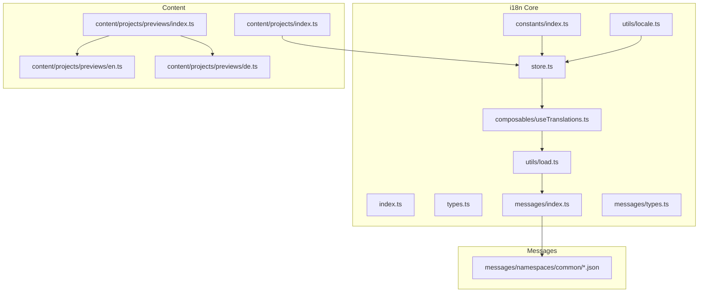
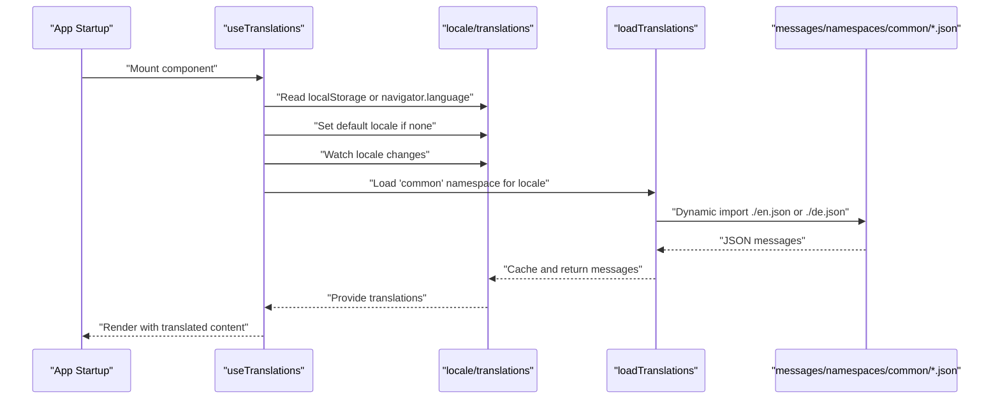
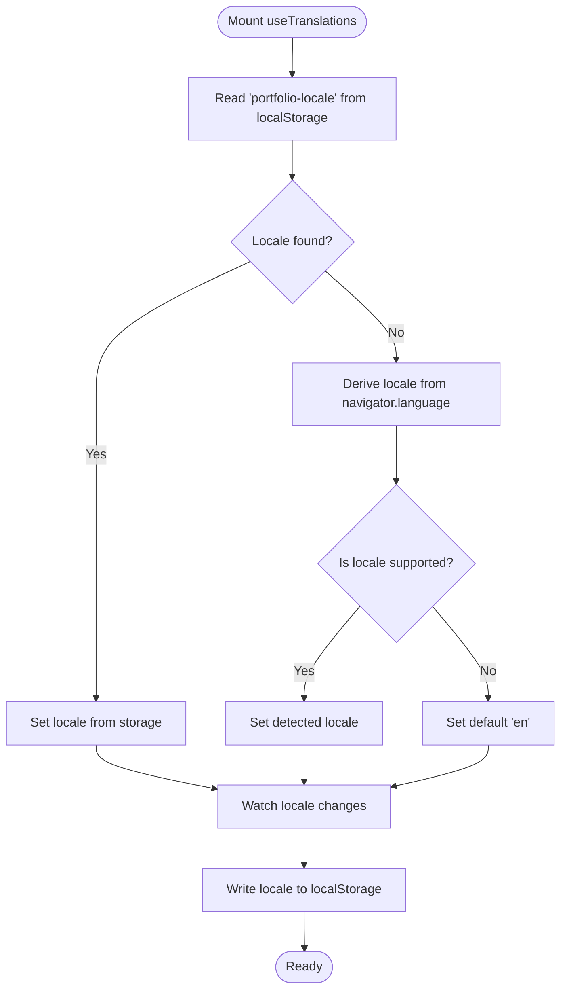
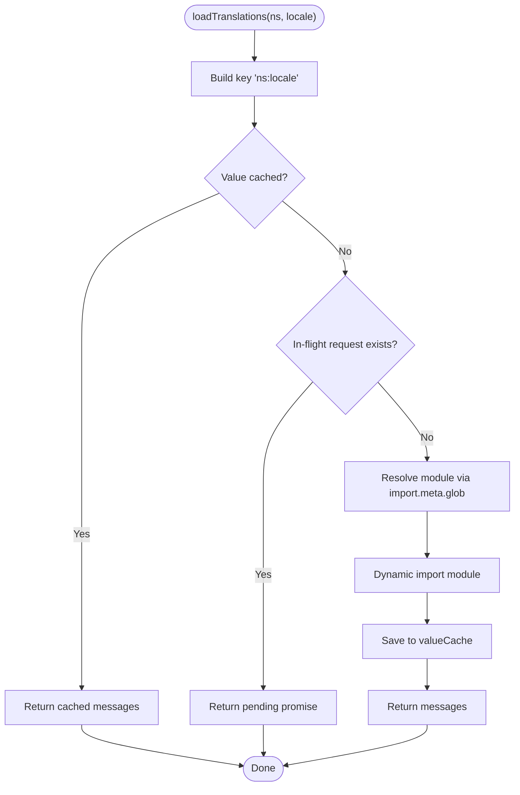
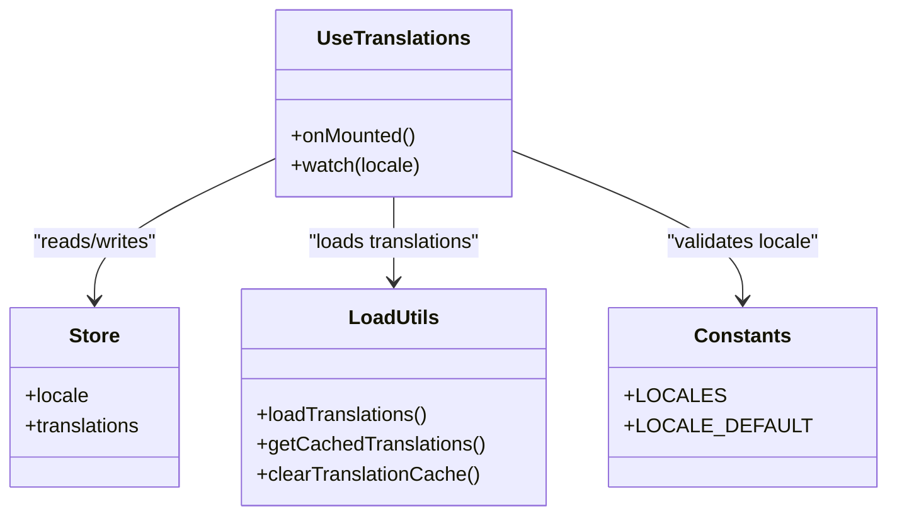
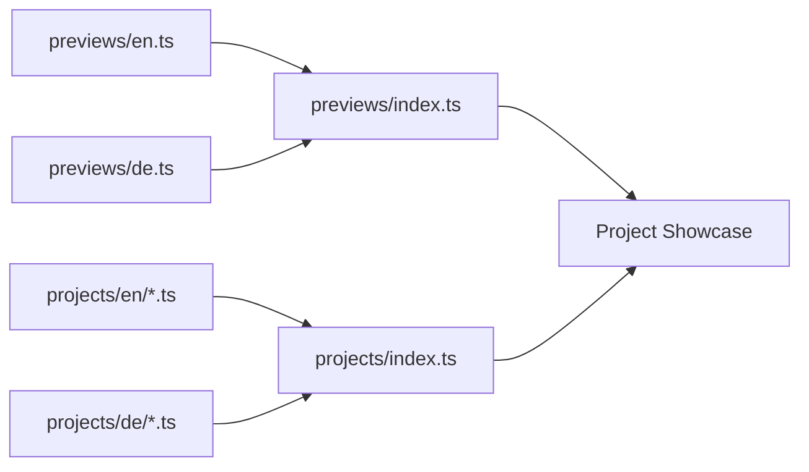
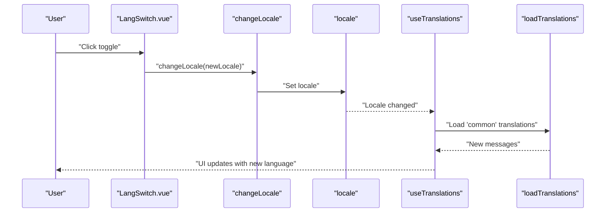
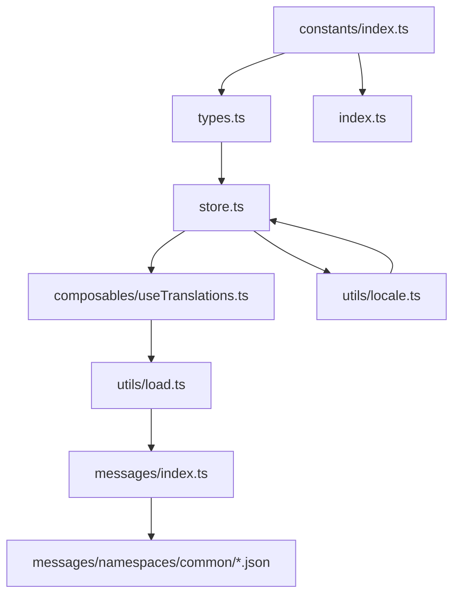

# Internationalization System

<cite>
**Referenced Files in This Document**
- [src/i18n/index.ts](file://src/i18n/index.ts)
- [src/i18n/store.ts](file://src/i18n/store.ts)
- [src/i18n/composables/useTranslations.ts](file://src/i18n/composables/useTranslations.ts)
- [src/i18n/utils/locale.ts](file://src/i18n/utils/locale.ts)
- [src/i18n/utils/load.ts](file://src/i18n/utils/load.ts)
- [src/i18n/constants/index.ts](file://src/i18n/constants/index.ts)
- [src/i18n/messages/index.ts](file://src/i18n/messages/index.ts)
- [src/i18n/messages/types.ts](file://src/i18n/messages/types.ts)
- [src/i18n/types.ts](file://src/i18n/types.ts)
- [src/i18n/messages/namespaces/common/en.json](file://src/i18n/messages/namespaces/common/en.json)
- [src/i18n/messages/namespaces/common/de.json](file://src/i18n/messages/namespaces/common/de.json)
- [src/content/projects/index.ts](file://src/content/projects/index.ts)
- [src/content/projects/previews/index.ts](file://src/content/projects/previews/index.ts)
- [src/content/projects/previews/en.ts](file://src/content/projects/previews/en.ts)
- [src/content/projects/previews/de.ts](file://src/content/projects/previews/de.ts)
- [src/components/LangSwitch.vue](file://src/components/LangSwitch.vue)
</cite>

## Table of Contents
1. [Introduction](#introduction)
2. [Project Structure](#project-structure)
3. [Core Components](#core-components)
4. [Architecture Overview](#architecture-overview)
5. [Detailed Component Analysis](#detailed-component-analysis)
6. [Dependency Analysis](#dependency-analysis)
7. [Performance Considerations](#performance-considerations)
8. [Troubleshooting Guide](#troubleshooting-guide)
9. [Conclusion](#conclusion)
10. [Appendices](#appendices)

## Introduction
This document describes the internationalization (i18n) system used to manage bilingual content (English and German) across Portfolio-PM. It covers locale detection and persistence, translation loading and caching, content organization for multilingual projects, and the translation composable architecture. It also explains how translations integrate with the project showcase system, how dynamic content switching works, and how to extend the system to support additional languages. Guidance is included for pluralization, date formatting, content synchronization across languages, and performance optimization.

## Project Structure
The i18n system is organized around:
- Constants defining supported locales and defaults
- A reactive store for current locale and loaded translations
- A composable to initialize and watch locale changes
- Utility functions for loading and caching translations
- Message bundles grouped by namespace and locale
- Content modules for projects and previews organized per locale

**Diagram sources**
- [src/i18n/constants/index.ts:1-19](file://src/i18n/constants/index.ts#L1-L19)
- [src/i18n/store.ts:1-7](file://src/i18n/store.ts#L1-L7)
- [src/i18n/index.ts:1-1](file://src/i18n/index.ts#L1-L1)
- [src/i18n/types.ts:1-4](file://src/i18n/types.ts#L1-L4)
- [src/i18n/messages/index.ts:1-4](file://src/i18n/messages/index.ts#L1-L4)
- [src/i18n/messages/types.ts:1-4](file://src/i18n/messages/types.ts#L1-L4)
- [src/i18n/utils/load.ts:1-77](file://src/i18n/utils/load.ts#L1-L77)
- [src/i18n/utils/locale.ts:1-8](file://src/i18n/utils/locale.ts#L1-L8)
- [src/i18n/composables/useTranslations.ts:1-37](file://src/i18n/composables/useTranslations.ts#L1-L37)
- [src/i18n/messages/namespaces/common/en.json:1-45](file://src/i18n/messages/namespaces/common/en.json#L1-L45)
- [src/i18n/messages/namespaces/common/de.json:1-45](file://src/i18n/messages/namespaces/common/de.json#L1-L45)
- [src/content/projects/previews/index.ts:1-5](file://src/content/projects/previews/index.ts#L1-L5)
- [src/content/projects/previews/en.ts:1-47](file://src/content/projects/previews/en.ts#L1-L47)
- [src/content/projects/previews/de.ts:1-54](file://src/content/projects/previews/de.ts#L1-L54)
- [src/content/projects/index.ts:1-18](file://src/content/projects/index.ts#L1-L18)

**Section sources**
- [src/i18n/constants/index.ts:1-19](file://src/i18n/constants/index.ts#L1-L19)
- [src/i18n/store.ts:1-7](file://src/i18n/store.ts#L1-L7)
- [src/i18n/composables/useTranslations.ts:1-37](file://src/i18n/composables/useTranslations.ts#L1-L37)
- [src/i18n/utils/load.ts:1-77](file://src/i18n/utils/load.ts#L1-L77)
- [src/i18n/messages/index.ts:1-4](file://src/i18n/messages/index.ts#L1-L4)
- [src/content/projects/previews/index.ts:1-5](file://src/content/projects/previews/index.ts#L1-L5)
- [src/content/projects/index.ts:1-18](file://src/content/projects/index.ts#L1-L18)

## Core Components
- Locale constants and default: Define supported locales and default fallback.
- Reactive store: Holds the current locale and loaded translations.
- Composable: Initializes locale from persisted storage or browser preference, watches for changes, and loads translations.
- Load utilities: Dynamic imports of JSON messages with in-memory and in-flight deduplication caches.
- Locale utility: Exposes a method to switch locale reactively.
- Message namespaces: Grouped by logical domains (e.g., common) with per-locale JSON files.
- Content organization: Projects and previews are organized per locale for localized metadata and descriptions.

Key responsibilities:
- Locale detection: Reads from localStorage on mount; falls back to navigator language; defaults to English if unknown.
- Persistence: Writes selected locale to localStorage on change.
- Translation loading: Loads a namespace for the current locale via dynamic imports and caches results.
- Caching: Prevents redundant fetches using valueCache and inflight tracking.
- Switching: Reactively updates translations when locale changes.

**Section sources**
- [src/i18n/constants/index.ts:1-19](file://src/i18n/constants/index.ts#L1-L19)
- [src/i18n/store.ts:1-7](file://src/i18n/store.ts#L1-L7)
- [src/i18n/composables/useTranslations.ts:1-37](file://src/i18n/composables/useTranslations.ts#L1-L37)
- [src/i18n/utils/locale.ts:1-8](file://src/i18n/utils/locale.ts#L1-L8)
- [src/i18n/utils/load.ts:1-77](file://src/i18n/utils/load.ts#L1-L77)
- [src/i18n/messages/namespaces/common/en.json:1-45](file://src/i18n/messages/namespaces/common/en.json#L1-L45)
- [src/i18n/messages/namespaces/common/de.json:1-45](file://src/i18n/messages/namespaces/common/de.json#L1-L45)

## Architecture Overview
The i18n architecture centers on a composable that initializes the locale, persists it, and loads translations for the “common” namespace. The loader uses Vite’s import.meta.glob to resolve per-locale JSON files and applies caching to avoid repeated network or module loads.

**Diagram sources**
- [src/i18n/composables/useTranslations.ts:1-37](file://src/i18n/composables/useTranslations.ts#L1-L37)
- [src/i18n/utils/load.ts:1-77](file://src/i18n/utils/load.ts#L1-L77)
- [src/i18n/messages/namespaces/common/en.json:1-45](file://src/i18n/messages/namespaces/common/en.json#L1-L45)
- [src/i18n/messages/namespaces/common/de.json:1-45](file://src/i18n/messages/namespaces/common/de.json#L1-L45)

## Detailed Component Analysis

### Locale Detection and Storage
- Initialization: On mount, reads the stored locale from localStorage. If absent, derives the preferred locale from navigator.language and validates against supported locales. Defaults to English if unknown.
- Persistence: Watches the locale and writes it to localStorage whenever it changes.
- Switching: A dedicated utility updates the reactive locale, triggering re-loading of translations.

**Diagram sources**
- [src/i18n/composables/useTranslations.ts:10-21](file://src/i18n/composables/useTranslations.ts#L10-L21)
- [src/i18n/utils/locale.ts:5-7](file://src/i18n/utils/locale.ts#L5-L7)

**Section sources**
- [src/i18n/composables/useTranslations.ts:1-37](file://src/i18n/composables/useTranslations.ts#L1-L37)
- [src/i18n/utils/locale.ts:1-8](file://src/i18n/utils/locale.ts#L1-L8)

### Translation Loading and Caching Strategies
- Namespace-based loading: Uses import.meta.glob to resolve per-locale JSON files under a namespace directory.
- Caching:
  - Value cache: Stores previously loaded messages keyed by namespace and locale.
  - In-flight deduplication: Tracks ongoing loads to prevent concurrent requests for the same key.
- Error handling: Logs errors during load and returns null gracefully.
- Batch loading: Supports loading multiple namespaces concurrently and merging results.

**Diagram sources**
- [src/i18n/utils/load.ts:25-58](file://src/i18n/utils/load.ts#L25-L58)

**Section sources**
- [src/i18n/utils/load.ts:1-77](file://src/i18n/utils/load.ts#L1-L77)

### Translation Composable Architecture
- Responsibilities:
  - Initialize locale on mount.
  - Persist locale changes.
  - Load translations for the “common” namespace when locale changes.
  - Provide reactive access to translations.
- Integration points:
  - Depends on constants for supported locales.
  - Uses store for locale and translations.
  - Uses load utilities for fetching and caching.

**Diagram sources**
- [src/i18n/composables/useTranslations.ts:1-37](file://src/i18n/composables/useTranslations.ts#L1-L37)
- [src/i18n/store.ts:1-7](file://src/i18n/store.ts#L1-L7)
- [src/i18n/utils/load.ts:1-77](file://src/i18n/utils/load.ts#L1-L77)
- [src/i18n/constants/index.ts:1-19](file://src/i18n/constants/index.ts#L1-L19)

**Section sources**
- [src/i18n/composables/useTranslations.ts:1-37](file://src/i18n/composables/useTranslations.ts#L1-L37)
- [src/i18n/store.ts:1-7](file://src/i18n/store.ts#L1-L7)

### Content Organization for Multilingual Projects
- Project showcases:
  - Project modules are organized per locale using glob imports.
  - Previews are organized per locale with separate files for English and German.
- Integration:
  - The project showcase system consumes locale-specific content from these modules.
  - Translations for common UI terms are provided by the i18n system and can be combined with localized project metadata.

**Diagram sources**
- [src/content/projects/previews/en.ts:1-47](file://src/content/projects/previews/en.ts#L1-L47)
- [src/content/projects/previews/de.ts:1-54](file://src/content/projects/previews/de.ts#L1-L54)
- [src/content/projects/previews/index.ts:1-5](file://src/content/projects/previews/index.ts#L1-L5)
- [src/content/projects/index.ts:1-18](file://src/content/projects/index.ts#L1-L18)

**Section sources**
- [src/content/projects/index.ts:1-18](file://src/content/projects/index.ts#L1-L18)
- [src/content/projects/previews/index.ts:1-5](file://src/content/projects/previews/index.ts#L1-L5)
- [src/content/projects/previews/en.ts:1-47](file://src/content/projects/previews/en.ts#L1-L47)
- [src/content/projects/previews/de.ts:1-54](file://src/content/projects/previews/de.ts#L1-L54)

### Dynamic Content Switching
- Language switch component:
  - Toggles between “de” and “en” by updating the reactive locale.
  - Triggers translation reload automatically due to watchers.
- User experience:
  - Immediate feedback when toggling languages.
  - Consistent UI state with translated strings and locale-specific project content.

**Diagram sources**
- [src/components/LangSwitch.vue:1-22](file://src/components/LangSwitch.vue#L1-L22)
- [src/i18n/utils/locale.ts:5-7](file://src/i18n/utils/locale.ts#L5-L7)
- [src/i18n/composables/useTranslations.ts:23-35](file://src/i18n/composables/useTranslations.ts#L23-L35)
- [src/i18n/utils/load.ts:25-58](file://src/i18n/utils/load.ts#L25-L58)

**Section sources**
- [src/components/LangSwitch.vue:1-22](file://src/components/LangSwitch.vue#L1-L22)
- [src/i18n/utils/locale.ts:1-8](file://src/i18n/utils/locale.ts#L1-L8)
- [src/i18n/composables/useTranslations.ts:1-37](file://src/i18n/composables/useTranslations.ts#L1-L37)

### Adding New Languages
Steps to add a new language (e.g., French):
1. Extend locale constants with the new language code and metadata.
2. Create a new per-locale JSON file under the relevant namespace directory.
3. Ensure the namespace is recognized by the loader and that the file path matches the expected pattern.
4. Verify that the composable and any explicit namespace references include the new locale.
5. Test locale detection, persistence, and translation loading for the new language.

Guidelines:
- Keep message keys consistent across locales to simplify maintenance.
- Use placeholders for dynamic content (e.g., project names) to maintain flexibility.
- Validate that the UI remains responsive and readable in the new language.

**Section sources**
- [src/i18n/constants/index.ts:1-19](file://src/i18n/constants/index.ts#L1-L19)
- [src/i18n/messages/index.ts:1-4](file://src/i18n/messages/index.ts#L1-L4)
- [src/i18n/messages/namespaces/common/en.json:1-45](file://src/i18n/messages/namespaces/common/en.json#L1-L45)
- [src/i18n/messages/namespaces/common/de.json:1-45](file://src/i18n/messages/namespaces/common/de.json#L1-L45)

### Implementing Locale-Specific Content
- Project case studies and previews:
  - Organize content modules per locale using the existing folder structure.
  - Reference locale-specific modules from the showcase components.
- Common phrases:
  - Add or update entries in the common namespace JSON files.
  - Access translations through the composable’s reactive translations store.

Best practices:
- Separate content from presentation; keep UI text in translations and media assets in static locations.
- Use consistent naming for slugs and identifiers to ensure deep linking and navigation remain stable across locales.

**Section sources**
- [src/content/projects/index.ts:1-18](file://src/content/projects/index.ts#L1-L18)
- [src/content/projects/previews/index.ts:1-5](file://src/content/projects/previews/index.ts#L1-L5)
- [src/i18n/composables/useTranslations.ts:28-35](file://src/i18n/composables/useTranslations.ts#L28-L35)

## Dependency Analysis
The i18n system exhibits low coupling and high cohesion:
- Constants define supported locales and defaults.
- Store encapsulates reactive state.
- Composable orchestrates lifecycle and side effects.
- Load utilities encapsulate dynamic imports and caching.
- Messages are decoupled from runtime logic via namespace resolution.

**Diagram sources**
- [src/i18n/constants/index.ts:1-19](file://src/i18n/constants/index.ts#L1-L19)
- [src/i18n/types.ts:1-4](file://src/i18n/types.ts#L1-L4)
- [src/i18n/index.ts:1-1](file://src/i18n/index.ts#L1-L1)
- [src/i18n/store.ts:1-7](file://src/i18n/store.ts#L1-L7)
- [src/i18n/composables/useTranslations.ts:1-37](file://src/i18n/composables/useTranslations.ts#L1-L37)
- [src/i18n/utils/load.ts:1-77](file://src/i18n/utils/load.ts#L1-L77)
- [src/i18n/messages/index.ts:1-4](file://src/i18n/messages/index.ts#L1-L4)
- [src/i18n/messages/namespaces/common/en.json:1-45](file://src/i18n/messages/namespaces/common/en.json#L1-L45)
- [src/i18n/messages/namespaces/common/de.json:1-45](file://src/i18n/messages/namespaces/common/de.json#L1-L45)
- [src/i18n/utils/locale.ts:1-8](file://src/i18n/utils/locale.ts#L1-L8)

**Section sources**
- [src/i18n/composables/useTranslations.ts:1-37](file://src/i18n/composables/useTranslations.ts#L1-L37)
- [src/i18n/utils/load.ts:1-77](file://src/i18n/utils/load.ts#L1-L77)
- [src/i18n/store.ts:1-7](file://src/i18n/store.ts#L1-L7)

## Performance Considerations
- Caching:
  - Value cache prevents repeated loads for the same namespace and locale.
  - In-flight deduplication avoids concurrent fetches for overlapping requests.
- Lazy loading:
  - Dynamic imports ensure only requested namespace/locale combinations are fetched.
- Batch loading:
  - Multiple namespaces can be loaded concurrently to reduce total latency.
- Recommendations:
  - Keep message files reasonably sized; split large namespaces into smaller logical groups.
  - Clear caches selectively when switching contexts or during development hot-reloads.
  - Avoid unnecessary re-renders by leveraging Vue’s reactivity and computed properties around translations.

**Section sources**
- [src/i18n/utils/load.ts:8-18](file://src/i18n/utils/load.ts#L8-L18)
- [src/i18n/utils/load.ts:60-77](file://src/i18n/utils/load.ts#L60-L77)

## Troubleshooting Guide
Common issues and resolutions:
- Locale not persisting:
  - Verify localStorage availability and absence of browser restrictions.
  - Confirm the watcher is triggered after initial mount.
- Unknown locale fallback:
  - Ensure the default locale is set and supported.
  - Validate navigator.language format and that the derived code matches supported locales.
- Missing translations:
  - Check that the namespace and locale JSON file exist and are named correctly.
  - Confirm the namespace is registered in the messages index.
- Translation reload not occurring:
  - Ensure the locale store is updated via the locale utility and that watchers are active.
- Mixed content across languages:
  - Align message keys across locales.
  - Use placeholders for dynamic content and validate interpolation at runtime.

**Section sources**
- [src/i18n/composables/useTranslations.ts:10-21](file://src/i18n/composables/useTranslations.ts#L10-L21)
- [src/i18n/utils/locale.ts:5-7](file://src/i18n/utils/locale.ts#L5-L7)
- [src/i18n/messages/index.ts:1-4](file://src/i18n/messages/index.ts#L1-L4)

## Conclusion
Portfolio-PM’s i18n system provides a robust foundation for bilingual content through a composable-driven architecture, efficient caching, and modular message organization. By following the outlined patterns for adding languages, organizing translation files, and integrating with the project showcase, teams can maintain consistency and performance while delivering a seamless multilingual experience.

## Appendices

### Message Loading Patterns
- Single namespace load: Triggered by locale changes to refresh the “common” namespace.
- Multiple namespace load: Use batch loading to merge several namespaces into a single translation object.
- Cache management: Clear or inspect caches when necessary to recover from partial failures or during development.

**Section sources**
- [src/i18n/composables/useTranslations.ts:28-35](file://src/i18n/composables/useTranslations.ts#L28-L35)
- [src/i18n/utils/load.ts:60-77](file://src/i18n/utils/load.ts#L60-L77)
- [src/i18n/utils/load.ts:15-18](file://src/i18n/utils/load.ts#L15-L18)

### Content Synchronization Across Languages
- Maintain identical keys across locales for shared UI elements.
- For project-specific content, mirror slugs and identifiers across locales to preserve navigation and deep links.
- Use placeholders for dynamic values to adapt content without duplicating keys.

**Section sources**
- [src/i18n/messages/namespaces/common/en.json:1-45](file://src/i18n/messages/namespaces/common/en.json#L1-L45)
- [src/i18n/messages/namespaces/common/de.json:1-45](file://src/i18n/messages/namespaces/common/de.json#L1-L45)
- [src/content/projects/previews/en.ts:1-47](file://src/content/projects/previews/en.ts#L1-L47)
- [src/content/projects/previews/de.ts:1-54](file://src/content/projects/previews/de.ts#L1-L54)

### Pluralization and Date Formatting
- Pluralization:
  - Use ICU-style placeholders for count-based inflection and localize plural rules per language.
  - Example placeholder pattern: switch-to-project with a project variable.
- Date formatting:
  - Use Intl.DateTimeFormat with locale-aware options for dates and durations.
  - Apply appropriate formatting in components that render project timelines or durations.

Note: These enhancements are conceptual and not implemented in the current codebase.

**Section sources**
- [src/i18n/messages/namespaces/common/en.json:41-41](file://src/i18n/messages/namespaces/common/en.json#L41-L41)
- [src/i18n/messages/namespaces/common/de.json:41-41](file://src/i18n/messages/namespaces/common/de.json#L41-L41)