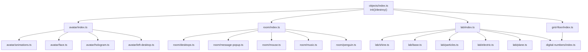
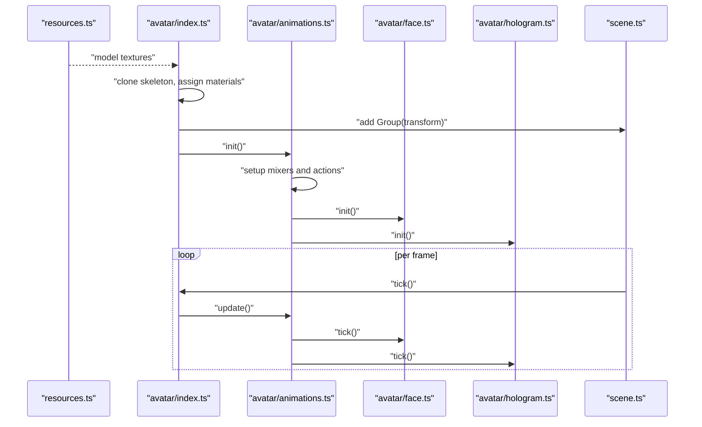
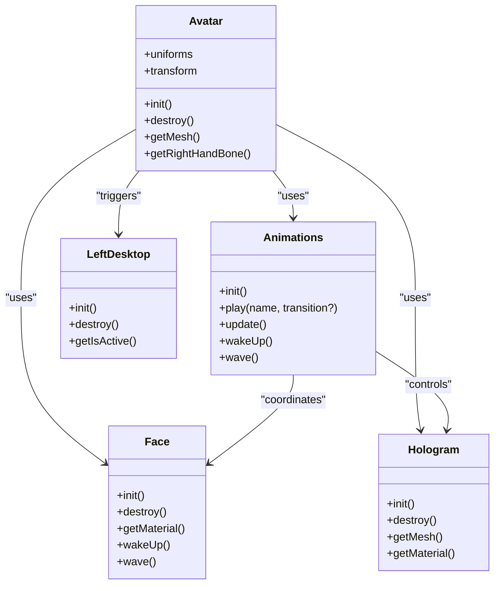
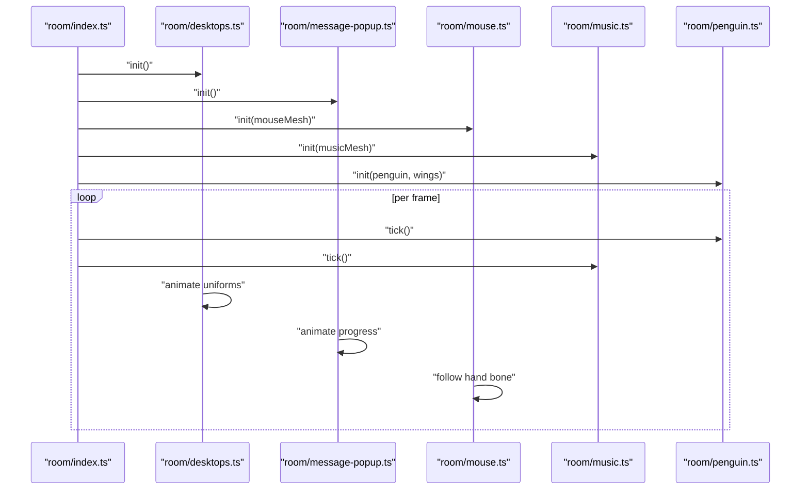
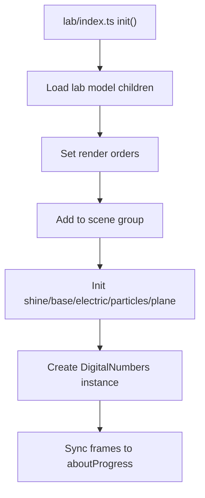
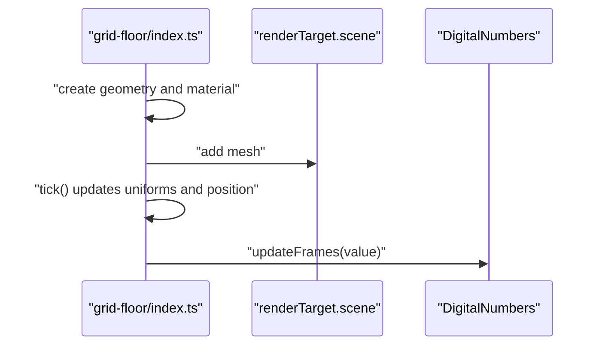
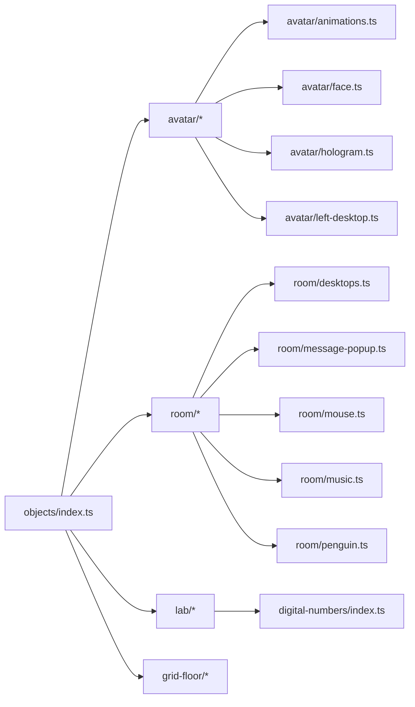

# 3D Object System and Hierarchy

<cite>
**Referenced Files in This Document**
- [src/three/objects/index.ts](file://src/three/objects/index.ts)
- [src/three/objects/avatar/index.ts](file://src/three/objects/avatar/index.ts)
- [src/three/objects/avatar/animations.ts](file://src/three/objects/avatar/animations.ts)
- [src/three/objects/avatar/face.ts](file://src/three/objects/avatar/face.ts)
- [src/three/objects/avatar/hologram.ts](file://src/three/objects/avatar/hologram.ts)
- [src/three/objects/avatar/left-desktop.ts](file://src/three/objects/avatar/left-desktop.ts)
- [src/three/objects/room/index.ts](file://src/three/objects/room/index.ts)
- [src/three/objects/room/desktops.ts](file://src/three/objects/room/desktops.ts)
- [src/three/objects/room/message-popup.ts](file://src/three/objects/room/message-popup.ts)
- [src/three/objects/room/mouse.ts](file://src/three/objects/room/mouse.ts)
- [src/three/objects/room/music.ts](file://src/three/objects/room/music.ts)
- [src/three/objects/room/penguin.ts](file://src/three/objects/room/penguin.ts)
- [src/three/objects/lab/index.ts](file://src/three/objects/lab/index.ts)
- [src/three/objects/grid-floor/index.ts](file://src/three/objects/grid-floor/index.ts)
- [src/three/objects/digital-numbers/index.ts](file://src/three/objects/digital-numbers/index.ts)
</cite>

## Table of Contents
1. [Introduction](#introduction)
2. [Project Structure](#project-structure)
3. [Core Components](#core-components)
4. [Architecture Overview](#architecture-overview)
5. [Detailed Component Analysis](#detailed-component-analysis)
6. [Dependency Analysis](#dependency-analysis)
7. [Performance Considerations](#performance-considerations)
8. [Troubleshooting Guide](#troubleshooting-guide)
9. [Conclusion](#conclusion)
10. [Appendices](#appendices)

## Introduction
This document describes the 3D object system architecture, focusing on the avatar character with holographic effects, the room environment with interactive elements, the lab area with particle systems and digital displays, and the grid floor with animated digital number displays. It explains object instantiation, positioning, animation integration, and interaction handling. It also covers lifecycle management, performance considerations, and practical guidance for extending the system with new objects.

## Project Structure
The 3D system is organized around modular object groups under a central initialization and destruction controller. Each major scene (avatar, room, lab, grid floor) encapsulates its own initialization, per-frame updates, and cleanup routines. Interactive elements are integrated via raycasting and sound utilities.

**Diagram sources**
- [src/three/objects/index.ts:11-33](file://src/three/objects/index.ts#L11-L33)
- [src/three/objects/avatar/index.ts:31-130](file://src/three/objects/avatar/index.ts#L31-L130)
- [src/three/objects/room/index.ts:34-86](file://src/three/objects/room/index.ts#L34-L86)
- [src/three/objects/lab/index.ts:26-57](file://src/three/objects/lab/index.ts#L26-L57)
- [src/three/objects/grid-floor/index.ts:22-43](file://src/three/objects/grid-floor/index.ts#L22-L43)

**Section sources**
- [src/three/objects/index.ts:11-33](file://src/three/objects/index.ts#L11-L33)

## Core Components
- Central orchestrator: Initializes and destroys all 3D objects and compiles the renderer.
- Avatar subsystem: Character mesh, face animation frames, and a separate hologram mesh driven by shader materials and animation mixers.
- Room subsystem: Static and animated room objects, interactive desktop surfaces, message popup, mouse follower, music controller, and penguin with hover interactions.
- Lab subsystem: Base, shine overlay, electric effects, particle system, a plane, and a digital number display synchronized to scene progress.
- Grid floor: A large shader-managed plane rendered to a render target with animated uniforms and positional tracking to the lab area.

Key lifecycle hooks:
- Initialization loads resources, clones skeletons where needed, sets up materials and render orders, attaches to the scene, and registers per-tick updates.
- Destruction removes ticker callbacks, disposes geometries/materials where applicable, and detaches children.

**Section sources**
- [src/three/objects/index.ts:11-33](file://src/three/objects/index.ts#L11-L33)
- [src/three/objects/avatar/index.ts:31-130](file://src/three/objects/avatar/index.ts#L31-L130)
- [src/three/objects/room/index.ts:34-86](file://src/three/objects/room/index.ts#L34-L86)
- [src/three/objects/lab/index.ts:26-57](file://src/three/objects/lab/index.ts#L26-L57)
- [src/three/objects/grid-floor/index.ts:22-43](file://src/three/objects/grid-floor/index.ts#L22-L43)

## Architecture Overview
The system follows a layered pattern:
- Resource loading and cloning: Skeletons are cloned from a shared model resource; materials are constructed from GLSL shaders and textures.
- Scene composition: Each module adds its objects to a local Group, then attaches the Group to the global scene or render target.
- Animation integration: AnimationMixer instances drive both the avatar and the avatar hologram, blending weights according to scene weights and transitions.
- Interaction pipeline: Raycast boxes are registered for clickable objects; sounds are triggered on hover/click; desktops animate via per-vertex attributes.

**Diagram sources**
- [src/three/objects/avatar/index.ts:31-130](file://src/three/objects/avatar/index.ts#L31-L130)
- [src/three/objects/avatar/animations.ts:23-33](file://src/three/objects/avatar/animations.ts#L23-L33)
- [src/three/objects/avatar/face.ts:37-47](file://src/three/objects/avatar/face.ts#L37-L47)
- [src/three/objects/avatar/hologram.ts:24-30](file://src/three/objects/avatar/hologram.ts#L24-L30)

## Detailed Component Analysis

### Avatar System
- Mesh setup: Clones a skinned mesh from the shared model, traverses children to assign specialized materials (head, face, matcap variants), and sets frustum culling and render order.
- Materials: Uses shader materials for head and matcap-based body parts; face material uses a frame index uniform mapped to a spritesheet.
- Animation integration: Two AnimationMixer instances (avatar and hologram) share the same actions and crossfade weights based on scene weights and transitions.
- Hologram: A separate skinned mesh composed from selected geometry segments, bound to the original skeleton, and rendered with a dedicated shader material and uniforms.
- Desktop interactions: Periodic left-desktop animation triggers keyboard sounds, desktop message activation, and message popup visibility.

**Diagram sources**
- [src/three/objects/avatar/index.ts:168-179](file://src/three/objects/avatar/index.ts#L168-L179)
- [src/three/objects/avatar/animations.ts:23-33](file://src/three/objects/avatar/animations.ts#L23-L33)
- [src/three/objects/avatar/face.ts:37-40](file://src/three/objects/avatar/face.ts#L37-L40)
- [src/three/objects/avatar/hologram.ts:105-112](file://src/three/objects/avatar/hologram.ts#L105-L112)
- [src/three/objects/avatar/left-desktop.ts:16-19](file://src/three/objects/avatar/left-desktop.ts#L16-L19)

**Section sources**
- [src/three/objects/avatar/index.ts:31-130](file://src/three/objects/avatar/index.ts#L31-L130)
- [src/three/objects/avatar/animations.ts:23-33](file://src/three/objects/avatar/animations.ts#L23-L33)
- [src/three/objects/avatar/face.ts:37-47](file://src/three/objects/avatar/face.ts#L37-L47)
- [src/three/objects/avatar/hologram.ts:24-30](file://src/three/objects/avatar/hologram.ts#L24-L30)
- [src/three/objects/avatar/left-desktop.ts:29-79](file://src/three/objects/avatar/left-desktop.ts#L29-L79)

### Room Environment and Interactions
- Composition: Loads room model, assigns a shared material to each child, and adds them to a Group attached to the scene.
- Desktops: Merges two desktop planes into one geometry, injects per-vertex attributes for scroll and message intensity, and animates uniforms on a timer.
- Message popup: Shader-managed quad with a spritesheet texture animated via a progress uniform.
- Mouse follower: Tracks the avatar’s right hand bone while constrained to a 3D region and updates position accordingly.
- Music controller: Registers a clickable bounding box around the music object, toggles sound enable state, and drives a note visualization system.
- Penguin: Hoverable with click animation, wing flapping, and a heart particle effect rendered via a shader material.

**Diagram sources**
- [src/three/objects/room/index.ts:34-45](file://src/three/objects/room/index.ts#L34-L45)
- [src/three/objects/room/desktops.ts:27-30](file://src/three/objects/room/desktops.ts#L27-L30)
- [src/three/objects/room/message-popup.ts:13-14](file://src/three/objects/room/message-popup.ts#L13-L14)
- [src/three/objects/room/mouse.ts:30-35](file://src/three/objects/room/mouse.ts#L30-L35)
- [src/three/objects/room/music.ts:19-29](file://src/three/objects/room/music.ts#L19-L29)
- [src/three/objects/room/penguin.ts:21-26](file://src/three/objects/room/penguin.ts#L21-L26)

**Section sources**
- [src/three/objects/room/index.ts:34-86](file://src/three/objects/room/index.ts#L34-L86)
- [src/three/objects/room/desktops.ts:32-73](file://src/three/objects/room/desktops.ts#L32-L73)
- [src/three/objects/room/message-popup.ts:17-42](file://src/three/objects/room/message-popup.ts#L17-L42)
- [src/three/objects/room/mouse.ts:30-56](file://src/three/objects/room/mouse.ts#L30-L56)
- [src/three/objects/room/music.ts:19-36](file://src/three/objects/room/music.ts#L19-L36)
- [src/three/objects/room/penguin.ts:40-67](file://src/three/objects/room/penguin.ts#L40-L67)

### Lab Area: Electric Effects, Particle Systems, and Shine
- Composition: Extracts base, shine, display, and electric objects from the lab model and sets render orders to ensure proper layering.
- Digital numbers: Instantiates an instanced mesh to render a rolling numeric display synchronized to scene progress.
- Effects: Initializes dedicated systems for shine, base, electric, particles, and a plane, each with their own initialization and per-frame updates.

**Diagram sources**
- [src/three/objects/lab/index.ts:26-68](file://src/three/objects/lab/index.ts#L26-L68)
- [src/three/objects/digital-numbers/index.ts:39-93](file://src/three/objects/digital-numbers/index.ts#L39-L93)

**Section sources**
- [src/three/objects/lab/index.ts:26-68](file://src/three/objects/lab/index.ts#L26-L68)
- [src/three/objects/digital-numbers/index.ts:39-93](file://src/three/objects/digital-numbers/index.ts#L39-L93)

### Grid Floor with Animated Digital Numbers
- Geometry and material: PlaneGeometry rotated to face up, ShaderMaterial with uniforms for color, line color, opacity, time, and progress.
- Behavior: Opacity and time uniforms are updated each frame; position tracks the lab group with a fixed height offset.
- Digital numbers: Reused from the lab area to display a percentage value derived from scene progress.

**Diagram sources**
- [src/three/objects/grid-floor/index.ts:22-54](file://src/three/objects/grid-floor/index.ts#L22-L54)
- [src/three/objects/digital-numbers/index.ts:95-116](file://src/three/objects/digital-numbers/index.ts#L95-L116)

**Section sources**
- [src/three/objects/grid-floor/index.ts:22-54](file://src/three/objects/grid-floor/index.ts#L22-L54)
- [src/three/objects/digital-numbers/index.ts:95-121](file://src/three/objects/digital-numbers/index.ts#L95-L121)

## Dependency Analysis
- Central controller depends on each subsystem’s init/destroy exports.
- Avatar depends on:
  - AnimationMixer and AnimationAction for skeletal animation.
  - Face module for facial frame indices and blink timing.
  - Hologram module for a second skinned mesh with shared skeleton.
  - Left-desktop for periodic desktop interaction triggers.
- Room depends on:
  - Desktops for merged geometry and per-vertex attributes.
  - Message-popup for notification visuals.
  - Mouse for hand-following behavior.
  - Music for sound toggle and raycast registration.
  - Penguin for hover/click animations and heart effect.
- Lab depends on:
  - DigitalNumbers for animated display.
  - Multiple effect modules (shine, base, electric, particles, plane).
- Grid floor depends on:
  - Render target scene for off-screen rendering.
  - DigitalNumbers for synchronized numeric display.

**Diagram sources**
- [src/three/objects/index.ts:1-36](file://src/three/objects/index.ts#L1-L36)
- [src/three/objects/avatar/index.ts:1-179](file://src/three/objects/avatar/index.ts#L1-L179)
- [src/three/objects/room/index.ts:1-111](file://src/three/objects/room/index.ts#L1-L111)
- [src/three/objects/lab/index.ts:1-91](file://src/three/objects/lab/index.ts#L1-L91)
- [src/three/objects/grid-floor/index.ts:1-66](file://src/three/objects/grid-floor/index.ts#L1-L66)

**Section sources**
- [src/three/objects/index.ts:1-36](file://src/three/objects/index.ts#L1-L36)

## Performance Considerations
- Instancing: DigitalNumbers uses an InstancedMesh to render multiple digits efficiently, reducing draw calls.
- Shared materials and textures: Materials reuse textures and uniforms; avoid frequent material creation in loops.
- Render orders: Carefully set render orders to minimize overdraw and ensure correct blending for translucent effects (e.g., face, hologram, popup).
- Frustum culling: Disabled for avatar and some effects to maintain visual continuity during transitions; re-enable where appropriate to save GPU cycles.
- Per-vertex attributes: Desktops inject attributes into merged geometry; keep attribute arrays aligned and avoid unnecessary updates.
- Ticker usage: Register only one ticker per module; remove on destroy to prevent leaks.
- Dispose strategy: Dispose materials and geometries in destroy routines where applicable; avoid holding references to Three.js objects after disposal.

[No sources needed since this section provides general guidance]

## Troubleshooting Guide
- No avatar visible:
  - Verify model resource loaded and mesh attached to scene.
  - Check visibility conditions based on scene weights and transitions.
- Hologram not rendering:
  - Confirm material and uniforms are updated each frame and that the mesh is added to the avatar’s transform group.
- Desktop scroll not triggering:
  - Ensure idle animation weight threshold is met and hero scene weight is sufficient.
  - Verify left-desktop interval is active and window visibility conditions are satisfied.
- Message popup not appearing:
  - Confirm uniforms are initialized and timeline completes; check sound playback on trigger.
- Mouse follower outside bounds:
  - Validate bone retrieval and worldToLocal conversion; confirm bounds and Y threshold checks.
- Music toggle not working:
  - Ensure raycast box is registered and onClick handler updates global sound state.
- Penguin jump not animating:
  - Check jumping flag guard and GSAP timeline completion; verify heart material progress uniform visibility logic.
- Lab numbers not updating:
  - Confirm aboutProgress is changing and DigitalNumbers.updateFrames receives a valid number; verify render order and visibility.

**Section sources**
- [src/three/objects/avatar/index.ts:132-159](file://src/three/objects/avatar/index.ts#L132-L159)
- [src/three/objects/avatar/hologram.ts:87-94](file://src/three/objects/avatar/hologram.ts#L87-L94)
- [src/three/objects/room/desktops.ts:75-100](file://src/three/objects/room/desktops.ts#L75-L100)
- [src/three/objects/room/message-popup.ts:44-62](file://src/three/objects/room/message-popup.ts#L44-L62)
- [src/three/objects/room/mouse.ts:37-56](file://src/three/objects/room/mouse.ts#L37-L56)
- [src/three/objects/room/music.ts:14-28](file://src/three/objects/room/music.ts#L14-L28)
- [src/three/objects/room/penguin.ts:69-155](file://src/three/objects/room/penguin.ts#L69-L155)
- [src/three/objects/digital-numbers/index.ts:95-116](file://src/three/objects/digital-numbers/index.ts#L95-L116)

## Conclusion
The 3D object system is modular, composable, and performance-conscious. Each subsystem manages its own lifecycle, animation, and interactions while sharing common patterns for resource loading, material construction, and per-frame updates. The avatar’s dual mesh (avatar + hologram) enables rich visual storytelling, while room and lab areas provide interactive and animated environments. The grid floor ties everything together with a persistent animated backdrop and synchronized numeric displays.

[No sources needed since this section summarizes without analyzing specific files]

## Appendices

### Creating a New Object
- Define initialization logic: load resources, construct geometry/materials, create meshes, and attach to a Group.
- Integrate with the scene: add the Group to the global scene or a render target as appropriate.
- Register per-frame updates: add a ticker callback and update uniforms or transforms.
- Handle lifecycle: remove ticker callbacks and dispose of resources in destroy.
- Example reference paths:
  - [Avatar initialization:94-130](file://src/three/objects/avatar/index.ts#L94-L130)
  - [Room composition:47-86](file://src/three/objects/room/index.ts#L47-L86)
  - [Lab composition:26-57](file://src/three/objects/lab/index.ts#L26-L57)
  - [Grid floor composition:22-43](file://src/three/objects/grid-floor/index.ts#L22-L43)

**Section sources**
- [src/three/objects/avatar/index.ts:94-130](file://src/three/objects/avatar/index.ts#L94-L130)
- [src/three/objects/room/index.ts:47-86](file://src/three/objects/room/index.ts#L47-L86)
- [src/three/objects/lab/index.ts:26-57](file://src/three/objects/lab/index.ts#L26-L57)
- [src/three/objects/grid-floor/index.ts:22-43](file://src/three/objects/grid-floor/index.ts#L22-L43)

### Integrating with the Animation System
- Use AnimationMixer to manage actions and blend weights.
- Coordinate multiple mixers (avatar + hologram) for synchronized animation.
- Reference:
  - [Avatar animations setup:23-33](file://src/three/objects/avatar/animations.ts#L23-L33)
  - [Scene-weight-driven transitions:208-219](file://src/three/objects/avatar/animations.ts#L208-L219)

**Section sources**
- [src/three/objects/avatar/animations.ts:23-33](file://src/three/objects/avatar/animations.ts#L23-L33)
- [src/three/objects/avatar/animations.ts:208-219](file://src/three/objects/avatar/animations.ts#L208-L219)

### Handling Object Lifecycle Management
- Initialization: register ticker callbacks, build materials, and attach to scene.
- Updates: compute per-frame changes (positions, uniforms, visibility).
- Destruction: unregister ticker callbacks, clear groups, and dispose resources.
- References:
  - [Central lifecycle:11-33](file://src/three/objects/index.ts#L11-L33)
  - [Avatar lifecycle:161-166](file://src/three/objects/avatar/index.ts#L161-L166)
  - [Room lifecycle:99-108](file://src/three/objects/room/index.ts#L99-L108)
  - [Lab lifecycle:77-88](file://src/three/objects/lab/index.ts#L77-L88)
  - [Grid floor lifecycle:56-63](file://src/three/objects/grid-floor/index.ts#L56-L63)

**Section sources**
- [src/three/objects/index.ts:11-33](file://src/three/objects/index.ts#L11-L33)
- [src/three/objects/avatar/index.ts:161-166](file://src/three/objects/avatar/index.ts#L161-L166)
- [src/three/objects/room/index.ts:99-108](file://src/three/objects/room/index.ts#L99-L108)
- [src/three/objects/lab/index.ts:77-88](file://src/three/objects/lab/index.ts#L77-L88)
- [src/three/objects/grid-floor/index.ts:56-63](file://src/three/objects/grid-floor/index.ts#L56-L63)