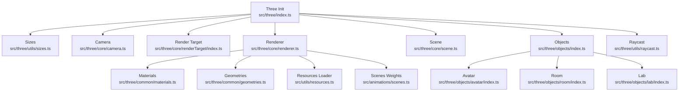
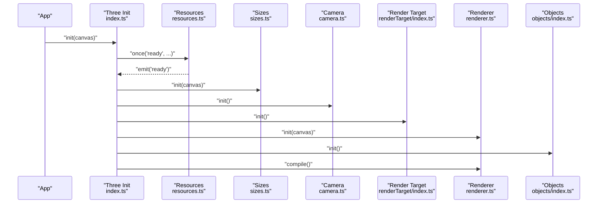
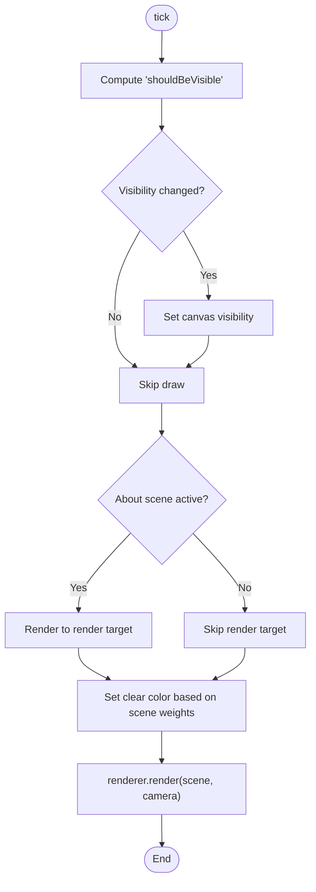
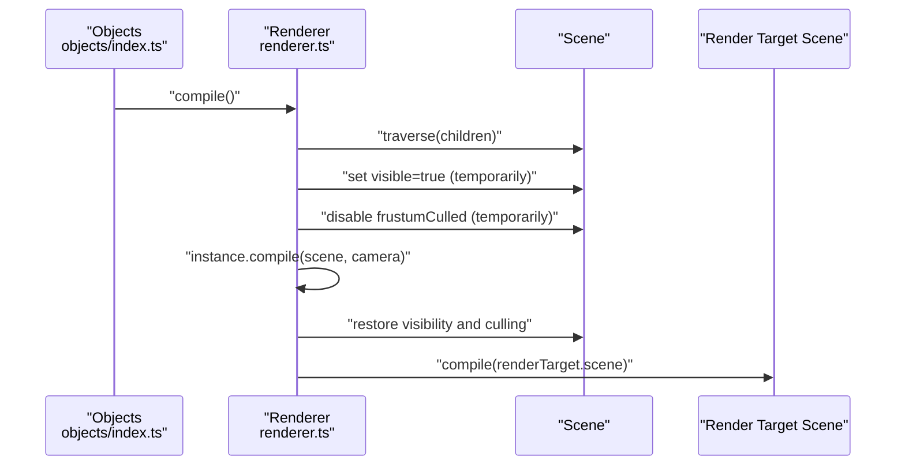
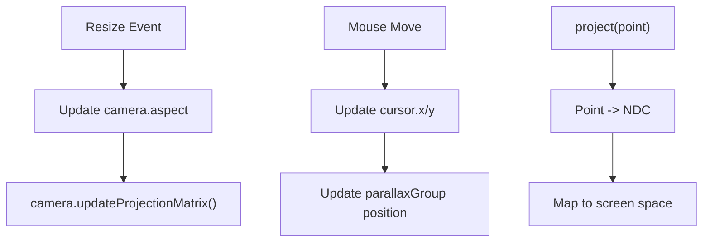
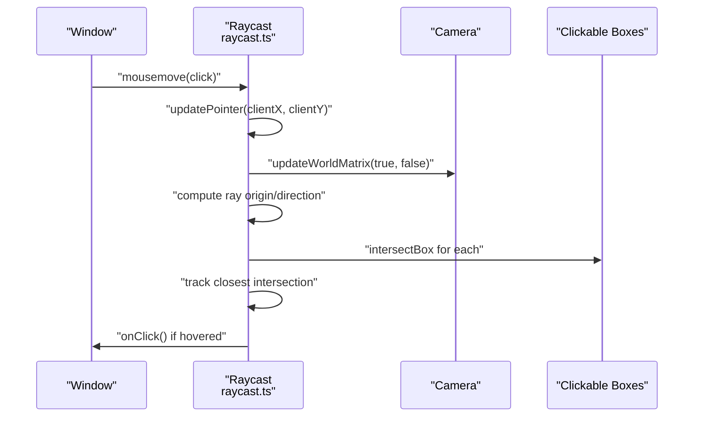
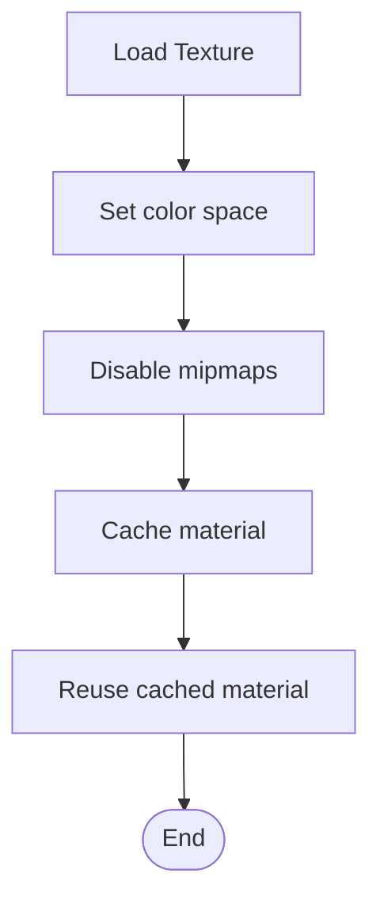
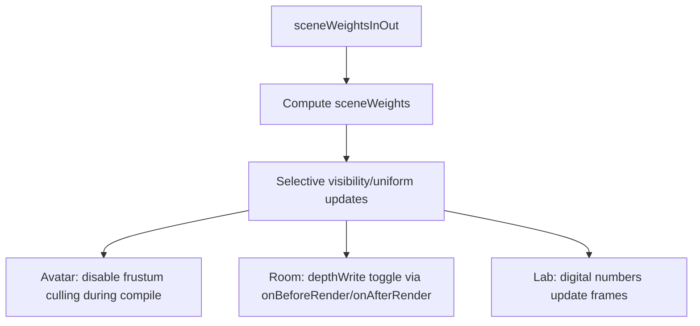
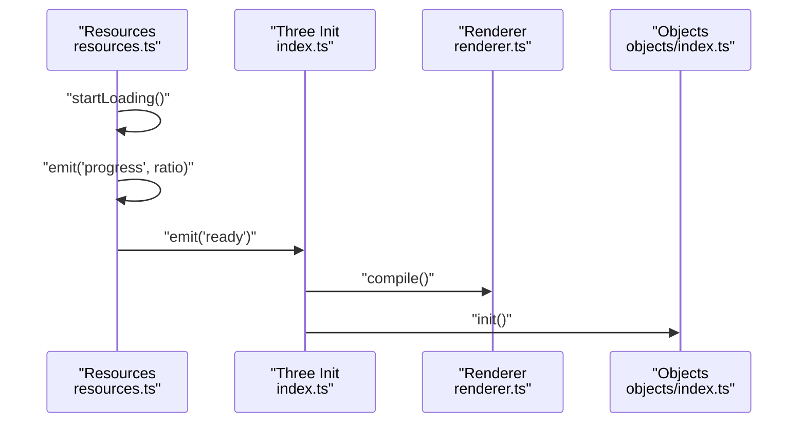
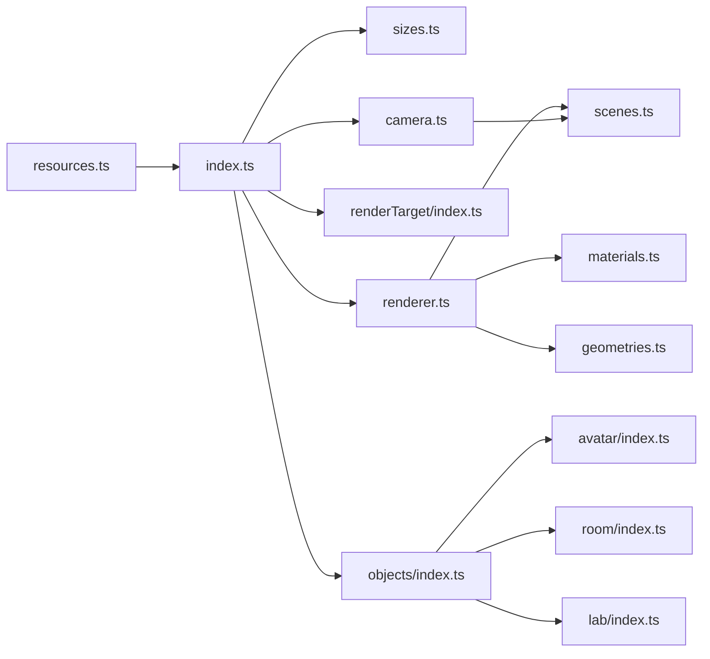

# Performance Optimization and Best Practices

<cite>
**Referenced Files in This Document**
- [src/three/index.ts](file://src/three/index.ts)
- [src/three/core/renderer.ts](file://src/three/core/renderer.ts)
- [src/three/core/camera.ts](file://src/three/core/camera.ts)
- [src/three/core/scene.ts](file://src/three/core/scene.ts)
- [src/three/core/renderTarget/index.ts](file://src/three/core/renderTarget/index.ts)
- [src/three/utils/sizes.ts](file://src/three/utils/sizes.ts)
- [src/three/utils/raycast.ts](file://src/three/utils/raycast.ts)
- [src/three/objects/index.ts](file://src/three/objects/index.ts)
- [src/three/objects/avatar/index.ts](file://src/three/objects/avatar/index.ts)
- [src/three/objects/room/index.ts](file://src/three/objects/room/index.ts)
- [src/three/objects/lab/index.ts](file://src/three/objects/lab/index.ts)
- [src/three/common/materials.ts](file://src/three/common/materials.ts)
- [src/three/common/geometries.ts](file://src/three/common/geometries.ts)
- [src/utils/resources.ts](file://src/utils/resources.ts)
- [src/animations/scenes.ts](file://src/animations/scenes.ts)
</cite>

## Table of Contents
1. [Introduction](#introduction)
2. [Project Structure](#project-structure)
3. [Core Components](#core-components)
4. [Architecture Overview](#architecture-overview)
5. [Detailed Component Analysis](#detailed-component-analysis)
6. [Dependency Analysis](#dependency-analysis)
7. [Performance Considerations](#performance-considerations)
8. [Troubleshooting Guide](#troubleshooting-guide)
9. [Conclusion](#conclusion)
10. [Appendices](#appendices)

## Introduction
This document consolidates performance optimization strategies and best practices for the Three.js-based interactive experience. It focuses on rendering optimization (frustum culling, level-of-detail considerations, batching), memory management, texture and geometry optimization, raycasting performance, animation efficiency, mobile/WebGL context management, progressive loading, profiling and bottleneck identification, and platform-specific considerations. The guidance is grounded in the repository’s architecture and implementation patterns.

## Project Structure
The Three.js integration is organized around a modular core:
- Initialization orchestrator wires up sizing, camera, render target, renderer, scene, objects, and raycasting.
- Renderer encapsulates WebGL setup, visibility gating, per-frame rendering, and shader compilation.
- Camera manages projection, parallax, and viewport updates.
- Render target supports off-screen rendering for effects.
- Objects module initializes scene objects and triggers shader compilation.
- Materials and geometries provide shared resources.
- Resource loader handles asynchronous asset loading with progress and readiness events.
- Scenes weights coordinate visibility and transitions across scenes.

**Diagram sources**
- [src/three/index.ts:1-35](file://src/three/index.ts#L1-L35)
- [src/three/utils/sizes.ts:1-35](file://src/three/utils/sizes.ts#L1-L35)
- [src/three/core/camera.ts:1-119](file://src/three/core/camera.ts#L1-L119)
- [src/three/core/renderTarget/index.ts:1-38](file://src/three/core/renderTarget/index.ts#L1-L38)
- [src/three/core/renderer.ts:1-119](file://src/three/core/renderer.ts#L1-L119)
- [src/three/core/scene.ts:1-6](file://src/three/core/scene.ts#L1-L6)
- [src/three/objects/index.ts:1-36](file://src/three/objects/index.ts#L1-L36)
- [src/three/utils/raycast.ts:1-106](file://src/three/utils/raycast.ts#L1-L106)
- [src/three/objects/avatar/index.ts:1-179](file://src/three/objects/avatar/index.ts#L1-L179)
- [src/three/objects/room/index.ts:1-111](file://src/three/objects/room/index.ts#L1-L111)
- [src/three/objects/lab/index.ts:1-91](file://src/three/objects/lab/index.ts#L1-L91)
- [src/three/common/materials.ts:1-49](file://src/three/common/materials.ts#L1-L49)
- [src/three/common/geometries.ts:1-4](file://src/three/common/geometries.ts#L1-L4)
- [src/utils/resources.ts:1-78](file://src/utils/resources.ts#L1-L78)
- [src/animations/scenes.ts:1-59](file://src/animations/scenes.ts#L1-L59)

**Section sources**
- [src/three/index.ts:1-35](file://src/three/index.ts#L1-L35)
- [src/three/utils/sizes.ts:1-35](file://src/three/utils/sizes.ts#L1-L35)
- [src/three/core/renderer.ts:1-119](file://src/three/core/renderer.ts#L1-L119)
- [src/three/core/camera.ts:1-119](file://src/three/core/camera.ts#L1-L119)
- [src/three/core/renderTarget/index.ts:1-38](file://src/three/core/renderTarget/index.ts#L1-L38)
- [src/three/objects/index.ts:1-36](file://src/three/objects/index.ts#L1-L36)
- [src/three/common/materials.ts:1-49](file://src/three/common/materials.ts#L1-L49)
- [src/three/common/geometries.ts:1-4](file://src/three/common/geometries.ts#L1-L4)
- [src/utils/resources.ts:1-78](file://src/utils/resources.ts#L1-L78)
- [src/animations/scenes.ts:1-59](file://src/animations/scenes.ts#L1-L59)

## Core Components
- Initialization and lifecycle: The initialization sequence ensures assets are ready before wiring up camera, render target, renderer, scene, objects, and raycasting. Destruction cleanly disposes of resources and removes listeners/tickers.
- Renderer: Manages WebGL context, visibility gating, resize handling, clear color selection based on scene weights, and compile-time shader preparation. It also conditionally renders to a render target during specific scenes.
- Camera: Handles aspect updates, parallax movement, waypoint-driven positioning, and projection updates. Provides a project method for screen-space conversions.
- Render Target: Off-screen rendering for specialized effects, sized according to pixel ratio and resized on canvas changes.
- Objects: Initializes scene objects and triggers shader compilation after resources are ready.
- Materials and Geometries: Centralized creation of materials and reuse of a shared plane geometry.
- Resource Loader: Asynchronous loading of GLTF models, textures, and fonts with progress and readiness events.
- Scenes Weights: Drives visibility and blending across scenes via tweened weights.

**Section sources**
- [src/three/index.ts:9-32](file://src/three/index.ts#L9-L32)
- [src/three/core/renderer.ts:19-61](file://src/three/core/renderer.ts#L19-L61)
- [src/three/core/camera.ts:29-98](file://src/three/core/camera.ts#L29-L98)
- [src/three/core/renderTarget/index.ts:15-35](file://src/three/core/renderTarget/index.ts#L15-L35)
- [src/three/objects/index.ts:11-22](file://src/three/objects/index.ts#L11-L22)
- [src/three/common/materials.ts:12-48](file://src/three/common/materials.ts#L12-L48)
- [src/three/common/geometries.ts:1-4](file://src/three/common/geometries.ts#L1-L4)
- [src/utils/resources.ts:39-68](file://src/utils/resources.ts#L39-L68)
- [src/animations/scenes.ts:45-52](file://src/animations/scenes.ts#L45-L52)

## Architecture Overview
The runtime loop integrates scene weights, camera transforms, and conditional rendering paths. Visibility gating prevents rendering when the camera is uninitialized or inactive. Shader compilation is performed once after assets are ready to reduce runtime overhead.

**Diagram sources**
- [src/three/index.ts:11-22](file://src/three/index.ts#L11-L22)
- [src/utils/resources.ts:63-67](file://src/utils/resources.ts#L63-L67)
- [src/three/utils/sizes.ts:12-25](file://src/three/utils/sizes.ts#L12-L25)
- [src/three/core/camera.ts:29-39](file://src/three/core/camera.ts#L29-L39)
- [src/three/core/renderTarget/index.ts:15-18](file://src/three/core/renderTarget/index.ts#L15-L18)
- [src/three/core/renderer.ts:19-31](file://src/three/core/renderer.ts#L19-L31)
- [src/three/objects/index.ts:11-22](file://src/three/objects/index.ts#L11-L22)

## Detailed Component Analysis

### Rendering Pipeline and Visibility Gating
- Visibility gating: The renderer toggles canvas visibility based on camera position and activity flag, reducing unnecessary draws when the scene is not initialized or not active.
- Conditional render target usage: During specific scenes, the pipeline renders to a render target before drawing the main scene, enabling post-processing-like effects.
- Clear color selection: Clear color is chosen dynamically based on scene weights to support scene transitions.

**Diagram sources**
- [src/three/core/renderer.ts:44-61](file://src/three/core/renderer.ts#L44-L61)
- [src/three/core/renderTarget/index.ts:20-26](file://src/three/core/renderTarget/index.ts#L20-L26)
- [src/animations/scenes.ts:3-10](file://src/animations/scenes.ts#L3-L10)

**Section sources**
- [src/three/core/renderer.ts:44-61](file://src/three/core/renderer.ts#L44-L61)
- [src/three/core/renderTarget/index.ts:20-26](file://src/three/core/renderTarget/index.ts#L20-L26)
- [src/animations/scenes.ts:3-10](file://src/animations/scenes.ts#L3-L10)

### Shader Compilation and Batch Rendering Considerations
- Compile-once strategy: The renderer compiles both the main scene and the render target scene to pre-compile shaders, avoiding per-frame compilation overhead.
- Frustum culling bypass during compile: Invisible objects are temporarily made visible and frustum culling disabled to ensure proper compilation, then restored afterward.
- Render order and material uniform updates: Objects set explicit render orders and update material uniforms per frame, which can be optimized further by batching similar materials.

**Diagram sources**
- [src/three/objects/index.ts:21](file://src/three/objects/index.ts#L21)
- [src/three/core/renderer.ts:71-108](file://src/three/core/renderer.ts#L71-L108)

**Section sources**
- [src/three/objects/index.ts:21](file://src/three/objects/index.ts#L21)
- [src/three/core/renderer.ts:71-108](file://src/three/core/renderer.ts#L71-L108)

### Camera and Viewport Management
- Aspect and projection updates: On resize, the camera updates its aspect ratio and projection matrix.
- Parallax effect: A group-based parallax system moves the camera slightly with mouse input to enhance immersion.
- Screen-space projection: A helper computes normalized device coordinates for UI overlays or hit-testing.

**Diagram sources**
- [src/three/core/camera.ts:95-98](file://src/three/core/camera.ts#L95-L98)
- [src/three/core/camera.ts:41-54](file://src/three/core/camera.ts#L41-L54)
- [src/three/core/camera.ts:100-108](file://src/three/core/camera.ts#L100-L108)

**Section sources**
- [src/three/core/camera.ts:29-98](file://src/three/core/camera.ts#L29-L98)
- [src/three/core/camera.ts:100-108](file://src/three/core/camera.ts#L100-L108)

### Raycasting and Interaction Performance
- Continuous raycast only on non-touch devices: Reduces CPU usage on mobile by avoiding continuous intersection tests.
- Efficient ray computation: Uses camera world matrix and unproject to derive ray direction, then iterates candidate boxes to find the closest intersection.
- Hover state change handling: Plays hover sounds only when transitioning between different hovered targets.

**Diagram sources**
- [src/three/utils/raycast.ts:18-62](file://src/three/utils/raycast.ts#L18-L62)
- [src/three/utils/raycast.ts:84-90](file://src/three/utils/raycast.ts#L84-L90)

**Section sources**
- [src/three/utils/raycast.ts:18-82](file://src/three/utils/raycast.ts#L18-L82)

### Memory Management and Texture Optimization
- Texture color space and mipmaps: Textures are configured with appropriate color spaces and mip generation disabled to reduce memory and improve performance on lower-end devices.
- Shared geometry reuse: A single plane geometry instance is reused across components to minimize memory footprint.
- Lazy material creation: Materials are created lazily and cached to avoid redundant allocations.

**Diagram sources**
- [src/three/common/materials.ts:14-20](file://src/three/common/materials.ts#L14-L20)
- [src/three/common/materials.ts:44-45](file://src/three/common/materials.ts#L44-L45)
- [src/three/common/geometries.ts:1-4](file://src/three/common/geometries.ts#L1-L4)

**Section sources**
- [src/three/common/materials.ts:14-20](file://src/three/common/materials.ts#L14-L20)
- [src/three/common/materials.ts:44-45](file://src/three/common/materials.ts#L44-L45)
- [src/three/common/geometries.ts:1-4](file://src/three/common/geometries.ts#L1-L4)

### Animation Efficiency and Level-of-Detail Considerations
- Scene weights: Smooth transitions between scenes are driven by tweened weights, allowing selective visibility and animation updates.
- Object visibility and uniforms: Objects selectively show/hide and update uniforms based on scene weights, minimizing unnecessary computations.
- Avatar-specific optimizations: Frustum culling is disabled for the avatar mesh and children to ensure visibility during compile and transitions; render order is set to manage layering.

**Diagram sources**
- [src/animations/scenes.ts:45-52](file://src/animations/scenes.ts#L45-L52)
- [src/three/objects/avatar/index.ts:99-107](file://src/three/objects/avatar/index.ts#L99-L107)
- [src/three/objects/room/index.ts:75-82](file://src/three/objects/room/index.ts#L75-L82)
- [src/three/objects/lab/index.ts:71-75](file://src/three/objects/lab/index.ts#L71-L75)

**Section sources**
- [src/animations/scenes.ts:45-52](file://src/animations/scenes.ts#L45-L52)
- [src/three/objects/avatar/index.ts:99-107](file://src/three/objects/avatar/index.ts#L99-L107)
- [src/three/objects/room/index.ts:75-82](file://src/three/objects/room/index.ts#L75-L82)
- [src/three/objects/lab/index.ts:71-75](file://src/three/objects/lab/index.ts#L71-L75)

### Progressive Loading and Asset Optimization
- Asynchronous loading: Assets are loaded asynchronously with progress updates and a single readiness event to gate initialization.
- Color space normalization: Textures are set to sRGB color space upon load to ensure correct lighting and shading.
- Deferred initialization: The renderer compiles shaders and initializes objects only after resources are ready.

**Diagram sources**
- [src/utils/resources.ts:39-68](file://src/utils/resources.ts#L39-L68)
- [src/three/index.ts:14-22](file://src/three/index.ts#L14-L22)
- [src/three/objects/index.ts:21](file://src/three/objects/index.ts#L21)

**Section sources**
- [src/utils/resources.ts:39-68](file://src/utils/resources.ts#L39-L68)
- [src/three/index.ts:14-22](file://src/three/index.ts#L14-L22)

### Mobile-Specific Optimizations and WebGL Context Management
- Pixel ratio clamping: The pixel ratio is capped to limit GPU memory pressure on high-DPR devices.
- Touch-aware raycast: Continuous raycast is disabled on touch devices to save CPU cycles.
- Visibility gating: Canvas visibility is toggled to avoid rendering when offscreen or uninitialized.

**Section sources**
- [src/three/utils/sizes.ts:23](file://src/three/utils/sizes.ts#L23)
- [src/three/utils/raycast.ts:84-87](file://src/three/utils/raycast.ts#L84-L87)
- [src/three/core/renderer.ts:47-50](file://src/three/core/renderer.ts#L47-L50)

## Dependency Analysis
The following diagram highlights key dependencies among core modules and how they influence performance characteristics.

**Diagram sources**
- [src/utils/resources.ts:1-78](file://src/utils/resources.ts#L1-L78)
- [src/three/index.ts:1-35](file://src/three/index.ts#L1-L35)
- [src/three/utils/sizes.ts:1-35](file://src/three/utils/sizes.ts#L1-L35)
- [src/three/core/camera.ts:1-119](file://src/three/core/camera.ts#L1-L119)
- [src/three/core/renderTarget/index.ts:1-38](file://src/three/core/renderTarget/index.ts#L1-L38)
- [src/three/core/renderer.ts:1-119](file://src/three/core/renderer.ts#L1-L119)
- [src/three/objects/index.ts:1-36](file://src/three/objects/index.ts#L1-L36)
- [src/three/objects/avatar/index.ts:1-179](file://src/three/objects/avatar/index.ts#L1-L179)
- [src/three/objects/room/index.ts:1-111](file://src/three/objects/room/index.ts#L1-L111)
- [src/three/objects/lab/index.ts:1-91](file://src/three/objects/lab/index.ts#L1-L91)
- [src/three/common/materials.ts:1-49](file://src/three/common/materials.ts#L1-L49)
- [src/three/common/geometries.ts:1-4](file://src/three/common/geometries.ts#L1-L4)
- [src/animations/scenes.ts:1-59](file://src/animations/scenes.ts#L1-L59)

**Section sources**
- [src/three/index.ts:1-35](file://src/three/index.ts#L1-L35)
- [src/three/objects/index.ts:1-36](file://src/three/objects/index.ts#L1-L36)
- [src/three/core/renderer.ts:1-119](file://src/three/core/renderer.ts#L1-L119)
- [src/three/core/camera.ts:1-119](file://src/three/core/camera.ts#L1-L119)
- [src/three/core/renderTarget/index.ts:1-38](file://src/three/core/renderTarget/index.ts#L1-L38)
- [src/three/common/materials.ts:1-49](file://src/three/common/materials.ts#L1-L49)
- [src/three/common/geometries.ts:1-4](file://src/three/common/geometries.ts#L1-L4)
- [src/utils/resources.ts:1-78](file://src/utils/resources.ts#L1-L78)
- [src/animations/scenes.ts:1-59](file://src/animations/scenes.ts#L1-L59)

## Performance Considerations
- Rendering optimization
  - Frustum culling: Keep enabled for static objects; temporarily disable during shader compilation as shown.
  - Level-of-detail: Use scene weights to hide complex geometry during transitions; leverage render orders to layer semi-transparent elements.
  - Batch rendering: Group objects with identical materials and minimal state changes; avoid frequent material switches.
- Memory management
  - Texture optimization: Disable mipmaps for UI textures and small repeating patterns; set correct color space.
  - Geometry reuse: Share geometries across instances.
  - Dispose: Call dispose on renderer and remove ticker/listeners on destroy.
- Raycasting performance
  - Limit continuous raycast to non-touch devices; cache ray origin/direction and candidate sets.
  - Reduce candidate set size by spatial partitioning or coarse bounding volume checks.
- Animation efficiency
  - Use tweening libraries for smooth, low-overhead transitions; compute only visible/active branches.
  - Minimize per-frame uniform updates to changed values only.
- Mobile/WebGL context
  - Clamp pixel ratio; prefer lower resolution passes for effects; disable expensive features on low-end devices.
  - Use visibility gating to avoid rendering when offscreen.
- Progressive loading
  - Preload critical assets; defer non-essential assets; use readiness gates before initializing Three.js.
- Profiling and bottleneck identification
  - Use browser devtools rendering and GPU timelines; monitor draw calls, shader compile times, and memory usage.
  - Instrument resource loading progress and renderer tick durations.

[No sources needed since this section provides general guidance]

## Troubleshooting Guide
- Renderer not initialized errors: Ensure initialization occurs after resource readiness and that the canvas is valid.
- Unexpected rendering artifacts: Verify shader compilation was executed after assets loaded and that frustum culling restoration occurred.
- Poor mobile performance: Confirm pixel ratio clamping, visibility gating, and disabling continuous raycast on touch devices.
- Incorrect raycast behavior: Ensure camera world matrix is updated and pointer normalization is applied consistently.

**Section sources**
- [src/three/core/renderer.ts:33-36](file://src/three/core/renderer.ts#L33-L36)
- [src/three/core/renderer.ts:71-108](file://src/three/core/renderer.ts#L71-L108)
- [src/three/utils/sizes.ts:23](file://src/three/utils/sizes.ts#L23)
- [src/three/utils/raycast.ts:28-35](file://src/three/utils/raycast.ts#L28-L35)

## Conclusion
By combining visibility gating, compile-once shader preparation, selective object updates via scene weights, efficient raycasting, and careful resource management, the project achieves a responsive and visually coherent experience. Adhering to the outlined strategies and continuously profiling performance will help maintain quality across diverse devices and platforms.

[No sources needed since this section summarizes without analyzing specific files]

## Appendices
- Practical steps
  - Profile GPU memory and draw calls regularly.
  - Monitor resource loading progress and delay Three.js initialization until ready.
  - Keep material counts low and reuse geometries.
  - Test on representative mobile devices and adjust pixel ratio and effects accordingly.

[No sources needed since this section provides general guidance]