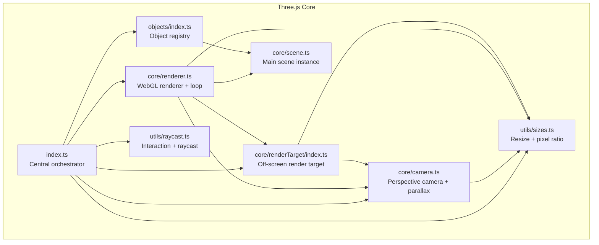
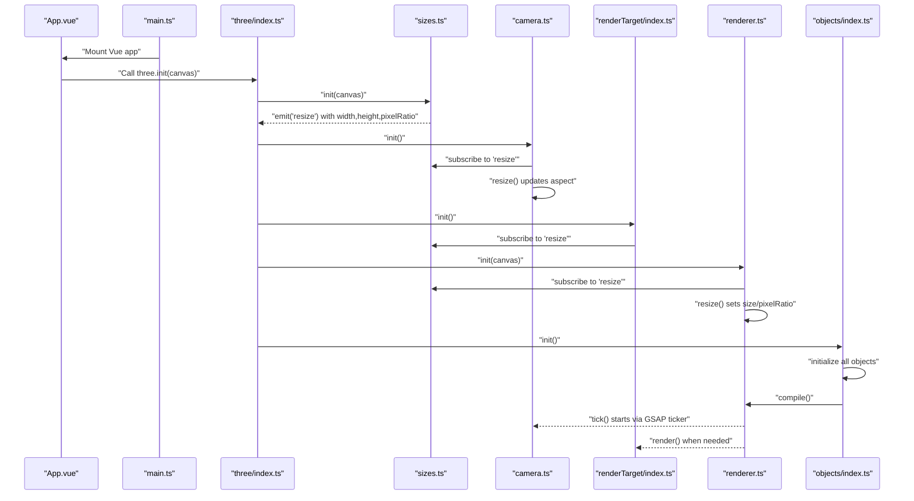
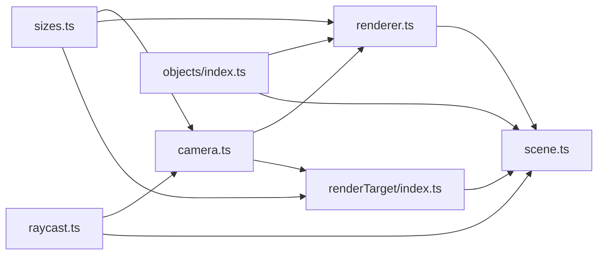

# Scene Management and Initialization

<cite>
**Referenced Files in This Document**
- [src/three/index.ts](file://src/three/index.ts)
- [src/three/core/camera.ts](file://src/three/core/camera.ts)
- [src/three/core/renderer.ts](file://src/three/core/renderer.ts)
- [src/three/core/scene.ts](file://src/three/core/scene.ts)
- [src/three/core/renderTarget/index.ts](file://src/three/core/renderTarget/index.ts)
- [src/three/utils/sizes.ts](file://src/three/utils/sizes.ts)
- [src/three/objects/index.ts](file://src/three/objects/index.ts)
- [src/three/utils/raycast.ts](file://src/three/utils/raycast.ts)
- [src/App.vue](file://src/App.vue)
- [src/main.ts](file://src/main.ts)
</cite>

## Table of Contents
1. [Introduction](#introduction)
2. [Project Structure](#project-structure)
3. [Core Components](#core-components)
4. [Architecture Overview](#architecture-overview)
5. [Detailed Component Analysis](#detailed-component-analysis)
6. [Dependency Analysis](#dependency-analysis)
7. [Performance Considerations](#performance-considerations)
8. [Troubleshooting Guide](#troubleshooting-guide)
9. [Conclusion](#conclusion)
10. [Appendices](#appendices)

## Introduction
This document explains the centralized Three.js scene management system used in the project. It covers the initialization sequence, camera configuration, WebGL renderer setup, scene graph organization, and the use of off-screen render targets for post-processing. It also provides practical guidance for adding/removing objects, handling multiple scenes, responding to window resize events, and avoiding common pitfalls such as memory leaks and performance degradation.

## Project Structure
The Three.js subsystem is organized around a small set of cohesive modules:
- Central initialization orchestrator
- Core systems: camera, renderer, scene, and render target
- Utilities for sizes and raycasting
- Object registry for scene content

**Diagram sources**
- [src/three/index.ts:11-34](file://src/three/index.ts#L11-L34)
- [src/three/core/camera.ts:21-39](file://src/three/core/camera.ts#L21-L39)
- [src/three/core/renderer.ts:19-61](file://src/three/core/renderer.ts#L19-L61)
- [src/three/core/scene.ts:3](file://src/three/core/scene.ts#L3)
- [src/three/core/renderTarget/index.ts:6-26](file://src/three/core/renderTarget/index.ts#L6-L26)
- [src/three/utils/sizes.ts:12-25](file://src/three/utils/sizes.ts#L12-L25)
- [src/three/objects/index.ts:11-22](file://src/three/objects/index.ts#L11-L22)
- [src/three/utils/raycast.ts:84-90](file://src/three/utils/raycast.ts#L84-L90)

**Section sources**
- [src/three/index.ts:11-34](file://src/three/index.ts#L11-L34)
- [src/three/utils/sizes.ts:12-35](file://src/three/utils/sizes.ts#L12-L35)

## Core Components
- Central initialization: coordinates resource readiness, sizing, camera, render target, renderer, object registration, and raycasting.
- Camera: perspective camera with dynamic aspect ratio, parallax group, and scene-weight-aware positioning.
- Renderer: WebGL renderer with antialiasing, pixel ratio handling, visibility gating, and optional off-screen rendering.
- Scene: single global Scene instance.
- Render target: off-screen WebGLRenderTarget used for post-processing passes.
- Sizes: unified width, height, and pixel ratio management with ResizeObserver.
- Objects: registry module that initializes and compiles scene content.
- Raycast: pointer-to-world raycasting for interaction.

**Section sources**
- [src/three/index.ts:11-34](file://src/three/index.ts#L11-L34)
- [src/three/core/camera.ts:21-98](file://src/three/core/camera.ts#L21-L98)
- [src/three/core/renderer.ts:19-118](file://src/three/core/renderer.ts#L19-L118)
- [src/three/core/scene.ts:3](file://src/three/core/scene.ts#L3)
- [src/three/core/renderTarget/index.ts:6-35](file://src/three/core/renderTarget/index.ts#L6-L35)
- [src/three/utils/sizes.ts:12-35](file://src/three/utils/sizes.ts#L12-L35)
- [src/three/objects/index.ts:11-33](file://src/three/objects/index.ts#L11-L33)
- [src/three/utils/raycast.ts:18-105](file://src/three/utils/raycast.ts#L18-L105)

## Architecture Overview
The initialization flow ensures that resources are ready before building the scene graph and entering the animation loop. The renderer’s tick controls visibility and renders either the main scene or an off-screen pass depending on scene weights.

**Diagram sources**
- [src/App.vue:33-57](file://src/App.vue#L33-L57)
- [src/main.ts:1-10](file://src/main.ts#L1-L10)
- [src/three/index.ts:14-22](file://src/three/index.ts#L14-L22)
- [src/three/utils/sizes.ts:18-25](file://src/three/utils/sizes.ts#L18-L25)
- [src/three/core/camera.ts:29-39](file://src/three/core/camera.ts#L29-L39)
- [src/three/core/renderTarget/index.ts:15-18](file://src/three/core/renderTarget/index.ts#L15-L18)
- [src/three/core/renderer.ts:19-31](file://src/three/core/renderer.ts#L19-L31)
- [src/three/objects/index.ts:11-22](file://src/three/objects/index.ts#L11-L22)

## Detailed Component Analysis

### Centralized Initialization (index.ts)
- Orchestrates startup after resource readiness.
- Initializes sizes, camera, render target, renderer, objects, and raycast.
- Provides a destroy method to tear down all subsystems cleanly.

Key behaviors:
- Uses a resource readiness event to gate initialization.
- Delegates lifecycle to each subsystem.

**Section sources**
- [src/three/index.ts:11-34](file://src/three/index.ts#L11-L34)

### Camera Setup (core/camera.ts)
- Perspective camera with a fixed vertical FOV and dynamic aspect ratio.
- Aspect ratio updates on resize to prevent distortion.
- Parallax group enables subtle camera movement based on mouse position.
- Scene-weight-aware positioning and look-at targeting for different scenes.
- Projects 3D positions to 2D screen coordinates.

Important configuration:
- Vertical FOV is set at creation time.
- Aspect ratio is recalculated on resize.
- Parallax intensity and speed are controlled by constants.
- Contact scene transform blends position and focus based on scene weights.

**Section sources**
- [src/three/core/camera.ts:21](file://src/three/core/camera.ts#L21)
- [src/three/core/camera.ts:95-98](file://src/three/core/camera.ts#L95-L98)
- [src/three/core/camera.ts:46-54](file://src/three/core/camera.ts#L46-L54)
- [src/three/core/camera.ts:75-93](file://src/three/core/camera.ts#L75-L93)
- [src/three/core/camera.ts:100-108](file://src/three/core/camera.ts#L100-L108)

### WebGL Renderer Configuration (core/renderer.ts)
- Creates a WebGLRenderer with antialiasing enabled and alpha disabled.
- Sets up a GSAP ticker-driven render loop.
- Visibility gating hides the canvas when the camera position is unset or the app is inactive.
- Clears color is dynamically selected based on scene weights.
- Optional off-screen rendering via render target when a specific scene weight threshold is met.
- Compiles scenes to improve first-frame performance by temporarily adjusting visibility and culling.

Performance-related highlights:
- Pixel ratio is applied per frame.
- Resize handler updates renderer size and pixel ratio.
- Scene compilation traverses and temporarily toggles visibility and frustum culling to force shader compilation.

**Section sources**
- [src/three/core/renderer.ts:19-42](file://src/three/core/renderer.ts#L19-L42)
- [src/three/core/renderer.ts:44-61](file://src/three/core/renderer.ts#L44-L61)
- [src/three/core/renderer.ts:63-108](file://src/three/core/renderer.ts#L63-L108)

### Scene Graph Organization (core/scene.ts)
- Exposes a single global Scene instance.
- Other modules attach objects to this shared scene.

Best practice:
- Keep the scene graph flat where possible and group related objects under named groups for easier management.

**Section sources**
- [src/three/core/scene.ts:3](file://src/three/core/scene.ts#L3)

### Render Target Usage (core/renderTarget/index.ts)
- Off-screen WebGLRenderTarget used to render a dedicated scene containing the parallax group.
- Render target is sized according to pixel ratio for crispness.
- Render target is cleared to a specific color and then set back to the default target.

Typical usage:
- Render the parallax scene to the render target.
- Use the render target texture in downstream passes (e.g., post-processing).

**Section sources**
- [src/three/core/renderTarget/index.ts:6-10](file://src/three/core/renderTarget/index.ts#L6-L10)
- [src/three/core/renderTarget/index.ts:20-26](file://src/three/core/renderTarget/index.ts#L20-L26)
- [src/three/core/renderTarget/index.ts:32-35](file://src/three/core/renderTarget/index.ts#L32-L35)

### Sizes and Resize Handling (utils/sizes.ts)
- Tracks width, height, and pixel ratio.
- Uses ResizeObserver to emit resize events.
- Limits pixel ratio to a safe cap to balance quality and performance.

Integration:
- Camera, renderer, and render target subscribe to resize events to update projection matrices and sizes.

**Section sources**
- [src/three/utils/sizes.ts:12-35](file://src/three/utils/sizes.ts#L12-L35)

### Object Registry (objects/index.ts)
- Initializes all scene objects in a deterministic order.
- Triggers scene compilation after initialization.

Guidelines:
- Add new objects by registering their init/destroy in this module.
- Keep initialization side-effect free and idempotent.

**Section sources**
- [src/three/objects/index.ts:11-22](file://src/three/objects/index.ts#L11-L22)

### Interaction and Raycasting (utils/raycast.ts)
- Converts pointer coordinates to normalized device coordinates.
- Builds a ray from the camera through the pointer position.
- Intersects against a registered set of boxes to find the hovered item.
- Plays hover sounds when transitioning hover states on non-touch devices.

Usage tips:
- Register clickable boxes with the raycast module.
- Ensure camera world matrix is current before casting.

**Section sources**
- [src/three/utils/raycast.ts:18-55](file://src/three/utils/raycast.ts#L18-L55)
- [src/three/utils/raycast.ts:84-105](file://src/three/utils/raycast.ts#L84-L105)

### Adding and Removing Objects
- To add an object: initialize it in the objects registry and attach it to the global scene.
- To remove an object: detach it from the scene and clean up any resources it holds.
- For dynamic content, prefer grouping under a parent and removing the group to simplify cleanup.

References:
- Global scene instance: [scene.ts](file://src/three/core/scene.ts#L3)
- Object registry: [objects/index.ts:11-33](file://src/three/objects/index.ts#L11-L33)

**Section sources**
- [src/three/core/scene.ts:3](file://src/three/core/scene.ts#L3)
- [src/three/objects/index.ts:11-33](file://src/three/objects/index.ts#L11-L33)

### Managing Multiple Scenes
- Scene weights control blending between different camera transforms and clear colors.
- Off-screen rendering is triggered conditionally based on scene weights.
- Use separate scenes or layers for complex overlays, and switch render targets accordingly.

References:
- Scene weights usage: [renderer.ts:54-59](file://src/three/core/renderer.ts#L54-L59)
- Conditional render target usage: [renderer.ts:54-56](file://src/three/core/renderer.ts#L54-L56)

**Section sources**
- [src/three/core/renderer.ts:54-59](file://src/three/core/renderer.ts#L54-L59)

### Handling Window Resize Events
- Subscribe to the "resize" event emitted by sizes.
- Update camera aspect ratio and renderer size/pixel ratio.
- Rebuild render target size considering pixel ratio.

References:
- Resize subscription: [camera.ts:30-31](file://src/three/core/camera.ts#L30-L31), [renderer.ts](file://src/three/core/renderer.ts#L29), [renderTarget/index.ts](file://src/three/core/renderTarget/index.ts#L16)
- Resize handler: [sizes.ts:18-25](file://src/three/utils/sizes.ts#L18-L25)

**Section sources**
- [src/three/core/camera.ts:30-31](file://src/three/core/camera.ts#L30-L31)
- [src/three/core/renderer.ts:29](file://src/three/core/renderer.ts#L29)
- [src/three/core/renderTarget/index.ts:16](file://src/three/core/renderTarget/index.ts#L16)
- [src/three/utils/sizes.ts:18-25](file://src/three/utils/sizes.ts#L18-L25)

## Dependency Analysis
The following diagram shows the primary runtime dependencies among core modules.

**Diagram sources**
- [src/three/utils/sizes.ts:12-25](file://src/three/utils/sizes.ts#L12-L25)
- [src/three/core/camera.ts:30-39](file://src/three/core/camera.ts#L30-L39)
- [src/three/core/renderer.ts:19-31](file://src/three/core/renderer.ts#L19-L31)
- [src/three/core/renderTarget/index.ts:15-18](file://src/three/core/renderTarget/index.ts#L15-L18)
- [src/three/core/scene.ts:3](file://src/three/core/scene.ts#L3)
- [src/three/objects/index.ts:11-22](file://src/three/objects/index.ts#L11-L22)
- [src/three/utils/raycast.ts:84-90](file://src/three/utils/raycast.ts#L84-L90)

**Section sources**
- [src/three/utils/sizes.ts:12-35](file://src/three/utils/sizes.ts#L12-L35)
- [src/three/core/camera.ts:21-98](file://src/three/core/camera.ts#L21-L98)
- [src/three/core/renderer.ts:19-118](file://src/three/core/renderer.ts#L19-L118)
- [src/three/core/renderTarget/index.ts:6-35](file://src/three/core/renderTarget/index.ts#L6-L35)
- [src/three/core/scene.ts:3](file://src/three/core/scene.ts#L3)
- [src/three/objects/index.ts:11-33](file://src/three/objects/index.ts#L11-L33)
- [src/three/utils/raycast.ts:18-105](file://src/three/utils/raycast.ts#L18-L105)

## Performance Considerations
- Antialiasing: Enabled in the renderer for smoother edges at the cost of bandwidth; disable for constrained devices if necessary.
- Pixel ratio: Clamped to a maximum to balance sharpness and performance.
- Visibility gating: Hides the canvas when the camera position is unset or the app is inactive to save GPU cycles.
- Scene compilation: Temporarily disables frustum culling and restores visibility to precompile shaders and reduce first-frame stalls.
- Off-screen rendering: Render target is cleared and re-rendered only when needed to minimize redundant work.
- Resize handling: Updates size and pixel ratio efficiently via ResizeObserver.

[No sources needed since this section provides general guidance]

## Troubleshooting Guide
Common issues and remedies:
- Canvas not visible:
  - Verify visibility gating logic and that the camera position is set.
  - Confirm isActive flag is true when expected.
- Blurry rendering on high-DPI displays:
  - Ensure pixel ratio is applied and render target size accounts for pixel ratio.
- Incorrect aspect ratio or stretched visuals:
  - Confirm camera resize handler updates the aspect and projection matrix.
- Slow first frame:
  - Trigger scene compilation after loading resources and initializing objects.
- Memory leaks:
  - Remove ticker listeners and event listeners in destroy methods.
  - Dispose of the renderer and remove children from the scene.
- Interaction not working:
  - Ensure raycast is initialized and pointer coordinates are transformed to normalized device coordinates.
  - Verify camera world matrix is updated before casting.

**Section sources**
- [src/three/core/renderer.ts:44-61](file://src/three/core/renderer.ts#L44-L61)
- [src/three/core/renderer.ts:110-116](file://src/three/core/renderer.ts#L110-L116)
- [src/three/core/camera.ts:95-98](file://src/three/core/camera.ts#L95-L98)
- [src/three/core/renderTarget/index.ts:32-35](file://src/three/core/renderTarget/index.ts#L32-L35)
- [src/three/utils/raycast.ts:18-55](file://src/three/utils/raycast.ts#L18-L55)

## Conclusion
The Three.js scene management system centers on a clean initialization sequence, robust resize handling, and a modular architecture that separates concerns across camera, renderer, scene, render target, sizes, objects, and raycasting. By following the recommended patterns—such as compiling scenes after loading, carefully managing lifecycles, and accounting for pixel ratio—the system remains responsive, maintainable, and extensible.

[No sources needed since this section summarizes without analyzing specific files]

## Appendices

### Best Practices for Scene Optimization and Cleanup
- Prefer batching initialization and compilation after resources are ready.
- Keep the scene graph shallow and grouped for clarity and performance.
- Dispose of geometries, materials, and textures when removing objects.
- Unregister event listeners and ticker callbacks in destroy routines.
- Limit pixel ratio and use off-screen rendering judiciously to preserve performance.

[No sources needed since this section provides general guidance]