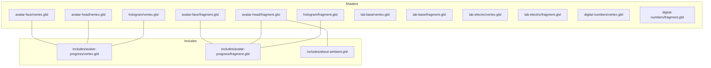
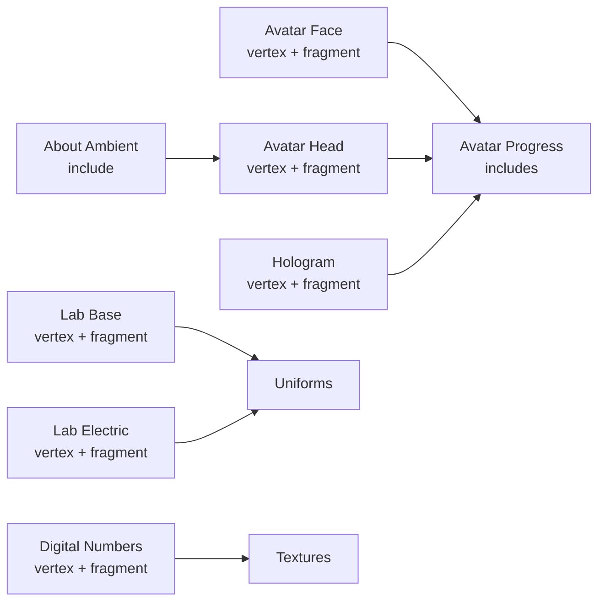
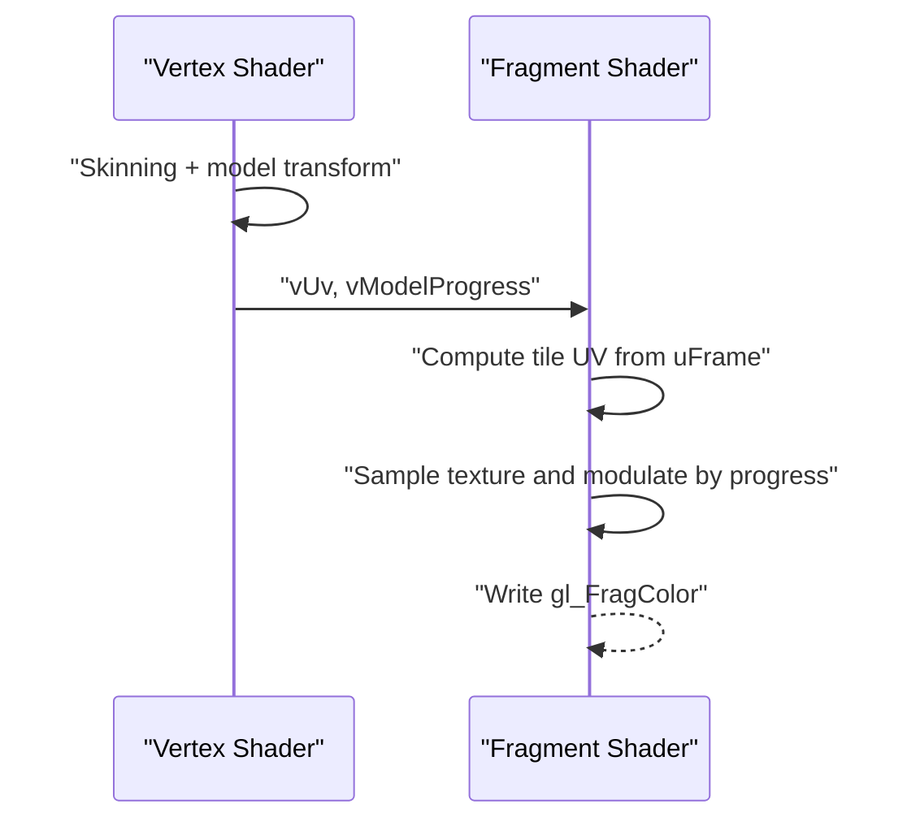
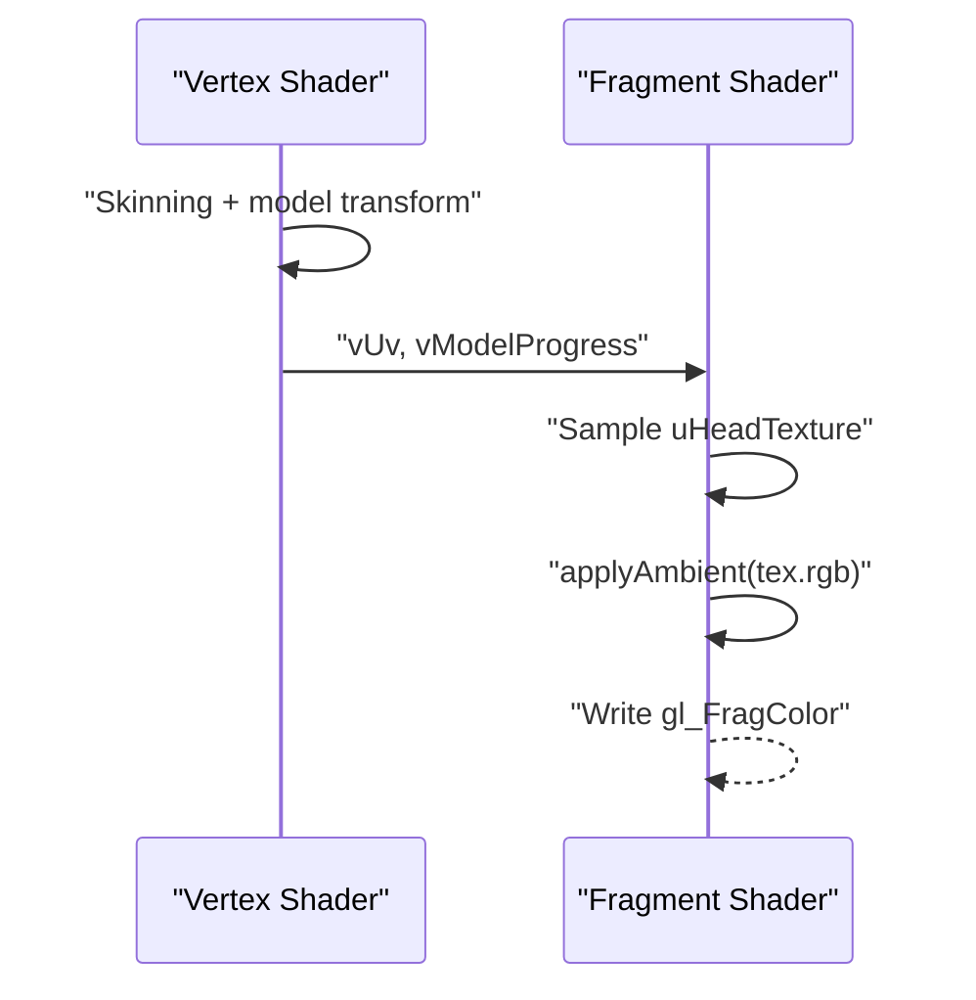
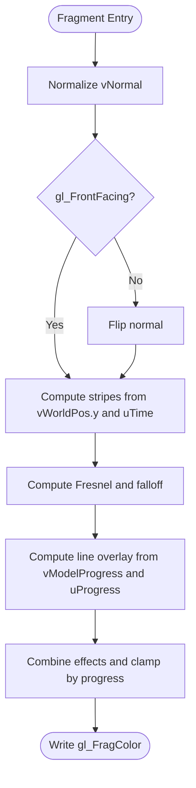
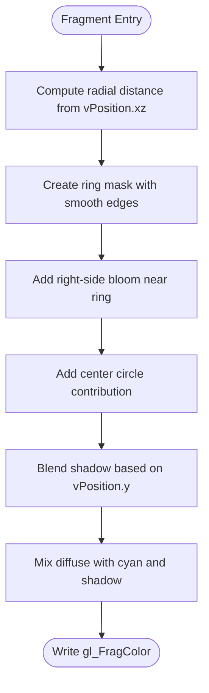
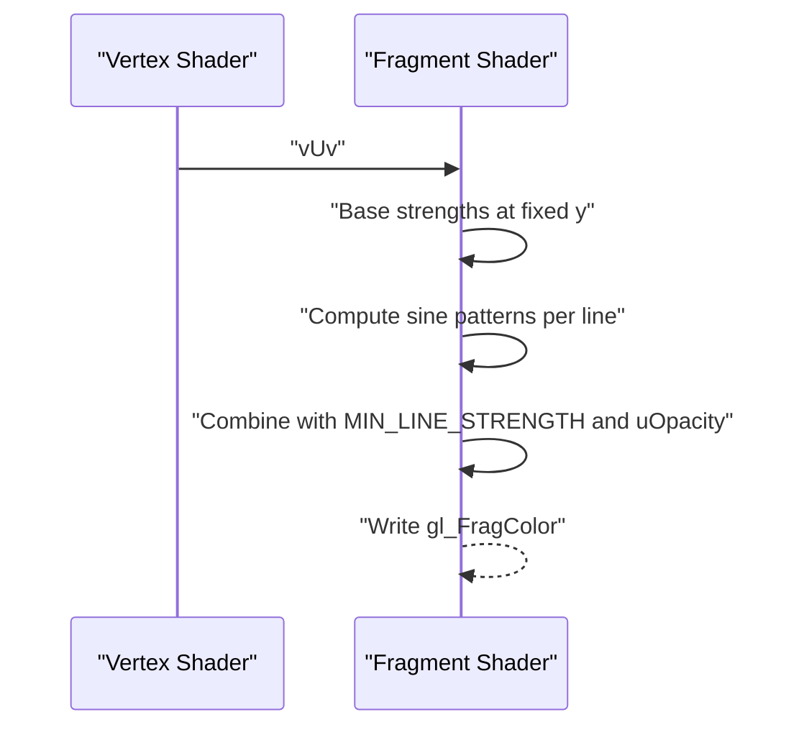
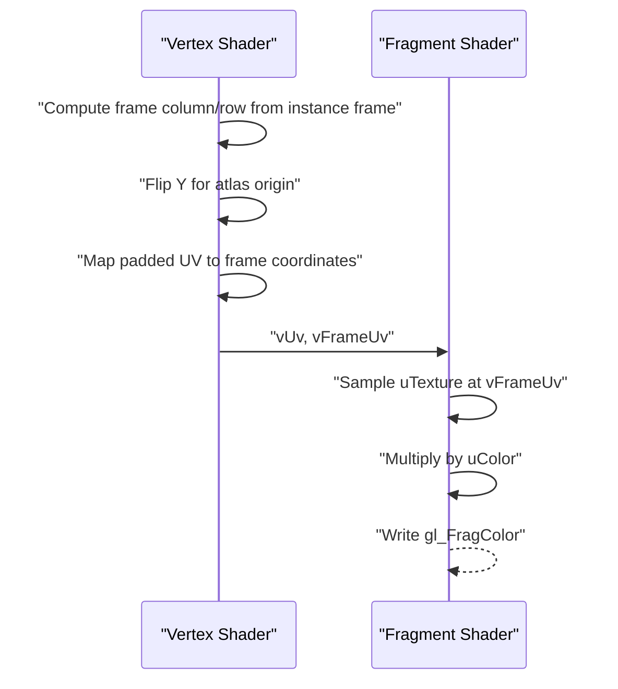
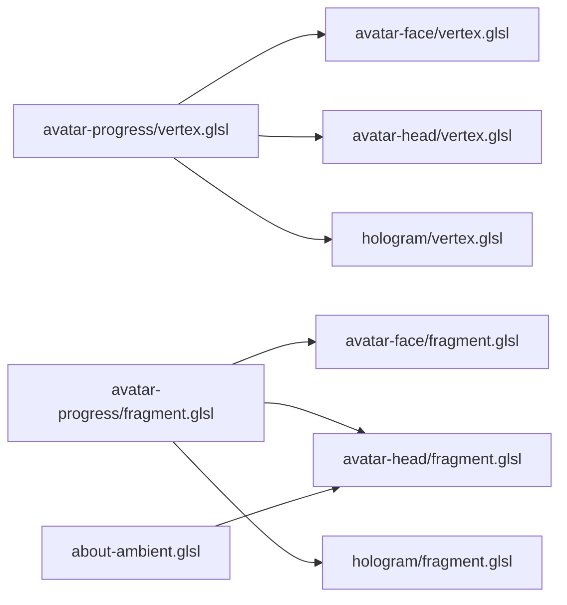

# Shader Programming and Materials

<cite>
**Referenced Files in This Document**
- [avatar-face/vertex.glsl](file://src/three/shaders/avatar-face/vertex.glsl)
- [avatar-face/fragment.glsl](file://src/three/shaders/avatar-face/fragment.glsl)
- [avatar-head/vertex.glsl](file://src/three/shaders/avatar-head/vertex.glsl)
- [avatar-head/fragment.glsl](file://src/three/shaders/avatar-head/fragment.glsl)
- [hologram/vertex.glsl](file://src/three/shaders/hologram/vertex.glsl)
- [hologram/fragment.glsl](file://src/three/shaders/hologram/fragment.glsl)
- [lab-base/vertex.glsl](file://src/three/shaders/lab-base/vertex.glsl)
- [lab-base/fragment.glsl](file://src/three/shaders/lab-base/fragment.glsl)
- [lab-electric/vertex.glsl](file://src/three/shaders/lab-electric/vertex.glsl)
- [lab-electric/fragment.glsl](file://src/three/shaders/lab-electric/fragment.glsl)
- [digital-numbers/vertex.glsl](file://src/three/shaders/digital-numbers/vertex.glsl)
- [digital-numbers/fragment.glsl](file://src/three/shaders/digital-numbers/fragment.glsl)
- [includes/avatar-progress/vertex.glsl](file://src/three/shaders/includes/avatar-progress/vertex.glsl)
- [includes/avatar-progress/fragment.glsl](file://src/three/shaders/includes/avatar-progress/fragment.glsl)
- [includes/about-ambient.glsl](file://src/three/shaders/includes/about-ambient.glsl)
</cite>

## Table of Contents
1. [Introduction](#introduction)
2. [Project Structure](#project-structure)
3. [Core Components](#core-components)
4. [Architecture Overview](#architecture-overview)
5. [Detailed Component Analysis](#detailed-component-analysis)
6. [Dependency Analysis](#dependency-analysis)
7. [Performance Considerations](#performance-considerations)
8. [Troubleshooting Guide](#troubleshooting-guide)
9. [Conclusion](#conclusion)
10. [Appendices](#appendices)

## Introduction
This document explains the GLSL shader programming system and custom materials used in the project. It covers the shader architecture for several materials (avatar-face, avatar-head, hologram, lab-base, lab-electric, digital-numbers), the includes system for reusable GLSL code fragments, material creation, texture handling, and uniform management. Advanced topics include procedural textures, screen-space effects, performance optimization, debugging techniques, and best practices for mobile and cross-platform compatibility.

## Project Structure
Shaders are organized per-material under a dedicated shaders directory. Each material defines a vertex and fragment shader pair. A shared includes directory centralizes reusable GLSL utilities such as avatar progress computation and ambient lighting helpers.

**Diagram sources**
- [avatar-face/vertex.glsl:1-15](file://src/three/shaders/avatar-face/vertex.glsl#L1-L15)
- [avatar-face/fragment.glsl:1-28](file://src/three/shaders/avatar-face/fragment.glsl#L1-L28)
- [avatar-head/vertex.glsl:1-15](file://src/three/shaders/avatar-head/vertex.glsl#L1-L15)
- [avatar-head/fragment.glsl:1-15](file://src/three/shaders/avatar-head/fragment.glsl#L1-L15)
- [hologram/vertex.glsl:1-36](file://src/three/shaders/hologram/vertex.glsl#L1-L36)
- [hologram/fragment.glsl:1-43](file://src/three/shaders/hologram/fragment.glsl#L1-L43)
- [lab-base/vertex.glsl:1-11](file://src/three/shaders/lab-base/vertex.glsl#L1-L11)
- [lab-base/fragment.glsl:1-47](file://src/three/shaders/lab-base/fragment.glsl#L1-L47)
- [lab-electric/vertex.glsl:1-11](file://src/three/shaders/lab-electric/vertex.glsl#L1-L11)
- [lab-electric/fragment.glsl:1-43](file://src/three/shaders/lab-electric/fragment.glsl#L1-L43)
- [digital-numbers/vertex.glsl:1-38](file://src/three/shaders/digital-numbers/vertex.glsl#L1-L38)
- [digital-numbers/fragment.glsl:1-13](file://src/three/shaders/digital-numbers/fragment.glsl#L1-L13)
- [includes/avatar-progress/vertex.glsl:1-7](file://src/three/shaders/includes/avatar-progress/vertex.glsl#L1-L7)
- [includes/avatar-progress/fragment.glsl:1-11](file://src/three/shaders/includes/avatar-progress/fragment.glsl#L1-L11)
- [includes/about-ambient.glsl:1-7](file://src/three/shaders/includes/about-ambient.glsl#L1-L7)

**Section sources**
- [avatar-face/vertex.glsl:1-15](file://src/three/shaders/avatar-face/vertex.glsl#L1-L15)
- [avatar-face/fragment.glsl:1-28](file://src/three/shaders/avatar-face/fragment.glsl#L1-L28)
- [avatar-head/vertex.glsl:1-15](file://src/three/shaders/avatar-head/vertex.glsl#L1-L15)
- [avatar-head/fragment.glsl:1-15](file://src/three/shaders/avatar-head/fragment.glsl#L1-L15)
- [hologram/vertex.glsl:1-36](file://src/three/shaders/hologram/vertex.glsl#L1-L36)
- [hologram/fragment.glsl:1-43](file://src/three/shaders/hologram/fragment.glsl#L1-L43)
- [lab-base/vertex.glsl:1-11](file://src/three/shaders/lab-base/vertex.glsl#L1-L11)
- [lab-base/fragment.glsl:1-47](file://src/three/shaders/lab-base/fragment.glsl#L1-L47)
- [lab-electric/vertex.glsl:1-11](file://src/three/shaders/lab-electric/vertex.glsl#L1-L11)
- [lab-electric/fragment.glsl:1-43](file://src/three/shaders/lab-electric/fragment.glsl#L1-L43)
- [digital-numbers/vertex.glsl:1-38](file://src/three/shaders/digital-numbers/vertex.glsl#L1-L38)
- [digital-numbers/fragment.glsl:1-13](file://src/three/shaders/digital-numbers/fragment.glsl#L1-L13)
- [includes/avatar-progress/vertex.glsl:1-7](file://src/three/shaders/includes/avatar-progress/vertex.glsl#L1-L7)
- [includes/avatar-progress/fragment.glsl:1-11](file://src/three/shaders/includes/avatar-progress/fragment.glsl#L1-L11)
- [includes/about-ambient.glsl:1-7](file://src/three/shaders/includes/about-ambient.glsl#L1-L7)

## Core Components
- Vertex shaders compute positions and pass varyings to the fragment stage. Many include avatar progress utilities and skinning support.
- Fragment shaders define surface appearance, lighting effects, and material-specific visuals. They rely on uniforms for textures, time, opacity, and color.
- Includes provide reusable logic for avatar progress blending and ambient color application.

Key responsibilities:
- Avatar-face and avatar-head: skinning-aware vertex processing, UV handling, and progress-based alpha modulation.
- Hologram: dynamic striping, Fresnel falloff, and line overlay controlled by model progress and time.
- Lab-base: procedural ring masking, shadow blending, and color mixing based on radial distance.
- Lab-electric: animated horizontal lines with sine wave patterns and configurable minimum visibility.
- Digital-numbers: texture atlas sampling with per-instance frame selection and color tinting.
- Includes: avatar progress computation and ambient lighting helper.

**Section sources**
- [avatar-face/vertex.glsl:1-15](file://src/three/shaders/avatar-face/vertex.glsl#L1-L15)
- [avatar-face/fragment.glsl:1-28](file://src/three/shaders/avatar-face/fragment.glsl#L1-L28)
- [avatar-head/vertex.glsl:1-15](file://src/three/shaders/avatar-head/vertex.glsl#L1-L15)
- [avatar-head/fragment.glsl:1-15](file://src/three/shaders/avatar-head/fragment.glsl#L1-L15)
- [hologram/vertex.glsl:1-36](file://src/three/shaders/hologram/vertex.glsl#L1-L36)
- [hologram/fragment.glsl:1-43](file://src/three/shaders/hologram/fragment.glsl#L1-L43)
- [lab-base/vertex.glsl:1-11](file://src/three/shaders/lab-base/vertex.glsl#L1-L11)
- [lab-base/fragment.glsl:1-47](file://src/three/shaders/lab-base/fragment.glsl#L1-L47)
- [lab-electric/vertex.glsl:1-11](file://src/three/shaders/lab-electric/vertex.glsl#L1-L11)
- [lab-electric/fragment.glsl:1-43](file://src/three/shaders/lab-electric/fragment.glsl#L1-L43)
- [digital-numbers/vertex.glsl:1-38](file://src/three/shaders/digital-numbers/vertex.glsl#L1-L38)
- [digital-numbers/fragment.glsl:1-13](file://src/three/shaders/digital-numbers/fragment.glsl#L1-L13)
- [includes/avatar-progress/vertex.glsl:1-7](file://src/three/shaders/includes/avatar-progress/vertex.glsl#L1-L7)
- [includes/avatar-progress/fragment.glsl:1-11](file://src/three/shaders/includes/avatar-progress/fragment.glsl#L1-L11)
- [includes/about-ambient.glsl:1-7](file://src/three/shaders/includes/about-ambient.glsl#L1-L7)

## Architecture Overview
The shader pipeline follows a consistent pattern:
- Vertex stage: transforms positions, optionally applies skinning, computes avatar progress, and passes varyings.
- Fragment stage: samples textures, evaluates material functions, blends with ambient or procedural effects, and writes final color.

**Diagram sources**
- [avatar-face/vertex.glsl:1-15](file://src/three/shaders/avatar-face/vertex.glsl#L1-L15)
- [avatar-face/fragment.glsl:1-28](file://src/three/shaders/avatar-face/fragment.glsl#L1-L28)
- [avatar-head/vertex.glsl:1-15](file://src/three/shaders/avatar-head/vertex.glsl#L1-L15)
- [avatar-head/fragment.glsl:1-15](file://src/three/shaders/avatar-head/fragment.glsl#L1-L15)
- [hologram/vertex.glsl:1-36](file://src/three/shaders/hologram/vertex.glsl#L1-L36)
- [hologram/fragment.glsl:1-43](file://src/three/shaders/hologram/fragment.glsl#L1-L43)
- [lab-base/vertex.glsl:1-11](file://src/three/shaders/lab-base/vertex.glsl#L1-L11)
- [lab-base/fragment.glsl:1-47](file://src/three/shaders/lab-base/fragment.glsl#L1-L47)
- [lab-electric/vertex.glsl:1-11](file://src/three/shaders/lab-electric/vertex.glsl#L1-L11)
- [lab-electric/fragment.glsl:1-43](file://src/three/shaders/lab-electric/fragment.glsl#L1-L43)
- [digital-numbers/vertex.glsl:1-38](file://src/three/shaders/digital-numbers/vertex.glsl#L1-L38)
- [digital-numbers/fragment.glsl:1-13](file://src/three/shaders/digital-numbers/fragment.glsl#L1-L13)
- [includes/avatar-progress/vertex.glsl:1-7](file://src/three/shaders/includes/avatar-progress/vertex.glsl#L1-L7)
- [includes/avatar-progress/fragment.glsl:1-11](file://src/three/shaders/includes/avatar-progress/fragment.glsl#L1-L11)
- [includes/about-ambient.glsl:1-7](file://src/three/shaders/includes/about-ambient.glsl#L1-L7)

## Detailed Component Analysis

### Avatar Face Material
- Vertex shader: includes skinning and avatar progress calculation; forwards UVs to fragment.
- Fragment shader: samples a texture atlas, computes tile UVs from a frame index, and modulates alpha using progress.

**Diagram sources**
- [avatar-face/vertex.glsl:1-15](file://src/three/shaders/avatar-face/vertex.glsl#L1-L15)
- [avatar-face/fragment.glsl:1-28](file://src/three/shaders/avatar-face/fragment.glsl#L1-L28)
- [includes/avatar-progress/vertex.glsl:1-7](file://src/three/shaders/includes/avatar-progress/vertex.glsl#L1-L7)
- [includes/avatar-progress/fragment.glsl:1-11](file://src/three/shaders/includes/avatar-progress/fragment.glsl#L1-L11)

**Section sources**
- [avatar-face/vertex.glsl:1-15](file://src/three/shaders/avatar-face/vertex.glsl#L1-L15)
- [avatar-face/fragment.glsl:1-28](file://src/three/shaders/avatar-face/fragment.glsl#L1-L28)
- [includes/avatar-progress/vertex.glsl:1-7](file://src/three/shaders/includes/avatar-progress/vertex.glsl#L1-L7)
- [includes/avatar-progress/fragment.glsl:1-11](file://src/three/shaders/includes/avatar-progress/fragment.glsl#L1-L11)

### Avatar Head Material
- Vertex shader: similar to avatar-face with skinning and progress.
- Fragment shader: applies an ambient color helper and uses a head-specific texture.

**Diagram sources**
- [avatar-head/vertex.glsl:1-15](file://src/three/shaders/avatar-head/vertex.glsl#L1-L15)
- [avatar-head/fragment.glsl:1-15](file://src/three/shaders/avatar-head/fragment.glsl#L1-L15)
- [includes/about-ambient.glsl:1-7](file://src/three/shaders/includes/about-ambient.glsl#L1-L7)

**Section sources**
- [avatar-head/vertex.glsl:1-15](file://src/three/shaders/avatar-head/vertex.glsl#L1-L15)
- [avatar-head/fragment.glsl:1-15](file://src/three/shaders/avatar-head/fragment.glsl#L1-L15)
- [includes/about-ambient.glsl:1-7](file://src/three/shaders/includes/about-ambient.glsl#L1-L7)

### Hologram Material
- Vertex shader: computes world position, normals, and progress; supports skinning.
- Fragment shader: procedural striping, Fresnel falloff, and line overlay based on model progress and time.

**Diagram sources**
- [hologram/vertex.glsl:1-36](file://src/three/shaders/hologram/vertex.glsl#L1-L36)
- [hologram/fragment.glsl:1-43](file://src/three/shaders/hologram/fragment.glsl#L1-L43)
- [includes/avatar-progress/fragment.glsl:1-11](file://src/three/shaders/includes/avatar-progress/fragment.glsl#L1-L11)

**Section sources**
- [hologram/vertex.glsl:1-36](file://src/three/shaders/hologram/vertex.glsl#L1-L36)
- [hologram/fragment.glsl:1-43](file://src/three/shaders/hologram/fragment.glsl#L1-L43)
- [includes/avatar-progress/fragment.glsl:1-11](file://src/three/shaders/includes/avatar-progress/fragment.glsl#L1-L11)

### Lab Base Material
- Vertex shader: passes UVs and position for fragment calculations.
- Fragment shader: radial distance-based ring masking, center bloom, and shadow blending.

**Diagram sources**
- [lab-base/vertex.glsl:1-11](file://src/three/shaders/lab-base/vertex.glsl#L1-L11)
- [lab-base/fragment.glsl:1-47](file://src/three/shaders/lab-base/fragment.glsl#L1-L47)

**Section sources**
- [lab-base/vertex.glsl:1-11](file://src/three/shaders/lab-base/vertex.glsl#L1-L11)
- [lab-base/fragment.glsl:1-47](file://src/three/shaders/lab-base/fragment.glsl#L1-L47)

### Lab Electric Material
- Vertex shader: passes UVs for fragment use.
- Fragment shader: three horizontal lines with animated sine patterns and configurable minimum strength.

**Diagram sources**
- [lab-electric/vertex.glsl:1-11](file://src/three/shaders/lab-electric/vertex.glsl#L1-L11)
- [lab-electric/fragment.glsl:1-43](file://src/three/shaders/lab-electric/fragment.glsl#L1-L43)

**Section sources**
- [lab-electric/vertex.glsl:1-11](file://src/three/shaders/lab-electric/vertex.glsl#L1-L11)
- [lab-electric/fragment.glsl:1-43](file://src/three/shaders/lab-electric/fragment.glsl#L1-L43)

### Digital Numbers Material
- Vertex shader: per-instance frame selection for texture atlas sampling; applies padding to UVs within the selected tile.
- Fragment shader: multiplies sampled color by a tint uniform.

**Diagram sources**
- [digital-numbers/vertex.glsl:1-38](file://src/three/shaders/digital-numbers/vertex.glsl#L1-L38)
- [digital-numbers/fragment.glsl:1-13](file://src/three/shaders/digital-numbers/fragment.glsl#L1-L13)

**Section sources**
- [digital-numbers/vertex.glsl:1-38](file://src/three/shaders/digital-numbers/vertex.glsl#L1-L38)
- [digital-numbers/fragment.glsl:1-13](file://src/three/shaders/digital-numbers/fragment.glsl#L1-L13)

### Includes System
Reusable GLSL utilities:
- Avatar progress: computes model-space progress from vertex position and exposes a smoothstep-based getter.
- About ambient: adds a constant ambient color scaled by a uniform strength.

**Diagram sources**
- [includes/avatar-progress/vertex.glsl:1-7](file://src/three/shaders/includes/avatar-progress/vertex.glsl#L1-L7)
- [includes/avatar-progress/fragment.glsl:1-11](file://src/three/shaders/includes/avatar-progress/fragment.glsl#L1-L11)
- [avatar-face/vertex.glsl:1-15](file://src/three/shaders/avatar-face/vertex.glsl#L1-L15)
- [avatar-face/fragment.glsl:1-28](file://src/three/shaders/avatar-face/fragment.glsl#L1-L28)
- [avatar-head/vertex.glsl:1-15](file://src/three/shaders/avatar-head/vertex.glsl#L1-L15)
- [avatar-head/fragment.glsl:1-15](file://src/three/shaders/avatar-head/fragment.glsl#L1-L15)
- [hologram/vertex.glsl:1-36](file://src/three/shaders/hologram/vertex.glsl#L1-L36)
- [hologram/fragment.glsl:1-43](file://src/three/shaders/hologram/fragment.glsl#L1-L43)
- [includes/about-ambient.glsl:1-7](file://src/three/shaders/includes/about-ambient.glsl#L1-L7)

**Section sources**
- [includes/avatar-progress/vertex.glsl:1-7](file://src/three/shaders/includes/avatar-progress/vertex.glsl#L1-L7)
- [includes/avatar-progress/fragment.glsl:1-11](file://src/three/shaders/includes/avatar-progress/fragment.glsl#L1-L11)
- [includes/about-ambient.glsl:1-7](file://src/three/shaders/includes/about-ambient.glsl#L1-L7)

## Dependency Analysis
- Vertex includes: avatar-face, avatar-head, and hologram share avatar progress utilities and skinning support.
- Fragment includes: avatar-face, avatar-head, and hologram reuse avatar progress; avatar-head additionally uses ambient helper.
- Uniform dependencies:
  - Avatar-face: uTexture, uFrame
  - Avatar-head: uHeadTexture, uHeadTextureSize
  - Hologram: uColor, uTime, uProgress
  - Lab-base: uDiffuseMap, uProgress
  - Lab-electric: uTime, uOpacity
  - Digital-numbers: uTexture, uColor
  - Includes: uProgress, uAmbientStrength

Potential coupling:
- Avatar progress depends on model matrix and vertex position; ensure consistent model transforms.
- Ambient helper depends on a single uniform; keep naming consistent across materials.

**Section sources**
- [avatar-face/fragment.glsl:1-28](file://src/three/shaders/avatar-face/fragment.glsl#L1-L28)
- [avatar-head/fragment.glsl:1-15](file://src/three/shaders/avatar-head/fragment.glsl#L1-L15)
- [hologram/fragment.glsl:1-43](file://src/three/shaders/hologram/fragment.glsl#L1-L43)
- [lab-base/fragment.glsl:1-47](file://src/three/shaders/lab-base/fragment.glsl#L1-L47)
- [lab-electric/fragment.glsl:1-43](file://src/three/shaders/lab-electric/fragment.glsl#L1-L43)
- [digital-numbers/fragment.glsl:1-13](file://src/three/shaders/digital-numbers/fragment.glsl#L1-L13)
- [includes/avatar-progress/fragment.glsl:1-11](file://src/three/shaders/includes/avatar-progress/fragment.glsl#L1-L11)
- [includes/about-ambient.glsl:1-7](file://src/three/shaders/includes/about-ambient.glsl#L1-L7)

## Performance Considerations
- Prefer smoothstep and saturate-style operations for cheap blending.
- Minimize branching in fragment shaders; use smooth interpolation where possible.
- Use texture atlases to reduce draw calls (as seen in avatar-face and digital-numbers).
- Keep uniform sets minimal; avoid unnecessary uniforms per material.
- Mobile optimization:
  - Reduce texture resolutions and use compressed formats.
  - Simplify procedural computations; cache constants in uniforms when feasible.
  - Favor dual-paraboloid or simpler ambient terms over expensive lighting.
- Cross-platform compatibility:
  - Validate GLSL ES conformance; avoid non-standard extensions.
  - Test on lower-end devices and adjust quality dynamically.

[No sources needed since this section provides general guidance]

## Troubleshooting Guide
Common issues and remedies:
- Incorrect alpha or transparency:
  - Verify progress-based alpha modulation and premultiplied textures.
  - Check that UV tiling aligns with atlas layout and Y-flip logic.
- Ambient color not applied:
  - Confirm uAmbientStrength is set and included file is present.
- Hologram artifacts:
  - Inspect Fresnel and stripe computations; ensure front/back facing handling.
- Lab ring mismatch:
  - Validate radius constants and smoothstep ranges; confirm vPosition.xz scaling.
- Electric lines flicker unexpectedly:
  - Adjust MIN_LINE_STRENGTH and ensure uOpacity affects only the animated portion.
- Uniform mismatches:
  - Ensure uniform names match between shader and material bindings.

**Section sources**
- [avatar-face/fragment.glsl:1-28](file://src/three/shaders/avatar-face/fragment.glsl#L1-L28)
- [avatar-head/fragment.glsl:1-15](file://src/three/shaders/avatar-head/fragment.glsl#L1-L15)
- [hologram/fragment.glsl:1-43](file://src/three/shaders/hologram/fragment.glsl#L1-L43)
- [lab-base/fragment.glsl:1-47](file://src/three/shaders/lab-base/fragment.glsl#L1-L47)
- [lab-electric/fragment.glsl:1-43](file://src/three/shaders/lab-electric/fragment.glsl#L1-L43)
- [includes/about-ambient.glsl:1-7](file://src/three/shaders/includes/about-ambient.glsl#L1-L7)

## Conclusion
The shader system leverages a modular includes architecture to share avatar progress and ambient logic across materials. Each material’s vertex and fragment shaders implement distinct visual strategies: texture atlasing, procedural patterns, and radial masking. By adhering to consistent uniform naming, minimizing branching, and optimizing for mobile targets, the system achieves both visual fidelity and broad compatibility.

[No sources needed since this section summarizes without analyzing specific files]

## Appendices

### Creating Custom Shaders
- Steps:
  - Define vertex and fragment GLSL files under the shaders directory.
  - Reuse includes for shared logic (e.g., avatar progress).
  - Declare required uniforms and bind them from the material.
  - Integrate with the Three.js material system by passing shader sources and uniforms.

[No sources needed since this section provides general guidance]

### Modifying Existing Materials
- Adjust uniforms (e.g., uProgress, uTime, uOpacity) to animate or tone down effects.
- Modify constants in fragment shaders to change shape or color.
- Swap textures for alternative appearances while preserving UV handling.

[No sources needed since this section provides general guidance]

### Integrating with Three.js Material System
- Bind uniforms and attributes consistently.
- Ensure vertex attributes (e.g., frame for digital-numbers) are passed per instance.
- Manage material lifecycle and dispose of textures and programs appropriately.

[No sources needed since this section provides general guidance]