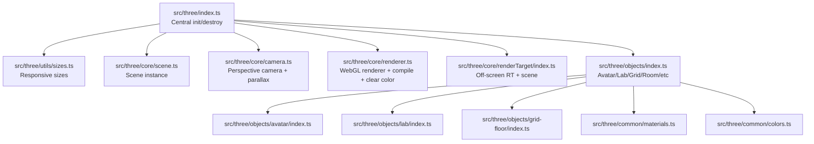
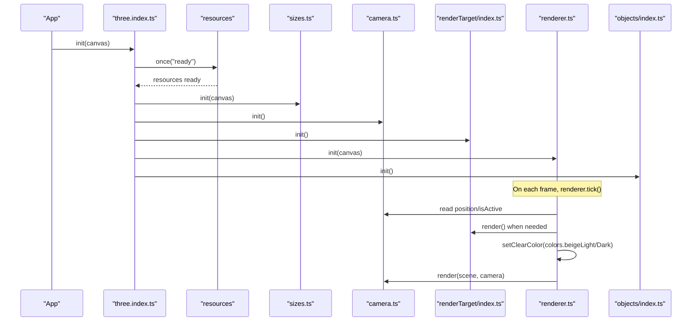
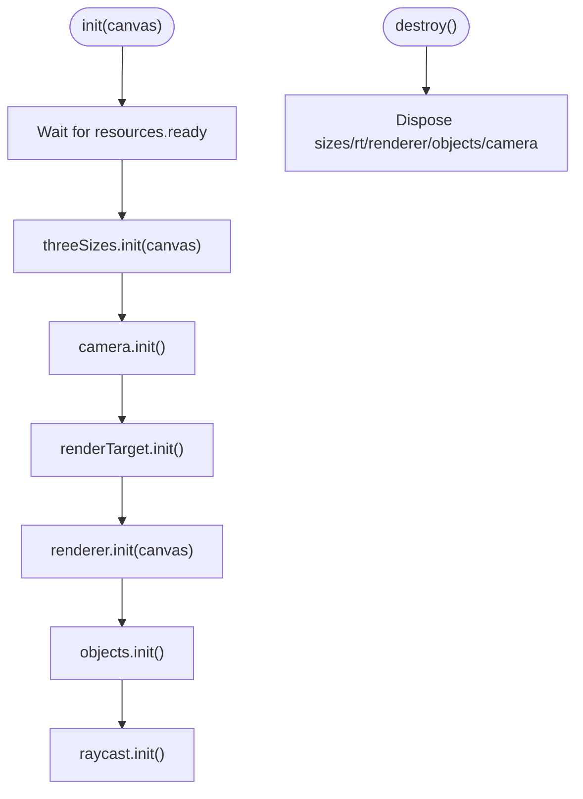
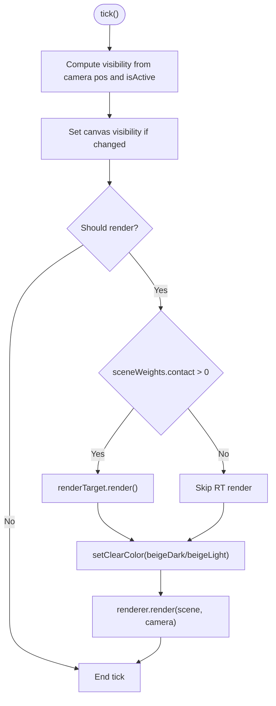
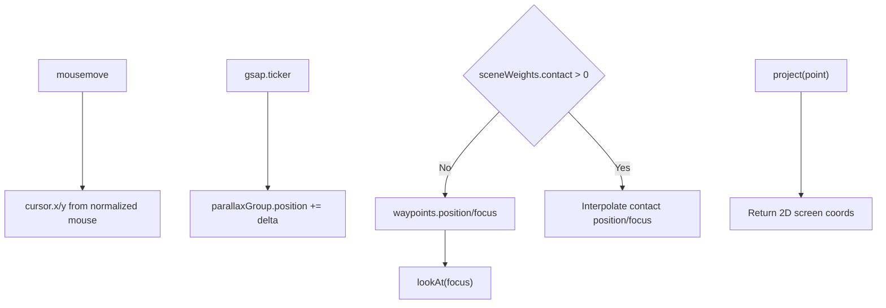
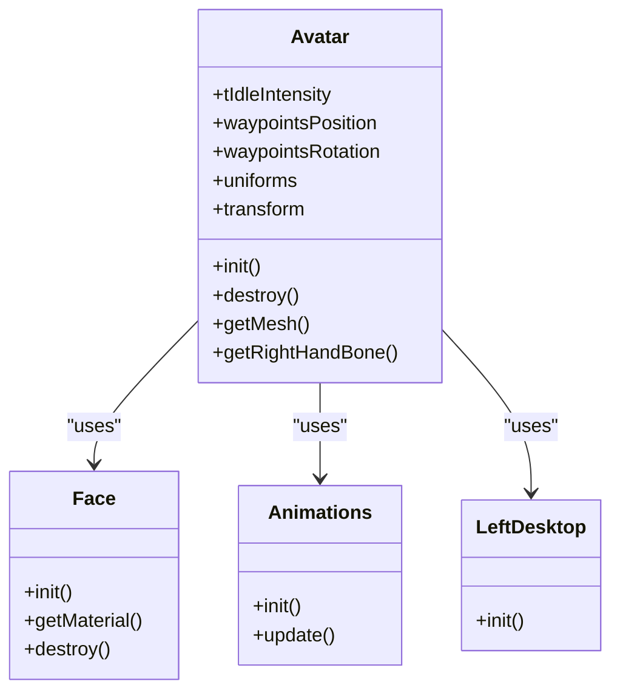
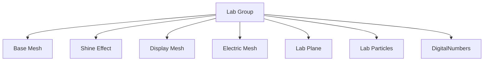
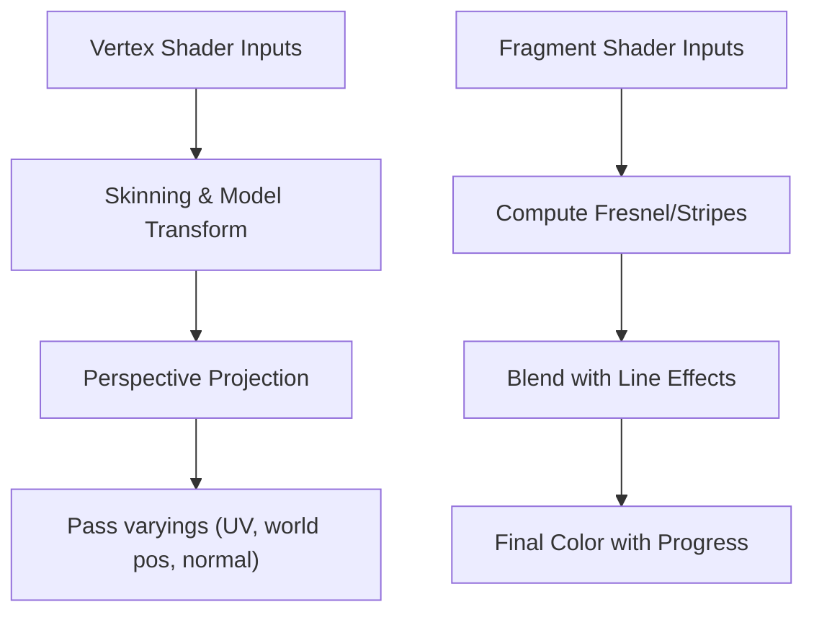
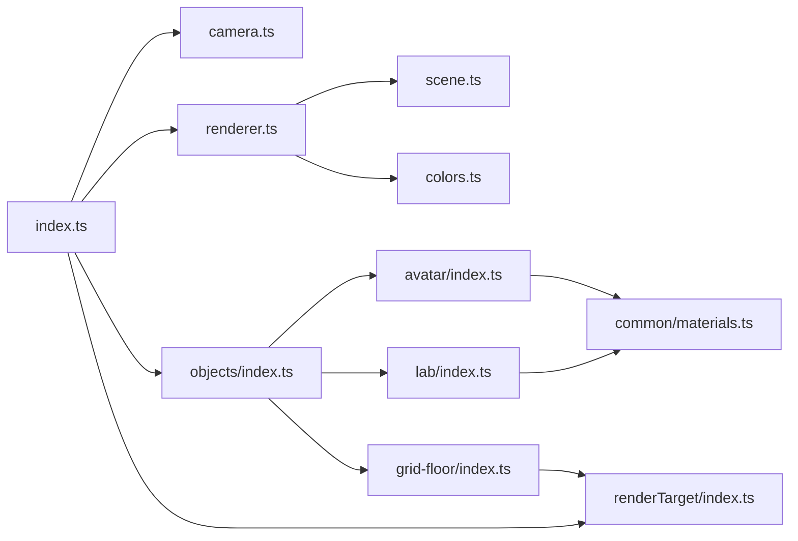

# Three.js 3D Graphics System

<cite>
**Referenced Files in This Document**
- [index.ts](file://src/three/index.ts)
- [scene.ts](file://src/three/core/scene.ts)
- [renderer.ts](file://src/three/core/renderer.ts)
- [camera.ts](file://src/three/core/camera.ts)
- [objects/index.ts](file://src/three/objects/index.ts)
- [renderTarget/index.ts](file://src/three/core/renderTarget/index.ts)
- [colors.ts](file://src/three/common/colors.ts)
- [materials.ts](file://src/three/common/materials.ts)
- [grid-floor/index.ts](file://src/three/objects/grid-floor/index.ts)
- [lab/index.ts](file://src/three/objects/lab/index.ts)
- [avatar/index.ts](file://src/three/objects/avatar/index.ts)
- [avatar-face/vertex.glsl](file://src/three/shaders/avatar-face/vertex.glsl)
- [avatar-face/fragment.glsl](file://src/three/shaders/avatar-face/fragment.glsl)
- [hologram/vertex.glsl](file://src/three/shaders/hologram/vertex.glsl)
- [hologram/fragment.glsl](file://src/three/shaders/hologram/fragment.glsl)
</cite>

## Table of Contents
1. [Introduction](#introduction)
2. [Project Structure](#project-structure)
3. [Core Components](#core-components)
4. [Architecture Overview](#architecture-overview)
5. [Detailed Component Analysis](#detailed-component-analysis)
6. [Dependency Analysis](#dependency-analysis)
7. [Performance Considerations](#performance-considerations)
8. [Troubleshooting Guide](#troubleshooting-guide)
9. [Conclusion](#conclusion)
10. [Appendices](#appendices)

## Introduction
This document describes the Three.js 3D graphics system that powers the visual environment of Portfolio-PM. It focuses on the centralized initialization and orchestration in the main module, the renderer-camera-scene coordination, the object system (avatar with holographic effects, room, lab with particle systems, and grid floor with digital numbers), shader implementations for custom materials, lighting and material creation, geometry definitions, color schemes, and performance optimizations including render targets and post-processing hooks. Practical guidance is also provided for extending the system with new 3D objects, customizing shaders, and integrating with the animation system.

## Project Structure
The Three.js subsystem is organized around a central initialization entry point that wires up the scene, camera, renderer, objects, and utilities. Rendering is driven by a ticker loop, with responsive sizing and optional off-screen render targets for specialized compositing.

**Diagram sources**
- [index.ts:1-35](file://src/three/index.ts#L1-L35)
- [scene.ts:1-6](file://src/three/core/scene.ts#L1-L6)
- [renderer.ts:1-119](file://src/three/core/renderer.ts#L1-L119)
- [camera.ts:1-119](file://src/three/core/camera.ts#L1-L119)
- [objects/index.ts:1-36](file://src/three/objects/index.ts#L1-L36)
- [renderTarget/index.ts:1-38](file://src/three/core/renderTarget/index.ts#L1-L38)
- [materials.ts:1-49](file://src/three/common/materials.ts#L1-L49)
- [colors.ts:1-7](file://src/three/common/colors.ts#L1-L7)

**Section sources**
- [index.ts:1-35](file://src/three/index.ts#L1-L35)
- [objects/index.ts:1-36](file://src/three/objects/index.ts#L1-L36)

## Core Components
- Central initialization orchestrator sets up sizes, camera, render target, renderer, objects, and raycasting after resources are ready.
- Scene encapsulates the global Three.js Scene instance.
- Renderer manages WebGL context creation, visibility lifecycle, resizing, clear color selection based on scenes, and compilation of scenes for shader readiness.
- Camera controls perspective projection, parallax offset via mouse movement, waypoint-driven positioning, and contact-mode transforms.
- Objects aggregator initializes avatar, room, lab, grid floor, and related effects, then triggers shader compilation.
- Render target provides an off-screen buffer for compositing special effects (e.g., reflections or post-processing passes).
- Materials and colors define reusable materials and color palettes used across the environment.

**Section sources**
- [index.ts:9-32](file://src/three/index.ts#L9-L32)
- [scene.ts:1-6](file://src/three/core/scene.ts#L1-L6)
- [renderer.ts:19-61](file://src/three/core/renderer.ts#L19-L61)
- [camera.ts:29-93](file://src/three/core/camera.ts#L29-L93)
- [objects/index.ts:11-22](file://src/three/objects/index.ts#L11-L22)
- [renderTarget/index.ts:6-26](file://src/three/core/renderTarget/index.ts#L6-L26)
- [materials.ts:12-48](file://src/three/common/materials.ts#L12-L48)
- [colors.ts:3-6](file://src/three/common/colors.ts#L3-L6)

## Architecture Overview
The runtime loop ties together initialization, animation updates, and rendering. The renderer conditionally renders to a render target during specific scenes, sets the clear color based on scene weights, and finally renders the main scene with the current camera.

**Diagram sources**
- [index.ts:11-22](file://src/three/index.ts#L11-L22)
- [renderer.ts:44-61](file://src/three/core/renderer.ts#L44-L61)
- [camera.ts:29-39](file://src/three/core/camera.ts#L29-L39)
- [renderTarget/index.ts:20-26](file://src/three/core/renderTarget/index.ts#L20-L26)
- [colors.ts:3-6](file://src/three/common/colors.ts#L3-L6)

## Detailed Component Analysis

### Centralized Initialization and Lifecycle
- Initializes responsive sizes, camera, render target, renderer, objects, and raycasting upon resource readiness.
- Provides a destroy routine to dispose of all subsystems and remove listeners/tickers.

**Diagram sources**
- [index.ts:11-32](file://src/three/index.ts#L11-L32)

**Section sources**
- [index.ts:9-32](file://src/three/index.ts#L9-L32)

### Renderer: Compilation, Clear Color, Visibility, and Render Target
- Creates WebGL renderer with antialias and configured canvas.
- Uses a GSAP ticker to drive per-frame updates.
- Resizes renderer to match internal sizes and pixel ratio.
- Conditionally renders to render target when a scene weight threshold is met.
- Selects clear color based on contact scene weight.
- Compiles scenes to pre-bind shaders and disable frustum culling for reliable first render.
- Disposes of the renderer and removes ticker on destroy.

**Diagram sources**
- [renderer.ts:44-61](file://src/three/core/renderer.ts#L44-L61)
- [colors.ts:3-6](file://src/three/common/colors.ts#L3-L6)

**Section sources**
- [renderer.ts:19-61](file://src/three/core/renderer.ts#L19-L61)
- [renderer.ts:63-108](file://src/three/core/renderer.ts#L63-L108)
- [renderer.ts:110-116](file://src/three/core/renderer.ts#L110-L116)

### Camera: Parallax, Waypoints, and Contact Transforms
- Sets up a perspective camera with aspect ratio derived from sizes.
- Wraps the camera inside a group to apply parallax offsets based on mouse position.
- Updates parallax smoothly each frame using delta time.
- Switches between waypoint-driven positioning and a contact-specific transform based on scene weights.
- Provides a project method to convert 3D positions to 2D screen coordinates.

**Diagram sources**
- [camera.ts:41-54](file://src/three/core/camera.ts#L41-L54)
- [camera.ts:75-93](file://src/three/core/camera.ts#L75-L93)
- [camera.ts:100-108](file://src/three/core/camera.ts#L100-L108)

**Section sources**
- [camera.ts:29-93](file://src/three/core/camera.ts#L29-L93)
- [camera.ts:95-98](file://src/three/core/camera.ts#L95-L98)
- [camera.ts:100-108](file://src/three/core/camera.ts#L100-L108)

### Objects Aggregator and Avatar System
- Initializes avatar, contact, dark plane, grid floor, lab, room, and sleeping sprite.
- Triggers renderer compilation after all objects are loaded.
- Avatar:
  - Clones a skeleton-based model and assigns per-part materials (head, face, and matcap variants).
  - Uses ShaderMaterial instances with custom vertex/fragment shaders and uniforms.
  - Manages visibility and uniforms based on scene weights and transitions.
  - Exposes right hand bone reference for interactions.

**Diagram sources**
- [avatar/index.ts:31-179](file://src/three/objects/avatar/index.ts#L31-L179)

**Section sources**
- [objects/index.ts:11-22](file://src/three/objects/index.ts#L11-L22)
- [avatar/index.ts:39-70](file://src/three/objects/avatar/index.ts#L39-L70)
- [avatar/index.ts:94-130](file://src/three/objects/avatar/index.ts#L94-L130)
- [avatar/index.ts:132-159](file://src/three/objects/avatar/index.ts#L132-L159)

### Room Environment and Materials
- Reusable materials for room and contact textures are created on demand with appropriate texture settings.
- Shadow catcher material uses a shader with uniforms for texture and color blending.

**Section sources**
- [materials.ts:12-30](file://src/three/common/materials.ts#L12-L30)
- [materials.ts:32-48](file://src/three/common/materials.ts#L32-L48)

### Lab Environment, Particle Systems, Shine, and Digital Numbers
- Loads lab model parts and attaches specialized effects (shine, base, electric, plane).
- Integrates a DigitalNumbers component to display animated frames synchronized with transitions.
- Particles and plane components are initialized and integrated into the lab group.

**Diagram sources**
- [lab/index.ts:26-69](file://src/three/objects/lab/index.ts#L26-L69)

**Section sources**
- [lab/index.ts:26-69](file://src/three/objects/lab/index.ts#L26-L69)

### Grid Floor with Digital Numbers
- Plane geometry oriented horizontally with custom shader material.
- Uniforms animate opacity, time, and progress based on scene transitions.
- Renders behind other objects via negative render order and aligns with lab position.

**Section sources**
- [grid-floor/index.ts:22-54](file://src/three/objects/grid-floor/index.ts#L22-L54)

### Render Target and Off-Screen Composition
- Creates a WebGLRenderTarget sized according to pixel ratio.
- Maintains a dedicated scene containing the camera’s parallax group for off-screen rendering.
- Renders to the target when needed and restores default render target afterward.

**Section sources**
- [renderTarget/index.ts:6-26](file://src/three/core/renderTarget/index.ts#L6-L26)
- [renderTarget/index.ts:32-35](file://src/three/core/renderTarget/index.ts#L32-L35)

### Shader Implementation Overview
- Avatar face shader:
  - Includes skinning and avatar progress helpers.
  - Uses atlas tiling controlled by a frame uniform to animate facial frames.
- Hologram shader:
  - Skinning-aware vertex shader computing world position and normals.
  - Fragment shader blends Fresnel, stripes, and line effects with progress and front-face handling.

**Diagram sources**
- [avatar-face/vertex.glsl:6-15](file://src/three/shaders/avatar-face/vertex.glsl#L6-L15)
- [avatar-face/fragment.glsl:10-28](file://src/three/shaders/avatar-face/fragment.glsl#L10-L28)
- [hologram/vertex.glsl:15-36](file://src/three/shaders/hologram/vertex.glsl#L15-L36)
- [hologram/fragment.glsl:13-43](file://src/three/shaders/hologram/fragment.glsl#L13-L43)

**Section sources**
- [avatar-face/vertex.glsl:1-15](file://src/three/shaders/avatar-face/vertex.glsl#L1-L15)
- [avatar-face/fragment.glsl:1-28](file://src/three/shaders/avatar-face/fragment.glsl#L1-L28)
- [hologram/vertex.glsl:1-36](file://src/three/shaders/hologram/vertex.glsl#L1-L36)
- [hologram/fragment.glsl:1-43](file://src/three/shaders/hologram/fragment.glsl#L1-L43)

## Dependency Analysis
The system exhibits clear layering:
- Entry depends on camera, renderer, objects, render target, sizes, resources, and raycasting.
- Renderer depends on scene, camera, sizes, and color palette.
- Objects depend on avatar, room, lab, grid floor, and others.
- Shaders are consumed by materials created in object modules and common materials.

**Diagram sources**
- [index.ts:1-7](file://src/three/index.ts#L1-L7)
- [renderer.ts:3-8](file://src/three/core/renderer.ts#L3-L8)
- [objects/index.ts:1-9](file://src/three/objects/index.ts#L1-L9)
- [renderTarget/index.ts:1-4](file://src/three/core/renderTarget/index.ts#L1-L4)
- [avatar/index.ts:1-15](file://src/three/objects/avatar/index.ts#L1-L15)
- [lab/index.ts:1-11](file://src/three/objects/lab/index.ts#L1-L11)
- [grid-floor/index.ts:1-8](file://src/three/objects/grid-floor/index.ts#L1-L8)
- [materials.ts:1-6](file://src/three/common/materials.ts#L1-L6)

**Section sources**
- [index.ts:1-7](file://src/three/index.ts#L1-L7)
- [renderer.ts:3-8](file://src/three/core/renderer.ts#L3-L8)
- [objects/index.ts:1-9](file://src/three/objects/index.ts#L1-L9)

## Performance Considerations
- Pre-compilation: Scenes are compiled before rendering to reduce first-draw stalls and ensure shader readiness.
- Frustum culling toggles: During compilation, objects are temporarily made non-culled to guarantee initial draw.
- Conditional rendering: Render target is only used when a scene weight threshold is met, avoiding unnecessary off-screen passes.
- Clear color selection: Dynamic clear color avoids costly full-buffer clears when switching scenes.
- Geometry and material tuning: Transparent materials and depth settings are configured per object to minimize overdraw and enable correct blending.
- Visibility control: Canvas visibility is toggled based on camera validity and activity to avoid rendering when offscreen.

Practical tips:
- Prefer ShaderMaterial for custom effects and reuse uniforms to minimize material churn.
- Keep shader complexity reasonable; use helper includes sparingly.
- Use render orders to manage transparency and overlays.
- Dispose of geometries and materials when removing objects to prevent memory leaks.

**Section sources**
- [renderer.ts:63-108](file://src/three/core/renderer.ts#L63-L108)
- [renderer.ts:44-61](file://src/three/core/renderer.ts#L44-L61)
- [avatar/index.ts:99-107](file://src/three/objects/avatar/index.ts#L99-L107)
- [grid-floor/index.ts:30-34](file://src/three/objects/grid-floor/index.ts#L30-L34)

## Troubleshooting Guide
Common issues and remedies:
- Renderer not initialized: Accessor functions throw if called before init; ensure initialization order is respected.
- Missing textures or materials: Verify resource loading and texture settings (flipY, colorSpace, mipmaps).
- Shader errors: Confirm shader includes exist and uniforms are provided; use pre-compilation to surface issues early.
- Off-screen rendering artifacts: Ensure render target size matches pixel ratio and is cleared appropriately.
- Performance drops:
  - Disable frustum culling only during compilation.
  - Reduce shader complexity or batch materials.
  - Avoid frequent geometry/material creation; reuse instances.
- Memory leaks:
  - Remove ticker callbacks and event listeners on destroy.
  - Dispose of geometries and materials when removing objects.
- Visual glitches:
  - Check render order for transparent objects.
  - Verify depthWrite/depthTest flags match intended blending.

**Section sources**
- [renderer.ts:33-36](file://src/three/core/renderer.ts#L33-L36)
- [renderer.ts:110-116](file://src/three/core/renderer.ts#L110-L116)
- [avatar/index.ts:161-166](file://src/three/objects/avatar/index.ts#L161-L166)
- [grid-floor/index.ts:56-63](file://src/three/objects/grid-floor/index.ts#L56-L63)

## Conclusion
The Three.js system in Portfolio-PM is structured around a clean initialization pipeline, robust renderer-camera-scene coordination, and modular object management. Custom shaders power avatar and environment effects, while render targets and careful material configuration support dynamic visuals and performance. Following the integration patterns and performance guidelines enables safe extension with new objects and effects.

## Appendices

### Adding a New 3D Object
- Define geometry and material (prefer ShaderMaterial for custom effects).
- Create an init/destroy pair that adds/removes the object from the scene or a dedicated group.
- Register the object in the objects aggregator and trigger compilation after initialization.
- Integrate with animation updates via the GSAP ticker if needed.

**Section sources**
- [objects/index.ts:11-22](file://src/three/objects/index.ts#L11-L22)
- [avatar/index.ts:31-37](file://src/three/objects/avatar/index.ts#L31-L37)

### Customizing Shaders
- Place vertex.glsl and fragment.glsl under the shaders directory.
- Import the shader sources in the material creator and pass uniforms as needed.
- Use pre-compilation to catch shader errors early.

**Section sources**
- [avatar-face/vertex.glsl:1-15](file://src/three/shaders/avatar-face/vertex.glsl#L1-L15)
- [avatar-face/fragment.glsl:1-28](file://src/three/shaders/avatar-face/fragment.glsl#L1-L28)
- [hologram/vertex.glsl:1-36](file://src/three/shaders/hologram/vertex.glsl#L1-L36)
- [hologram/fragment.glsl:1-43](file://src/three/shaders/hologram/fragment.glsl#L1-L43)

### Integrating with Animation System
- Use scene weights and transitions to drive object visibility and uniforms.
- Synchronize time-based uniforms with the GSAP ticker for smooth animations.
- Coordinate camera transforms and parallax with scene modes.

**Section sources**
- [avatar/index.ts:132-159](file://src/three/objects/avatar/index.ts#L132-L159)
- [grid-floor/index.ts:45-54](file://src/three/objects/grid-floor/index.ts#L45-L54)
- [lab/index.ts:71-75](file://src/three/objects/lab/index.ts#L71-L75)