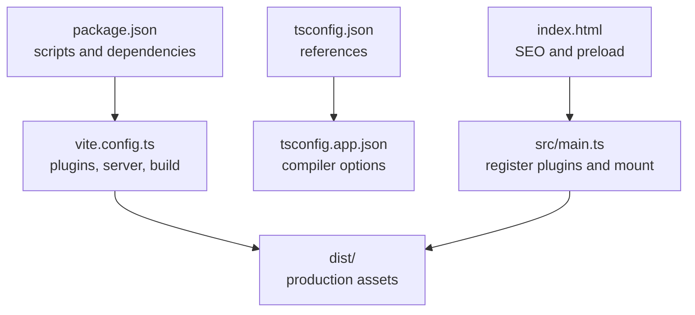
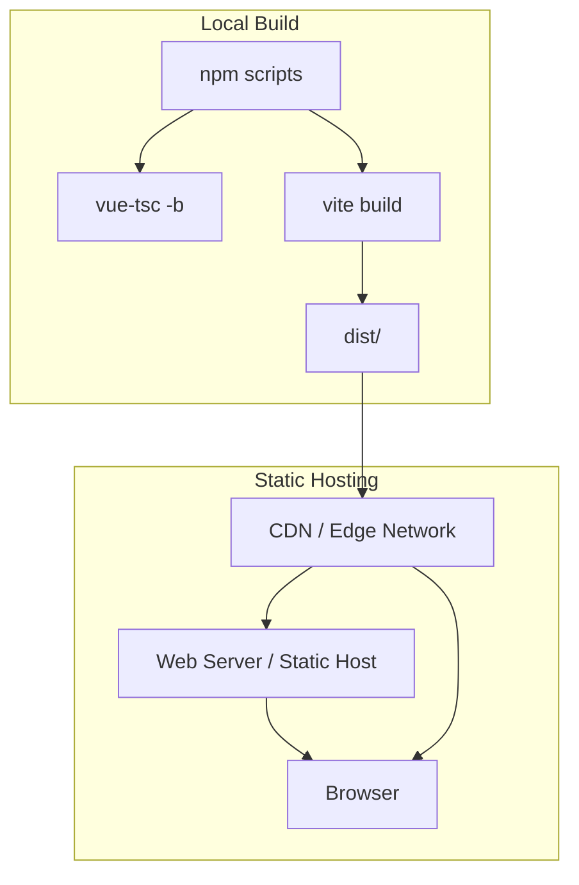
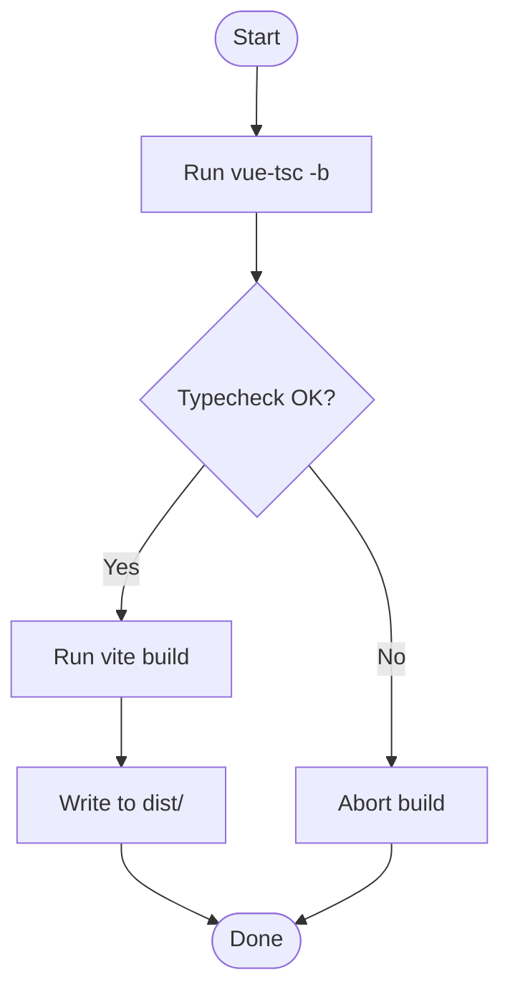
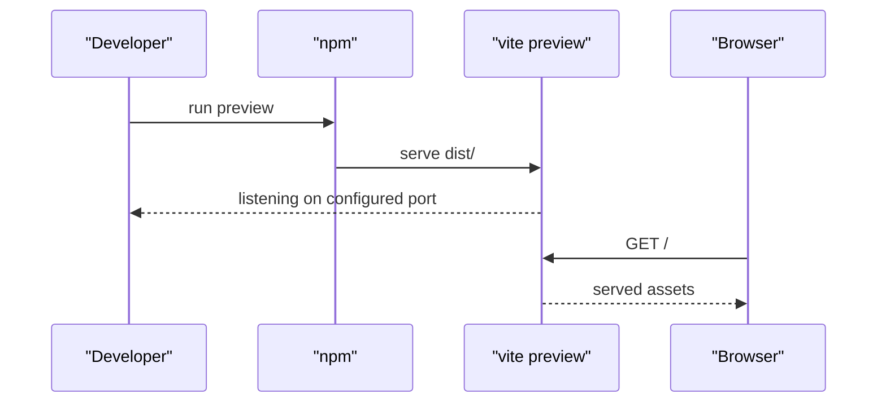
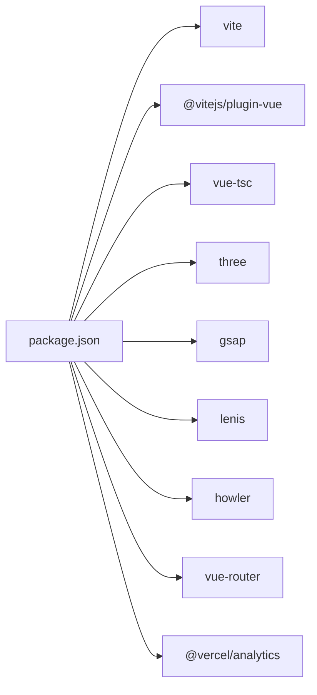

# Deployment and Maintenance

<cite>
**Referenced Files in This Document**
- [package.json](file://package.json)
- [vite.config.ts](file://vite.config.ts)
- [tsconfig.json](file://tsconfig.json)
- [tsconfig.app.json](file://tsconfig.app.json)
- [README.md](file://README.md)
- [src/main.ts](file://src/main.ts)
- [index.html](file://index.html)
</cite>

## Table of Contents
1. [Introduction](#introduction)
2. [Project Structure](#project-structure)
3. [Core Components](#core-components)
4. [Architecture Overview](#architecture-overview)
5. [Detailed Component Analysis](#detailed-component-analysis)
6. [Dependency Analysis](#dependency-analysis)
7. [Performance Considerations](#performance-considerations)
8. [Troubleshooting Guide](#troubleshooting-guide)
9. [Conclusion](#conclusion)
10. [Appendices](#appendices)

## Introduction
This document provides comprehensive deployment and maintenance guidance for Portfolio-PM. It covers the production build pipeline using npm scripts, type checking with vue-tsc, Vite bundling optimizations, and local production testing via vite preview. It also outlines deployment strategies for static hosting and CDNs, performance optimization techniques, maintenance procedures for updates and security, asset optimization and bundle analysis, content and feature updates, and operational practices such as monitoring and disaster recovery.

## Project Structure
Portfolio-PM is a Vue 3 + TypeScript + Vite application with a modern frontend stack. The build and runtime rely on:
- npm scripts for development, building, and previewing
- Vite for bundling and dev server
- vue-tsc for type checking
- TypeScript configuration split across app and node contexts
- HTML entry with SEO metadata and preloaded fonts
- Application bootstrap registering GSAP ScrollTrigger and mounting the root component

**Diagram sources**
- [package.json:6-12](file://package.json#L6-L12)
- [vite.config.ts:1-45](file://vite.config.ts#L1-L45)
- [tsconfig.json:1-8](file://tsconfig.json#L1-L8)
- [tsconfig.app.json:1-18](file://tsconfig.app.json#L1-L18)
- [index.html:1-72](file://index.html#L1-L72)
- [src/main.ts:1-10](file://src/main.ts#L1-L10)

**Section sources**
- [README.md:7-14](file://README.md#L7-L14)
- [package.json:6-12](file://package.json#L6-L12)
- [vite.config.ts:30-43](file://vite.config.ts#L30-L43)
- [tsconfig.json:1-8](file://tsconfig.json#L1-L8)
- [tsconfig.app.json:1-18](file://tsconfig.app.json#L1-L18)
- [index.html:1-72](file://index.html#L1-L72)
- [src/main.ts:1-10](file://src/main.ts#L1-L10)

## Core Components
- Build pipeline
  - Type checking: vue-tsc -b
  - Bundling: vite build
  - Combined script: npm run build
- Local production preview: npm run preview
- Development server: npm run dev
- Type checking only: npm run typecheck
- Environment helpers: env:copy-example and env:remove

Key build-time behaviors:
- Vite build outputs to ./dist with hashed asset/chunk filenames
- Source maps disabled for production
- Chunk size warning limit increased to reduce noise
- Asset inclusion extended to GLSL, KTX2, and image formats
- CSS preprocessor configured with shared SCSS mixins

Runtime initialization:
- GSAP ScrollTrigger registered globally
- Root component mounted to #app
- HTML includes canonical URL, Open Graph, Twitter metadata, and font preloads

**Section sources**
- [package.json:6-12](file://package.json#L6-L12)
- [vite.config.ts:30-43](file://vite.config.ts#L30-L43)
- [vite.config.ts:23-29](file://vite.config.ts#L23-L29)
- [vite.config.ts:22](file://vite.config.ts#L22)
- [vite.config.ts:19-21](file://vite.config.ts#L19-L21)
- [src/main.ts:1-10](file://src/main.ts#L1-L10)
- [index.html:1-72](file://index.html#L1-L72)

## Architecture Overview
The deployment architecture centers on Vite’s build pipeline and static hosting delivery. The production build produces cache-friendly artifacts with hashed filenames, enabling long-term caching and CDN optimization. The runtime initializes the Vue app and registers motion libraries for smooth interactions.

**Diagram sources**
- [package.json:6-12](file://package.json#L6-L12)
- [vite.config.ts:30-43](file://vite.config.ts#L30-L43)

## Detailed Component Analysis

### Production Build Pipeline
The production build integrates type checking and bundling:
- Type checking runs first to catch errors early
- Vite bundles the application with optimized chunking and hashed filenames
- Source maps are disabled for production performance and security
- Asset hashing enables long-lived caches and efficient invalidation

**Diagram sources**
- [package.json:8](file://package.json#L8)
- [vite.config.ts:30-43](file://vite.config.ts#L30-L43)

**Section sources**
- [package.json:8](file://package.json#L8)
- [vite.config.ts:32](file://vite.config.ts#L32)
- [vite.config.ts:38-41](file://vite.config.ts#L38-L41)

### Local Production Testing (Preview)
The preview command serves the production build locally to validate behavior before deployment:
- Uses vite preview to serve the dist/ directory
- Useful for verifying asset paths, routing, and performance characteristics

**Diagram sources**
- [package.json:9](file://package.json#L9)
- [vite.config.ts:14-18](file://vite.config.ts#L14-L18)

**Section sources**
- [package.json:9](file://package.json#L9)
- [vite.config.ts:14-18](file://vite.config.ts#L14-L18)

### Asset Optimization and CDN Considerations
Optimization strategies derived from configuration:
- Hashed asset and chunk filenames for cache busting
- Extended asset include list supports GLSL, KTX2, and images
- CSS preprocessor configured with shared mixins
- Font preloading in HTML improves Core Web Vitals

Recommendations:
- Enable compression (gzip/brotli) on the web server
- Configure cache-control headers for long-term caching of hashed assets
- Use a CDN with global edge locations to minimize latency
- Consider HTTP/2 or HTTP/3 for multiplexed requests
- Monitor image and video sizes; leverage modern formats (AVIF/HEIC) where supported

**Section sources**
- [vite.config.ts:38-41](file://vite.config.ts#L38-L41)
- [vite.config.ts:22](file://vite.config.ts#L22)
- [vite.config.ts:26](file://vite.config.ts#L26)
- [index.html:36-41](file://index.html#L36-L41)

### Deployment Strategies
Static site deployment:
- Build dist/ locally or in CI
- Upload dist/ to static hosting (e.g., Vercel, Netlify, GitHub Pages)
- Ensure trailing slash redirects and SPA fallback routing are configured

CDN considerations:
- Point domain DNS to CDN provider
- Set up origin pull or push deployment
- Configure cache policies and compression
- Enable HTTPS and security headers

SPA routing:
- Configure 404 fallback to index.html for client-side routes
- Canonical URLs and sitemaps help search engines index dynamic routes

**Section sources**
- [README.md:11-14](file://README.md#L11-L14)
- [index.html:12-13](file://index.html#L12-L13)

### Maintenance Procedures
- Dependency updates
  - Review package.json regularly
  - Run typecheck after updates to catch breaking changes
  - Test preview build to confirm runtime stability
- Security patches
  - Monitor advisory notifications
  - Pin major versions cautiously; automate patch/minor updates
  - Rebuild and retest after applying patches
- Performance monitoring
  - Track Lighthouse scores and field data trends
  - Observe Core Web Vitals (LCP, FID, CLS)
  - Use analytics to monitor bounce rates and engagement
- Troubleshooting
  - Validate build logs for chunk size warnings and missing assets
  - Confirm hashed filenames are present in dist/
  - Verify HTML metadata and canonical URLs

**Section sources**
- [package.json:14-22](file://package.json#L14-L22)
- [package.json:23-36](file://package.json#L23-L36)
- [vite.config.ts:34](file://vite.config.ts#L34)
- [index.html:7-34](file://index.html#L7-L34)

### Content Management and Feature Updates
- Content updates
  - Add or modify project entries under src/content/projects/{en,de}/<slug>.ts
  - Keep slugs aligned with projectIds in src/content/projects/index.ts
  - Update previews in src/content/projects/previews/
- Feature additions
  - Extend src/three/ for WebGL/GLSL enhancements
  - Add new icons to src/components/icons/
  - Introduce new SCSS mixins and variables under src/assets/styles/
- System upgrades
  - Update TypeScript and Vue ecosystem packages gradually
  - Validate vite.config.ts and tsconfig.app.json after upgrades
  - Re-run typecheck and build to ensure compatibility

**Section sources**
- [README.md:18-21](file://README.md#L18-L21)
- [tsconfig.app.json:3-13](file://tsconfig.app.json#L3-L13)

### Backup, Monitoring, and Disaster Recovery
- Backups
  - Version control (Git) for source and configuration
  - Archive dist/ artifacts per release
  - Store environment-specific secrets securely (avoid committing .env)
- Monitoring
  - Use built-in analytics integration for traffic insights
  - Set up synthetic checks for uptime and performance
- Disaster recovery
  - Maintain a documented rebuild procedure
  - Keep a recent working dist/ artifact
  - Automate deployment to minimize manual intervention during incidents

**Section sources**
- [package.json:14-16](file://package.json#L14-L16)

## Dependency Analysis
The project’s dependency graph focuses on build-time and runtime responsibilities:
- Build/runtime orchestration: npm scripts
- Type safety: vue-tsc, TypeScript configs
- Bundling and dev server: Vite, @vitejs/plugin-vue
- 3D rendering and shaders: three, vite-plugin-glsl
- Motion and scroll effects: gsap, lenis
- Audio playback: howler
- Routing: vue-router
- Analytics: @vercel/analytics

**Diagram sources**
- [package.json:14-36](file://package.json#L14-L36)

**Section sources**
- [package.json:14-36](file://package.json#L14-L36)

## Performance Considerations
- Bundle size and chunking
  - Inspect dist/ output and monitor warnings
  - Split large dependencies and defer non-critical features
- Asset delivery
  - Use hashed filenames and long cache TTLs
  - Compress assets and enable HTTP/2
- Rendering and UX
  - Preload critical fonts and assets
  - Minimize main-thread work; leverage off-main-thread animations
- Observability
  - Track Lighthouse scores and real-user metrics
  - Monitor Core Web Vitals and error rates

[No sources needed since this section provides general guidance]

## Troubleshooting Guide
Common production issues and resolutions:
- Build fails due to type errors
  - Run typecheck to identify issues; fix before vite build
- Missing assets after build
  - Verify asset include patterns and hashed filenames
- Preview server not serving content
  - Ensure dist/ exists and vite preview targets the correct directory
- Runtime errors with GSAP or three.js
  - Confirm plugin registration and module availability in the bundle

**Section sources**
- [package.json:10](file://package.json#L10)
- [vite.config.ts:38-41](file://vite.config.ts#L38-L41)
- [src/main.ts:4-7](file://src/main.ts#L4-L7)

## Conclusion
Portfolio-PM’s deployment and maintenance rely on a robust Vite-based build pipeline, strong type safety, and performance-focused asset delivery. By following the outlined procedures—building with vue-tsc and vite, validating with preview, deploying to static hosts or CDNs, and maintaining continuous monitoring—you can ensure reliable, fast, and secure operation of the portfolio site.

[No sources needed since this section summarizes without analyzing specific files]

## Appendices
- Quick reference
  - Build: npm run build
  - Preview: npm run preview
  - Typecheck: npm run typecheck
  - Dev: npm run dev
  - Copy env example: npm run env:copy-example
  - Remove env: npm run env:remove

**Section sources**
- [README.md:7-14](file://README.md#L7-L14)
- [package.json:6-12](file://package.json#L6-L12)