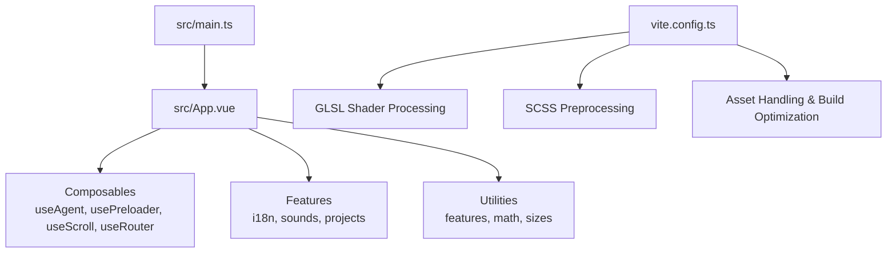
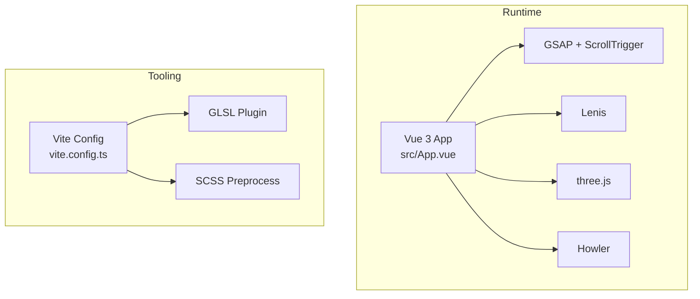
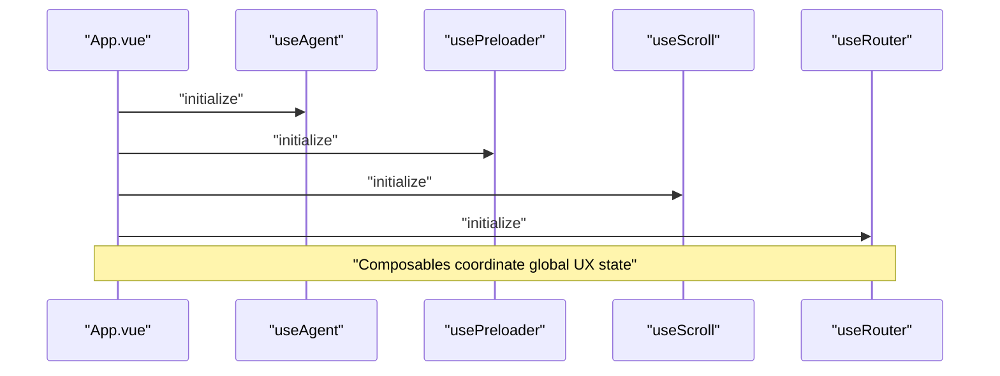
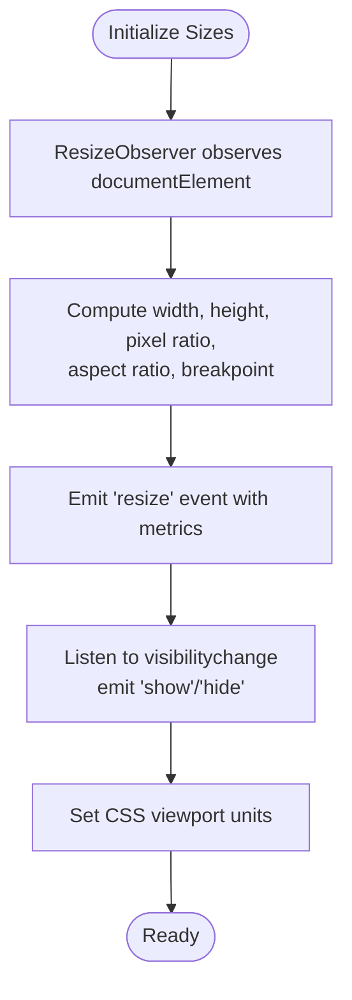
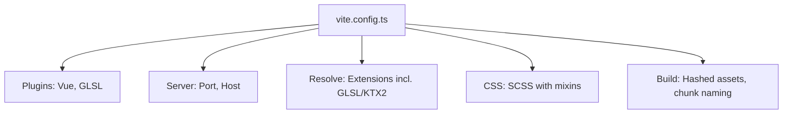
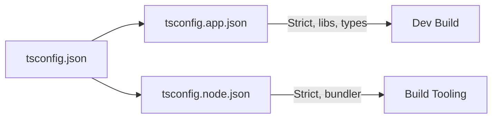
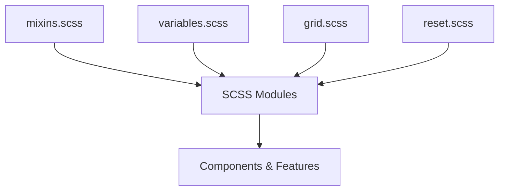
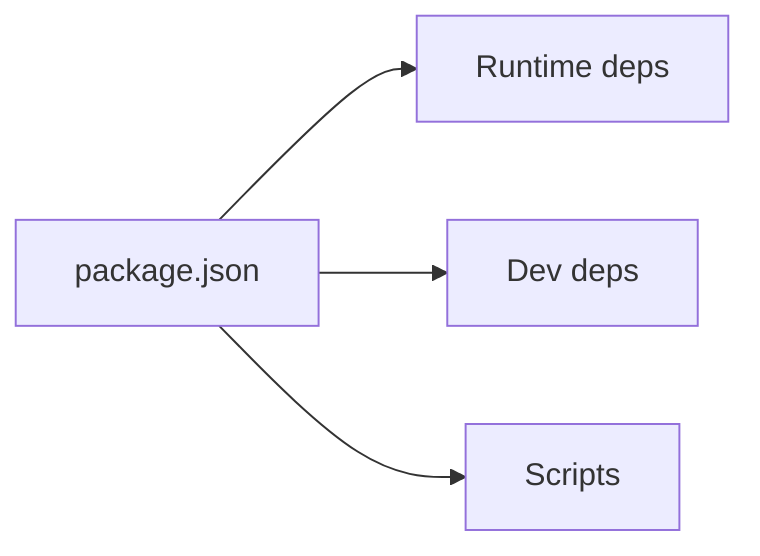

# Development Guidelines

<cite>
**Referenced Files in This Document**
- [package.json](file://package.json)
- [vite.config.ts](file://vite.config.ts)
- [tsconfig.json](file://tsconfig.json)
- [tsconfig.app.json](file://tsconfig.app.json)
- [tsconfig.node.json](file://tsconfig.node.json)
- [src/main.ts](file://src/main.ts)
- [src/App.vue](file://src/App.vue)
- [src/composables/useAgent.ts](file://src/composables/useAgent.ts)
- [src/composables/usePreloader.ts](file://src/composables/usePreloader.ts)
- [src/composables/useScroll.ts](file://src/composables/useScroll.ts)
- [src/composables/useRouter.ts](file://src/composables/useRouter.ts)
- [src/utils/features.ts](file://src/utils/features.ts)
- [src/utils/math.ts](file://src/utils/math.ts)
- [src/utils/sizes.ts](file://src/utils/sizes.ts)
- [README.md](file://README.md)
</cite>

## Table of Contents
1. [Introduction](#introduction)
2. [Project Structure](#project-structure)
3. [Core Components](#core-components)
4. [Architecture Overview](#architecture-overview)
5. [Detailed Component Analysis](#detailed-component-analysis)
6. [Dependency Analysis](#dependency-analysis)
7. [Performance Considerations](#performance-considerations)
8. [Troubleshooting Guide](#troubleshooting-guide)
9. [Conclusion](#conclusion)
10. [Appendices](#appendices)

## Introduction
This document defines development guidelines for Portfolio-PM, focusing on code organization, Vue 3 composition patterns, TypeScript configuration, utility modules, Vite build pipeline, SCSS architecture, and operational practices. It consolidates established patterns in the codebase to support consistent contributions, maintainable extensions, and predictable performance.

## Project Structure
Portfolio-PM is a Vue 3 + TypeScript + Vite application with a modular architecture:
- Application bootstrap initializes global motion libraries and mounts the root component.
- Feature areas are organized under dedicated namespaces (e.g., i18n, sounds, projects).
- Composables encapsulate cross-cutting concerns (agent detection, preloader, scroll, routing).
- Utilities provide feature toggles, math helpers, and responsive sizing.
- Vite handles asset processing, GLSL compilation, and build optimization.
- SCSS provides a shared design system with mixins and variables.

**Diagram sources**
- [src/main.ts:1-10](file://src/main.ts#L1-L10)
- [src/App.vue:1-87](file://src/App.vue#L1-L87)
- [vite.config.ts:1-45](file://vite.config.ts#L1-L45)

**Section sources**
- [README.md:1-44](file://README.md#L1-L44)
- [src/main.ts:1-10](file://src/main.ts#L1-L10)
- [vite.config.ts:1-45](file://vite.config.ts#L1-L45)

## Core Components
- Composition function patterns
  - Composables export a named function returning reactive state and utilities. They leverage lifecycle hooks (onMounted, onUnmounted) and watchers to manage side effects.
  - Examples: useAgent, usePreloader, useScroll, useRouter.
- Naming conventions
  - Composables: useXxx pattern (e.g., useAgent, usePreloader).
  - Utilities: lowercase nouns (e.g., features, math, sizes).
- Component architecture principles
  - Single-file components with script setup and TypeScript.
  - Feature-based grouping under dedicated directories.
  - Global analytics and cursor rendering controlled at the root App level.

**Section sources**
- [src/composables/useAgent.ts:1-17](file://src/composables/useAgent.ts#L1-L17)
- [src/composables/usePreloader.ts:1-43](file://src/composables/usePreloader.ts#L1-L43)
- [src/composables/useScroll.ts:1-61](file://src/composables/useScroll.ts#L1-L61)
- [src/composables/useRouter.ts:1-28](file://src/composables/useRouter.ts#L1-L28)
- [src/App.vue:1-87](file://src/App.vue#L1-L87)

## Architecture Overview
The runtime architecture integrates Vue 3 reactivity, GSAP/Lenis for smooth scrolling, Howler for audio, and three.js for WebGL. Vite compiles GLSL shaders and SCSS, while Rollup bundles assets with hashed filenames.

**Diagram sources**
- [src/App.vue:1-87](file://src/App.vue#L1-L87)
- [src/main.ts:1-10](file://src/main.ts#L1-L10)
- [vite.config.ts:1-45](file://vite.config.ts#L1-L45)

## Detailed Component Analysis

### Composable Patterns and Conventions
- useAgent: Detects touch capability and exposes reactive state for conditional rendering (e.g., cursor visibility).
- usePreloader: Integrates resource loading events with GSAP-driven UI updates and class-based state management.
- useScroll: Manages Lenis smooth scrolling, integrates with GSAP ticker, and coordinates with transition state.
- useRouter: Provides history manipulation primitives for SPA navigation without full router overhead.

**Diagram sources**
- [src/App.vue:1-87](file://src/App.vue#L1-L87)
- [src/composables/useAgent.ts:1-17](file://src/composables/useAgent.ts#L1-L17)
- [src/composables/usePreloader.ts:1-43](file://src/composables/usePreloader.ts#L1-L43)
- [src/composables/useScroll.ts:1-61](file://src/composables/useScroll.ts#L1-L61)
- [src/composables/useRouter.ts:1-28](file://src/composables/useRouter.ts#L1-L28)

**Section sources**
- [src/composables/useAgent.ts:1-17](file://src/composables/useAgent.ts#L1-L17)
- [src/composables/usePreloader.ts:1-43](file://src/composables/usePreloader.ts#L1-L43)
- [src/composables/useScroll.ts:1-61](file://src/composables/useScroll.ts#L1-L61)
- [src/composables/useRouter.ts:1-28](file://src/composables/useRouter.ts#L1-L28)

### Utility Functions and Helper Modules
- features: Centralized feature flags with compile-time safety via const assertions.
- math: Linear interpolation, mixing, and clamping helpers.
- sizes: Responsive sizing, breakpoints, orientation detection, and viewport unit synchronization with event emissions.

**Diagram sources**
- [src/utils/sizes.ts:16-107](file://src/utils/sizes.ts#L16-L107)

**Section sources**
- [src/utils/features.ts:1-10](file://src/utils/features.ts#L1-L10)
- [src/utils/math.ts:1-12](file://src/utils/math.ts#L1-L12)
- [src/utils/sizes.ts:1-110](file://src/utils/sizes.ts#L1-L110)

### Vite Configuration and Build Pipeline
- Plugins: Vue SFC compilation and GLSL shader processing.
- Server: Dev server configured with strict port and host binding.
- Resolution: Extends to GLSL, KTX2, and audio formats for seamless imports.
- CSS preprocessing: SCSS with additional module inclusion for mixins.
- Build: Hashed asset filenames, chunk naming, and warning limit tuning.

**Diagram sources**
- [vite.config.ts:1-45](file://vite.config.ts#L1-L45)

**Section sources**
- [vite.config.ts:1-45](file://vite.config.ts#L1-L45)
- [package.json:1-38](file://package.json#L1-L38)

### TypeScript Configuration and Type Safety
- Project references: Separate app and node configurations for build isolation.
- App config: DOM strictness, unused checks, erasable syntax enforcement, and explicit lib/types.
- Node config: ESNext target, bundler resolution, strictness, and no-emit.
- Root tsconfig: References app and node configs.

**Diagram sources**
- [tsconfig.json:1-8](file://tsconfig.json#L1-L8)
- [tsconfig.app.json:1-18](file://tsconfig.app.json#L1-L18)
- [tsconfig.node.json:1-25](file://tsconfig.node.json#L1-L25)

**Section sources**
- [tsconfig.json:1-8](file://tsconfig.json#L1-L8)
- [tsconfig.app.json:1-18](file://tsconfig.app.json#L1-L18)
- [tsconfig.node.json:1-25](file://tsconfig.node.json#L1-L25)

### SCSS Architecture and Design System
- Shared modules: Variables, mixins, grid, reset, and component-specific styles.
- Mixin inclusion: Vite injects mixins globally for SCSS modules.
- Component styling: Uses CSS custom properties and z-index tokens for layout coordination.

**Diagram sources**
- [vite.config.ts:24-28](file://vite.config.ts#L24-L28)

**Section sources**
- [vite.config.ts:24-28](file://vite.config.ts#L24-L28)

## Dependency Analysis
- Runtime dependencies: Vue 3, GSAP, Lenis, three.js, Howler, vue-router, @vercel/analytics.
- Dev dependencies: TypeScript, Vue TS config, Vite, GLSL plugin, Sass, Prettier.
- Scripts: Development, build, preview, and typecheck commands orchestrate the toolchain.

**Diagram sources**
- [package.json:1-38](file://package.json#L1-L38)

**Section sources**
- [package.json:1-38](file://package.json#L1-L38)

## Performance Considerations
- Smooth scrolling: Lenis with low-friction lerp and GSAP ticker integration.
- Transition gating: Scroll disabled during transitions to prevent jank.
- Asset optimization: Hashed filenames and chunked output reduce cache misses and improve caching.
- Resize handling: ResizeObserver minimizes layout thrashing; CSS viewport units stabilize mobile layouts.
- Feature flags: Centralized toggles enable gradual rollout and A/B experimentation.

[No sources needed since this section provides general guidance]

## Troubleshooting Guide
- Dev server port conflicts: Ensure strict port mode is respected; adjust host/port in Vite config if necessary.
- GLSL shader errors: Verify file extensions and plugin configuration; confirm shader includes and includes paths.
- Build failures: Run typecheck separately; fix TS errors before building; check Rollup chunk limits.
- Scroll anomalies: Confirm ScrollTrigger registration and ticker lifecycle; ensure transition state disables input appropriately.
- Cursor visibility: Touch device detection drives conditional rendering; verify useAgent initialization order.

**Section sources**
- [vite.config.ts:14-18](file://vite.config.ts#L14-L18)
- [vite.config.ts:8-12](file://vite.config.ts#L8-L12)
- [src/main.ts:4-7](file://src/main.ts#L4-L7)
- [src/composables/useScroll.ts:47-55](file://src/composables/useScroll.ts#L47-L55)
- [src/composables/useAgent.ts:5-16](file://src/composables/useAgent.ts#L5-L16)

## Conclusion
These guidelines consolidate established patterns for Vue 3 composition, TypeScript strictness, utility modules, Vite tooling, and SCSS architecture. Following them ensures consistent code quality, predictable performance, and maintainable extensibility across the codebase.

[No sources needed since this section summarizes without analyzing specific files]

## Appendices

### Contribution Standards
- Use the useXxx naming convention for composables.
- Keep composables focused and reactive; avoid side effects outside lifecycle hooks.
- Prefer const assertions for feature flags and enums.
- Add type-safe utilities for math and geometry.
- Group related SCSS under shared modules; import mixins globally via Vite.

**Section sources**
- [src/composables/useAgent.ts:1-17](file://src/composables/useAgent.ts#L1-L17)
- [src/utils/features.ts:1-10](file://src/utils/features.ts#L1-L10)
- [src/utils/math.ts:1-12](file://src/utils/math.ts#L1-L12)
- [vite.config.ts:24-28](file://vite.config.ts#L24-L28)

### Testing Approaches
- Unit tests for composables: mock lifecycle hooks, test watchers, and reactive state transitions.
- Integration tests for scroll and preloader: simulate resource events and verify DOM updates.
- Visual regression: snapshot critical pages after feature flag toggles.

[No sources needed since this section provides general guidance]

### Debugging Techniques
- Inspect reactive state in DevTools; verify watcher triggers and lifecycle cleanup.
- Log ScrollTrigger and Lenis events; confirm ticker callbacks are registered/unregistered.
- Validate GLSL shader compilation by checking network requests and console logs.

[No sources needed since this section provides general guidance]