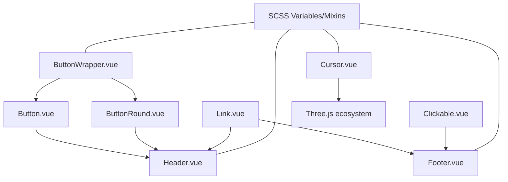
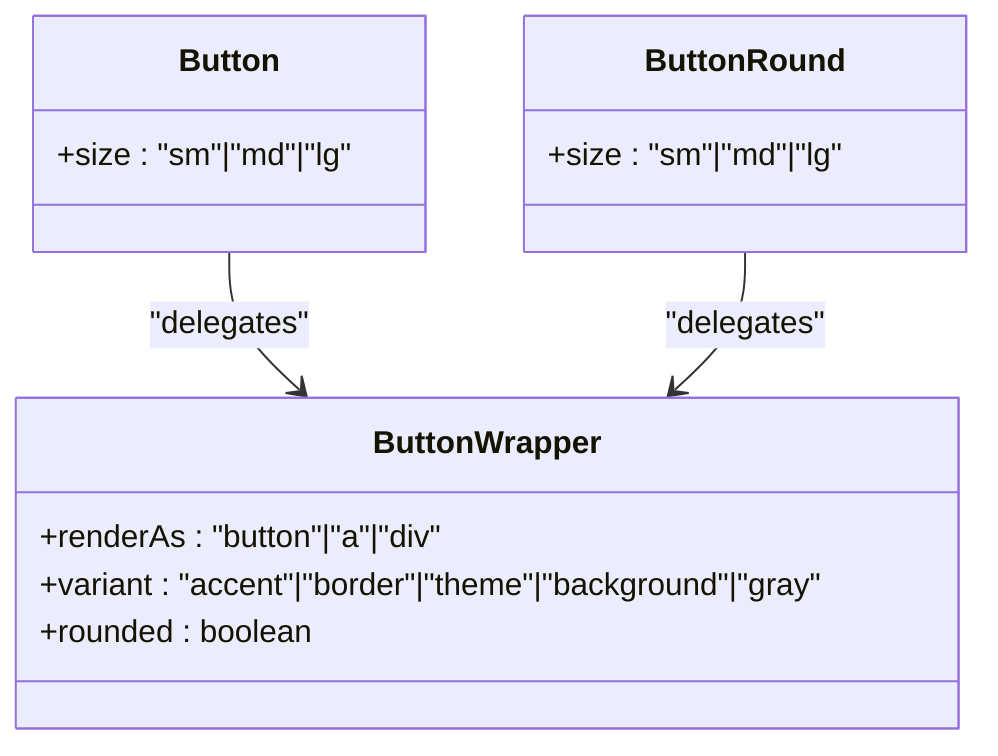
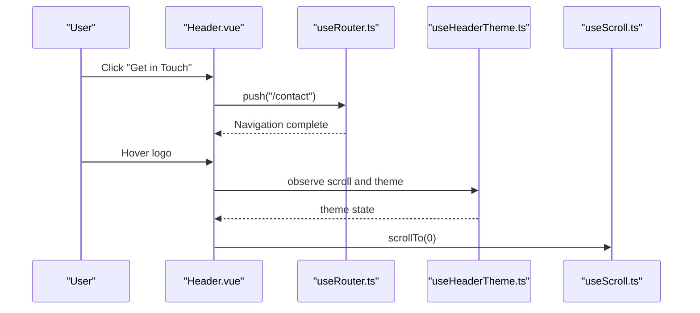
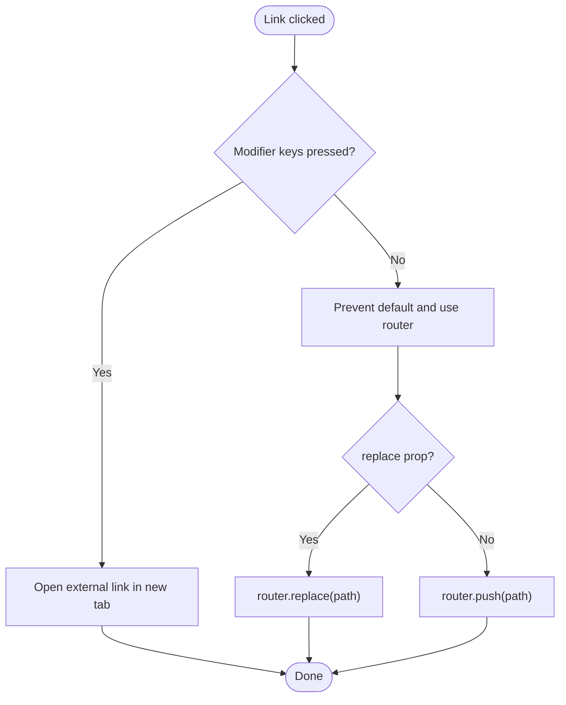
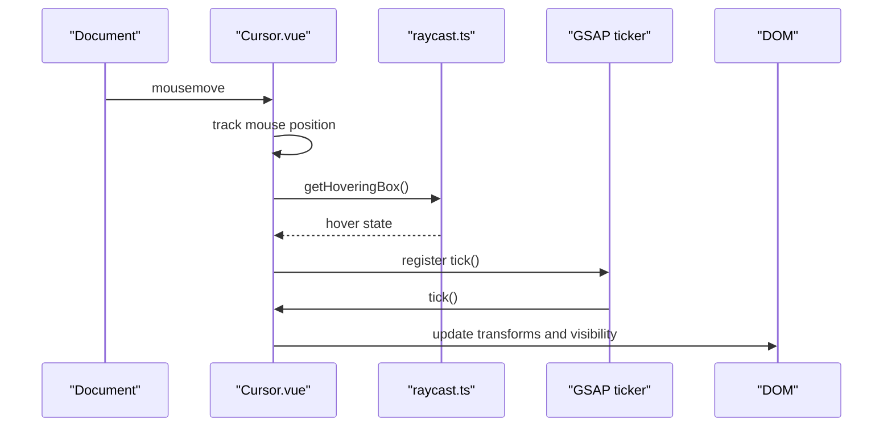
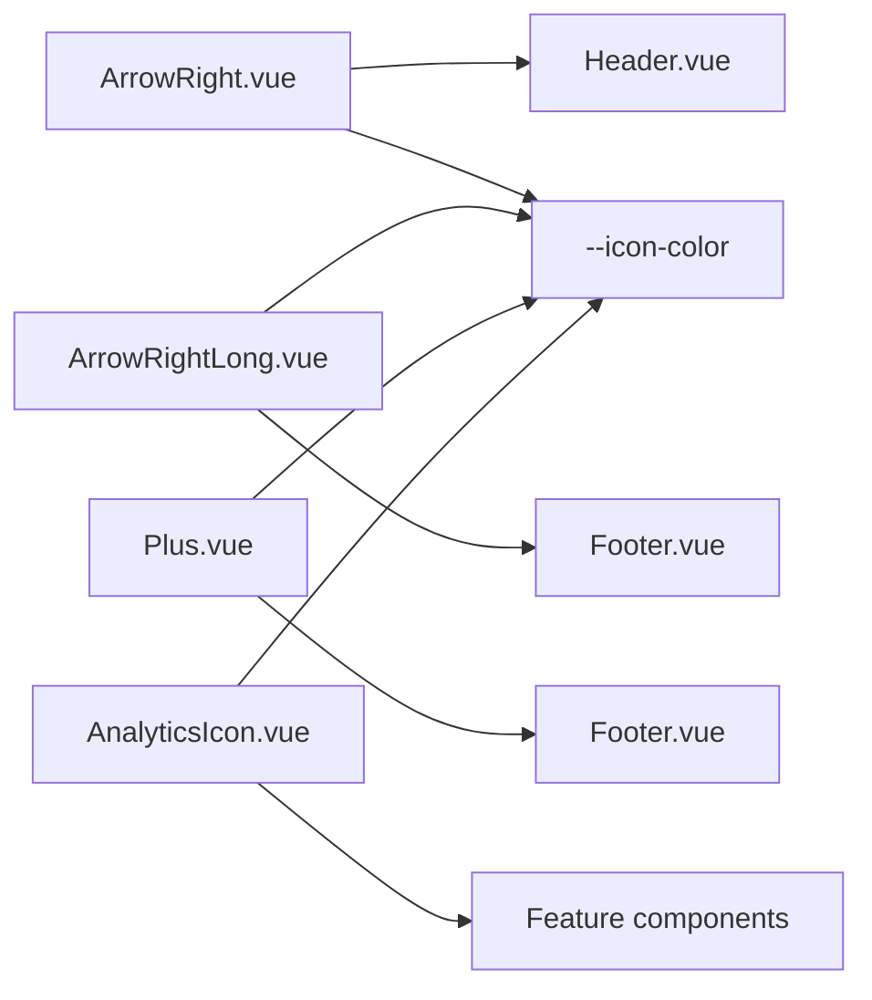
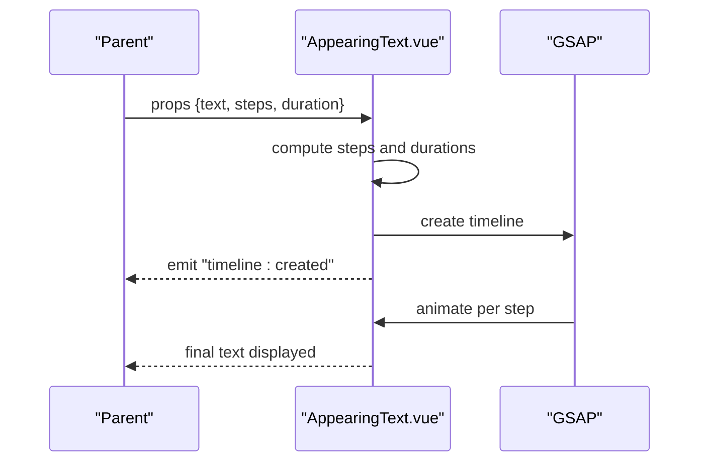
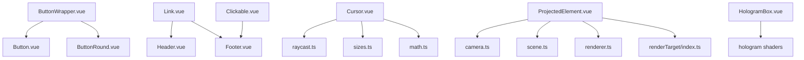

# Component Library

<cite>
**Referenced Files in This Document**
- [Button.vue](file://src/components/Button.vue)
- [ButtonRound.vue](file://src/components/ButtonRound.vue)
- [ButtonWrapper.vue](file://src/components/ButtonWrapper.vue)
- [Header.vue](file://src/components/Header.vue)
- [Footer.vue](file://src/components/Footer.vue)
- [Link.vue](file://src/components/Link.vue)
- [Clickable.vue](file://src/components/Clickable.vue)
- [Cursor.vue](file://src/components/Cursor.vue)
- [HologramBox.vue](file://src/components/HologramBox.vue)
- [ProjectedElement.vue](file://src/components/ProjectedElement.vue)
- [AppearingText.vue](file://src/components/AppearingText.vue)
- [Tag.vue](file://src/components/Tag.vue)
- [tagVariants.ts](file://src/components/tagVariants.ts)
- [ArrowRight.vue](file://src/components/icons/ArrowRight.vue)
- [ArrowRightLong.vue](file://src/components/icons/ArrowRightLong.vue)
- [Plus.vue](file://src/components/icons/Plus.vue)
- [AnalyticsIcon.vue](file://src/components/icons/AnalyticsIcon.vue)
- [index.scss](file://src/assets/styles/index.scss)
- [mixins.scss](file://src/assets/styles/mixins.scss)
- [variables.scss](file://src/assets/styles/variables.scss)
- [colors.scss](file://src/assets/styles/colors.scss)
- [fonts.scss](file://src/assets/styles/fonts.scss)
- [grid.scss](file://src/assets/styles/grid.scss)
- [preloader.scss](file://src/assets/styles/preloader.scss)
- [projects.scss](file://src/assets/styles/projects.scss)
- [reset.scss](file://src/assets/styles/reset.scss)
- [lenis.scss](file://src/assets/styles/lenis.scss)
- [useRouter.ts](file://src/composables/useRouter.ts)
- [useHeaderTheme.ts](file://src/composables/useHeaderTheme.ts)
- [useScroll.ts](file://src/composables/useScroll.ts)
- [useRouteObserver.ts](file://src/composables/useRouteObserver.ts)
- [useFirstRoute.ts](file://src/composables/useFirstRoute.ts)
- [useAgent.ts](file://src/composables/useAgent.ts)
- [usePreloader.ts](file://src/composables/usePreloader.ts)
- [useProjectTransition.ts](file://src/composables/useProjectTransition.ts)
- [useRouteObserver.ts](file://src/composables/useRouteObserver.ts)
- [useSize.ts](file://src/utils/sizes.ts)
- [math.ts](file://src/utils/math.ts)
- [EventEmitter.ts](file://src/utils/EventEmitter.ts)
- [raycast.ts](file://src/three/utils/raycast.ts)
- [camera.ts](file://src/three/core/camera.ts)
- [scene.ts](file://src/three/core/scene.ts)
- [renderer.ts](file://src/three/core/renderer.ts)
- [renderTarget/index.ts](file://src/three/core/renderTarget/index.ts)
- [common/colors.ts](file://src/three/common/colors.ts)
- [common/geometries.ts](file://src/three/common/geometries.ts)
- [common/materials.ts](file://src/three/common/materials.ts)
- [shaders/hologram/fragment.glsl](file://src/three/shaders/hologram/fragment.glsl)
- [shaders/hologram/vertex.glsl](file://src/three/shaders/hologram/vertex.glsl)
</cite>

## Table of Contents
1. [Introduction](#introduction)
2. [Project Structure](#project-structure)
3. [Core Components](#core-components)
4. [Architecture Overview](#architecture-overview)
5. [Detailed Component Analysis](#detailed-component-analysis)
6. [Dependency Analysis](#dependency-analysis)
7. [Performance Considerations](#performance-considerations)
8. [Troubleshooting Guide](#troubleshooting-guide)
9. [Conclusion](#conclusion)
10. [Appendices](#appendices)

## Introduction
This document describes the component library used across the application. It covers reusable UI components (buttons, navigation, links, clickable surfaces), interactive elements (cursor, scroll indicators), the icon system (SVG-based and component-based), specialized components (hologram boxes, projected elements, animated text), and the tag system with variant styling. It also documents composition patterns, prop interfaces, event handling, styling integration with SCSS, accessibility considerations, responsive design patterns, naming conventions, exports, and integration with the broader application architecture.

## Project Structure
The component library is organized under src/components with dedicated subfolders for icons and specialized components. Styles are centralized in src/assets/styles and integrated via SCSS. Composables and utilities support cross-cutting concerns like routing, scrolling, and device detection.

```mermaid
graph TB
subgraph "Components"
Btn["Button.vue"]
BtnRound["ButtonRound.vue"]
BtnWrap["ButtonWrapper.vue"]
Head["Header.vue"]
Foot["Footer.vue"]
Lk["Link.vue"]
Click["Clickable.vue"]
Cur["Cursor.vue"]
HBox["HologramBox.vue"]
Proj["ProjectedElement.vue"]
Atxt["AppearingText.vue"]
Tag["Tag.vue"]
TV["tagVariants.ts"]
end
subgraph "Icons"
AR["ArrowRight.vue"]
ARL["ArrowRightLong.vue"]
Pl["Plus.vue"]
AI["AnalyticsIcon.vue"]
end
subgraph "Styles"
IDX["index.scss"]
MIX["mixins.scss"]
VAR["variables.scss"]
COL["colors.scss"]
FNT["fonts.scss"]
GRD["grid.scss"]
PRE["preloader.scss"]
PRJ["projects.scss"]
RST["reset.scss"]
LEN["lenis.scss"]
end
subgraph "Composables"
UR["useRouter.ts"]
UHT["useHeaderTheme.ts"]
US["useScroll.ts"]
URO["useRouteObserver.ts"]
UFR["useFirstRoute.ts"]
UA["useAgent.ts"]
UPR["usePreloader.ts"]
UPT["useProjectTransition.ts"]
end
subgraph "Utils"
SZ["sizes.ts"]
MATH["math.ts"]
EVT["EventEmitter.ts"]
RCAST["raycast.ts"]
end
subgraph "Three.js"
CAM["camera.ts"]
SCN["scene.ts"]
REN["renderer.ts"]
RT["renderTarget/index.ts"]
COL3["common/colors.ts"]
GEO["common/geometries.ts"]
MAT["common/materials.ts"]
SH_FRAG["shaders/hologram/fragment.glsl"]
SH_VERT["shaders/hologram/vertex.glsl"]
end
Btn --> BtnWrap
BtnRound --> BtnWrap
Head --> Btn
Head --> BtnRound
Head --> Lk
Head --> AR
Foot --> Lk
Foot --> ARL
Foot --> Pl
Cur --> AR
Cur --> ARL
HBox --> AR
Proj --> CAM
Proj --> SCN
Proj --> REN
Proj --> RT
Proj --> GEO
Proj --> MAT
HBox --> SH_FRAG
HBox --> SH_VERT
BtnWrap --> MIX
Head --> MIX
Foot --> MIX
Cur --> MIX
Tag --> TV
Tag --> VAR
Tag --> COL
BtnWrap --> VAR
BtnWrap --> COL
Lk --> UR
Head --> UHT
Head --> US
Head --> URO
Head --> UFR
Foot --> US
Cur --> RCAST
Cur --> UA
Cur --> SZ
Cur --> MATH
```



**Diagram sources**
- [Button.vue](file://src/components/Button.vue)
- [ButtonRound.vue](file://src/components/ButtonRound.vue)
- [ButtonWrapper.vue](file://src/components/ButtonWrapper.vue)
- [Header.vue](file://src/components/Header.vue)
- [Footer.vue](file://src/components/Footer.vue)
- [Link.vue](file://src/components/Link.vue)
- [Clickable.vue](file://src/components/Clickable.vue)
- [Cursor.vue](file://src/components/Cursor.vue)
- [HologramBox.vue](file://src/components/HologramBox.vue)
- [ProjectedElement.vue](file://src/components/ProjectedElement.vue)
- [Tag.vue](file://src/components/Tag.vue)
- [tagVariants.ts](file://src/components/tagVariants.ts)
- [ArrowRight.vue](file://src/components/icons/ArrowRight.vue)
- [ArrowRightLong.vue](file://src/components/icons/ArrowRightLong.vue)
- [Plus.vue](file://src/components/icons/Plus.vue)
- [AnalyticsIcon.vue](file://src/components/icons/AnalyticsIcon.vue)
- [index.scss](file://src/assets/styles/index.scss)
- [mixins.scss](file://src/assets/styles/mixins.scss)
- [variables.scss](file://src/assets/styles/variables.scss)
- [colors.scss](file://src/assets/styles/colors.scss)
- [fonts.scss](file://src/assets/styles/fonts.scss)
- [grid.scss](file://src/assets/styles/grid.scss)
- [preloader.scss](file://src/assets/styles/preloader.scss)
- [projects.scss](file://src/assets/styles/projects.scss)
- [reset.scss](file://src/assets/styles/reset.scss)
- [lenis.scss](file://src/assets/styles/lenis.scss)
- [useRouter.ts](file://src/composables/useRouter.ts)
- [useHeaderTheme.ts](file://src/composables/useHeaderTheme.ts)
- [useScroll.ts](file://src/composables/useScroll.ts)
- [useRouteObserver.ts](file://src/composables/useRouteObserver.ts)
- [useFirstRoute.ts](file://src/composables/useFirstRoute.ts)
- [useAgent.ts](file://src/composables/useAgent.ts)
- [usePreloader.ts](file://src/composables/usePreloader.ts)
- [useProjectTransition.ts](file://src/composables/useProjectTransition.ts)
- [useSize.ts](file://src/utils/sizes.ts)
- [math.ts](file://src/utils/math.ts)
- [EventEmitter.ts](file://src/utils/EventEmitter.ts)
- [raycast.ts](file://src/three/utils/raycast.ts)
- [camera.ts](file://src/three/core/camera.ts)
- [scene.ts](file://src/three/core/scene.ts)
- [renderer.ts](file://src/three/core/renderer.ts)
- [renderTarget/index.ts](file://src/three/core/renderTarget/index.ts)
- [common/colors.ts](file://src/three/common/colors.ts)
- [common/geometries.ts](file://src/three/common/geometries.ts)
- [common/materials.ts](file://src/three/common/materials.ts)
- [shaders/hologram/fragment.glsl](file://src/three/shaders/hologram/fragment.glsl)
- [shaders/hologram/vertex.glsl](file://src/three/shaders/hologram/vertex.glsl)

**Section sources**
- [Button.vue](file://src/components/Button.vue)
- [ButtonRound.vue](file://src/components/ButtonRound.vue)
- [ButtonWrapper.vue](file://src/components/ButtonWrapper.vue)
- [Header.vue](file://src/components/Header.vue)
- [Footer.vue](file://src/components/Footer.vue)
- [Link.vue](file://src/components/Link.vue)
- [Clickable.vue](file://src/components/Clickable.vue)
- [Cursor.vue](file://src/components/Cursor.vue)
- [HologramBox.vue](file://src/components/HologramBox.vue)
- [ProjectedElement.vue](file://src/components/ProjectedElement.vue)
- [AppearingText.vue](file://src/components/AppearingText.vue)
- [Tag.vue](file://src/components/Tag.vue)
- [tagVariants.ts](file://src/components/tagVariants.ts)
- [ArrowRight.vue](file://src/components/icons/ArrowRight.vue)
- [ArrowRightLong.vue](file://src/components/icons/ArrowRightLong.vue)
- [Plus.vue](file://src/components/icons/Plus.vue)
- [AnalyticsIcon.vue](file://src/components/icons/AnalyticsIcon.vue)
- [index.scss](file://src/assets/styles/index.scss)
- [mixins.scss](file://src/assets/styles/mixins.scss)
- [variables.scss](file://src/assets/styles/variables.scss)
- [colors.scss](file://src/assets/styles/colors.scss)
- [fonts.scss](file://src/assets/styles/fonts.scss)
- [grid.scss](file://src/assets/styles/grid.scss)
- [preloader.scss](file://src/assets/styles/preloader.scss)
- [projects.scss](file://src/assets/styles/projects.scss)
- [reset.scss](file://src/assets/styles/reset.scss)
- [lenis.scss](file://src/assets/styles/lenis.scss)
- [useRouter.ts](file://src/composables/useRouter.ts)
- [useHeaderTheme.ts](file://src/composables/useHeaderTheme.ts)
- [useScroll.ts](file://src/composables/useScroll.ts)
- [useRouteObserver.ts](file://src/composables/useRouteObserver.ts)
- [useFirstRoute.ts](file://src/composables/useFirstRoute.ts)
- [useAgent.ts](file://src/composables/useAgent.ts)
- [usePreloader.ts](file://src/composables/usePreloader.ts)
- [useProjectTransition.ts](file://src/composables/useProjectTransition.ts)
- [useSize.ts](file://src/utils/sizes.ts)
- [math.ts](file://src/utils/math.ts)
- [EventEmitter.ts](file://src/utils/EventEmitter.ts)
- [raycast.ts](file://src/three/utils/raycast.ts)
- [camera.ts](file://src/three/core/camera.ts)
- [scene.ts](file://src/three/core/scene.ts)
- [renderer.ts](file://src/three/core/renderer.ts)
- [renderTarget/index.ts](file://src/three/core/renderTarget/index.ts)
- [common/colors.ts](file://src/three/common/colors.ts)
- [common/geometries.ts](file://src/three/common/geometries.ts)
- [common/materials.ts](file://src/three/common/materials.ts)
- [shaders/hologram/fragment.glsl](file://src/three/shaders/hologram/fragment.glsl)
- [shaders/hologram/vertex.glsl](file://src/three/shaders/hologram/vertex.glsl)

## Core Components
This section documents the primary building blocks: button family, navigation, links, clickable surfaces, and cursor.

- Button family
  - ButtonWrapper: Base wrapper with variant and rounded styling, supports renderAs and rounded props.
  - Button: Adds size variants and delegates to ButtonWrapper.
  - ButtonRound: Circular button variant with size scaling and rounded behavior.
- Navigation
  - Header: Fixed header with back button, logo, and “Get in Touch” link; integrates theme and scroll state.
  - Footer: Back-to-top control, legal links, language switch, optional social; uses Link and Clickable.
- Links and interaction
  - Link: Smart link that navigates internally or externally; respects modifiers and replaces vs push semantics.
  - Clickable: Minimal wrapper to enable hover effects and focus affordances.
- Cursor
  - Cursor: Animated, typed cursor synchronized with mouse movement and Three.js raycasting.

Usage examples (paths only):
- [Header.vue](file://src/components/Header.vue) demonstrates Button, ButtonRound, Link, and icon usage.
- [Footer.vue](file://src/components/Footer.vue) demonstrates Link, Clickable, ButtonRound, and icons.
- [Link.vue](file://src/components/Link.vue) shows internal vs external navigation.
- [Clickable.vue](file://src/components/Clickable.vue) shows hover effect pattern.
- [Cursor.vue](file://src/components/Cursor.vue) shows typed cursor and raycast integration.

Accessibility and responsiveness:
- Buttons and links expose aria-labels and keyboard activation where applicable.
- Responsive breakpoints are applied via mixins and media queries in SCSS.

Styling integration:
- All components rely on SCSS variables, mixins, and color tokens defined in assets/styles.

**Section sources**
- [ButtonWrapper.vue](file://src/components/ButtonWrapper.vue)
- [Button.vue](file://src/components/Button.vue)
- [ButtonRound.vue](file://src/components/ButtonRound.vue)
- [Header.vue](file://src/components/Header.vue)
- [Footer.vue](file://src/components/Footer.vue)
- [Link.vue](file://src/components/Link.vue)
- [Clickable.vue](file://src/components/Clickable.vue)
- [Cursor.vue](file://src/components/Cursor.vue)
- [mixins.scss](file://src/assets/styles/mixins.scss)
- [variables.scss](file://src/assets/styles/variables.scss)
- [colors.scss](file://src/assets/styles/colors.scss)

## Architecture Overview
The component library follows a composition-first pattern:
- Low-level wrappers (ButtonWrapper, Clickable) encapsulate shared styling and behavior.
- Feature-specific components (Button, ButtonRound, Header, Footer) compose wrappers and icons.
- Interactive elements (Link, Cursor) integrate with composables for routing, scrolling, and device behavior.
- Specialized components (HologramBox, ProjectedElement, AppearingText) combine UI with Three.js and animation libraries.



**Diagram sources**
- [ButtonWrapper.vue](file://src/components/ButtonWrapper.vue)
- [Button.vue](file://src/components/Button.vue)
- [ButtonRound.vue](file://src/components/ButtonRound.vue)
- [Header.vue](file://src/components/Header.vue)
- [Footer.vue](file://src/components/Footer.vue)
- [Link.vue](file://src/components/Link.vue)
- [Clickable.vue](file://src/components/Clickable.vue)
- [Cursor.vue](file://src/components/Cursor.vue)
- [mixins.scss](file://src/assets/styles/mixins.scss)
- [variables.scss](file://src/assets/styles/variables.scss)

## Detailed Component Analysis

### Button Family
- ButtonWrapper
  - Purpose: Shared button styling and behavior.
  - Props: renderAs, variant, rounded.
  - Variants: accent, theme, background, gray, border.
  - Rounded mode: circular shape with aspect ratio.
- Button
  - Purpose: Standard rectangular button with size variants.
  - Props: size (sm/md/lg), inherits ButtonWrapper props.
  - Delegates to ButtonWrapper and adds size classes.
- ButtonRound
  - Purpose: Circular button for compact actions.
  - Props: size (sm/md/lg), inherits ButtonWrapper props.
  - Delegates to ButtonWrapper with rounded flag.



**Diagram sources**
- [ButtonWrapper.vue](file://src/components/ButtonWrapper.vue)
- [Button.vue](file://src/components/Button.vue)
- [ButtonRound.vue](file://src/components/ButtonRound.vue)

**Section sources**
- [ButtonWrapper.vue](file://src/components/ButtonWrapper.vue)
- [Button.vue](file://src/components/Button.vue)
- [ButtonRound.vue](file://src/components/ButtonRound.vue)

### Navigation Components
- Header
  - Fixed header with back button, logo, and “Get in Touch” link.
  - Integrates theme detection, scroll awareness, and router navigation.
  - Uses Button, ButtonRound, Link, and icons.
- Footer
  - Back-to-top control, legal links, language switch, optional social.
  - Uses Link, Clickable, ButtonRound, and icons.



**Diagram sources**
- [Header.vue](file://src/components/Header.vue)
- [useRouter.ts](file://src/composables/useRouter.ts)
- [useHeaderTheme.ts](file://src/composables/useHeaderTheme.ts)
- [useScroll.ts](file://src/composables/useScroll.ts)

**Section sources**
- [Header.vue](file://src/components/Header.vue)
- [Footer.vue](file://src/components/Footer.vue)

### Links and Interaction
- Link
  - Determines internal vs external navigation.
  - Respects modifier keys and supports replace vs push.
  - Uses router composable for programmatic navigation.
- Clickable
  - Provides hover background and focus affordances.
  - Supports renderAs for semantic markup.



**Diagram sources**
- [Link.vue](file://src/components/Link.vue)
- [useRouter.ts](file://src/composables/useRouter.ts)

**Section sources**
- [Link.vue](file://src/components/Link.vue)
- [Clickable.vue](file://src/components/Clickable.vue)

### Cursor and Scroll Indicators
- Cursor
  - Tracks mouse position with smoothing.
  - Detects cursor type via dataset traversal and Three.js raycasting.
  - Renders multiple cursor variants (circle-black, circle-white, arrow, arrow-external).
  - Integrates with device detection and route changes to reset state.
- Scroll indicators
  - Footer back-to-top uses ButtonRound with ArrowRightLong icon.
  - Header logo becomes clickable after scrolling past hero.



**Diagram sources**
- [Cursor.vue](file://src/components/Cursor.vue)
- [raycast.ts](file://src/three/utils/raycast.ts)

**Section sources**
- [Cursor.vue](file://src/components/Cursor.vue)
- [Footer.vue](file://src/components/Footer.vue)
- [Header.vue](file://src/components/Header.vue)

### Icon System
- SVG integration
  - Icons are pure SVG components with stroke-based theming via --icon-color.
  - Icons declare vector-effect for crisp strokes and overflow visibility.
- Component-based rendering
  - Icons are imported directly into components (e.g., ArrowRight, ArrowRightLong, Plus, AnalyticsIcon).
  - Icons adapt to surrounding theme via CSS variables.



**Diagram sources**
- [ArrowRight.vue](file://src/components/icons/ArrowRight.vue)
- [ArrowRightLong.vue](file://src/components/icons/ArrowRightLong.vue)
- [Plus.vue](file://src/components/icons/Plus.vue)
- [AnalyticsIcon.vue](file://src/components/icons/AnalyticsIcon.vue)
- [Header.vue](file://src/components/Header.vue)
- [Footer.vue](file://src/components/Footer.vue)

**Section sources**
- [ArrowRight.vue](file://src/components/icons/ArrowRight.vue)
- [ArrowRightLong.vue](file://src/components/icons/ArrowRightLong.vue)
- [Plus.vue](file://src/components/icons/Plus.vue)
- [AnalyticsIcon.vue](file://src/components/icons/AnalyticsIcon.vue)

### Specialized Components
- HologramBox
  - Purpose: Decorative container with curved header, optional footer, and gradient background.
  - Slots: default and title.
  - Styling: relies on SCSS variables and mixins; uses inline SVG for curves and footer.
- ProjectedElement
  - Purpose: Position UI elements in screen space using Three.js camera projection.
  - Props: point (Vector3).
  - Lifecycle: registers/unregisters with GSAP ticker; updates transform per frame.
- AppearingText
  - Purpose: Animated text reveal with flicker effect on desktop, immediate reveal on mobile/reduced motion.
  - Emits: timeline:created with the GSAP timeline for orchestration.



**Diagram sources**
- [AppearingText.vue](file://src/components/AppearingText.vue)

**Section sources**
- [HologramBox.vue](file://src/components/HologramBox.vue)
- [ProjectedElement.vue](file://src/components/ProjectedElement.vue)
- [AppearingText.vue](file://src/components/AppearingText.vue)

### Tag System
- Tag
  - Purpose: Lightweight semantic badges with variant styling.
  - Props: variant (from tagVariants).
  - Renders label from tagLabels mapping.
- tagVariants
  - Defines TagVariant union and tagLabels mapping.

```mermaid
classDiagram
class Tag {
+variant : TagVariant
}
class TagVariant {
<<union>>
"agile"|"clickup"|...|"seo"
}
Tag --> TagVariant : "uses"
```

**Diagram sources**
- [Tag.vue](file://src/components/Tag.vue)
- [tagVariants.ts](file://src/components/tagVariants.ts)

**Section sources**
- [Tag.vue](file://src/components/Tag.vue)
- [tagVariants.ts](file://src/components/tagVariants.ts)

## Dependency Analysis
- Composition and reusability
  - Button and ButtonRound depend on ButtonWrapper for shared styling.
  - Header and Footer depend on Link, Clickable, and Button variants.
  - Cursor depends on raycast, device detection, and animation utilities.
- Styling dependencies
  - All styled components import SCSS variables and mixins.
- Thematic integration
  - Icons and components consume --icon-color and color tokens.
- Three.js integration
  - ProjectedElement integrates camera, scene, renderer, and render targets.



**Diagram sources**
- [ButtonWrapper.vue](file://src/components/ButtonWrapper.vue)
- [Button.vue](file://src/components/Button.vue)
- [ButtonRound.vue](file://src/components/ButtonRound.vue)
- [Link.vue](file://src/components/Link.vue)
- [Header.vue](file://src/components/Header.vue)
- [Footer.vue](file://src/components/Footer.vue)
- [Clickable.vue](file://src/components/Clickable.vue)
- [Cursor.vue](file://src/components/Cursor.vue)
- [raycast.ts](file://src/three/utils/raycast.ts)
- [useSize.ts](file://src/utils/sizes.ts)
- [math.ts](file://src/utils/math.ts)
- [ProjectedElement.vue](file://src/components/ProjectedElement.vue)
- [camera.ts](file://src/three/core/camera.ts)
- [scene.ts](file://src/three/core/scene.ts)
- [renderer.ts](file://src/three/core/renderer.ts)
- [renderTarget/index.ts](file://src/three/core/renderTarget/index.ts)
- [HologramBox.vue](file://src/components/HologramBox.vue)

**Section sources**
- [ButtonWrapper.vue](file://src/components/ButtonWrapper.vue)
- [Button.vue](file://src/components/Button.vue)
- [ButtonRound.vue](file://src/components/ButtonRound.vue)
- [Link.vue](file://src/components/Link.vue)
- [Header.vue](file://src/components/Header.vue)
- [Footer.vue](file://src/components/Footer.vue)
- [Clickable.vue](file://src/components/Clickable.vue)
- [Cursor.vue](file://src/components/Cursor.vue)
- [ProjectedElement.vue](file://src/components/ProjectedElement.vue)
- [HologramBox.vue](file://src/components/HologramBox.vue)

## Performance Considerations
- Cursor
  - Uses GSAP ticker for smooth updates; visibility toggled to avoid rendering off-screen.
  - Leverages will-change and transforms for GPU-friendly updates.
- ProjectedElement
  - Updates transform only when changed to minimize layout thrash.
  - Pauses updates during scenes where projection is irrelevant.
- AppearingText
  - Skips animation when reduced motion is preferred.
  - Cleans up timelines and matchMedia on unmount.
- SCSS
  - Mixins and variables centralize design tokens to reduce duplication and improve maintainability.

[No sources needed since this section provides general guidance]

## Troubleshooting Guide
- Links not navigating internally
  - Ensure external prop is not set and no modifier keys are pressed.
  - Verify router composable is available and initialized.
- Cursor not appearing
  - Confirm device supports hover and cursor is not hidden on touch.
  - Check raycast hover state and dataset attributes on elements.
- Button hover styles not applying
  - Ensure variant and rounded props are correctly passed.
  - Verify SCSS variables and mixins are loaded.
- HologramBox visuals incorrect
  - Confirm SCSS variables for colors and radii are defined.
  - Ensure SVG paths match expected stroke and fill tokens.
- ProjectedElement not moving
  - Verify Vector3 point prop and camera projection are valid.
  - Confirm GSAP ticker lifecycle hooks are registered.

**Section sources**
- [Link.vue](file://src/components/Link.vue)
- [useRouter.ts](file://src/composables/useRouter.ts)
- [Cursor.vue](file://src/components/Cursor.vue)
- [ButtonWrapper.vue](file://src/components/ButtonWrapper.vue)
- [HologramBox.vue](file://src/components/HologramBox.vue)
- [ProjectedElement.vue](file://src/components/ProjectedElement.vue)

## Conclusion
The component library emphasizes composition, consistency, and performance. Wrappers encapsulate shared behavior, while feature components apply domain-specific logic. The icon system and SCSS architecture ensure cohesive theming. Specialized components integrate with Three.js and animation libraries for immersive experiences. Accessibility and responsive patterns are embedded through props, mixins, and event handling.

[No sources needed since this section summarizes without analyzing specific files]

## Appendices

### Component Naming Conventions and Exports
- Naming
  - Feature-based: Button, Link, Cursor, HologramBox.
  - Variant suffixes: ButtonRound, ButtonWrapper.
  - Icon components: PascalCase filenames with SVG content.
- Exports
  - Components are single-file Vue SFCs; no explicit barrel exports are shown in the referenced files.

**Section sources**
- [Button.vue](file://src/components/Button.vue)
- [ButtonRound.vue](file://src/components/ButtonRound.vue)
- [ButtonWrapper.vue](file://src/components/ButtonWrapper.vue)
- [Link.vue](file://src/components/Link.vue)
- [Clickable.vue](file://src/components/Clickable.vue)
- [Cursor.vue](file://src/components/Cursor.vue)
- [HologramBox.vue](file://src/components/HologramBox.vue)
- [Tag.vue](file://src/components/Tag.vue)
- [tagVariants.ts](file://src/components/tagVariants.ts)

### Prop Interfaces Summary
- ButtonWrapper
  - renderAs: "button" | "a" | "div"
  - variant: "accent" | "border" | "theme" | "background" | "gray"
  - rounded: boolean
- Button
  - size: "sm" | "md" | "lg"
- ButtonRound
  - size: "sm" | "md" | "lg"
- Link
  - external: boolean
  - renderAs: "a" | "button" | "div"
  - href: string
  - to: string
  - replace: boolean
- Clickable
  - renderAs: "button" | "a" | "div"
- Cursor
  - Mouse tracking and raycast-driven type detection.
- ProjectedElement
  - point: Vector3
- Tag
  - variant: TagVariant (from tagVariants)

**Section sources**
- [ButtonWrapper.vue](file://src/components/ButtonWrapper.vue)
- [Button.vue](file://src/components/Button.vue)
- [ButtonRound.vue](file://src/components/ButtonRound.vue)
- [Link.vue](file://src/components/Link.vue)
- [Clickable.vue](file://src/components/Clickable.vue)
- [Cursor.vue](file://src/components/Cursor.vue)
- [ProjectedElement.vue](file://src/components/ProjectedElement.vue)
- [Tag.vue](file://src/components/Tag.vue)
- [tagVariants.ts](file://src/components/tagVariants.ts)

### Accessibility and Responsive Patterns
- Accessibility
  - aria-labels on interactive elements.
  - Keyboard activation via Link and Clickable.
  - Reduced motion handling in animated components.
- Responsive
  - Breakpoints and mixins from SCSS drive responsive layouts.
  - Hover mixins conditionally apply styles on hover-capable devices.

**Section sources**
- [Header.vue](file://src/components/Header.vue)
- [Footer.vue](file://src/components/Footer.vue)
- [Link.vue](file://src/components/Link.vue)
- [Clickable.vue](file://src/components/Clickable.vue)
- [mixins.scss](file://src/assets/styles/mixins.scss)