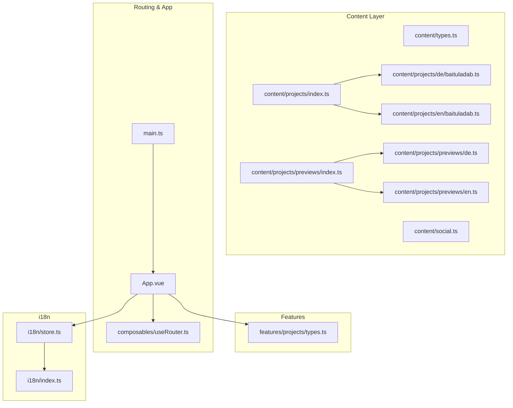
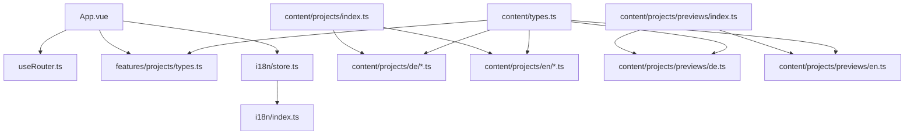
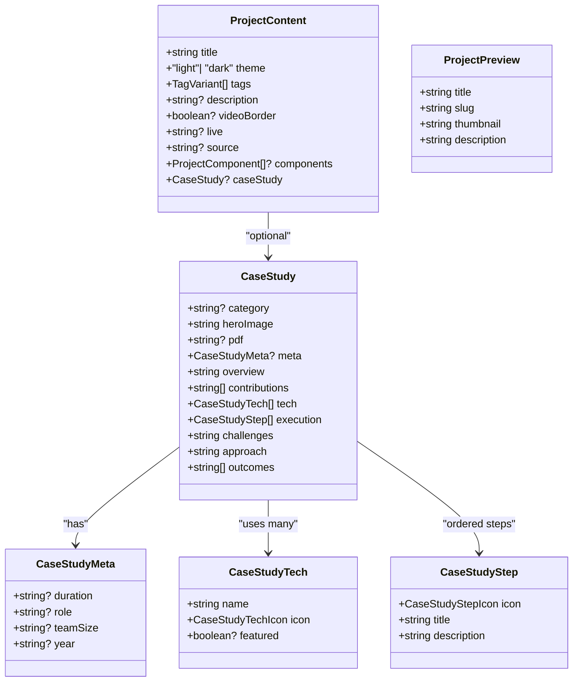
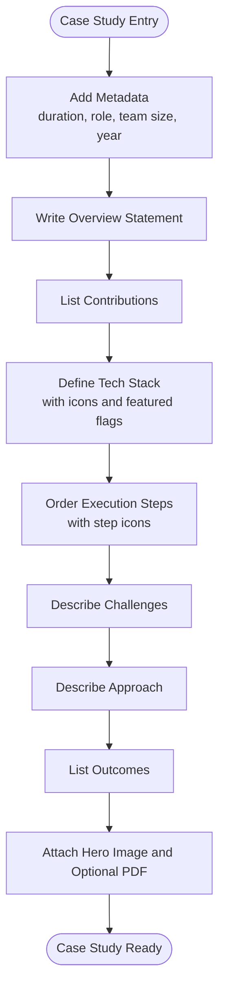
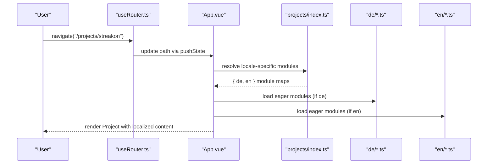
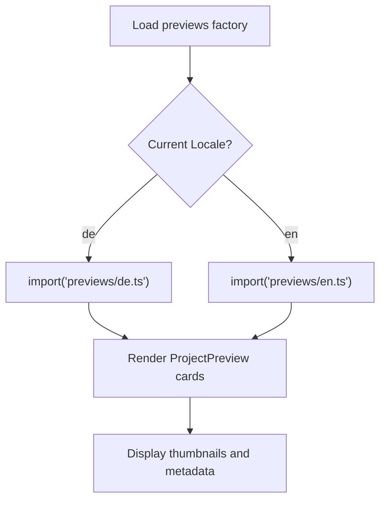
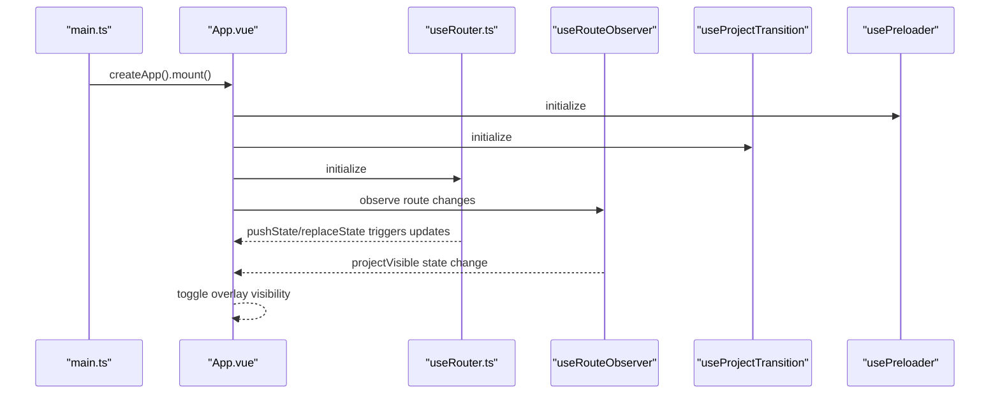
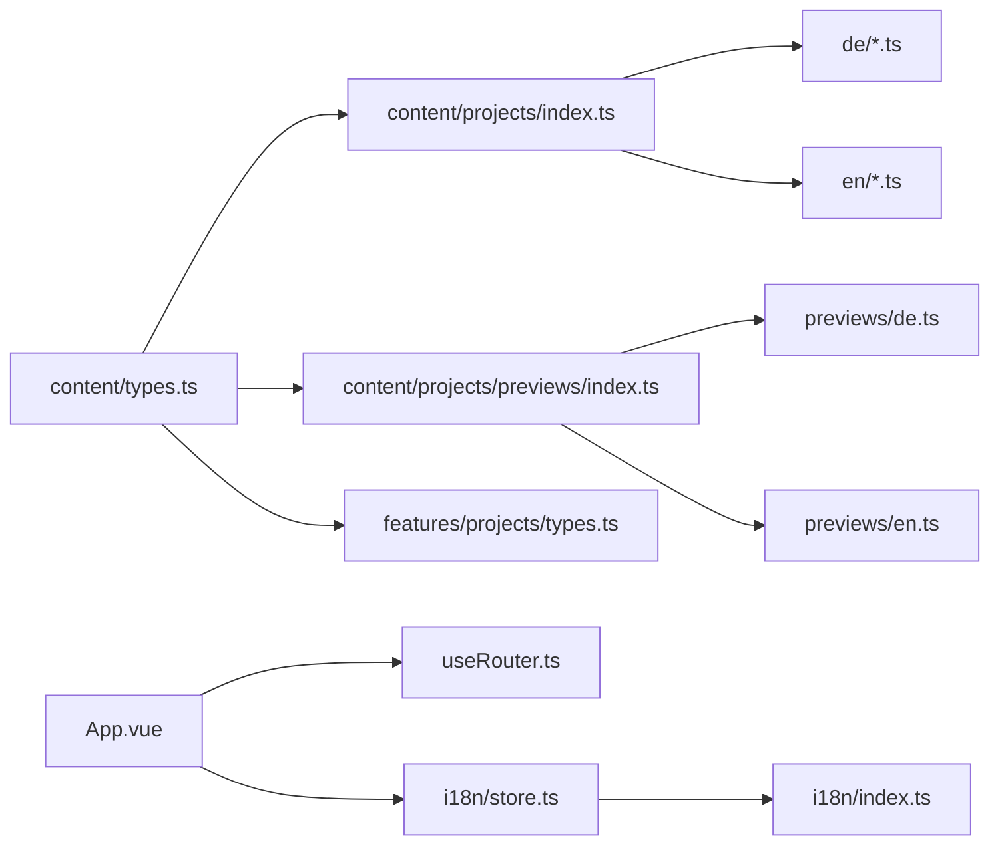

# Content Management System

<cite>
**Referenced Files in This Document**
- [src/content/types.ts](file://src/content/types.ts)
- [src/content/projects/index.ts](file://src/content/projects/index.ts)
- [src/content/projects/de/baituladab.ts](file://src/content/projects/de/baituladab.ts)
- [src/content/projects/en/baituladab.ts](file://src/content/projects/en/baituladab.ts)
- [src/content/projects/previews/index.ts](file://src/content/projects/previews/index.ts)
- [src/content/projects/previews/de.ts](file://src/content/projects/previews/de.ts)
- [src/content/projects/previews/en.ts](file://src/content/projects/previews/en.ts)
- [src/content/social.ts](file://src/content/social.ts)
- [src/features/projects/types.ts](file://src/features/projects/types.ts)
- [src/composables/useRouter.ts](file://src/composables/useRouter.ts)
- [src/App.vue](file://src/App.vue)
- [src/i18n/store.ts](file://src/i18n/store.ts)
- [src/i18n/index.ts](file://src/i18n/index.ts)
- [src/main.ts](file://src/main.ts)
</cite>

## Table of Contents
1. [Introduction](#introduction)
2. [Project Structure](#project-structure)
3. [Core Components](#core-components)
4. [Architecture Overview](#architecture-overview)
5. [Detailed Component Analysis](#detailed-component-analysis)
6. [Dependency Analysis](#dependency-analysis)
7. [Performance Considerations](#performance-considerations)
8. [Troubleshooting Guide](#troubleshooting-guide)
9. [Conclusion](#conclusion)
10. [Appendices](#appendices)

## Introduction
This document describes the content management system for a bilingual portfolio site. It explains the data model for projects and case studies, the TypeScript module organization for German and English content, the case study format specification, content preview system for thumbnails and metadata, social content integration, dynamic content loading via URL routes, and the bilingual content delivery strategy. It also outlines content creation workflows, validation patterns, update procedures, caching and performance considerations, and preview generation.

## Project Structure
The content system is organized under a dedicated content directory with locale-specific folders and a shared type system. Key areas:
- Content types and interfaces define the shape of project content, case studies, and previews.
- Project modules are grouped per locale and loaded via Vite’s import.meta.glob with eager evaluation for fast initial loads.
- Previews are separated by locale and lazily imported to keep initial bundle size manageable.
- Social links are centralized for reuse across components.
- Routing and dynamic loading integrate with Vue components to render project pages.

**Diagram sources**
- [src/content/projects/index.ts:14-18](file://src/content/projects/index.ts#L14-L18)
- [src/content/projects/previews/index.ts:1-5](file://src/content/projects/previews/index.ts#L1-L5)
- [src/content/projects/previews/de.ts:10-54](file://src/content/projects/previews/de.ts#L10-L54)
- [src/content/projects/previews/en.ts:9-47](file://src/content/projects/previews/en.ts#L9-L47)
- [src/content/projects/de/baituladab.ts:1-75](file://src/content/projects/de/baituladab.ts#L1-L75)
- [src/content/projects/en/baituladab.ts:1-83](file://src/content/projects/en/baituladab.ts#L1-L83)
- [src/features/projects/types.ts:1-26](file://src/features/projects/types.ts#L1-L26)
- [src/composables/useRouter.ts:1-28](file://src/composables/useRouter.ts#L1-L28)
- [src/App.vue:1-87](file://src/App.vue#L1-L87)
- [src/i18n/store.ts:1-7](file://src/i18n/store.ts#L1-L7)
- [src/i18n/index.ts:1](file://src/i18n/index.ts#L1)
- [src/main.ts:1-10](file://src/main.ts#L1-L10)

**Section sources**
- [src/content/projects/index.ts:1-18](file://src/content/projects/index.ts#L1-L18)
- [src/content/projects/previews/index.ts:1-5](file://src/content/projects/previews/index.ts#L1-L5)
- [src/content/projects/previews/de.ts:1-54](file://src/content/projects/previews/de.ts#L1-L54)
- [src/content/projects/previews/en.ts:1-47](file://src/content/projects/previews/en.ts#L1-L47)
- [src/content/projects/de/baituladab.ts:1-75](file://src/content/projects/de/baituladab.ts#L1-L75)
- [src/content/projects/en/baituladab.ts:1-83](file://src/content/projects/en/baituladab.ts#L1-L83)
- [src/features/projects/types.ts:1-26](file://src/features/projects/types.ts#L1-L26)
- [src/composables/useRouter.ts:1-28](file://src/composables/useRouter.ts#L1-L28)
- [src/App.vue:1-87](file://src/App.vue#L1-L87)
- [src/i18n/store.ts:1-7](file://src/i18n/store.ts#L1-L7)
- [src/i18n/index.ts:1](file://src/i18n/index.ts#L1)
- [src/main.ts:1-10](file://src/main.ts#L1-L10)

## Core Components
- Content types define the canonical shapes for projects, case studies, and previews. They ensure consistent structure across locales and enable compile-time validation.
- Project modules are indexed by locale and resolved via import.meta.glob with eager loading for immediate availability.
- Previews are grouped per locale and lazily imported to reduce initial payload.
- Social links are centralized for consistent branding and maintenance.
- Routing composable integrates with browser history to drive dynamic content loading.
- App orchestrates lifecycle hooks for translation, preloader, audio, scroll, route observation, and cursor rendering.

Key responsibilities:
- Type safety: enforce uniformity across content entries.
- Locale separation: isolate German and English content modules.
- Dynamic loading: map URLs to content modules using router and route observer.
- Preview generation: provide thumbnails and metadata for project listings.

**Section sources**
- [src/content/types.ts:1-86](file://src/content/types.ts#L1-L86)
- [src/content/projects/index.ts:1-18](file://src/content/projects/index.ts#L1-L18)
- [src/content/projects/previews/index.ts:1-5](file://src/content/projects/previews/index.ts#L1-L5)
- [src/content/social.ts:1-8](file://src/content/social.ts#L1-L8)
- [src/composables/useRouter.ts:1-28](file://src/composables/useRouter.ts#L1-L28)
- [src/App.vue:1-87](file://src/App.vue#L1-L87)

## Architecture Overview
The system follows a modular architecture:
- Content layer defines data contracts and locale-specific modules.
- Features layer exposes typed components for rendering content blocks.
- App layer coordinates initialization, routing, and UI overlays.
- i18n layer manages locale state and translation resources.
- Social layer centralizes external link metadata.

**Diagram sources**
- [src/App.vue:1-87](file://src/App.vue#L1-L87)
- [src/composables/useRouter.ts:1-28](file://src/composables/useRouter.ts#L1-L28)
- [src/features/projects/types.ts:1-26](file://src/features/projects/types.ts#L1-L26)
- [src/i18n/store.ts:1-7](file://src/i18n/store.ts#L1-L7)
- [src/i18n/index.ts:1](file://src/i18n/index.ts#L1)
- [src/content/projects/index.ts:14-18](file://src/content/projects/index.ts#L14-L18)
- [src/content/projects/previews/index.ts:1-5](file://src/content/projects/previews/index.ts#L1-L5)
- [src/content/types.ts:1-86](file://src/content/types.ts#L1-L86)

## Detailed Component Analysis

### Data Model and TypeScript Interfaces
The content model centers around ProjectContent, CaseStudy, and related interfaces. These define:
- ProjectContent: title, theme, tags, optional description, video border flag, live/source links, optional components array, and optional case study.
- CaseStudy: category, hero image, optional PDF, metadata (duration, role, team size, year), overview, contributions list, technology stack, execution steps, challenges, approach, and outcomes list.
- ProjectPreview: title, slug, thumbnail, description.
- ProjectComponent types: imageText, text, list, media, enabling structured composition of project pages.

**Diagram sources**
- [src/content/types.ts:30-86](file://src/content/types.ts#L30-L86)

**Section sources**
- [src/content/types.ts:1-86](file://src/content/types.ts#L1-L86)

### Case Study Format Specification
The case study structure supports:
- Metadata: duration, role, team size, year.
- Overview and approach statements.
- Contributions as a bullet list.
- Technology stack with icons and optional featured flag.
- Execution steps with predefined step icons and ordered presentation.
- Challenges and outcomes lists.
- Optional PDF reference and hero image.

Media integration patterns:
- Hero image is a local asset path used for visual prominence.
- Optional PDF link for downloadable case study documents.
- Components array allows embedding structured content blocks (text, image-text, list, media) within a project page.

Timeline formatting:
- Steps are ordered arrays of CaseStudyStep with icons representing phases such as initiation, planning, design, development, testing, deployment, execution, monitoring, closing, coordination, and delivery.

**Diagram sources**
- [src/content/types.ts:30-61](file://src/content/types.ts#L30-L61)

**Section sources**
- [src/content/types.ts:8-61](file://src/content/types.ts#L8-L61)
- [src/features/projects/types.ts:6-18](file://src/features/projects/types.ts#L6-L18)

### Bilingual Content Organization and Locale Delivery
Structure:
- Project modules are organized per locale under content/projects/{de,en}/.
- A central index maps locale keys to simplified module records derived from import.meta.glob with eager loading.
- Previews are similarly organized per locale and lazily imported via a factory map.

Locale resolution:
- The locale is managed in i18n store and exported via i18n constants for consumption across components.
- Routing and content selection rely on the current locale to fetch the appropriate module set.

**Diagram sources**
- [src/composables/useRouter.ts:1-28](file://src/composables/useRouter.ts#L1-L28)
- [src/App.vue:1-87](file://src/App.vue#L1-L87)
- [src/content/projects/index.ts:14-18](file://src/content/projects/index.ts#L14-L18)

**Section sources**
- [src/content/projects/index.ts:1-18](file://src/content/projects/index.ts#L1-L18)
- [src/i18n/store.ts:1-7](file://src/i18n/store.ts#L1-L7)
- [src/i18n/index.ts:1](file://src/i18n/index.ts#L1)

### Content Preview System
The preview system provides:
- A list of ProjectPreview entries per locale.
- Each entry includes title, slug, thumbnail asset, and description.
- Previews are lazily imported via a factory map to defer loading until needed.

**Diagram sources**
- [src/content/projects/previews/index.ts:1-5](file://src/content/projects/previews/index.ts#L1-L5)
- [src/content/projects/previews/de.ts:10-54](file://src/content/projects/previews/de.ts#L10-L54)
- [src/content/projects/previews/en.ts:9-47](file://src/content/projects/previews/en.ts#L9-L47)

**Section sources**
- [src/content/projects/previews/index.ts:1-5](file://src/content/projects/previews/index.ts#L1-L5)
- [src/content/projects/previews/de.ts:1-54](file://src/content/projects/previews/de.ts#L1-L54)
- [src/content/projects/previews/en.ts:1-47](file://src/content/projects/previews/en.ts#L1-L47)

### Social Content Management and Integration
Social links are centralized in a single module with strongly-typed entries. This enables:
- Consistent branding across components.
- Easy addition/removal of platforms.
- Type-safe consumption in UI components.

Integration pattern:
- Components import the social array and render links accordingly, ensuring maintainability and uniform UX.

**Section sources**
- [src/content/social.ts:1-8](file://src/content/social.ts#L1-L8)

### Dynamic Content Loading Mechanism
The app initializes plugins and composable hooks, then renders either the home or project overlay depending on route visibility. Routing is handled via a composable that manipulates browser history, allowing the rest of the app to react to path changes.

**Diagram sources**
- [src/main.ts:1-10](file://src/main.ts#L1-L10)
- [src/App.vue:1-87](file://src/App.vue#L1-L87)
- [src/composables/useRouter.ts:1-28](file://src/composables/useRouter.ts#L1-L28)

**Section sources**
- [src/main.ts:1-10](file://src/main.ts#L1-L10)
- [src/App.vue:1-87](file://src/App.vue#L1-L87)
- [src/composables/useRouter.ts:1-28](file://src/composables/useRouter.ts#L1-L28)

### Content Creation Workflows
- Define ProjectContent with title, theme, tags, optional description, and optional case study.
- Populate CaseStudy with metadata, overview, contributions, tech stack, ordered execution steps, challenges, approach, and outcomes.
- Add components array for structured content blocks if needed.
- Provide ProjectPreview entries with thumbnail assets and descriptions for listings.
- Ensure locale-specific files exist under content/projects/{de,en}/ and previews under content/projects/previews/{de,en}/.

Validation patterns:
- Use TypeScript const assertions to lock down literal values for icons and slugs.
- Leverage enums-like unions for step and tech icons to prevent typos.
- Keep slugs consistent with projectIds to guarantee route-to-content mapping.

Update procedures:
- Modify the relevant locale file under content/projects/{de,en}/.
- Update previews in content/projects/previews/{de,en}/ if metadata or thumbnails change.
- Verify eager-loaded modules still resolve correctly after adding new files.

**Section sources**
- [src/content/types.ts:1-86](file://src/content/types.ts#L1-L86)
- [src/content/projects/index.ts:1-18](file://src/content/projects/index.ts#L1-L18)
- [src/content/projects/previews/index.ts:1-5](file://src/content/projects/previews/index.ts#L1-L5)

## Dependency Analysis
The content system exhibits clear separation of concerns:
- content/types.ts defines the canonical interfaces consumed by all modules.
- content/projects/index.ts aggregates locale-specific modules and exposes them for runtime selection.
- content/projects/previews/index.ts defers locale-specific preview loading.
- features/projects/types.ts provides component-level typing for structured content blocks.
- App.vue orchestrates lifecycle and routing integration.
- i18n/store.ts and i18n/index.ts manage locale state and exports.

**Diagram sources**
- [src/content/types.ts:1-86](file://src/content/types.ts#L1-L86)
- [src/content/projects/index.ts:14-18](file://src/content/projects/index.ts#L14-L18)
- [src/content/projects/previews/index.ts:1-5](file://src/content/projects/previews/index.ts#L1-L5)
- [src/features/projects/types.ts:1-26](file://src/features/projects/types.ts#L1-L26)
- [src/App.vue:1-87](file://src/App.vue#L1-L87)
- [src/composables/useRouter.ts:1-28](file://src/composables/useRouter.ts#L1-L28)
- [src/i18n/store.ts:1-7](file://src/i18n/store.ts#L1-L7)
- [src/i18n/index.ts:1](file://src/i18n/index.ts#L1)

**Section sources**
- [src/content/types.ts:1-86](file://src/content/types.ts#L1-L86)
- [src/content/projects/index.ts:1-18](file://src/content/projects/index.ts#L1-L18)
- [src/content/projects/previews/index.ts:1-5](file://src/content/projects/previews/index.ts#L1-L5)
- [src/features/projects/types.ts:1-26](file://src/features/projects/types.ts#L1-L26)
- [src/App.vue:1-87](file://src/App.vue#L1-L87)
- [src/composables/useRouter.ts:1-28](file://src/composables/useRouter.ts#L1-L28)
- [src/i18n/store.ts:1-7](file://src/i18n/store.ts#L1-L7)
- [src/i18n/index.ts:1](file://src/i18n/index.ts#L1)

## Performance Considerations
- Eager loading: import.meta.glob with eager: true ensures immediate availability of project modules, reducing first-load latency for content pages.
- Lazy loading previews: previews are lazily imported via factory functions to minimize initial bundle size.
- Asset bundling: thumbnails and hero images are imported as static assets; keep image sizes optimized for web delivery.
- Route transitions: overlay visibility and transition states are controlled in App.vue to avoid unnecessary re-renders during navigation.
- Plugin initialization: GSAP and other plugins are registered once in main.ts to avoid redundant setup costs.

[No sources needed since this section provides general guidance]

## Troubleshooting Guide
Common issues and resolutions:
- Missing locale module: ensure the requested slug exists under content/projects/{de,en}/ and matches projectIds.
- Incorrect slug or mismatched ids: verify slugs in previews and project modules align with projectIds.
- Broken image paths: confirm thumbnail and hero image imports resolve correctly and assets are present in the assets directory.
- Preview not updating: check lazy import factory and ensure the correct locale is selected in i18n store.
- Route not changing: verify useRouter composable is used for navigation and that pushState/replaceState are intercepted by route observers.

**Section sources**
- [src/content/projects/index.ts:1-18](file://src/content/projects/index.ts#L1-L18)
- [src/content/projects/previews/index.ts:1-5](file://src/content/projects/previews/index.ts#L1-L5)
- [src/i18n/store.ts:1-7](file://src/i18n/store.ts#L1-L7)
- [src/composables/useRouter.ts:1-28](file://src/composables/useRouter.ts#L1-L28)

## Conclusion
The content management system leverages TypeScript interfaces, locale-specific modules, and a structured case study format to deliver consistent, bilingual project content. Dynamic loading via router and route observer integrates seamlessly with Vue components, while previews and social content are centrally managed for maintainability. Performance is optimized through eager loading for critical content and lazy loading for previews, with clear pathways for content creation, validation, and updates.

[No sources needed since this section summarizes without analyzing specific files]

## Appendices
- Example content files demonstrate the structure for German and English projects and previews.
- Social links are defined in a single module for easy maintenance.
- Routing composable and App orchestration provide the runtime foundation for dynamic content loading.

**Section sources**
- [src/content/projects/de/baituladab.ts:1-75](file://src/content/projects/de/baituladab.ts#L1-L75)
- [src/content/projects/en/baituladab.ts:1-83](file://src/content/projects/en/baituladab.ts#L1-L83)
- [src/content/projects/previews/de.ts:1-54](file://src/content/projects/previews/de.ts#L1-L54)
- [src/content/projects/previews/en.ts:1-47](file://src/content/projects/previews/en.ts#L1-L47)
- [src/content/social.ts:1-8](file://src/content/social.ts#L1-L8)
- [src/App.vue:1-87](file://src/App.vue#L1-L87)
- [src/composables/useRouter.ts:1-28](file://src/composables/useRouter.ts#L1-L28)