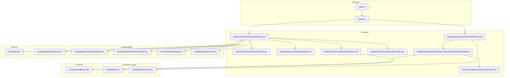
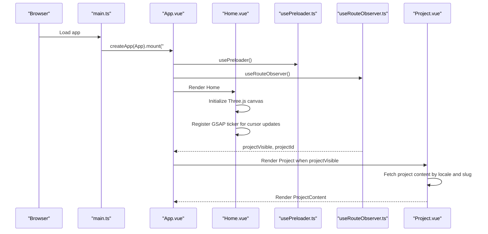
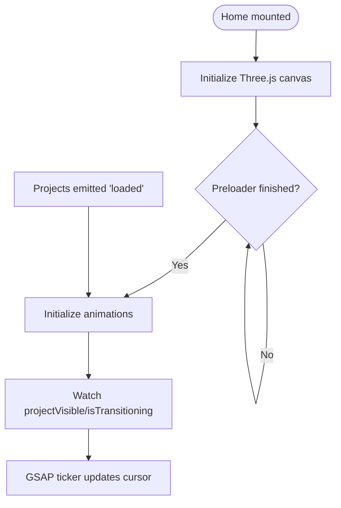
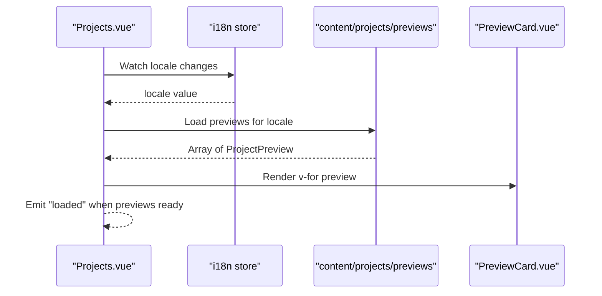
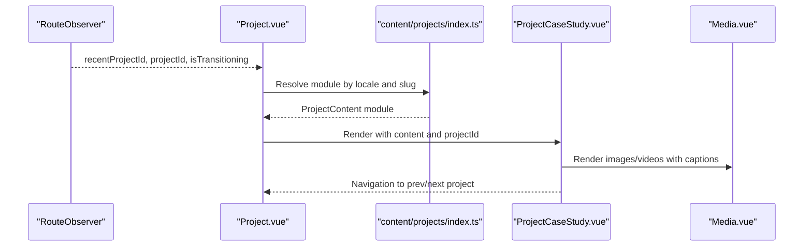
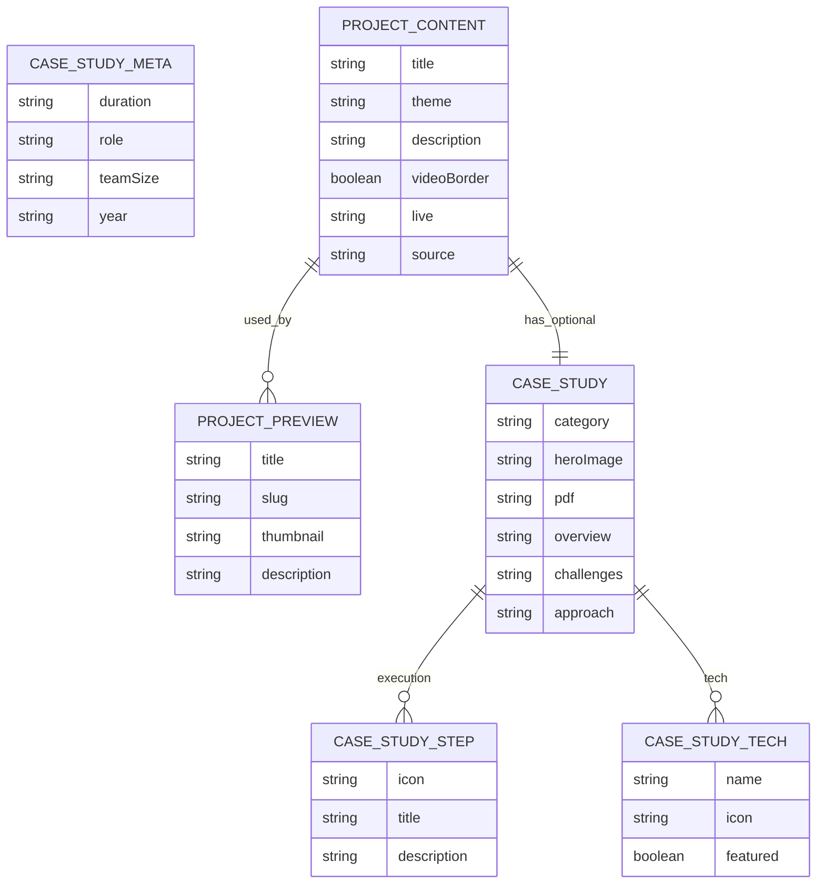
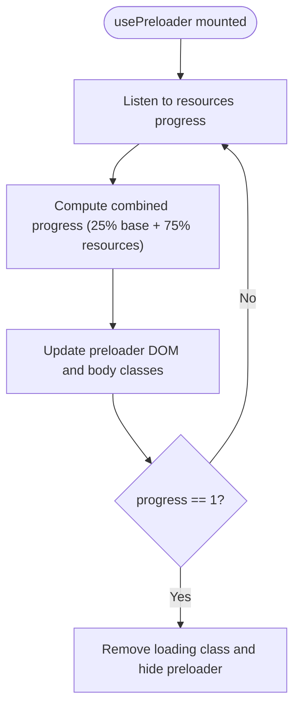
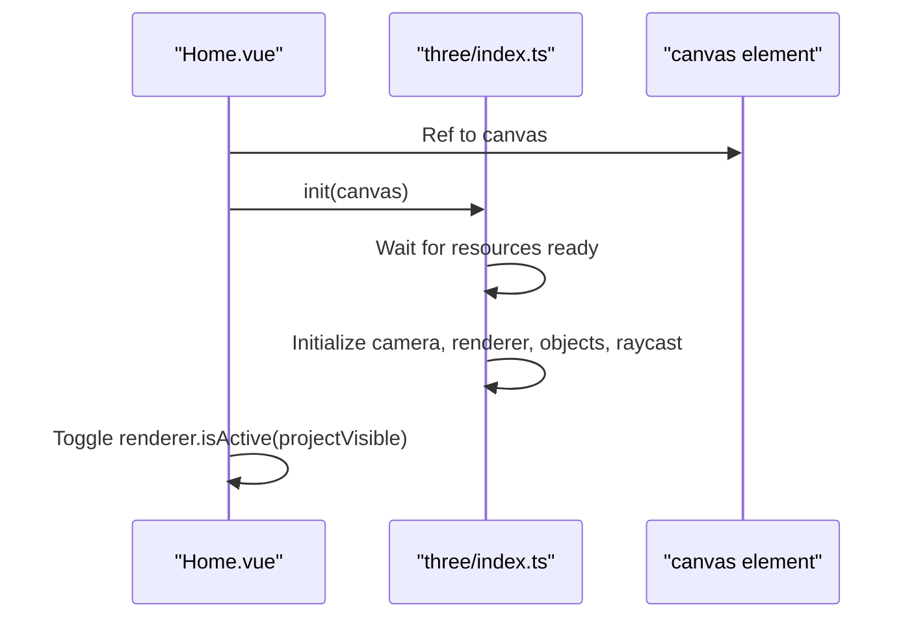
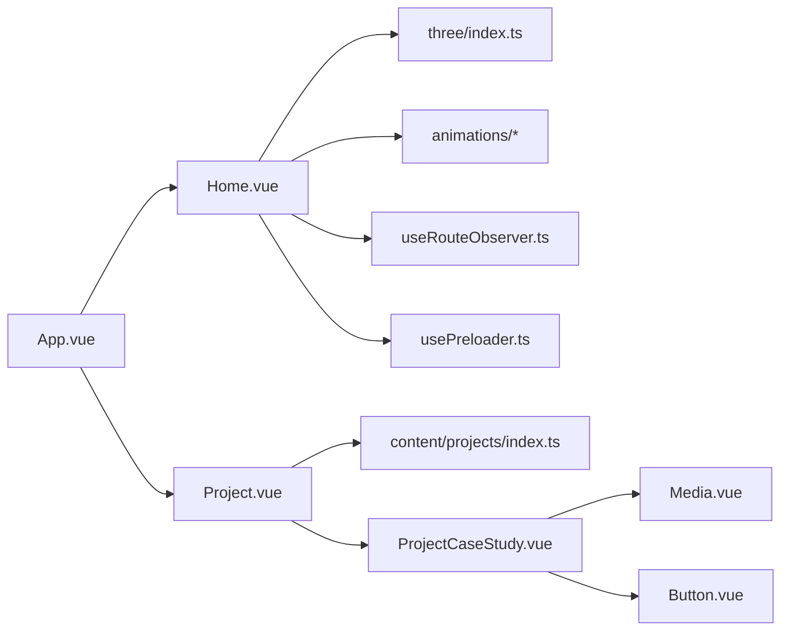

# Feature Implementation

<cite>
**Referenced Files in This Document**
- [App.vue](file://src/App.vue)
- [main.ts](file://src/main.ts)
- [Home.vue](file://src/features/home/components/Home.vue)
- [Hero.vue](file://src/features/home/components/Hero.vue)
- [About.vue](file://src/features/home/components/About.vue)
- [Projects.vue](file://src/features/home/components/Projects.vue)
- [Contact.vue](file://src/features/home/components/Contact.vue)
- [Project.vue](file://src/features/projects/components/Project.vue)
- [ProjectCaseStudy.vue](file://src/features/projects/components/casestudy/ProjectCaseStudy.vue)
- [Media.vue](file://src/features/projects/components/Media.vue)
- [types.ts](file://src/content/types.ts)
- [index.ts](file://src/content/projects/index.ts)
- [usePreloader.ts](file://src/composables/usePreloader.ts)
- [useAgent.ts](file://src/composables/useAgent.ts)
- [useRouteObserver.ts](file://src/composables/useRouteObserver.ts)
- [useProjectTransition.ts](file://src/composables/useProjectTransition.ts)
- [useScroll.ts](file://src/composables/useScroll.ts)
- [three/index.ts](file://src/three/index.ts)
- [Button.vue](file://src/components/Button.vue)
</cite>

## Table of Contents
1. [Introduction](#introduction)
2. [Project Structure](#project-structure)
3. [Core Components](#core-components)
4. [Architecture Overview](#architecture-overview)
5. [Detailed Component Analysis](#detailed-component-analysis)
6. [Dependency Analysis](#dependency-analysis)
7. [Performance Considerations](#performance-considerations)
8. [Troubleshooting Guide](#troubleshooting-guide)
9. [Conclusion](#conclusion)
10. [Appendices](#appendices)

## Introduction
This document explains the feature implementation for Portfolio-PM’s interactive home interface and project showcase system. It covers:
- Home interface: hero section with 3D avatar integration, animated about section, projects grid with responsive cards, and contact presentation.
- Project showcase: dynamic project loading, case study presentation, media integration (images/videos), and navigation between projects.
- Content management: project data model, case study schema, media asset organization, and content preview system.
- Reusable component library: UI primitives, iconography, buttons, and layout helpers.
- Underlying infrastructure: feature detection, agent analysis, preloader, resource management, and Three.js integration.

## Project Structure
The application is a Vue 3 + TypeScript SPA bootstrapped with Vite. Key areas:
- Features: home and projects showcase under src/features.
- Content: typed project data and previews under src/content.
- Composables: shared logic for routing, transitions, scrolling, and preloading.
- Three.js integration: 3D scenes and avatar under src/three.
- Styles: SCSS-based design system under src/assets/styles.
- Icons and UI components: under src/components.

**Diagram sources**
- [App.vue:1-87](file://src/App.vue#L1-L87)
- [main.ts:1-10](file://src/main.ts#L1-L10)
- [Home.vue:1-293](file://src/features/home/components/Home.vue#L1-L293)
- [Hero.vue:1-123](file://src/features/home/components/Hero.vue#L1-L123)
- [About.vue:1-112](file://src/features/home/components/About.vue#L1-L112)
- [Projects.vue:1-160](file://src/features/home/components/Projects.vue#L1-L160)
- [Contact.vue:1-80](file://src/features/home/components/Contact.vue#L1-L80)
- [Project.vue:1-109](file://src/features/projects/components/Project.vue#L1-L109)
- [ProjectCaseStudy.vue:1-795](file://src/features/projects/components/casestudy/ProjectCaseStudy.vue#L1-L795)
- [Media.vue:1-178](file://src/features/projects/components/Media.vue#L1-L178)
- [types.ts:1-86](file://src/content/types.ts#L1-L86)
- [index.ts:1-18](file://src/content/projects/index.ts#L1-L18)
- [usePreloader.ts:1-43](file://src/composables/usePreloader.ts#L1-L43)
- [useRouteObserver.ts](file://src/composables/useRouteObserver.ts)
- [useProjectTransition.ts](file://src/composables/useProjectTransition.ts)
- [useAgent.ts](file://src/composables/useAgent.ts)
- [useScroll.ts](file://src/composables/useScroll.ts)
- [three/index.ts:1-35](file://src/three/index.ts#L1-L35)
- [Button.vue:1-46](file://src/components/Button.vue#L1-L46)

**Section sources**
- [App.vue:1-87](file://src/App.vue#L1-L87)
- [main.ts:1-10](file://src/main.ts#L1-L10)

## Core Components
- Home page orchestrates hero, about, projects, and contact sections, initializes Three.js, and coordinates animations and cursor updates.
- Project page dynamically loads project content per locale and renders case studies with media and navigation.
- Content types define the shape of project data, case study steps, and preview metadata.
- Preloader composable manages resource loading progress and hides itself after readiness.
- Three.js integration initializes camera, renderer, objects, and raycasting for 3D interactions.

Key implementation patterns:
- Composition API for lifecycle hooks and reactive state.
- Event-driven resource loading via a dedicated resource manager.
- Scroll-triggered animations with GSAP and ScrollTrigger.
- Dynamic imports for locale-specific content and previews.

**Section sources**
- [Home.vue:1-293](file://src/features/home/components/Home.vue#L1-L293)
- [Project.vue:1-109](file://src/features/projects/components/Project.vue#L1-L109)
- [types.ts:1-86](file://src/content/types.ts#L1-L86)
- [usePreloader.ts:1-43](file://src/composables/usePreloader.ts#L1-L43)
- [three/index.ts:1-35](file://src/three/index.ts#L1-L35)

## Architecture Overview
The runtime mounts the app, sets up global composable logic (translations, preloader, audio, scroll, route observation), and toggles between the home and project views. The home view embeds a Three.js canvas for the hero/about sections and integrates GSAP animations. Project pages lazily load content modules keyed by locale and project ID.

**Diagram sources**
- [main.ts:1-10](file://src/main.ts#L1-L10)
- [App.vue:1-87](file://src/App.vue#L1-L87)
- [Home.vue:1-293](file://src/features/home/components/Home.vue#L1-L293)
- [usePreloader.ts:1-43](file://src/composables/usePreloader.ts#L1-L43)
- [useRouteObserver.ts](file://src/composables/useRouteObserver.ts)
- [Project.vue:1-109](file://src/features/projects/components/Project.vue#L1-L109)

## Detailed Component Analysis

### Home Interface
- Hero: Presents headline and animated banner, conditionally rendered after preloader completes.
- About: Animated sections for details, description, services, and progress counters, orchestrated by animation transitions.
- Projects: Loads localized previews and renders cards; emits “loaded” to signal when 3D animations can initialize.
- Contact: Animated presentation area for social links and CTA.

Implementation highlights:
- Intersection observers and ResizeObserver manage sticky behavior and offsets.
- GSAP ticker updates cursor state based on 3D raycasting results.
- Three.js initialization deferred until previews are loaded and preloader is dismissed.

**Diagram sources**
- [Home.vue:83-132](file://src/features/home/components/Home.vue#L83-L132)
- [Home.vue:107-124](file://src/features/home/components/Home.vue#L107-L124)
- [Hero.vue:14-16](file://src/features/home/components/Hero.vue#L14-L16)

**Section sources**
- [Hero.vue:1-123](file://src/features/home/components/Hero.vue#L1-L123)
- [About.vue:1-112](file://src/features/home/components/About.vue#L1-L112)
- [Projects.vue:1-160](file://src/features/home/components/Projects.vue#L1-L160)
- [Contact.vue:1-80](file://src/features/home/components/Contact.vue#L1-L80)
- [Home.vue:1-293](file://src/features/home/components/Home.vue#L1-L293)

### Projects Grid and Hover Effects
- Projects.vue loads previews for the current locale and renders PreviewCard instances.
- Responsive grid adapts to breakpoints; cards are clickable to navigate to project pages.
- Optional placeholder card for a feature flag allows adding a new project entry.

**Diagram sources**
- [Projects.vue:19-30](file://src/features/home/components/Projects.vue#L19-L30)
- [Projects.vue:45-46](file://src/features/home/components/Projects.vue#L45-L46)

**Section sources**
- [Projects.vue:1-160](file://src/features/home/components/Projects.vue#L1-L160)

### Project Showcase and Case Study Presentation
- Project.vue fetches the project module by locale and slug, handles loading/error states, and renders ProjectContent when visible.
- ProjectCaseStudy.vue presents a structured case study with hero, metadata, contributions, tech stack, execution timeline, outcomes, and navigation to previous/next projects.
- Media.vue supports image/video media with scroll-triggered entrance animations and captions.

**Diagram sources**
- [Project.vue:17-46](file://src/features/projects/components/Project.vue#L17-L46)
- [index.ts:14-17](file://src/content/projects/index.ts#L14-L17)
- [ProjectCaseStudy.vue:29-44](file://src/features/projects/components/casestudy/ProjectCaseStudy.vue#L29-L44)
- [Media.vue:27-48](file://src/features/projects/components/Media.vue#L27-L48)

**Section sources**
- [Project.vue:1-109](file://src/features/projects/components/Project.vue#L1-L109)
- [ProjectCaseStudy.vue:1-795](file://src/features/projects/components/casestudy/ProjectCaseStudy.vue#L1-L795)
- [Media.vue:1-178](file://src/features/projects/components/Media.vue#L1-L178)

### Content Management System
- Project data structure: ProjectContent defines title, theme, tags, optional video border, live/source links, components array, and optional caseStudy.
- Case study schema: CaseStudy includes category, hero image, optional PDF, meta (duration, role, team size, year), overview, contributions, tech stack, execution steps, challenges, approach, and outcomes.
- Project preview: ProjectPreview includes title, slug, thumbnail, and description.
- Project module resolution: content/projects/index.ts exposes projectModules per locale using glob imports.

**Diagram sources**
- [types.ts:30-86](file://src/content/types.ts#L30-L86)

**Section sources**
- [types.ts:1-86](file://src/content/types.ts#L1-L86)
- [index.ts:1-18](file://src/content/projects/index.ts#L1-L18)

### Reusable Component Library
- Button: A simple wrapper around ButtonWrapper with size variants and consistent spacing.
- Icon system: Extensive set of SVG icons under components/icons/, consumed by case study components and buttons.
- Layout and utility components: Notch, Banner, Link, Social, Tag, and others support consistent presentation.

Integration pattern:
- Buttons receive variant and renderAs props to adapt to contexts (anchor/button/div).
- Icons are embedded inline and sized consistently via component classes.

**Section sources**
- [Button.vue:1-46](file://src/components/Button.vue#L1-L46)
- [ProjectCaseStudy.vue:12-26](file://src/features/projects/components/casestudy/ProjectCaseStudy.vue#L12-L26)

### Feature Detection and Agent Analysis
- useAgent determines touch capability to conditionally render the custom cursor and adjust interactions.
- Cursor behavior is updated reactively based on 3D object hover states.

**Section sources**
- [useAgent.ts](file://src/composables/useAgent.ts)
- [Home.vue:72-81](file://src/features/home/components/Home.vue#L72-L81)

### Preloader System and Resource Management
- usePreloader tracks resource loading progress and scales the preloader bar accordingly.
- The preloader is hidden when progress reaches completion, and body classes are adjusted to remove loading state.

**Diagram sources**
- [usePreloader.ts:17-42](file://src/composables/usePreloader.ts#L17-L42)

**Section sources**
- [usePreloader.ts:1-43](file://src/composables/usePreloader.ts#L1-L43)

### Three.js Integration and 3D Avatar in Hero
- three/index.ts initializes camera, renderer, render target, objects, and raycasting when resources are ready.
- Home.vue mounts the canvas and toggles renderer activity based on project visibility to pause rendering off-screen.

**Diagram sources**
- [Home.vue:83-93](file://src/features/home/components/Home.vue#L83-L93)
- [three/index.ts:11-23](file://src/three/index.ts#L11-L23)

**Section sources**
- [Home.vue:1-133](file://src/features/home/components/Home.vue#L1-L133)
- [three/index.ts:1-35](file://src/three/index.ts#L1-L35)

## Dependency Analysis
- App.vue composes global state and toggles between home and project overlays.
- Home.vue depends on Three.js, animations, route observer, and preloader.
- Project.vue depends on route observer and project modules resolver.
- ProjectCaseStudy.vue composes icons, tags, and links; relies on i18n translation utilities.
- Media.vue uses GSAP ScrollTrigger for scroll-based animations.

**Diagram sources**
- [App.vue:1-31](file://src/App.vue#L1-L31)
- [Home.vue:1-21](file://src/features/home/components/Home.vue#L1-L21)
- [Project.vue:1-12](file://src/features/projects/components/Project.vue#L1-L12)
- [ProjectCaseStudy.vue:1-11](file://src/features/projects/components/casestudy/ProjectCaseStudy.vue#L1-L11)
- [Media.vue:1-4](file://src/features/projects/components/Media.vue#L1-L4)
- [Button.vue:1-3](file://src/components/Button.vue#L1-L3)

**Section sources**
- [App.vue:1-87](file://src/App.vue#L1-L87)
- [Home.vue:1-293](file://src/features/home/components/Home.vue#L1-L293)
- [Project.vue:1-109](file://src/features/projects/components/Project.vue#L1-L109)

## Performance Considerations
- Deferred Three.js initialization until previews and preloader are ready to avoid unnecessary work.
- GSAP ScrollTrigger is scoped to media components to keep animations targeted and efficient.
- Lazy loading of project modules and previews reduces initial bundle size.
- Pointer cursor updates are ticked via GSAP ticker; disconnect on unmount to prevent leaks.
- Renderer activity is paused when the project page is active to conserve resources.

[No sources needed since this section provides general guidance]

## Troubleshooting Guide
- Preloader never completes:
  - Verify resource events fire and progress updates are received.
  - Ensure the preloader DOM elements exist and are updated.
- Project content does not load:
  - Confirm locale and slug resolve to an existing module.
  - Check for errors thrown during dynamic import.
- 3D canvas not rendering:
  - Ensure resources are ready before initializing Three.js.
  - Verify canvas ref is present and renderer isActive toggles correctly.
- Animations not triggering:
  - Confirm “loaded” event fires from Projects.vue so animations can initialize.
  - Check ScrollTrigger availability and trigger elements exist.

**Section sources**
- [usePreloader.ts:17-42](file://src/composables/usePreloader.ts#L17-L42)
- [Project.vue:17-27](file://src/features/projects/components/Project.vue#L17-L27)
- [Home.vue:83-104](file://src/features/home/components/Home.vue#L83-L104)
- [Home.vue:111-124](file://src/features/home/components/Home.vue#L111-L124)

## Conclusion
Portfolio-PM’s feature architecture combines a reactive home interface with immersive 3D elements, a robust project showcase powered by dynamic content modules, and a comprehensive case study presentation. The system leverages composable logic for preloading, routing, transitions, and device capabilities, while maintaining a scalable content model and a reusable UI library. The result is a performant, accessible, and visually engaging portfolio experience.

[No sources needed since this section summarizes without analyzing specific files]

## Appendices
- Animation and transition orchestration is centralized in the animations module and invoked from Home.vue and About.vue.
- Scroll management is handled by a Lenis-based composable, ensuring smooth navigation across sections and project pages.

[No sources needed since this section provides general guidance]