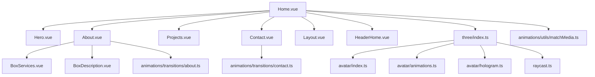
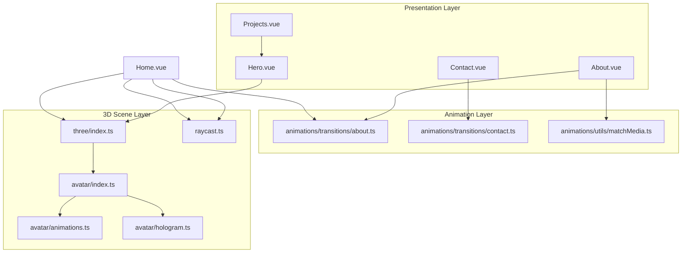
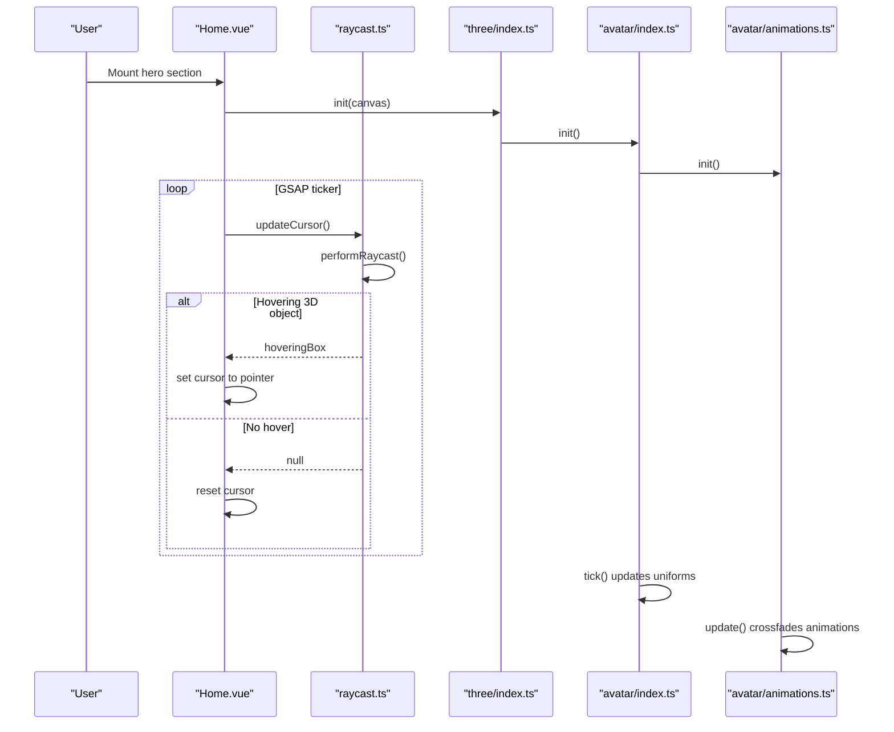
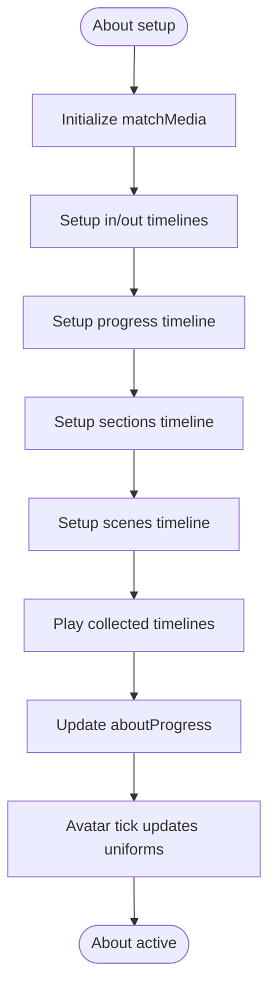
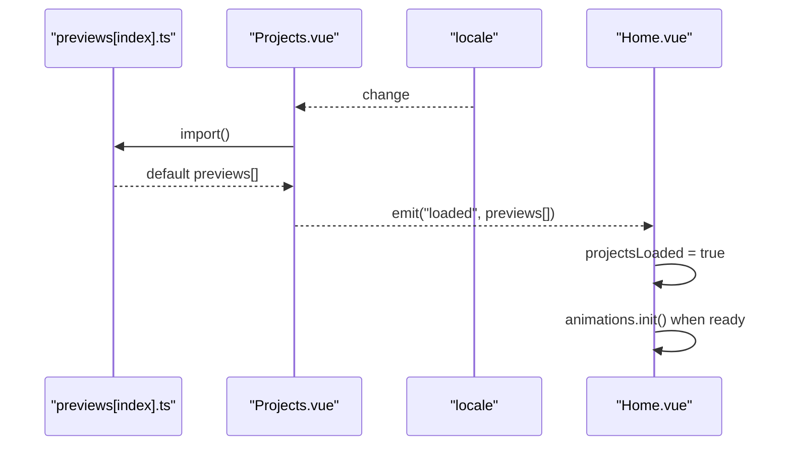
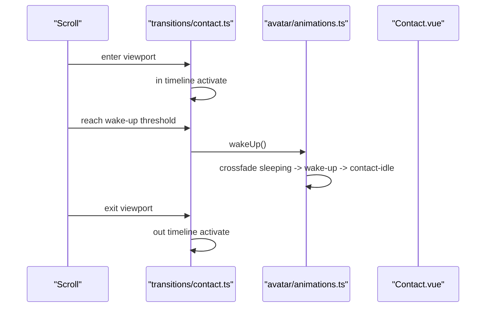
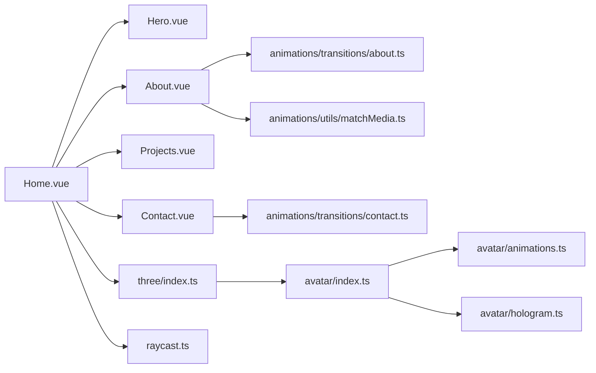

# Home Interface

<cite>
**Referenced Files in This Document**
- [Home.vue](file://src/features/home/components/Home.vue)
- [Hero.vue](file://src/features/home/components/Hero.vue)
- [About.vue](file://src/features/home/components/About.vue)
- [Projects.vue](file://src/features/home/components/Projects.vue)
- [Contact.vue](file://src/features/home/components/Contact.vue)
- [BoxServices.vue](file://src/features/home/components/BoxServices.vue)
- [BoxDescription.vue](file://src/features/home/components/BoxDescription.vue)
- [index.ts](file://src/three/index.ts)
- [avatar/index.ts](file://src/three/objects/avatar/index.ts)
- [avatar/animations.ts](file://src/three/objects/avatar/animations.ts)
- [avatar/hologram.ts](file://src/three/objects/avatar/hologram.ts)
- [raycast.ts](file://src/three/utils/raycast.ts)
- [transitions/about.ts](file://src/animations/transitions/about.ts)
- [transitions/contact.ts](file://src/animations/transitions/contact.ts)
- [matchMedia.ts](file://src/animations/utils/matchMedia.ts)
</cite>

## Table of Contents
1. [Introduction](#introduction)
2. [Project Structure](#project-structure)
3. [Core Components](#core-components)
4. [Architecture Overview](#architecture-overview)
5. [Detailed Component Analysis](#detailed-component-analysis)
6. [Dependency Analysis](#dependency-analysis)
7. [Performance Considerations](#performance-considerations)
8. [Troubleshooting Guide](#troubleshooting-guide)
9. [Conclusion](#conclusion)

## Introduction
This document provides comprehensive documentation for the home interface feature implementation. It covers the hero section with 3D avatar integration, the animated about section with responsive service animations, the projects grid with dynamic loading and hover effects, and the contact section with animation triggers. The guide explains component composition patterns, prop interfaces, event handling, state management, and how each component integrates with the overall home page architecture to deliver an immersive user experience.

## Project Structure
The home interface is composed of several Vue components orchestrated by a layout container. The 3D scene is initialized and managed via a dedicated Three.js integration layer, while animation orchestration leverages GSAP timelines and matchMedia hooks. The projects grid dynamically loads localized preview data, and the contact section triggers avatar animations upon viewport entry.

**Diagram sources**
- [Home.vue:1-293](file://src/features/home/components/Home.vue#L1-L293)
- [Hero.vue:1-123](file://src/features/home/components/Hero.vue#L1-L123)
- [About.vue:1-112](file://src/features/home/components/About.vue#L1-L112)
- [Projects.vue:1-160](file://src/features/home/components/Projects.vue#L1-L160)
- [Contact.vue:1-80](file://src/features/home/components/Contact.vue#L1-L80)
- [index.ts:1-35](file://src/three/index.ts#L1-L35)
- [avatar/index.ts:1-179](file://src/three/objects/avatar/index.ts#L1-L179)
- [avatar/animations.ts:1-222](file://src/three/objects/avatar/animations.ts#L1-L222)
- [avatar/hologram.ts:1-113](file://src/three/objects/avatar/hologram.ts#L1-L113)
- [raycast.ts:1-106](file://src/three/utils/raycast.ts#L1-L106)
- [transitions/about.ts:1-295](file://src/animations/transitions/about.ts#L1-L295)
- [transitions/contact.ts:1-68](file://src/animations/transitions/contact.ts#L1-L68)
- [matchMedia.ts:1-27](file://src/animations/utils/matchMedia.ts#L1-L27)

**Section sources**
- [Home.vue:1-293](file://src/features/home/components/Home.vue#L1-L293)
- [Hero.vue:1-123](file://src/features/home/components/Hero.vue#L1-L123)
- [About.vue:1-112](file://src/features/home/components/About.vue#L1-L112)
- [Projects.vue:1-160](file://src/features/home/components/Projects.vue#L1-L160)
- [Contact.vue:1-80](file://src/features/home/components/Contact.vue#L1-L80)

## Core Components
- Home.vue: Orchestrates the entire home page lifecycle, initializes the 3D scene, manages cursor updates based on 3D interactions, and coordinates animations after initial content loads.
- Hero.vue: Provides the hero presentation layer with typography and banner elements, integrating with the preloader state.
- About.vue: Coordinates multiple animated sections (services, description, details, progress count) using GSAP timelines and matchMedia-responsive triggers.
- Projects.vue: Dynamically loads project previews based on locale, emits a loaded event, and renders cards with responsive grid layouts.
- Contact.vue: Sets up contact-specific animations and cleans them up on unmount.

Key integration points:
- Three.js initialization and lifecycle management are centralized in the three module and avatar subsystems.
- Animation orchestration uses GSAP timelines with scroll-triggered segments and responsive breakpoints.
- Dynamic loading of project previews occurs via locale-dependent imports.

**Section sources**
- [Home.vue:1-293](file://src/features/home/components/Home.vue#L1-L293)
- [Hero.vue:1-123](file://src/features/home/components/Hero.vue#L1-L123)
- [About.vue:1-112](file://src/features/home/components/About.vue#L1-L112)
- [Projects.vue:1-160](file://src/features/home/components/Projects.vue#L1-L160)
- [Contact.vue:1-80](file://src/features/home/components/Contact.vue#L1-L80)

## Architecture Overview
The home interface follows a layered architecture:
- Presentation Layer: Vue components (Hero, About, Projects, Contact) render content and manage local state.
- Animation Layer: GSAP-driven timelines coordinate scroll-triggered animations and responsive behaviors.
- 3D Scene Layer: Three.js manages camera, renderer, scene, and avatar/hologram objects with raycasting for interactivity.
- Data Layer: Dynamic project previews are loaded asynchronously based on locale.

**Diagram sources**
- [Home.vue:1-293](file://src/features/home/components/Home.vue#L1-L293)
- [Hero.vue:1-123](file://src/features/home/components/Hero.vue#L1-L123)
- [About.vue:1-112](file://src/features/home/components/About.vue#L1-L112)
- [Projects.vue:1-160](file://src/features/home/components/Projects.vue#L1-L160)
- [Contact.vue:1-80](file://src/features/home/components/Contact.vue#L1-L80)
- [index.ts:1-35](file://src/three/index.ts#L1-L35)
- [avatar/index.ts:1-179](file://src/three/objects/avatar/index.ts#L1-L179)
- [avatar/animations.ts:1-222](file://src/three/objects/avatar/animations.ts#L1-L222)
- [avatar/hologram.ts:1-113](file://src/three/objects/avatar/hologram.ts#L1-L113)
- [raycast.ts:1-106](file://src/three/utils/raycast.ts#L1-L106)
- [transitions/about.ts:1-295](file://src/animations/transitions/about.ts#L1-L295)
- [transitions/contact.ts:1-68](file://src/animations/transitions/contact.ts#L1-L68)
- [matchMedia.ts:1-27](file://src/animations/utils/matchMedia.ts#L1-L27)

## Detailed Component Analysis

### Hero Section with 3D Avatar Integration
The hero section establishes the visual identity and integrates with the 3D scene through a shared canvas. The avatar is rendered within the hero area and responds to scene weights and transitions.

Implementation highlights:
- Canvas lifecycle: The Home component initializes the 3D scene when the canvas is mounted and cleans up on unmount.
- Cursor integration: A continuous raycast loop detects hovered 3D objects and updates the global cursor accordingly.
- Avatar rendering: The avatar mesh and hologram are integrated into the scene with shader materials and uniform updates driven by scene weights and about progress.

**Diagram sources**
- [Home.vue:83-104](file://src/features/home/components/Home.vue#L83-L104)
- [raycast.ts:68-82](file://src/three/utils/raycast.ts#L68-L82)
- [index.ts:11-23](file://src/three/index.ts#L11-L23)
- [avatar/index.ts:31-37](file://src/three/objects/avatar/index.ts#L31-L37)
- [avatar/animations.ts:208-219](file://src/three/objects/avatar/animations.ts#L208-L219)

**Section sources**
- [Home.vue:83-104](file://src/features/home/components/Home.vue#L83-L104)
- [raycast.ts:18-82](file://src/three/utils/raycast.ts#L18-L82)
- [index.ts:11-23](file://src/three/index.ts#L11-L23)
- [avatar/index.ts:31-37](file://src/three/objects/avatar/index.ts#L31-L37)
- [avatar/animations.ts:208-219](file://src/three/objects/avatar/animations.ts#L208-L219)

### About Section with Animated Services
The about section orchestrates multiple animated components using GSAP timelines and responsive matchMedia. It integrates with the avatar and room scenes to synchronize motion with scroll progress.

Key behaviors:
- Progress-driven animation: aboutProgress tracks scroll-based progress to drive avatar and hologram uniforms.
- Responsive timelines: Desktop and landscape modes apply different delays and easing for synchronized reveals.
- Component composition: About.vue aggregates BoxServices and BoxDescription, collecting timeline creation events to coordinate playback.

**Diagram sources**
- [About.vue:21-47](file://src/features/home/components/About.vue#L21-L47)
- [transitions/about.ts:16-49](file://src/animations/transitions/about.ts#L16-L49)
- [transitions/about.ts:51-67](file://src/animations/transitions/about.ts#L51-L67)
- [transitions/about.ts:181-284](file://src/animations/transitions/about.ts#L181-L284)
- [transitions/about.ts:154-179](file://src/animations/transitions/about.ts#L154-L179)
- [matchMedia.ts:4-27](file://src/animations/utils/matchMedia.ts#L4-L27)
- [avatar/index.ts:132-159](file://src/three/objects/avatar/index.ts#L132-L159)

**Section sources**
- [About.vue:1-112](file://src/features/home/components/About.vue#L1-L112)
- [transitions/about.ts:16-295](file://src/animations/transitions/about.ts#L16-L295)
- [matchMedia.ts:1-27](file://src/animations/utils/matchMedia.ts#L1-L27)
- [avatar/index.ts:132-159](file://src/three/objects/avatar/index.ts#L132-L159)

### Projects Grid with Dynamic Loading and Hover Effects
The projects grid dynamically loads localized preview data and renders cards in a responsive grid. Hover effects are handled via 3D raycasting and cursor updates.

Implementation details:
- Dynamic loading: Projects.vue watches locale changes and imports the appropriate preview module, emitting a loaded event with the array of previews.
- Responsive grid: CSS grid adapts column counts and gaps across breakpoints.
- Hover feedback: The Home component continuously checks for hovered 3D objects and updates the cursor to pointer when applicable.

**Diagram sources**
- [Projects.vue:19-31](file://src/features/home/components/Projects.vue#L19-L31)
- [Home.vue:107-124](file://src/features/home/components/Home.vue#L107-L124)

**Section sources**
- [Projects.vue:1-160](file://src/features/home/components/Projects.vue#L1-L160)
- [Home.vue:107-124](file://src/features/home/components/Home.vue#L107-L124)
- [raycast.ts:68-82](file://src/three/utils/raycast.ts#L68-L82)

### Contact Form Implementation with Animation Triggers
The contact section sets up scroll-triggered animations and integrates with avatar wake-up sequences. While the contact form itself is not implemented here, the section prepares the stage for future form integration.

Behavior highlights:
- Scroll-triggered activation: Contact animations activate when the section enters the viewport and deactivate on exit.
- Avatar wake-up: On reaching a specific scroll threshold, the avatar transitions from sleeping to waking and idle states.

**Diagram sources**
- [Contact.vue:9-17](file://src/features/home/components/Contact.vue#L9-L17)
- [transitions/contact.ts:10-50](file://src/animations/transitions/contact.ts#L10-L50)
- [avatar/animations.ts:171-196](file://src/three/objects/avatar/animations.ts#L171-L196)

**Section sources**
- [Contact.vue:1-80](file://src/features/home/components/Contact.vue#L1-L80)
- [transitions/contact.ts:1-68](file://src/animations/transitions/contact.ts#L1-L68)
- [avatar/animations.ts:171-196](file://src/three/objects/avatar/animations.ts#L171-L196)

### Component Composition Patterns and Prop Interfaces
- About.vue composes BoxServices and BoxDescription, passing a spacer reference and collecting timeline creation events to coordinate playback.
- BoxServices.vue and BoxDescription.vue use matchMedia to adapt animations for desktop and mobile, emitting timeline creation events for synchronization.
- Projects.vue exposes a loaded event with previews data, enabling parent orchestration.

Event and prop patterns:
- Emitted events: "loaded" from Projects.vue, "timeline:created" from BoxServices and BoxDescription.
- Props: About.vue accepts a spacerRef prop; BoxServices and BoxDescription accept no props but rely on emitted events.

**Section sources**
- [About.vue:17-47](file://src/features/home/components/About.vue#L17-L47)
- [BoxServices.vue:18-107](file://src/features/home/components/BoxServices.vue#L18-L107)
- [BoxDescription.vue:17-95](file://src/features/home/components/BoxDescription.vue#L17-L95)
- [Projects.vue:15-31](file://src/features/home/components/Projects.vue#L15-L31)

## Dependency Analysis
The home interface exhibits strong cohesion within its feature boundary and clear separation of concerns across layers. Dependencies flow from presentation to animation to 3D scene management.

**Diagram sources**
- [Home.vue:1-293](file://src/features/home/components/Home.vue#L1-L293)
- [Hero.vue:1-123](file://src/features/home/components/Hero.vue#L1-L123)
- [About.vue:1-112](file://src/features/home/components/About.vue#L1-L112)
- [Projects.vue:1-160](file://src/features/home/components/Projects.vue#L1-L160)
- [Contact.vue:1-80](file://src/features/home/components/Contact.vue#L1-L80)
- [index.ts:1-35](file://src/three/index.ts#L1-L35)
- [avatar/index.ts:1-179](file://src/three/objects/avatar/index.ts#L1-L179)
- [avatar/animations.ts:1-222](file://src/three/objects/avatar/animations.ts#L1-L222)
- [avatar/hologram.ts:1-113](file://src/three/objects/avatar/hologram.ts#L1-L113)
- [raycast.ts:1-106](file://src/three/utils/raycast.ts#L1-L106)
- [transitions/about.ts:1-295](file://src/animations/transitions/about.ts#L1-L295)
- [transitions/contact.ts:1-68](file://src/animations/transitions/contact.ts#L1-L68)
- [matchMedia.ts:1-27](file://src/animations/utils/matchMedia.ts#L1-L27)

**Section sources**
- [Home.vue:1-293](file://src/features/home/components/Home.vue#L1-L293)
- [About.vue:1-112](file://src/features/home/components/About.vue#L1-L112)
- [Projects.vue:1-160](file://src/features/home/components/Projects.vue#L1-L160)
- [Contact.vue:1-80](file://src/features/home/components/Contact.vue#L1-L80)

## Performance Considerations
- GSAP ticker usage: Continuous updates via GSAP ticker should be removed on unmount to prevent memory leaks. Verified in Home.vue and raycast.ts cleanup routines.
- 3D rendering: Avatar and hologram materials use shader uniforms and frustum culling toggles to optimize rendering. Ensure visibility toggles are respected during scene transitions.
- Responsive animations: matchMedia instances are cleaned up on component unmount to avoid stale listeners.
- Dynamic imports: Project previews are loaded asynchronously per locale to reduce initial bundle size.

[No sources needed since this section provides general guidance]

## Troubleshooting Guide
Common issues and resolutions:
- Avatar not visible: Verify three initialization order and that the canvas is present before initializing. Check that scene weights and about progress are updating correctly.
- Cursor not changing on hover: Confirm raycast initialization and that the ticker is running. Ensure raycast.performRaycast is executed and hoveringBox state changes are detected.
- Animations not playing: Ensure About.vue receives the spacerRef and that timeline creation events are emitted and collected properly. Verify matchMedia conditions and cleanup on unmount.
- Projects grid not loading: Confirm locale watcher triggers the import and that the loaded event is emitted with the expected previews array.

**Section sources**
- [Home.vue:95-105](file://src/features/home/components/Home.vue#L95-L105)
- [raycast.ts:92-98](file://src/three/utils/raycast.ts#L92-L98)
- [About.vue:21-47](file://src/features/home/components/About.vue#L21-L47)
- [Projects.vue:19-31](file://src/features/home/components/Projects.vue#L19-L31)

## Conclusion
The home interface feature integrates a sophisticated 3D avatar experience with responsive animations and dynamic content loading. The modular component architecture, coordinated by GSAP timelines and matchMedia, ensures a cohesive and performant user experience across devices. The avatar’s interaction with the 3D scene, the about section’s animated services, the projects grid’s dynamic loading, and the contact section’s animation triggers collectively contribute to an immersive and engaging presentation.