# Project Showcase System

<cite>
**Referenced Files in This Document**
- [index.ts](file://src/content/projects/index.ts)
- [index.ts](file://src/content/projects/previews/index.ts)
- [types.ts](file://src/features/projects/types.ts)
- [useRouter.ts](file://src/composables/useRouter.ts)
- [Project.vue](file://src/features/projects/components/Project.vue)
- [ProjectHero.vue](file://src/features/projects/components/ProjectHero.vue)
- [PreviewCard.vue](file://src/features/projects/components/PreviewCard.vue)
- [ProjectCaseStudy.vue](file://src/features/projects/components/casestudy/ProjectCaseStudy.vue)
- [Media.vue](file://src/features/projects/components/Media.vue)
- [types.ts](file://src/content/types.ts)
- [streakon.ts](file://src/content/projects/en/streakon.ts)
- [NextProject.vue](file://src/features/projects/components/NextProject.vue)
- [ProjectContent.vue](file://src/features/projects/components/ProjectContent.vue)
- [useRouteObserver.ts](file://src/composables/useRouteObserver.ts)
</cite>

## Table of Contents
1. [Introduction](#introduction)
2. [Project Structure](#project-structure)
3. [Core Components](#core-components)
4. [Architecture Overview](#architecture-overview)
5. [Detailed Component Analysis](#detailed-component-analysis)
6. [Dependency Analysis](#dependency-analysis)
7. [Performance Considerations](#performance-considerations)
8. [Troubleshooting Guide](#troubleshooting-guide)
9. [Conclusion](#conclusion)
10. [Appendices](#appendices)

## Introduction
This document explains the project showcase system that dynamically loads and renders project content based on URL routing and structured content definitions. It covers how projects are discovered via route parsing, how content is fetched and rendered, and how case studies integrate timelines, step-by-step progression, and interactive navigation. It also documents the media integration system for images and videos, the preview card system for thumbnails, and the project hero section. Finally, it outlines component composition patterns, data flow from content management to UI presentation, and integration points with the 3D scene for immersive project displays.

## Project Structure
The project showcase system is organized around:
- Content definition: per-project TypeScript modules under content/projects with locale-specific folders and a shared previews registry.
- Dynamic loader: a glob-based registry that exposes project modules by slug and locale.
- Route observation: reactive path parsing that detects project routes and triggers content loading.
- Rendering pipeline: Vue components that assemble project heroes, case studies, and media galleries.
- Navigation: computed previous/next project links derived from localized preview lists.

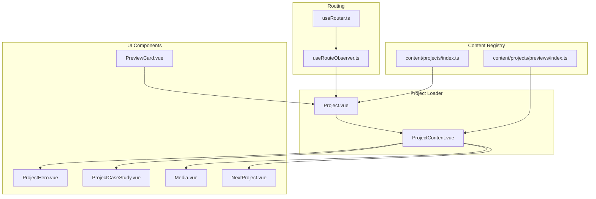

**Diagram sources**
- [useRouter.ts:1-28](file://src/composables/useRouter.ts#L1-L28)
- [useRouteObserver.ts:1-93](file://src/composables/useRouteObserver.ts#L1-L93)
- [index.ts:1-18](file://src/content/projects/index.ts#L1-L18)
- [index.ts:1-5](file://src/content/projects/previews/index.ts#L1-L5)
- [Project.vue:1-109](file://src/features/projects/components/Project.vue#L1-L109)
- [ProjectContent.vue:1-142](file://src/features/projects/components/ProjectContent.vue#L1-L142)
- [ProjectHero.vue:1-183](file://src/features/projects/components/ProjectHero.vue#L1-L183)
- [ProjectCaseStudy.vue:1-795](file://src/features/projects/components/casestudy/ProjectCaseStudy.vue#L1-L795)
- [Media.vue:1-178](file://src/features/projects/components/Media.vue#L1-L178)
- [NextProject.vue:1-101](file://src/features/projects/components/NextProject.vue#L1-L101)
- [PreviewCard.vue:1-242](file://src/features/projects/components/PreviewCard.vue#L1-L242)

**Section sources**
- [index.ts:1-18](file://src/content/projects/index.ts#L1-L18)
- [index.ts:1-5](file://src/content/projects/previews/index.ts#L1-L5)
- [useRouteObserver.ts:1-93](file://src/composables/useRouteObserver.ts#L1-L93)
- [Project.vue:1-109](file://src/features/projects/components/Project.vue#L1-L109)
- [ProjectContent.vue:1-142](file://src/features/projects/components/ProjectContent.vue#L1-L142)

## Core Components
- Dynamic project loader: resolves project content modules by locale and slug, and renders only when the project route is visible and not transitioning.
- Project content assembler: selects between case study layout and component-based layout, computes next/previous project links from localized preview lists, and renders hero or case study accordingly.
- Case study presentation: integrates timeline steps, tech stack tiles, outcomes, and navigation between projects.
- Media integration: responsive image/video rendering with lazy loading and animated entrance via scroll-triggered timelines.
- Preview cards: thumbnail-based project cards with hover effects and optional “add project” fallback.
- Navigation: programmatic history manipulation via a lightweight router composable and route change listeners.

**Section sources**
- [Project.vue:17-46](file://src/features/projects/components/Project.vue#L17-L46)
- [ProjectContent.vue:21-52](file://src/features/projects/components/ProjectContent.vue#L21-L52)
- [ProjectCaseStudy.vue:29-47](file://src/features/projects/components/casestudy/ProjectCaseStudy.vue#L29-L47)
- [Media.vue:27-52](file://src/features/projects/components/Media.vue#L27-L52)
- [PreviewCard.vue:23-45](file://src/features/projects/components/PreviewCard.vue#L23-L45)
- [useRouter.ts:1-28](file://src/composables/useRouter.ts#L1-L28)

## Architecture Overview
The system follows a reactive, route-driven architecture:
- Route detection identifies project slugs and decouples content loading from navigation.
- Content registries expose modules and preview lists via dynamic imports.
- Components compose content into either a case study layout or a modular component grid.
- Interactive elements (scroll-triggered animations, timeline navigation) enhance storytelling.

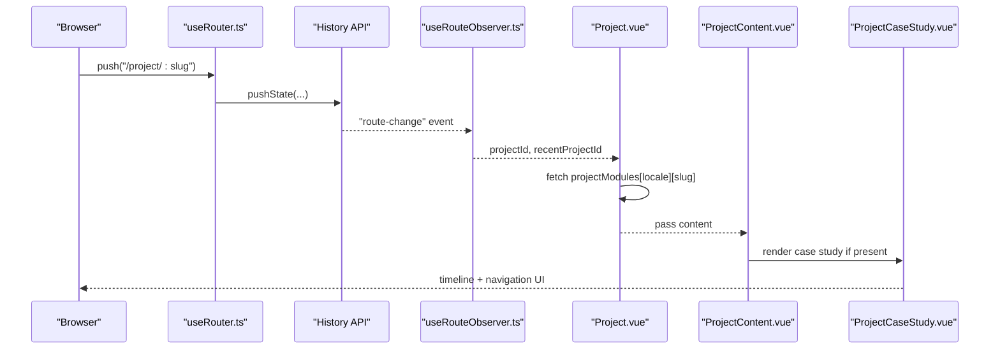

**Diagram sources**
- [useRouter.ts:2-7](file://src/composables/useRouter.ts#L2-L7)
- [useRouteObserver.ts:67-92](file://src/composables/useRouteObserver.ts#L67-L92)
- [Project.vue:17-37](file://src/features/projects/components/Project.vue#L17-L37)
- [ProjectContent.vue:55-88](file://src/features/projects/components/ProjectContent.vue#L55-L88)
- [ProjectCaseStudy.vue:49-225](file://src/features/projects/components/casestudy/ProjectCaseStudy.vue#L49-L225)

## Detailed Component Analysis

### Dynamic Project Loading Mechanism
- Project discovery: route parsing extracts the slug; visibility is gated by transition state.
- Module resolution: locale-aware registry resolves the project module by slug.
- Reactive fetching: watcher triggers on slug/locale changes and resets loading/error states.
- Scroll handling: ensures smooth scroll-to-top when a project becomes visible.

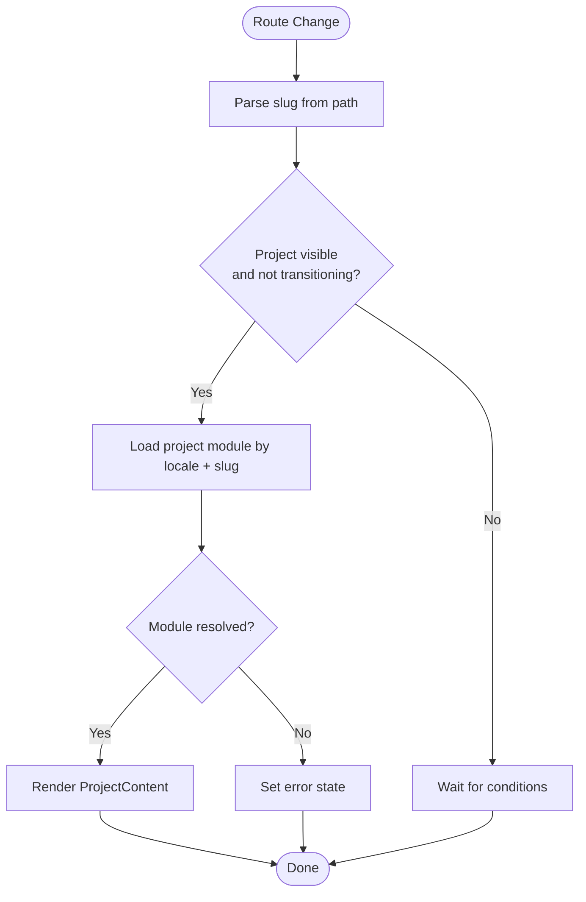

**Diagram sources**
- [useRouteObserver.ts:18-34](file://src/composables/useRouteObserver.ts#L18-L34)
- [Project.vue:17-37](file://src/features/projects/components/Project.vue#L17-L37)

**Section sources**
- [useRouteObserver.ts:14-34](file://src/composables/useRouteObserver.ts#L14-L34)
- [Project.vue:17-46](file://src/features/projects/components/Project.vue#L17-L46)

### Project Content Assembly and Navigation
- Preview loading: localized preview list is dynamically imported and cached per locale.
- Next/Previous computation: wraps indices to form a circular navigation among projects.
- Conditional rendering: case study layout versus component-based layout depending on presence of case study data.
- Hero vs. components: when no case study exists, renders hero and component grid; otherwise case study takes over.

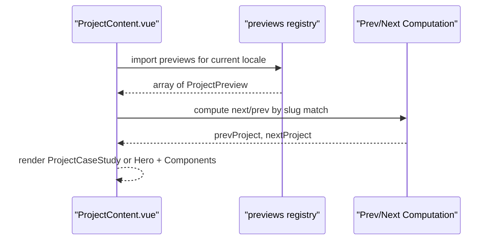

**Diagram sources**
- [ProjectContent.vue:21-52](file://src/features/projects/components/ProjectContent.vue#L21-L52)
- [index.ts:1-5](file://src/content/projects/previews/index.ts#L1-L5)
- [types.ts:80-85](file://src/content/types.ts#L80-L85)

**Section sources**
- [ProjectContent.vue:26-48](file://src/features/projects/components/ProjectContent.vue#L26-L48)
- [index.ts:1-5](file://src/content/projects/previews/index.ts#L1-L5)

### Case Study Presentation
- Hero section: title, description, tags, and action buttons; supports PDF download and live/source links.
- Timeline integration: ordered list of execution steps with icons and descriptions.
- Side panels: challenges, approach, outcomes, and tech stack tiles with logos.
- Navigation: previous/next project links with animated arrows and titles.

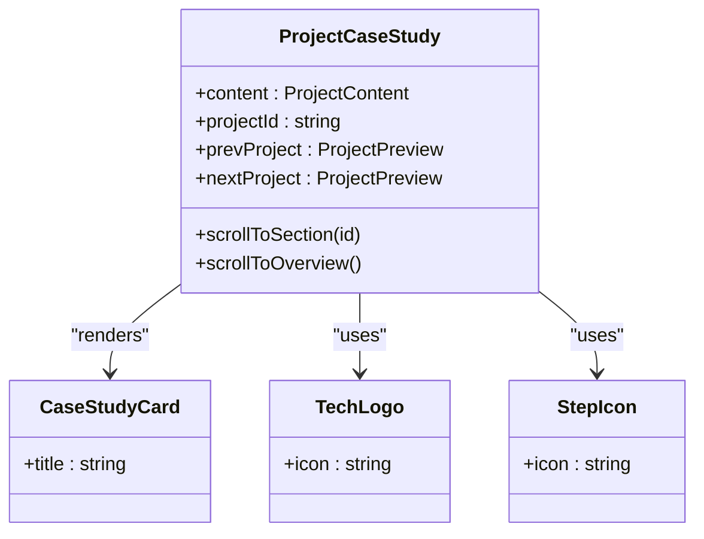

**Diagram sources**
- [ProjectCaseStudy.vue:29-47](file://src/features/projects/components/casestudy/ProjectCaseStudy.vue#L29-L47)
- [ProjectCaseStudy.vue:131-189](file://src/features/projects/components/casestudy/ProjectCaseStudy.vue#L131-L189)

**Section sources**
- [ProjectCaseStudy.vue:49-225](file://src/features/projects/components/casestudy/ProjectCaseStudy.vue#L49-L225)

### Media Integration System
- Supported types: images and videos with responsive aspect ratio.
- Lazy loading: images use lazy loading; videos are muted, loop, and play inline.
- Animated entrance: scroll-triggered GSAP timeline animates scale on viewport entry.
- Caption system: decorative notches and background accents accompany captions.

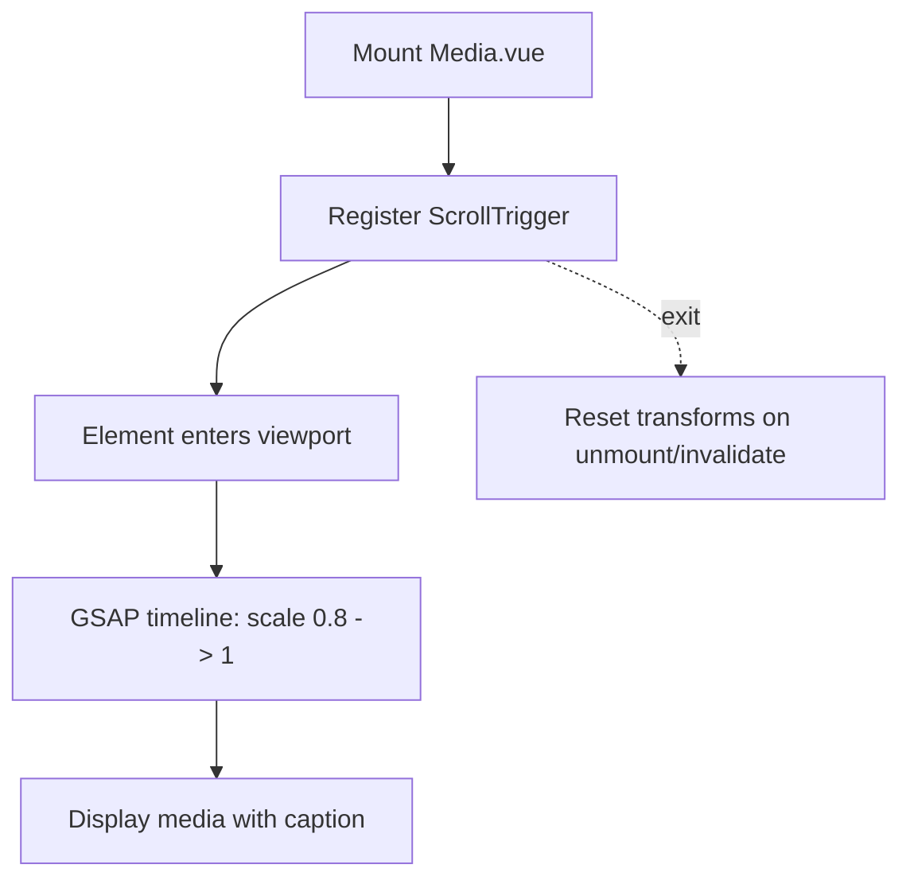

**Diagram sources**
- [Media.vue:27-52](file://src/features/projects/components/Media.vue#L27-L52)
- [Media.vue:55-87](file://src/features/projects/components/Media.vue#L55-L87)

**Section sources**
- [Media.vue:11-17](file://src/features/projects/components/Media.vue#L11-L17)
- [Media.vue:55-87](file://src/features/projects/components/Media.vue#L55-L87)

### Preview Card System
- Thumbnail-based cards with overlay buttons and decorative notches.
- Hover and scroll-triggered animations: subtle scaling and arrow rotation.
- Fallback link: when no preview exists, links to external contact page.

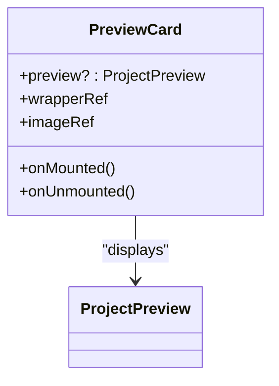

**Diagram sources**
- [PreviewCard.vue:19-45](file://src/features/projects/components/PreviewCard.vue#L19-L45)
- [types.ts:80-85](file://src/content/types.ts#L80-L85)

**Section sources**
- [PreviewCard.vue:48-99](file://src/features/projects/components/PreviewCard.vue#L48-L99)

### Project Hero Section
- Title and description with animation on slug change.
- Tag badges, live/source links, and button interactions.
- Responsive grid layout with button grouping and typography scaling.

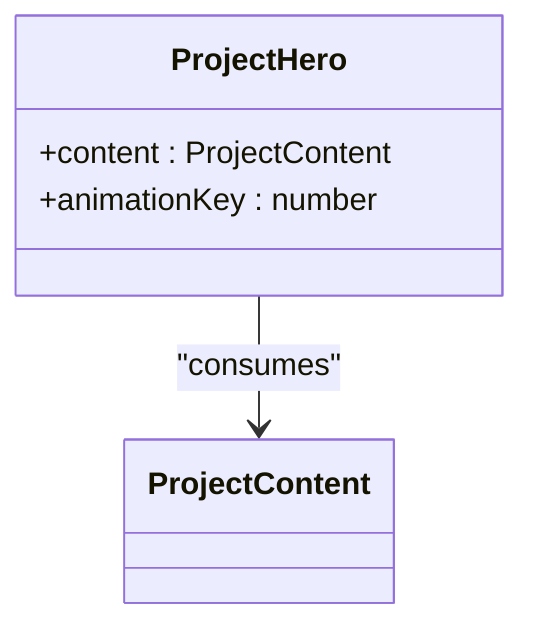

**Diagram sources**
- [ProjectHero.vue:11-21](file://src/features/projects/components/ProjectHero.vue#L11-L21)
- [types.ts:63-73](file://src/content/types.ts#L63-L73)

**Section sources**
- [ProjectHero.vue:23-54](file://src/features/projects/components/ProjectHero.vue#L23-L54)

### Next Project Navigation
- Compact card displaying thumbnail, label, and title.
- Links to the next project in the preview list.

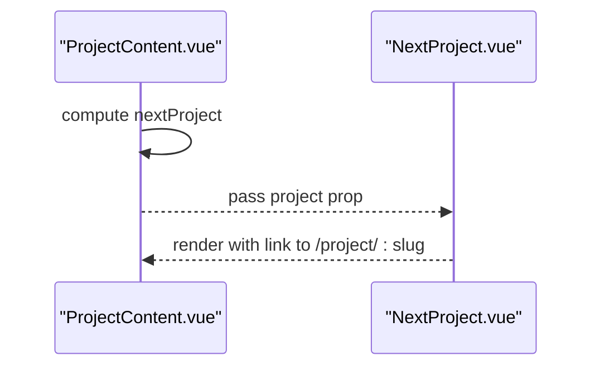

**Diagram sources**
- [ProjectContent.vue:26-48](file://src/features/projects/components/ProjectContent.vue#L26-L48)
- [NextProject.vue:7-21](file://src/features/projects/components/NextProject.vue#L7-L21)

**Section sources**
- [NextProject.vue:12-21](file://src/features/projects/components/NextProject.vue#L12-L21)

### Component Composition Patterns and Data Flow
- ProjectContent orchestrates layout selection and passes props downstream.
- ProjectComponent receives typed component definitions from content and renders specialized blocks.
- ProjectHero and ProjectCaseStudy encapsulate presentation logic and handle navigation actions.

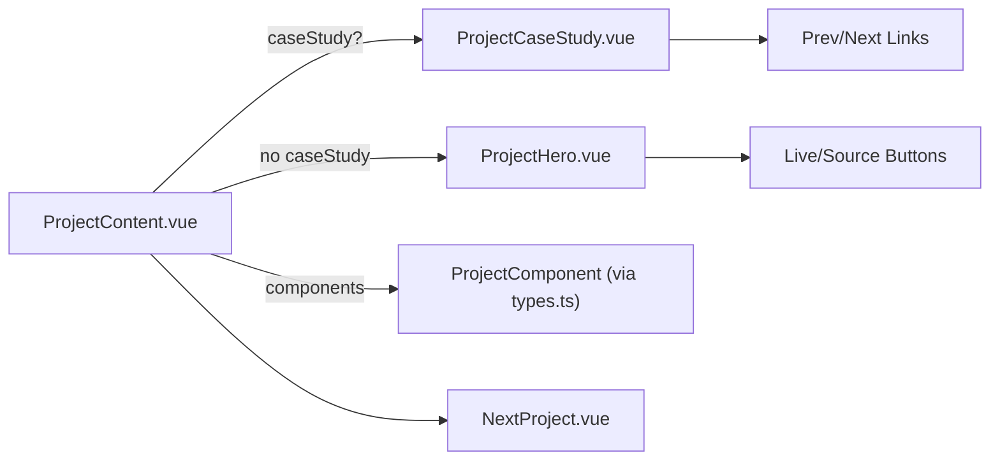

**Diagram sources**
- [ProjectContent.vue:55-88](file://src/features/projects/components/ProjectContent.vue#L55-L88)
- [types.ts:6-25](file://src/features/projects/types.ts#L6-L25)
- [ProjectCaseStudy.vue:192-224](file://src/features/projects/components/casestudy/ProjectCaseStudy.vue#L192-L224)
- [ProjectHero.vue:36-53](file://src/features/projects/components/ProjectHero.vue#L36-L53)

**Section sources**
- [ProjectContent.vue:55-88](file://src/features/projects/components/ProjectContent.vue#L55-L88)
- [types.ts:6-25](file://src/features/projects/types.ts#L6-L25)

### Integration with 3D Scene
- While the showcased components focus on UI presentation, the 3D scene integration points are implied by the presence of three.js assets and objects in the repository. The project content and UI components can be extended to embed or coordinate with 3D elements during immersive project displays. This integration is conceptual and does not modify the current showcase components.

[No sources needed since this section provides conceptual guidance]

## Dependency Analysis
- Content registry depends on locale-specific project modules and preview lists.
- Project components depend on content types and i18n utilities.
- Navigation relies on route observation and history manipulation.
- Media components rely on GSAP and ScrollTrigger for animations.

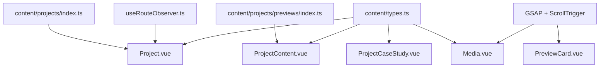

**Diagram sources**
- [index.ts:1-18](file://src/content/projects/index.ts#L1-L18)
- [index.ts:1-5](file://src/content/projects/previews/index.ts#L1-L5)
- [useRouteObserver.ts:1-93](file://src/composables/useRouteObserver.ts#L1-L93)
- [types.ts:63-85](file://src/content/types.ts#L63-L85)
- [Project.vue:1-12](file://src/features/projects/components/Project.vue#L1-L12)
- [ProjectContent.vue:1-17](file://src/features/projects/components/ProjectContent.vue#L1-L17)
- [ProjectCaseStudy.vue:1-34](file://src/features/projects/components/casestudy/ProjectCaseStudy.vue#L1-L34)
- [Media.vue:1-17](file://src/features/projects/components/Media.vue#L1-L17)
- [PreviewCard.vue:1-13](file://src/features/projects/components/PreviewCard.vue#L1-L13)

**Section sources**
- [types.ts:1-26](file://src/features/projects/types.ts#L1-L26)
- [index.ts:1-18](file://src/content/projects/index.ts#L1-L18)
- [index.ts:1-5](file://src/content/projects/previews/index.ts#L1-L5)

## Performance Considerations
- Dynamic imports: project modules and preview lists are loaded on demand, reducing initial bundle size.
- Lazy loading: media components defer resource loading until in viewport.
- Scroll-triggered animations: GSAP timelines are cleaned up on unmount to prevent memory leaks.
- Route throttling: microtask-based event dispatch avoids reactive collision during history manipulation.

[No sources needed since this section provides general guidance]

## Troubleshooting Guide
- Project not loading: verify slug matches registered project ids and locale-specific folder structure.
- No next/previous project: ensure preview list includes the current slug and previews are loaded for the active locale.
- Media not animating: confirm ScrollTrigger is initialized and element is outside initial viewport.
- Route not updating: check that history interception is applied and “route-change” events fire after push/replace.

**Section sources**
- [index.ts:3](file://src/content/projects/index.ts#L3)
- [ProjectContent.vue:30-48](file://src/features/projects/components/ProjectContent.vue#L30-L48)
- [Media.vue:27-52](file://src/features/projects/components/Media.vue#L27-L52)
- [useRouteObserver.ts:42-61](file://src/composables/useRouteObserver.ts#L42-L61)

## Conclusion
The project showcase system combines route-driven loading, locale-aware content registries, and flexible UI components to deliver immersive project presentations. Case studies are structured with timelines and interactive navigation, while media assets are integrated responsively with animated entrances. The system’s modular design enables easy extension for 3D integrations and additional project formats.

## Appendices

### Example: Project Case Study Formatting
- Define a ProjectContent object with a caseStudy block containing hero image, metadata, overview, contributions, tech stack, execution timeline, challenges, approach, and outcomes.
- Reference static assets via local imports and ensure image paths resolve correctly.

**Section sources**
- [streakon.ts:5-75](file://src/content/projects/en/streakon.ts#L5-L75)

### Example: Media Asset Organization
- Place images and videos under dedicated asset directories and import them into project content modules.
- Use the Media component to render images and videos with captions and responsive layouts.

**Section sources**
- [streakon.ts:1](file://src/content/projects/en/streakon.ts#L1)
- [Media.vue:58-79](file://src/features/projects/components/Media.vue#L58-L79)