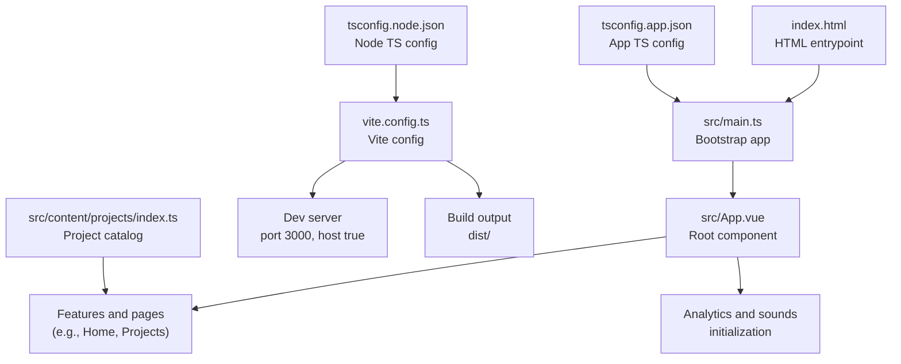

# Getting Started

<cite>
**Referenced Files in This Document**
- [package.json](file://package.json)
- [README.md](file://README.md)
- [vite.config.ts](file://vite.config.ts)
- [tsconfig.json](file://tsconfig.json)
- [tsconfig.app.json](file://tsconfig.app.json)
- [tsconfig.node.json](file://tsconfig.node.json)
- [src/main.ts](file://src/main.ts)
- [src/App.vue](file://src/App.vue)
- [index.html](file://index.html)
- [src/types/vue.d.ts](file://src/types/vue.d.ts)
- [src/content/projects/index.ts](file://src/content/projects/index.ts)
</cite>

## Table of Contents
1. [Introduction](#introduction)
2. [Prerequisites](#prerequisites)
3. [Installation](#installation)
4. [Development Workflow](#development-workflow)
5. [Build and Preview](#build-and-preview)
6. [Type Checking](#type-checking)
7. [Project Structure Overview](#project-structure-overview)
8. [Common Setup Issues and Troubleshooting](#common-setup-issues-and-troubleshooting)
9. [Conclusion](#conclusion)

## Introduction
This guide helps you set up and run Portfolio-PM locally. It covers prerequisites, installation, development workflow, building for production, type checking, and troubleshooting. The project is built with Vue 3, TypeScript, and Vite, with motion via GSAP and Lenis, 3D via three.js, audio via Howler, and GLSL shaders processed by vite-plugin-glsl.

## Prerequisites
Before installing, ensure your environment meets the following requirements:
- Operating system: macOS, Linux, or Windows with WSL
- Node.js: Version matching the project’s engine requirement (see engines field in package.json)
- Package manager: npm (recommended) or yarn
- Basic familiarity with Vue 3 and TypeScript
- Optional: A modern code editor with TypeScript and Vue 3 support

Key project dependencies and versions:
- Vue 3: ^3.5.22
- TypeScript: ~5.9.3
- Vite: ^7.1.7
- GSAP: ^3.13.0
- Lenis: ^1.3.11
- three.js: ^0.181.0
- Howler: ^2.2.4
- vite-plugin-glsl: ^1.5.4

Notes:
- The project uses ES modules and requires a compatible Node.js version.
- If using yarn, ensure compatibility with the package scripts and Vite configuration.

**Section sources**
- [package.json:14-36](file://package.json#L14-L36)
- [README.md:5](file://README.md#L5)

## Installation
Follow these steps to clone and run the project locally:

1. Clone the repository
   - Use your preferred Git client or command line to clone the repository to your machine.

2. Navigate to the project directory
   - Change into the project folder on your system.

3. Install dependencies
   - Run the package manager install command:
     - npm: npm install
     - yarn: yarn install

4. Environment setup
   - Copy the example environment file to create a local .env:
     - npm: npm run env:copy-example
   - Remove the environment file when needed:
     - npm: npm run env:remove

5. Start the development server
   - Run the dev script:
     - npm: npm run dev
   - The server starts on port 3000 with strictPort enabled.

6. Open the app in your browser
   - Visit http://localhost:3000 to view the site.

Notes:
- The project expects a modern Node.js runtime and supports ES modules.
- If port 3000 is busy, Vite will not start due to strictPort configuration.

**Section sources**
- [README.md:11](file://README.md#L11)
- [vite.config.ts:14-18](file://vite.config.ts#L14-L18)
- [package.json:6-12](file://package.json#L6-L12)

## Development Workflow
During development, Vite serves your app with hot module replacement and fast rebuilds. The development server is configured as follows:
- Port: 3000
- Host: accessible on network (host: true)
- Strict port enforcement: true (Vite exits if the port is occupied)

To develop:
- Start the dev server: npm run dev
- Edit files in src/ to see changes immediately
- Use the browser console and Vite overlay for errors

Local server access:
- Open http://localhost:3000 in your browser
- If you need to access the app from other devices on the same network, Vite binds to 0.0.0.0 due to host: true.

**Section sources**
- [README.md:11](file://README.md#L11)
- [vite.config.ts:14-18](file://vite.config.ts#L14-L18)

## Build and Preview
To prepare the project for production:
1. Build the project
   - npm: npm run build
   - This runs TypeScript checks and builds the optimized production bundle into dist/.

2. Preview the production build locally
   - npm: npm run preview
   - This serves the dist/ directory on the default Vite preview port.

Outputs:
- Production bundle placed in dist/
- Source maps disabled by default for smaller bundles

**Section sources**
- [README.md:12-13](file://README.md#L12-L13)
- [package.json:8-9](file://package.json#L8-L9)
- [vite.config.ts:30-43](file://vite.config.ts#L30-L43)

## Type Checking
Run TypeScript checks separately:
- npm: npm run typecheck
- This validates type definitions and project configuration without bundling.

Configuration highlights:
- Strict TypeScript settings enabled for both app and node configs
- Additional type declarations for Vue single-file components

**Section sources**
- [README.md:14](file://README.md#L14)
- [package.json:10](file://package.json#L10)
- [tsconfig.app.json:8-14](file://tsconfig.app.json#L8-L14)
- [tsconfig.node.json:16-22](file://tsconfig.node.json#L16-L22)
- [src/types/vue.d.ts:1-5](file://src/types/vue.d.ts#L1-L5)

## Project Structure Overview
High-level layout and key areas:
- src/main.ts: Application bootstrap, global plugins, and mount point
- src/App.vue: Root component orchestrating header, home, project overlays, analytics, and sound initialization
- src/content/projects/index.ts: Project catalog and localized content modules
- vite.config.ts: Vite configuration including plugins, server, CSS preprocessing, and build outputs
- tsconfig*.json: Split TypeScript configurations for app and node environments
- index.html: HTML shell with preloads, metadata, and favicon references

**Diagram sources**
- [index.html:69](file://index.html#L69)
- [src/main.ts:1-9](file://src/main.ts#L1-L9)
- [src/App.vue:1-31](file://src/App.vue#L1-L31)
- [vite.config.ts:5-44](file://vite.config.ts#L5-L44)
- [tsconfig.app.json:1-18](file://tsconfig.app.json#L1-L18)
- [tsconfig.node.json:1-25](file://tsconfig.node.json#L1-L25)
- [src/content/projects/index.ts:1-18](file://src/content/projects/index.ts#L1-L18)

**Section sources**
- [index.html:1-72](file://index.html#L1-L72)
- [src/main.ts:1-10](file://src/main.ts#L1-L10)
- [src/App.vue:1-87](file://src/App.vue#L1-L87)
- [vite.config.ts:1-45](file://vite.config.ts#L1-L45)
- [tsconfig.json:1-8](file://tsconfig.json#L1-L8)
- [tsconfig.app.json:1-18](file://tsconfig.app.json#L1-L18)
- [tsconfig.node.json:1-25](file://tsconfig.node.json#L1-L25)
- [src/content/projects/index.ts:1-18](file://src/content/projects/index.ts#L1-L18)

## Common Setup Issues and Troubleshooting
- Port 3000 is in use
  - Cause: Another process occupies port 3000.
  - Fix: Stop the conflicting process or change the port in vite.config.ts (not recommended if strictPort remains true).
  - Reference: strictPort is enabled in server configuration.

- Missing .env file
  - Symptom: Environment-dependent features behave unexpectedly.
  - Fix: Create .env from the example using the provided script.

- TypeScript errors after install
  - Symptom: Editor shows type errors immediately.
  - Fix: Run npm run typecheck to validate configuration and fix reported issues.

- GLSL shader compilation errors
  - Symptom: Errors related to .glsl, .vert, or .frag files.
  - Fix: Ensure filenames match plugin include patterns and are imported correctly.

- Three.js or 3D-related runtime errors
  - Symptom: 3D scenes fail to render.
  - Fix: Verify three.js version compatibility and ensure assets are loaded via supported paths.

- Node.js version mismatch
  - Symptom: Install fails or scripts do not run.
  - Fix: Use a Node.js version aligned with the project’s engine requirement.

- Fonts or assets not loading
  - Symptom: Missing fonts or images in production.
  - Fix: Confirm asset paths and extensions in vite.config.ts assetsInclude and ensure files exist.

- Hot reload not working
  - Symptom: Changes do not reflect without restart.
  - Fix: Ensure Vite dev server is running on port 3000 and strictPort is respected; avoid modifying plugin configurations unless necessary.

**Section sources**
- [vite.config.ts:14-18](file://vite.config.ts#L14-L18)
- [package.json:6-12](file://package.json#L6-L12)
- [README.md:14](file://README.md#L14)
- [vite.config.ts:22-22](file://vite.config.ts#L22-L22)

## Conclusion
You now have the essentials to install, run, build, and validate Portfolio-PM locally. Use npm run dev for development, npm run build for production bundles, and npm run typecheck for type safety. If you encounter issues, consult the troubleshooting section and verify your Node.js and package manager versions against the project’s requirements.