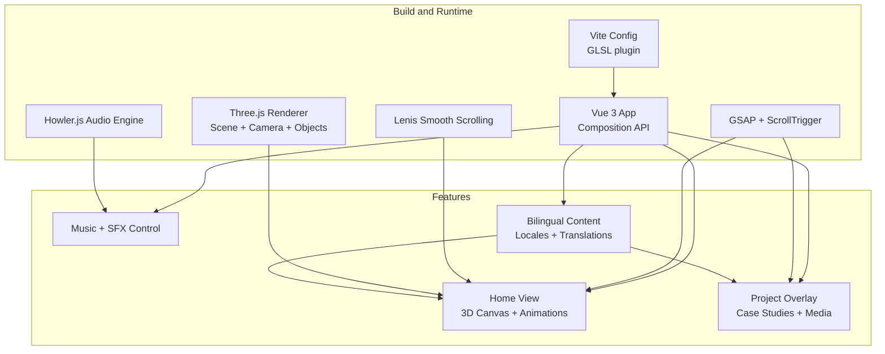
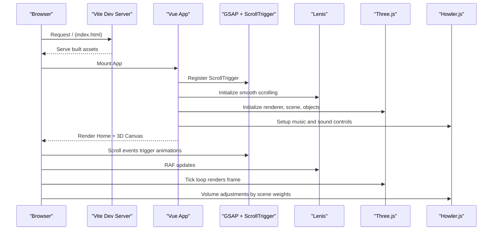
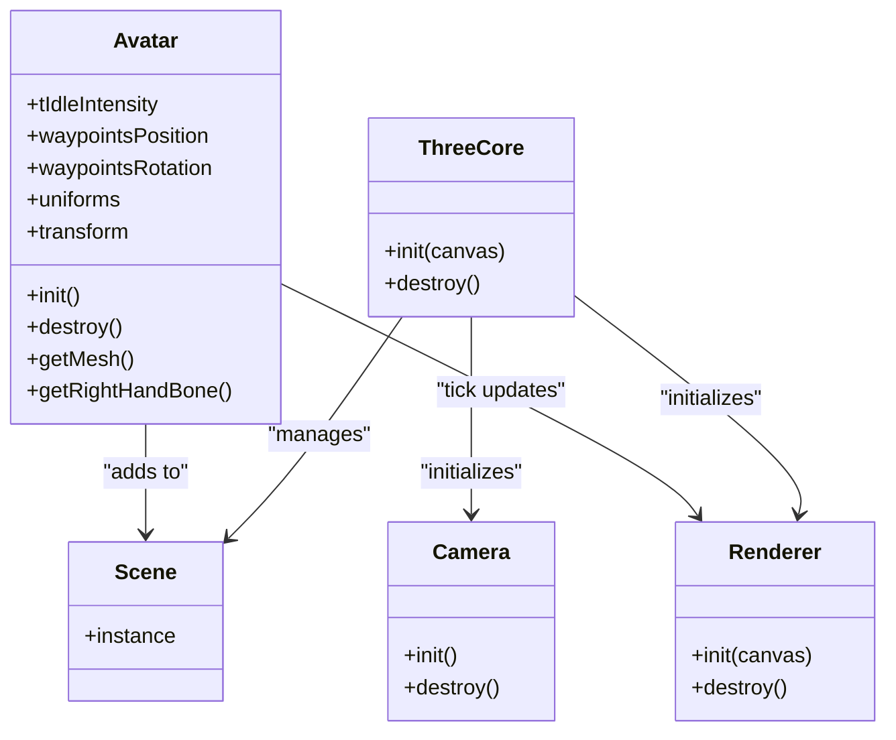
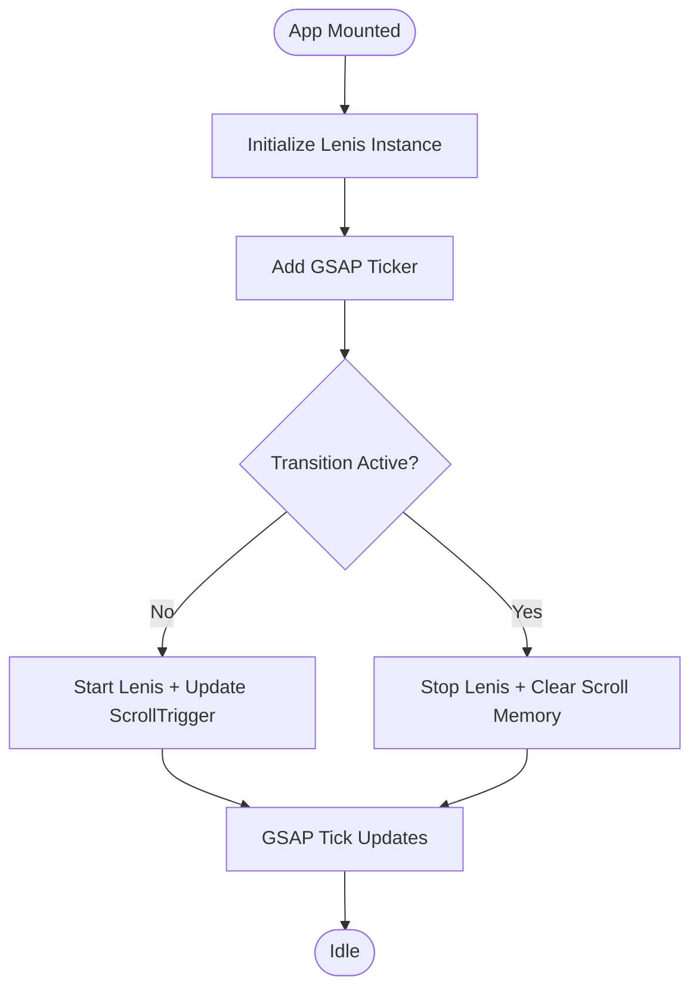
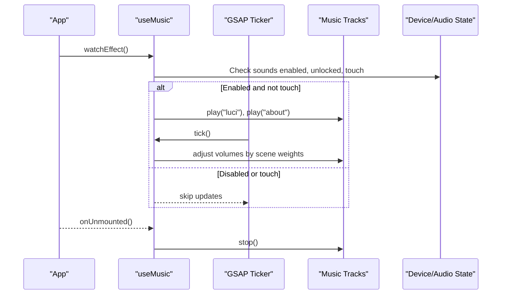
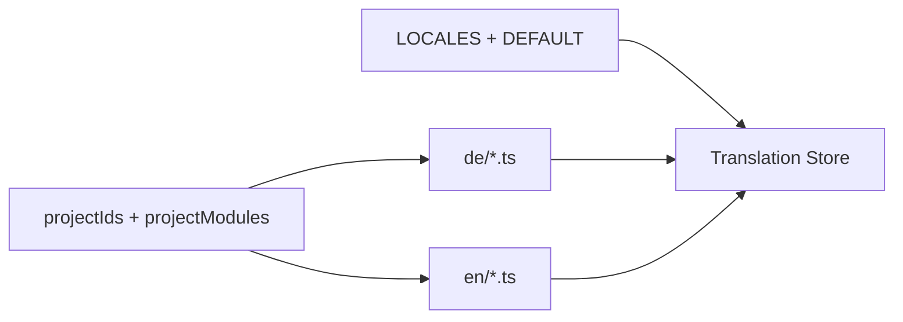
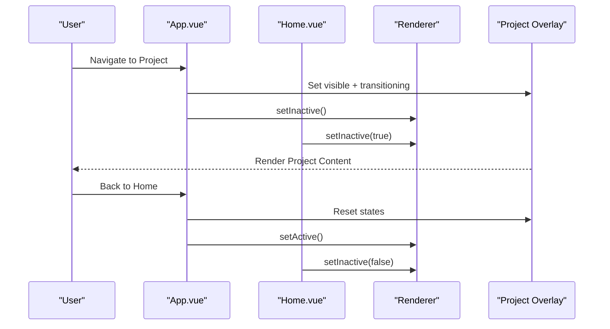
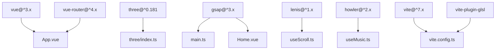

# Project Overview

<cite>
**Referenced Files in This Document**
- [README.md](file://README.md)
- [package.json](file://package.json)
- [vite.config.ts](file://vite.config.ts)
- [src/main.ts](file://src/main.ts)
- [src/App.vue](file://src/App.vue)
- [src/features/home/components/Home.vue](file://src/features/home/components/Home.vue)
- [src/three/index.ts](file://src/three/index.ts)
- [src/three/objects/avatar/index.ts](file://src/three/objects/avatar/index.ts)
- [src/animations/index.ts](file://src/animations/index.ts)
- [src/composables/useScroll.ts](file://src/composables/useScroll.ts)
- [src/features/sounds/composables/useMusic.ts](file://src/features/sounds/composables/useMusic.ts)
- [src/i18n/constants/index.ts](file://src/i18n/constants/index.ts)
- [src/i18n/store.ts](file://src/i18n/store.ts)
- [src/content/projects/index.ts](file://src/content/projects/index.ts)
</cite>

## Table of Contents
1. [Introduction](#introduction)
2. [Project Structure](#project-structure)
3. [Core Components](#core-components)
4. [Architecture Overview](#architecture-overview)
5. [Detailed Component Analysis](#detailed-component-analysis)
6. [Dependency Analysis](#dependency-analysis)
7. [Performance Considerations](#performance-considerations)
8. [Troubleshooting Guide](#troubleshooting-guide)
9. [Conclusion](#conclusion)

## Introduction
Portfolio-PM is an interactive 3D portfolio website that redefines personal branding by combining a modern frontend framework with immersive 3D environments, smooth scroll experiences, and rich multimedia. It showcases personal projects through a dual-view interface: a main home view with an integrated 3D scene and a project overlay that reveals detailed case studies. The site supports bilingual content (English and German) and integrates dynamic audio and scroll-triggered animations to deliver a cohesive, engaging user experience.

Key goals:
- Deliver a visually immersive portfolio with real-time 3D rendering.
- Provide a seamless, scroll-driven narrative with animated transitions.
- Support multilingual content for broader international reach.
- Combine responsive design with high-performance 3D and audio systems.

## Project Structure
The project follows a modular, feature-based structure:
- Frontend framework: Vue 3 with Composition API and TypeScript.
- Build tooling: Vite with GLSL support for shader compilation.
- 3D graphics: Three.js with custom shaders and avatar character.
- Animation: GSAP with ScrollTrigger and Lenis for smooth scrolling.
- Audio: Howler.js for spatialized and layered soundtracks.
- Internationalization: i18n with locale-aware content modules.
- Content management: Project listings and previews organized per locale.

**Diagram sources**
- [vite.config.ts:1-45](file://vite.config.ts#L1-L45)
- [src/main.ts:1-10](file://src/main.ts#L1-L10)
- [src/App.vue:1-87](file://src/App.vue#L1-L87)
- [src/features/home/components/Home.vue:1-293](file://src/features/home/components/Home.vue#L1-L293)
- [src/three/index.ts:1-35](file://src/three/index.ts#L1-L35)
- [src/features/sounds/composables/useMusic.ts:1-63](file://src/features/sounds/composables/useMusic.ts#L1-L63)
- [src/i18n/constants/index.ts:1-19](file://src/i18n/constants/index.ts#L1-L19)

**Section sources**
- [README.md:1-44](file://README.md#L1-L44)
- [package.json:1-38](file://package.json#L1-L38)
- [vite.config.ts:1-45](file://vite.config.ts#L1-L45)
- [src/main.ts:1-10](file://src/main.ts#L1-L10)
- [src/App.vue:1-87](file://src/App.vue#L1-L87)

## Core Components
- Dual-view interface:
  - Home view with a persistent 3D canvas and integrated animations.
  - Project overlay that slides in/out with a dedicated background and content area.
- Interactive 3D scene:
  - Avatar character with custom shaders and facial expressions.
  - Raycasting-based hover interactions and cursor feedback.
- Scroll-triggered animations:
  - GSAP-driven timeline with ScrollTrigger for scroll-linked effects.
  - Lenis for buttery-smooth scroll behavior.
- Dynamic audio system:
  - Layered music tracks controlled by scene weights and route context.
  - Sound toggles and device-specific behavior (touch devices).
- Bilingual content management:
  - Locale-aware content modules per English and German.
  - Translation store and constants for locale metadata.
- Responsive design:
  - Flexible layouts and canvas sizing with viewport units.
  - Conditional rendering for touch vs. pointer devices.

**Section sources**
- [src/App.vue:33-57](file://src/App.vue#L33-L57)
- [src/features/home/components/Home.vue:83-105](file://src/features/home/components/Home.vue#L83-L105)
- [src/three/objects/avatar/index.ts:31-179](file://src/three/objects/avatar/index.ts#L31-L179)
- [src/composables/useScroll.ts:15-61](file://src/composables/useScroll.ts#L15-L61)
- [src/features/sounds/composables/useMusic.ts:14-63](file://src/features/sounds/composables/useMusic.ts#L14-L63)
- [src/i18n/constants/index.ts:1-19](file://src/i18n/constants/index.ts#L1-L19)
- [src/i18n/store.ts:1-7](file://src/i18n/store.ts#L1-L7)

## Architecture Overview
The architecture blends a Vue 3 frontend with Three.js for 3D rendering, GSAP for animations, Lenis for scroll smoothing, and Howler.js for audio. Content is managed through locale-specific modules and rendered via Vue components. The app initializes plugins, sets up the 3D pipeline, and orchestrates transitions between views.

**Diagram sources**
- [vite.config.ts:14-18](file://vite.config.ts#L14-L18)
- [src/main.ts:4-7](file://src/main.ts#L4-L7)
- [src/App.vue:20-29](file://src/App.vue#L20-L29)
- [src/features/home/components/Home.vue:83-105](file://src/features/home/components/Home.vue#L83-L105)
- [src/three/index.ts:11-32](file://src/three/index.ts#L11-L32)
- [src/features/sounds/composables/useMusic.ts:35-61](file://src/features/sounds/composables/useMusic.ts#L35-L61)

## Detailed Component Analysis

### 3D Scene and Avatar
The 3D system initializes the renderer, camera, and scene, then loads and configures objects including the avatar. The avatar uses custom ShaderMaterial instances and updates uniforms based on scene weights and transitions. Raycasting enables hover detection to change the cursor and drive interactions.

**Diagram sources**
- [src/three/index.ts:11-32](file://src/three/index.ts#L11-L32)
- [src/three/objects/avatar/index.ts:31-179](file://src/three/objects/avatar/index.ts#L31-L179)

**Section sources**
- [src/three/index.ts:1-35](file://src/three/index.ts#L1-L35)
- [src/three/objects/avatar/index.ts:31-179](file://src/three/objects/avatar/index.ts#L31-L179)

### Scroll and Animation Orchestration
GSAP and Lenis collaborate to provide smooth scrolling and precise scroll-triggered animations. The composable manages Lenis instances, scroll velocity, and lifecycle hooks, while animations initialize timelines and waypoint triggers after content loads.

**Diagram sources**
- [src/composables/useScroll.ts:15-61](file://src/composables/useScroll.ts#L15-L61)
- [src/animations/index.ts:14-29](file://src/animations/index.ts#L14-L29)

**Section sources**
- [src/composables/useScroll.ts:15-61](file://src/composables/useScroll.ts#L15-L61)
- [src/animations/index.ts:1-30](file://src/animations/index.ts#L1-30)

### Audio System and Music Tracks
The music composable coordinates layered tracks, adjusting volumes based on the current route and scene weights. It respects user preferences, device capabilities, and feature flags, integrating with GSAP’s ticker for smooth updates.

**Diagram sources**
- [src/features/sounds/composables/useMusic.ts:14-63](file://src/features/sounds/composables/useMusic.ts#L14-L63)

**Section sources**
- [src/features/sounds/composables/useMusic.ts:14-63](file://src/features/sounds/composables/useMusic.ts#L14-L63)

### Bilingual Content Management
Content is organized per locale with separate modules for English and German. Project slugs are aligned with a central index, enabling consistent routing and rendering across languages. The i18n constants define locales and defaults, while the translation store holds loaded keys.

**Diagram sources**
- [src/content/projects/index.ts:3-17](file://src/content/projects/index.ts#L3-L17)
- [src/i18n/constants/index.ts:1-19](file://src/i18n/constants/index.ts#L1-L19)
- [src/i18n/store.ts:1-7](file://src/i18n/store.ts#L1-L7)

**Section sources**
- [src/content/projects/index.ts:1-18](file://src/content/projects/index.ts#L1-L18)
- [src/i18n/constants/index.ts:1-19](file://src/i18n/constants/index.ts#L1-L19)
- [src/i18n/store.ts:1-7](file://src/i18n/store.ts#L1-L7)

### Dual-View Interface and Transitions
The App component defines the layout with a home wrapper and a project overlay. Project visibility and transition states control rendering and interactivity, while the Home component initializes Three.js and animations, and coordinates with the renderer to pause/resume during overlays.

**Diagram sources**
- [src/App.vue:38-54](file://src/App.vue#L38-L54)
- [src/features/home/components/Home.vue:126-132](file://src/features/home/components/Home.vue#L126-L132)

**Section sources**
- [src/App.vue:33-57](file://src/App.vue#L33-L57)
- [src/features/home/components/Home.vue:126-132](file://src/features/home/components/Home.vue#L126-L132)

## Dependency Analysis
The project relies on a focused set of libraries:
- Vue 3 ecosystem for reactive UI and routing.
- Three.js for 3D rendering and custom shaders.
- GSAP for animation orchestration and ScrollTrigger for scroll-linked effects.
- Lenis for smooth scrolling.
- Howler.js for audio playback and sprite management.
- Vite with GLSL plugin for shader bundling and fast development builds.

**Diagram sources**
- [package.json:14-22](file://package.json#L14-L22)
- [src/main.ts:1-10](file://src/main.ts#L1-L10)
- [src/three/index.ts:1-35](file://src/three/index.ts#L1-L35)
- [src/features/sounds/composables/useMusic.ts:1-12](file://src/features/sounds/composables/useMusic.ts#L1-L12)
- [vite.config.ts:1-45](file://vite.config.ts#L1-L45)

**Section sources**
- [package.json:1-38](file://package.json#L1-L38)
- [vite.config.ts:1-45](file://vite.config.ts#L1-L45)

## Performance Considerations
- 3D rendering:
  - Use frustum culling controls and render order carefully to minimize overdraw.
  - Keep shader complexity balanced; leverage uniform updates instead of recreating materials.
- Animations:
  - Prefer GSAP’s ticker for frame-perfect updates; disable unnecessary listeners during overlays.
- Audio:
  - Defer loading and stop tracks on unmount; avoid autoplay on mobile.
- Build and assets:
  - Configure Vite’s Rollup output and asset naming for efficient caching.
  - Use GLSL includes and avoid redundant shader copies.

## Troubleshooting Guide
- 3D scene not rendering:
  - Verify canvas initialization and that the renderer is attached to the DOM before rendering.
  - Confirm resources are ready before initializing Three.js components.
- Scroll jank or stutter:
  - Ensure Lenis RAF is registered and GSAP lag smoothing is configured.
  - Disable scroll during transitions to prevent memory drift.
- Audio not playing:
  - Check user gesture requirements and device touch state.
  - Validate that sound features are enabled and Howler is unlocked.
- Content not switching locales:
  - Confirm slug alignment between content modules and the project index.
  - Ensure locale constants and default fallbacks are correctly configured.

**Section sources**
- [src/three/index.ts:14-22](file://src/three/index.ts#L14-L22)
- [src/composables/useScroll.ts:47-55](file://src/composables/useScroll.ts#L47-L55)
- [src/features/sounds/composables/useMusic.ts:35-49](file://src/features/sounds/composables/useMusic.ts#L35-L49)
- [src/content/projects/index.ts:3-17](file://src/content/projects/index.ts#L3-L17)

## Conclusion
Portfolio-PM demonstrates a modern synthesis of web technologies to elevate the traditional portfolio into an immersive, interactive experience. By layering Vue 3 and TypeScript with Three.js, GSAP, Lenis, and Howler.js, it delivers a polished, bilingual showcase of personal projects. Its modular architecture, robust animation pipeline, and thoughtful audio and 3D systems provide a strong foundation for creators seeking to stand out in a competitive digital landscape.